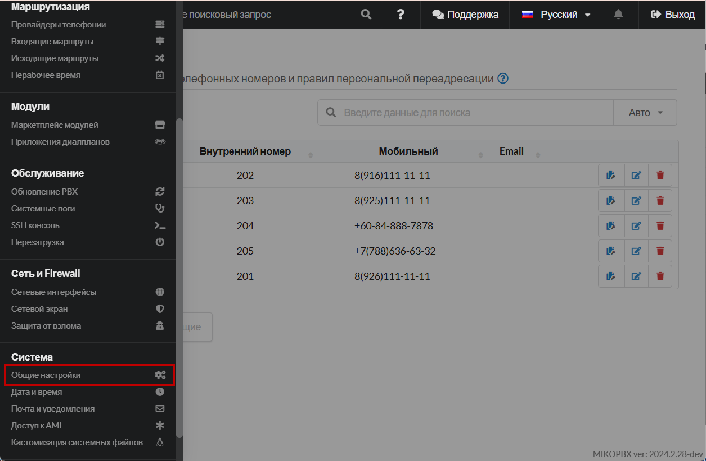
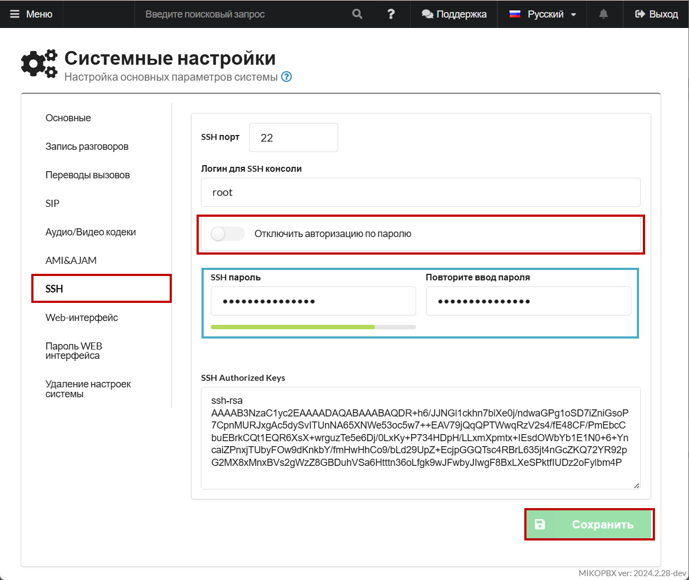
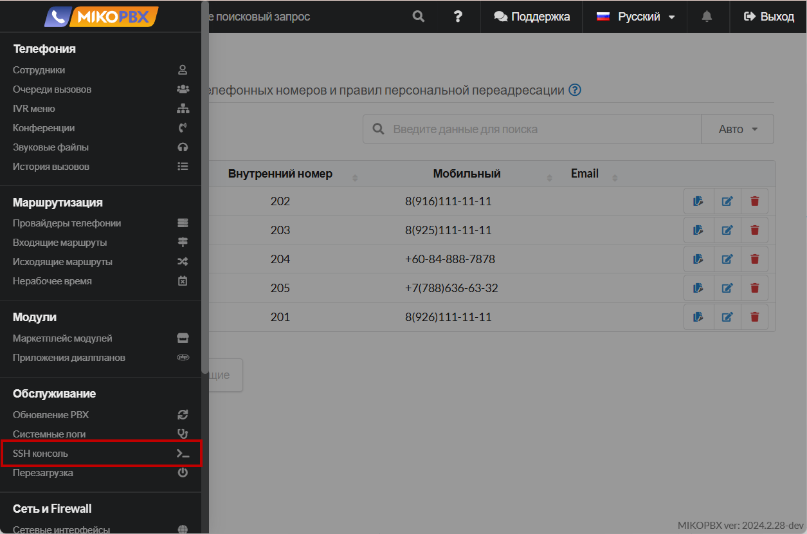
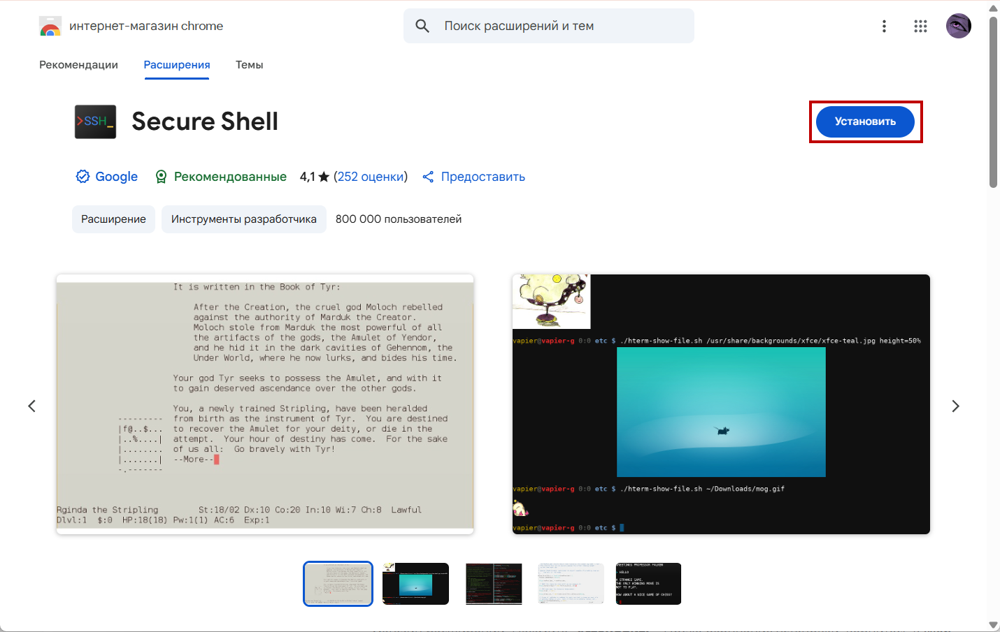

# Подключение с помощью Google Secure Shell


Данный способ подходит, если Вы используете браузеры Google Chrome или Yandex Browser для подключения к Web-интерфейсу MikoPBX.


### Подключение доступа по паролю&#x20;

1. Перейдите в раздел "Система" -> "**Общие настройки**".

<figure><figcaption>
Раздел "Система" - "Общие настройки"
</figcaption></figure>

2. Перейдите в раздел "**SSH**". Переключите тумблер "**Отключить авторизацию по паролю**" (По умолчанию в активном положении). Задайте Ваш пароль для SSH-подключения. Сохраните настройки.


**Не используйте простые пароли!** После окончания сессии всегда отключайте возможность SSH-подключения с использованием авторизации по паролю!


<figure><figcaption>
Подключения доступа по паролю
</figcaption></figure>

### Установка расширения

1. В Web-интерфейсе MikoPBX перейдите в раздел **"Обслуживание"** -> **"SSH консоль"**.

<figure><figcaption>
Раздел "Обслуживание" - "SSH консоль"
</figcaption></figure>

2. В случае, если у Вас не установлено расширение "Secure Shell" для браузера, Вас переадресует в магазин расширений. Нажмите "**Установить**". После окончания установки, вернитесь в Web-интерфейс и повторите **первый** шаг.

<figure><figcaption>
Установка расширения
</figcaption></figure>

3. После переадрисации на вкладку Google Secure Shell, введите "yes" в диалоговом окне для нового подключения. Нажмите "**Enter**".

<figure><figcaption>
Диалоговое окно #1
</figcaption></figure>

4. В новом диалоговом окне введите ранее заданный пароль для SSH. Нажмите "Enter".&#x20;

<figure><figcaption>
Диалоговое окно #2
</figcaption></figure>

Произойдет SSH-подключение. :tada:

<figure><figcaption>
Успешное SSH-подключения через Google Secure Shell.
</figcaption></figure>
