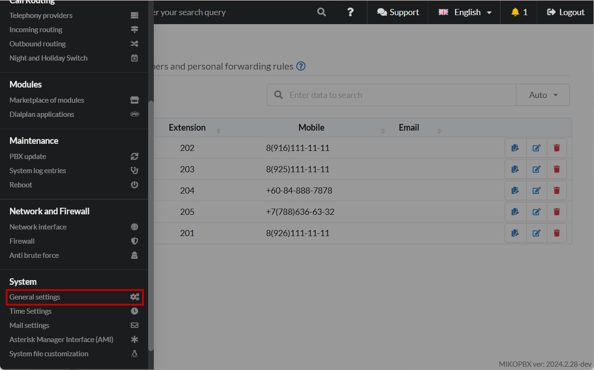
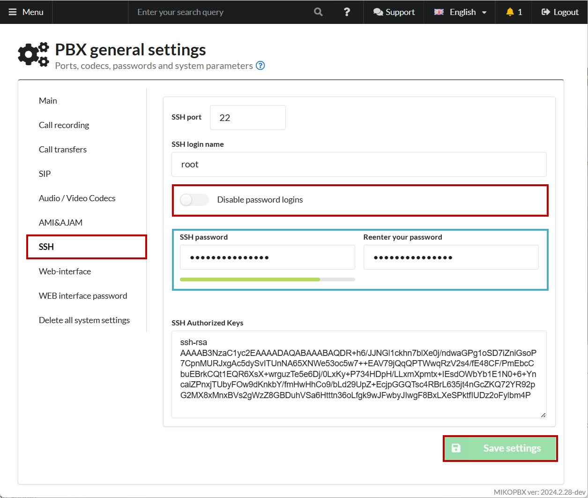
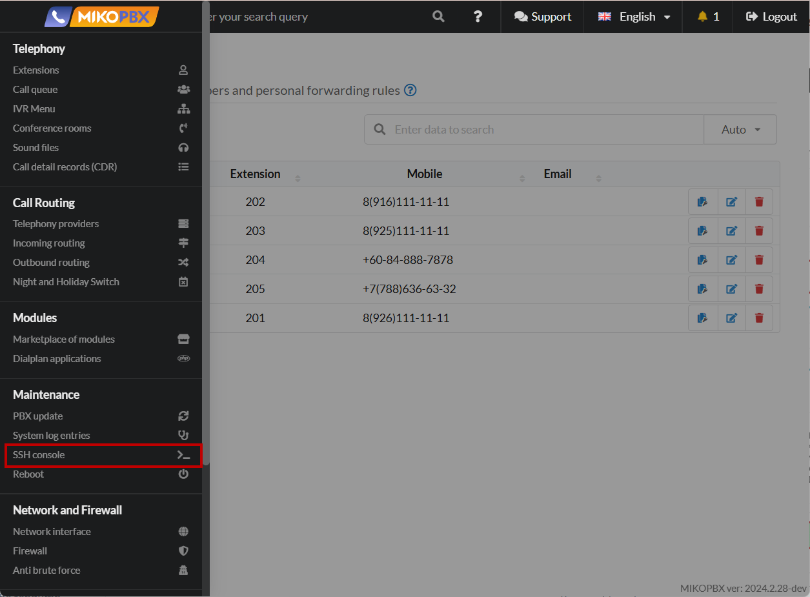
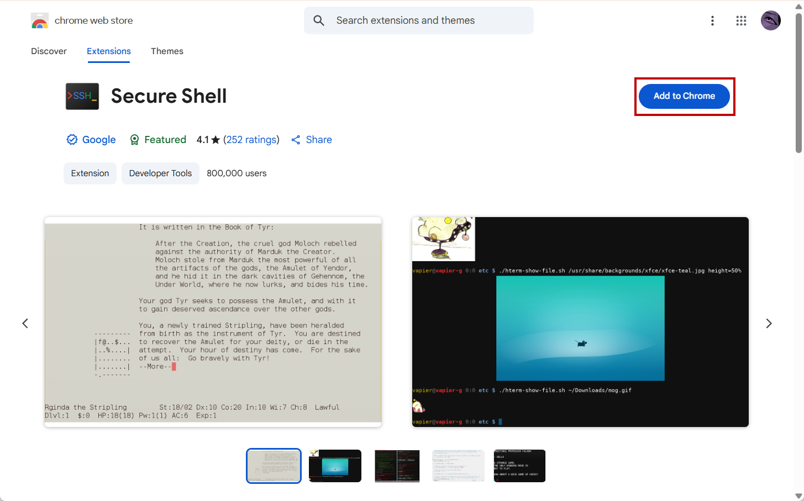
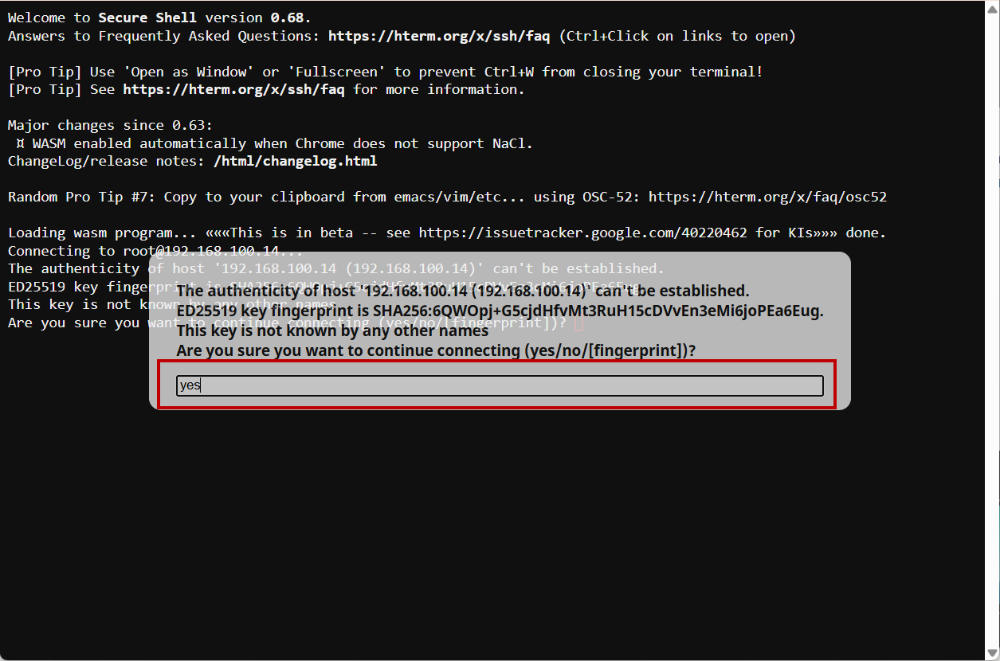
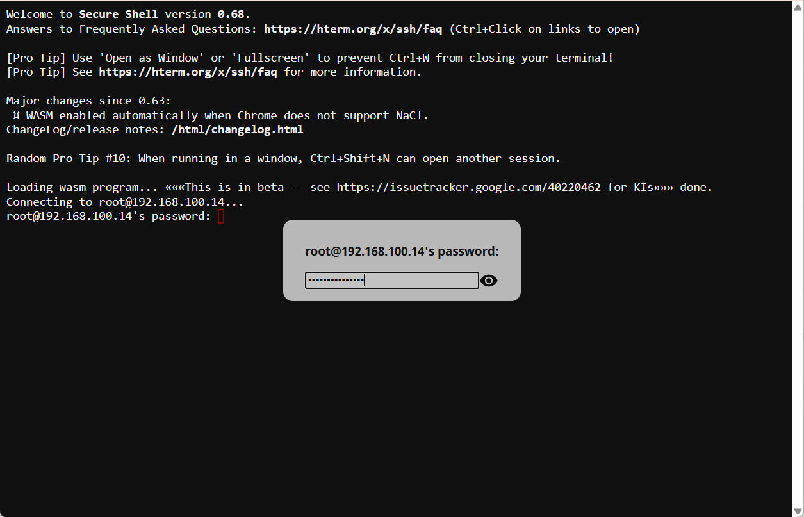
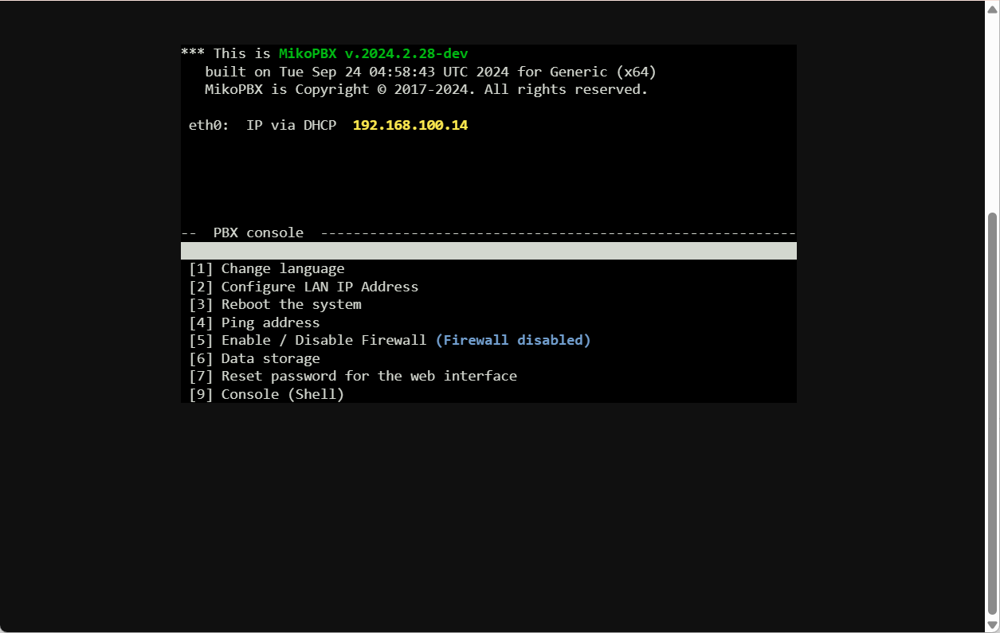

# SSH Connection (Google Secure Shell)


This method is available if you use Google Chrome for connection to the MikoPBX web interface.


### Enabling password access

1. Go to the "**System**" -> "**General Settings**" section.

<figure><figcaption>
"<strong>System</strong>" - "<strong>General settings</strong>" section
</figcaption></figure>

2. Go to the "**SSH**" section. Toggle the "**Disable password logins**" switch (switch is enabled by default). Set your password for the SSH connection. **Save** the settings.


Do not use weak passwords! Always disable password-based SSH connections after you log out!


<figure><figcaption>
Password-based access
</figcaption></figure>

### Connection using Google Secure Shell

1. In the MikoPBX Web-interface, go to "Maintenance" -> "SSH console".

<figure><figcaption>
"Maintenance" -> "SSH Console" section
</figcaption></figure>

2. If you don't have the "**Secure Shell**" browser extension installed, you will be redirected to the extension store. Click "**Add to Chrome**." After installation is complete, return to the web interface and repeat **Step 1**.

<figure><figcaption>
Installing extension
</figcaption></figure>

3. After redirecting to the Google Secure Shell tab, enter "**yes**" in the dialog box for a new connection. Press "**Enter**."

<figure><figcaption>
Dialog box #1
</figcaption></figure>

4. In the new dialog box, enter the previously set SSH password. Press "**Enter**."

<figure><figcaption>
Dialog box #2
</figcaption></figure>

An SSH connection will be established. :tada:

<figure><figcaption>
Successful SSH connection
</figcaption></figure>
