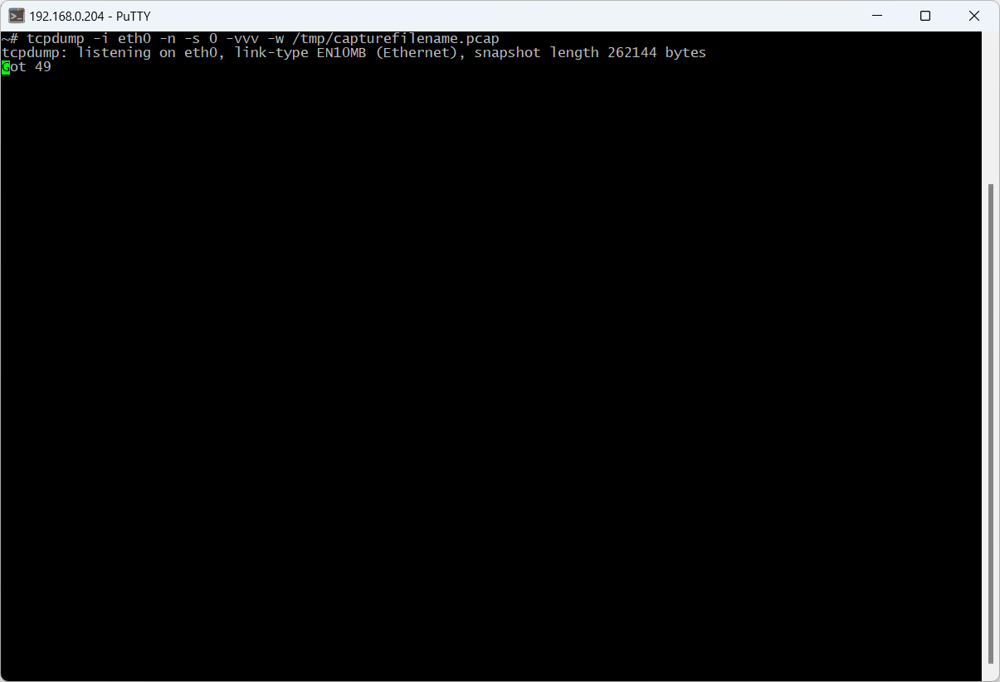
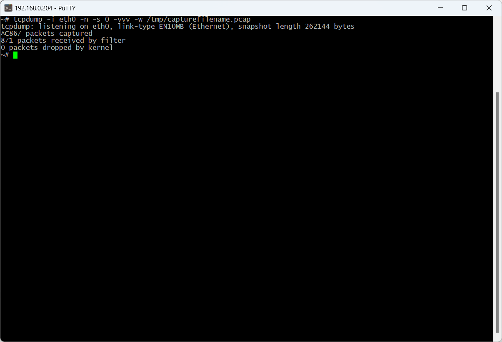
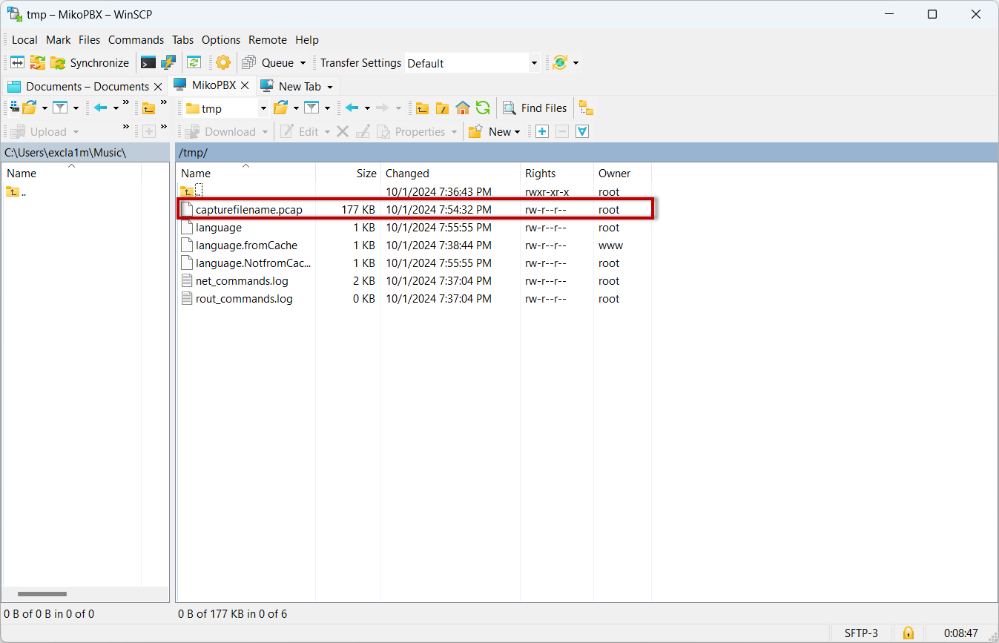

# Getting logs using the tcpdump application

**tcpdump** — это утилита в Linux для захвата и анализа сетевого трафика. Она позволяет в реальном времени отслеживать пакеты, проходящие через сетевой интерфейс, и сохранять их для дальнейшего анализа.

## Capturing Logs with the tcpdump Application

1. Connect to your PBX via SSH (instructions [here](connecting-to-a-pbx-using-an-ssh-client.md)).
2. Run the following command:

```bash
tcpdump -i eth0 -n -s 0 -vvv -w /tmp/capturefilename.pcap
```

<figure><figcaption><p>Command in SSH connection</p></figcaption></figure>

3. Reproduce the issue by making a phone call. After the call, press **CTRL + C** in the SSH console to stop **tcpdump**.

<figure><figcaption><p>Command in SSH connection</p></figcaption></figure>

4. Connect to the PBX using WinSCP (instructions [here](connecting-to-a-pbx-using-winscp.md)).
5. Send the log file **/tmp/capturefilename.pcap** to technical support.

<figure><figcaption><p>File with logs</p></figcaption></figure>
