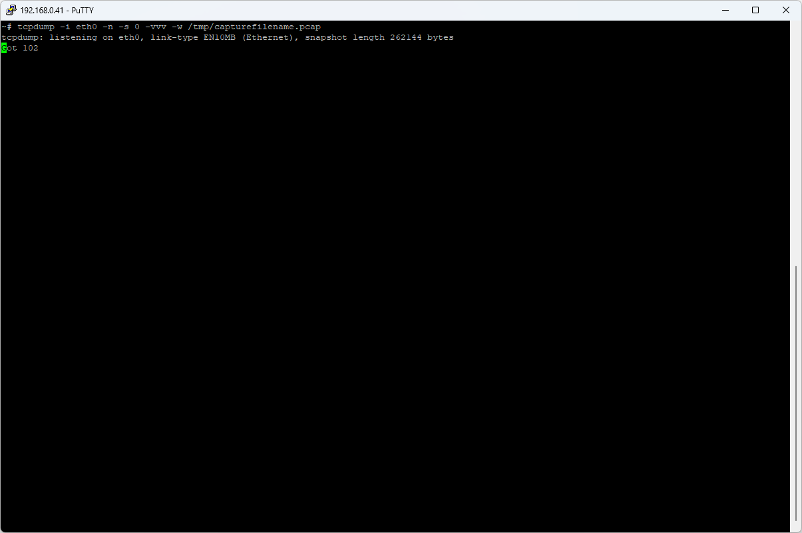
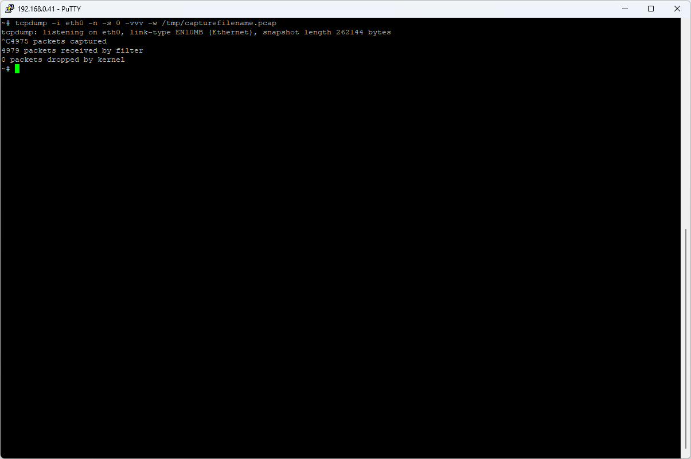
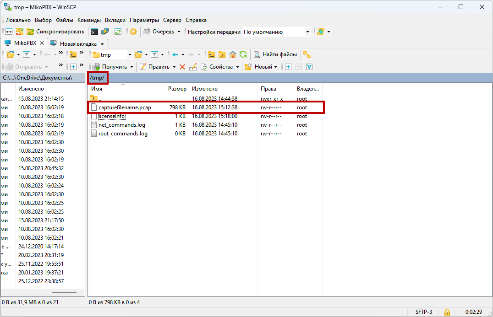

# Получение логов с помощью приложения tcpdump

1. Подключитесь к вашей АТС по SSH ([инструкция](podklyuchenie-k-ats-s-pomoshyu-ssh-klienta.md))
2. Выполните команду:

```php
tcpdump -i eth0 -n -s 0 -vvv -w /tmp/capturefilename.pcap
```

<figure><figcaption><p>Команда в интерфейсе SSH</p></figcaption></figure>

3. Воспроизведите Вашу ситуацию, выполните телефонный звонок. Далее нажмите в SSH консоли **CTRL + С**. Работа приложения **tcpdump** будет завершена.

<figure><figcaption><p>Результат работы tcpdump</p></figcaption></figure>

4. Подключитесь к АТС с помощью WinSCP ([инструкция](podklyuchenie-k-ats-s-pomoshyu-winscp.md))
5. Лог вызова **/tmp/capturefilename.pcap** отправляйте в техническую поддержку

<figure><figcaption><p>Файл "capturefilename.pcap"</p></figcaption></figure>
