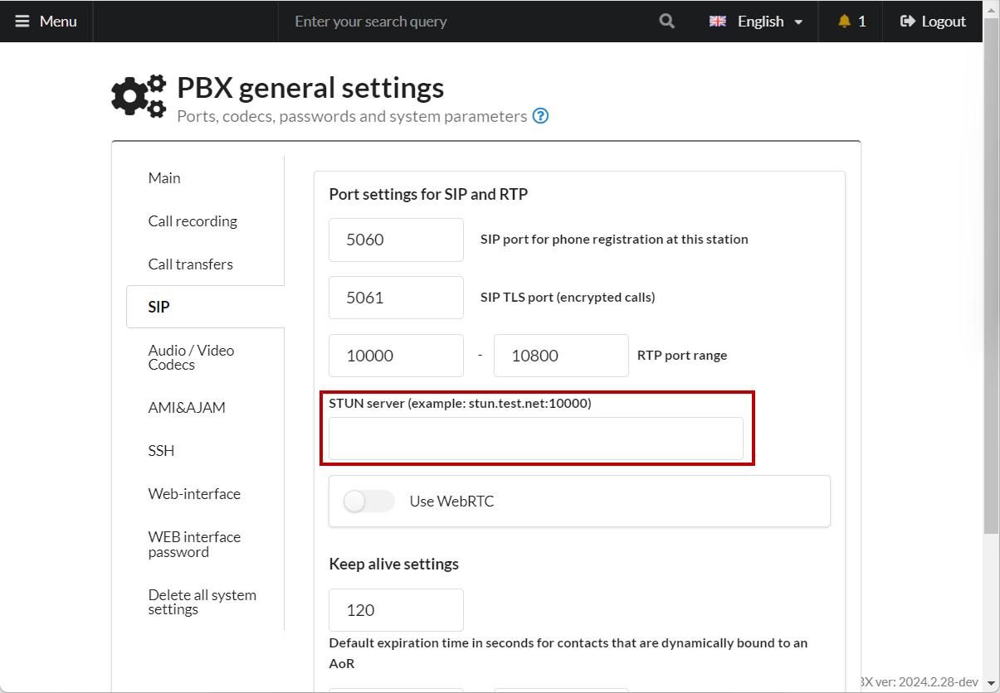

# Troubleshooting sound problems

## **Introduction**

In the development of MikoPBX, we strive to make features as simple as possible so that even a beginner can quickly start using the system.

However, some issues can significantly complicate life for an unprepared user. One of these issues is poor call quality, such as one-way audio. In this article, I'll outline an approach to analyzing audio problems.

## Codecs 

This is likely the first thing to check. MikoPBX allows you to connect a wide variety of **SIP / IAX** devices (endpoints), such as:

* Hardware SIP phone
* Analog phone (via a SIP gateway)
* Provider account, where the "endpoint" could be either physical hardware or an application (such as Asterisk)

Devices attempt to "negotiate" a session by exchanging information about supported codecs (media formats), such as **gsm / ulaw / alaw**, etc.

If the devices cannot find a common codec, the call will likely drop, and the logs will show an error indicating that no compatible codec was found.

In MikoPBX, codecs are configured in the "**General Settings**" - "**Audio/Video Codecs**" section ([see wiki](../../manual/system/general-settings.md#audio\_video\_kodeki)). The most common codec in Russia is **alaw**. For working with webRTC, you should enable the **opus** codec.

## NAT 

Incorrectly configured network settings are the most common problem.

**Typical Example**

At a company, there may be several local subnets:

* 172.16.32.0/24 - **Office**
* 172.16.33.0/24 - **VPN**
* 172.16.34.0/24 - **Other**

There is an external IP address **109.61.231.230**. Employees need to connect to the PBX from the following subnets:

* Office
* VPN
* Directly from the internet (LTE) for mobile employees

For external employees to connect, you will need:

* A public, static IP address - purchased from the internet service provider.
* In the network interface settings, specify the external PBX address ([see wiki](../../manual/connectivity/network.md)).
* Map the external SIP and RTP ports on the router ([see wiki](../../manual/system/general-settings.md#sip)) to the corresponding PBX ports (one-to-one). For example, if the PBX uses SIP port 5060 and RTP ports from 10000 to 20000, these ports should be opened on the router as well.
* [Enable ](../../manual/connectivity/firewall.md)and [configure ](../setup/fine-tuning-the-firewall.md)the PBX firewall.

In the firewall, all local subnets must be specified. **Be sure** to check the box "**This is a local subnet or VPN...**". If this box is not checked, the PBX will treat the subnet as external, and SIP messages will use the external PBX address instead of the internal one, causing audio issues.

In PBX versions **2021.4.1+**, you can specify a **STUN** server, which helps correctly determine the external address. From my experience, this is useful for webRTC clients:

<figure><figcaption>
Stun server address
</figcaption></figure>

**Symptoms** of incorrect configuration:

* One-way audio
* No audio in both directions
* Inability to make calls
* Calls not completing

## **SIP ALG**

"**SIP ALG**" is a Network Address Translation (NAT) helper feature found in most modern routers.

When the router receives a **SIP** packet with an **INVITE**, it modifies the IP address in the packet, which can cause communication problems.

If you're not sure how to configure it properly, **disable SIP ALG on your router**.

#### **Other Issues**

There are several problems that can be harder to detect at first glance. In practice, I have encountered the following:

* **Disk failure for storing data** - This can cause improper PBX operation, leading to poor call quality.
* **Unreliable internet connection** - A damaged network cable (surprisingly common) or overloaded network with torrent downloads, etc.
* **Hardware issues**

Here's an example of network traffic analysis for a problematic call:

<figure><figcaption>
Example of network traffic analysis
</figcaption></figure>

In the image, you can see "**red-yellow dots**". These represent "dropped packets" that will not be played back to the client. In this case, increasing the **Jitter Buffer** value to **800** stabilized the audio and eliminated stuttering.

Although the client "received" all the packets, due to significant delays, they were not played back. This specific problem was related to the use of the **Proxmox** virtualization system and was resolved by switching the client to a physical server.

## **Conclusion**

* When experiencing call quality issues, check the NAT settings.
* Ensure that all devices support the selected codecs.
* Capture traffic logs and send them to your provider for analysis.
