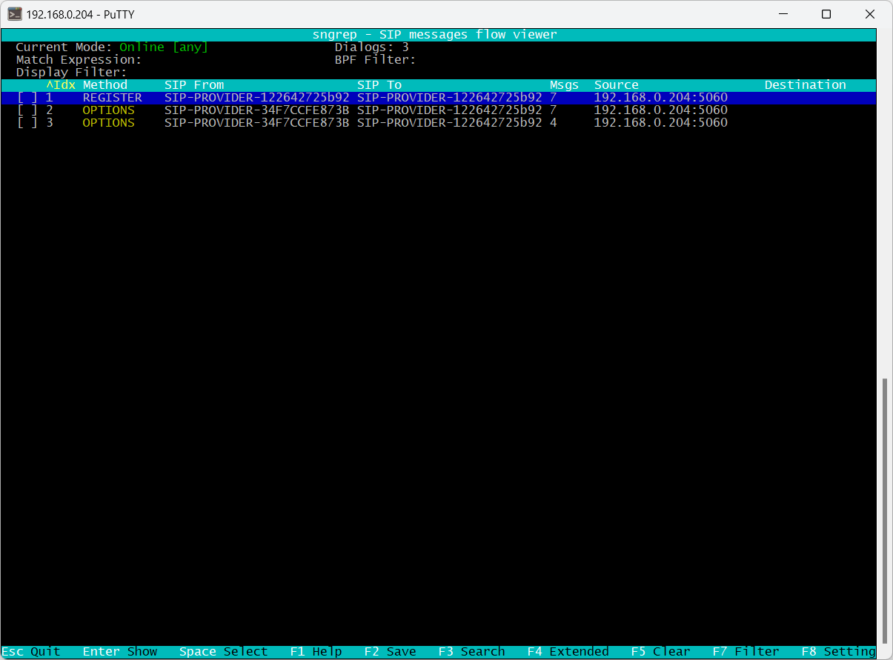
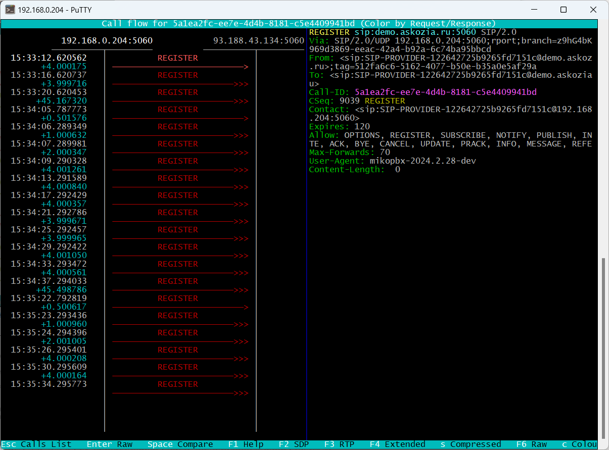
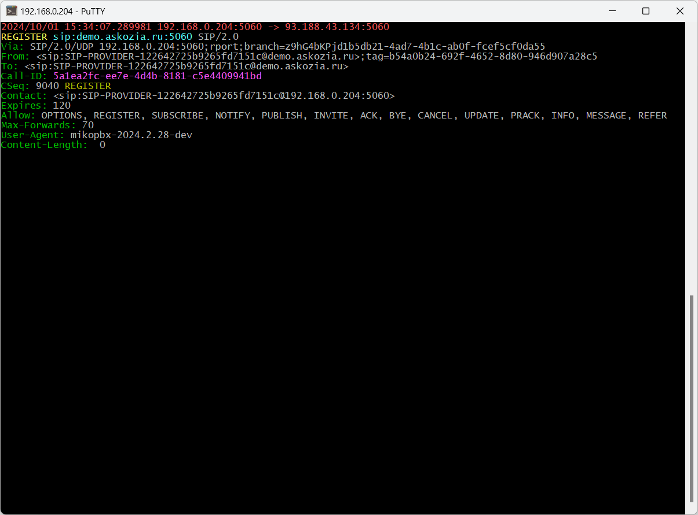
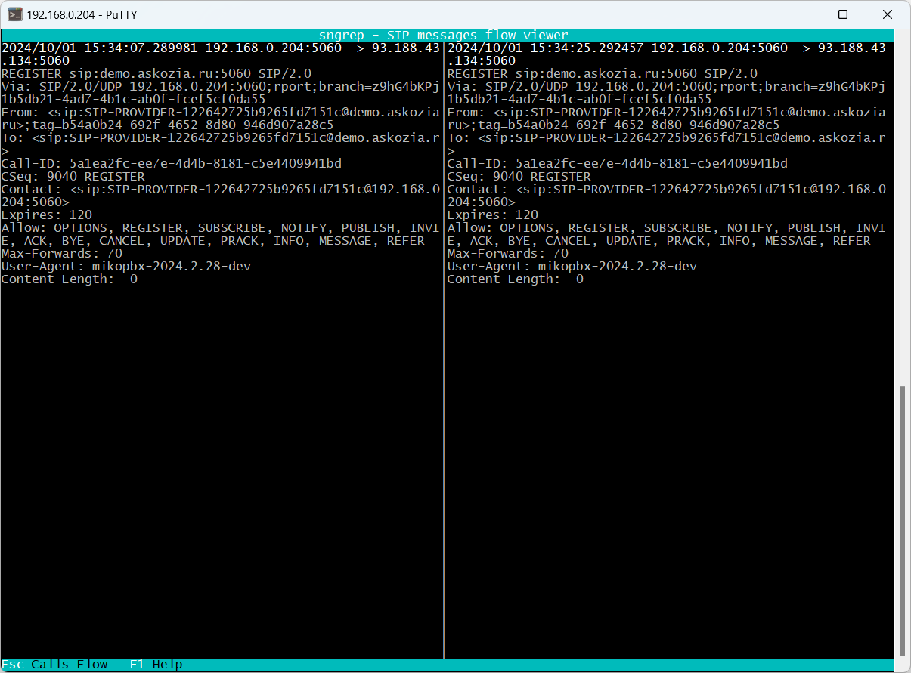
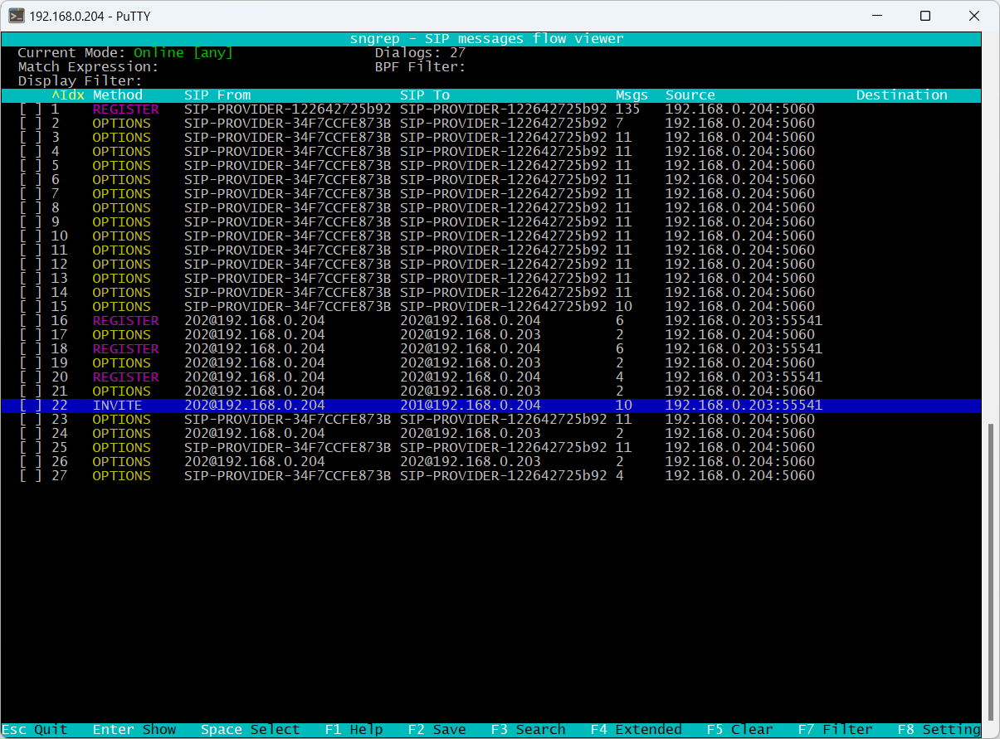
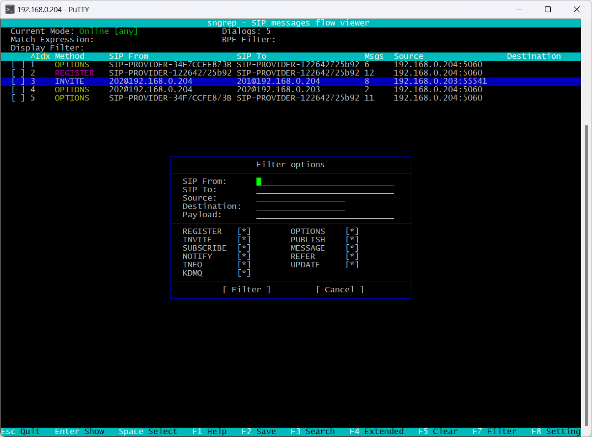

# Анализ трафика средствами Sngrep

**Sngrep** — это консольная утилита для захвата и анализа SIP-трафика. Она позволяет визуализировать SIP-сессии, фильтровать их и отслеживать проблемы в голосовых соединениях.


Используйте это приложение для анализа логов и их отправки в техническую поддержку.


Для начала работы с приложением используйте [Подключение к АТС с помощью SSH-клиента](connecting-to-a-pbx-using-an-ssh-client.md).

Для **запуска** приложения используйте команду:

```
# sngrep -r
```


Если используется несколько сетевых интерфейсов, то при запуске приложения следует уточнить ID интерфейса:

```
# sngrep -d eth1 -r
```

\
Ключ **-r** позволяет захватить звуковой трафик.&#x20;


Список интерфейсов можно посмотреть в выводе команды:

```php
# ifconfig 
eth0      Link encap:Ethernet  HWaddr 00:0C:29:08:EF:FD  
          inet addr:172.16.156.223  Bcast:172.16.156.255  Mask:255.255.255.0
          UP BROADCAST RUNNING MULTICAST  MTU:1500  Metric:1
          RX packets:81838 errors:0 dropped:0 overruns:0 frame:0
          TX packets:38019 errors:0 dropped:0 overruns:0 carrier:0
          collisions:0 txqueuelen:1000 
          RX bytes:66203565 (63.1 Mb)  TX bytes:7603334 (7.2 Mb)

eth1      Link encap:Ethernet  HWaddr 00:0C:29:08:EF:07  
          inet addr:172.16.32.162  Bcast:172.16.32.255  Mask:255.255.255.0
          UP BROADCAST RUNNING MULTICAST  MTU:1500  Metric:1
          RX packets:48506 errors:0 dropped:4432 overruns:0 frame:0
          TX packets:5386 errors:0 dropped:0 overruns:0 carrier:0
          collisions:0 txqueuelen:1000 
          RX bytes:3698996 (3.5 Mb)  TX bytes:1886690 (1.7 Mb)
```

Пример внешнего вида sngrep:

<figure><figcaption><p>Внешний вид Sngrep</p></figcaption></figure>

В окне приложения отображается список всех SIP диалогов:

* Стрелками **⇑** и **⇓** можно перемещаться между диалогами.
* Нажмите **Enter** Для просмотра детальной информации по диалогу

<figure><figcaption><p>Информация по диалогу</p></figcaption></figure>

* В детальной информации можно просматривать конкретные SIP пакеты выбирая нужный **⇑** и **⇓**
* Нажмите **Enter** Для просмотра содержимого SIP пакета

<figure><figcaption><p>Содержимое SIP пакета</p></figcaption></figure>

* Нажмите **ESC** для возврата к предыдущему окну
* Используйте клавишу «**Пробел**» для выбора нескольких SIP диалогов и нажмите **Enter** для их просмотра в одном окне
* В детальной информации используйте клавишу «**Пробел**» для двух SIP пакетов и их сравнения

<figure><figcaption><p>Сравнение двух SIP пакетов</p></figcaption></figure>

### Сохранение дампа <a href="#soxranenie_dampa" id="soxranenie_dampa"></a>

1. Выделите клавишей «Пробел» интересующий вас SIP диалог «Call»

<figure><figcaption><p>Диалог "Call"</p></figcaption></figure>

2. Нажмите F2 для вызова диалога сохранения дампа в файл:&#x20;

* Стрелками **⇑** и **⇓** перемещайтесь между полями формы ввода
* Заполните путь и имя файла
* Выберите действие сохранить и нажмите **ENTER**
* Скачайте файл используя [Подключение к АТС с помощью WinSCP](connecting-to-a-pbx-using-winscp.md)

### Фильтрация <a href="#filtracija" id="filtracija"></a>

1. Нажмите F7 для вызова диалога фильтра:

<figure><figcaption></figcaption></figure>

2. Стрелками **⇑** и **⇓** перемещайтесь между полями формы ввода
3. Клавишей «**Пробел**» выберите SIP методы для анализа
4. Выберите действие «**Filter**» и нажмите **ENTER**
