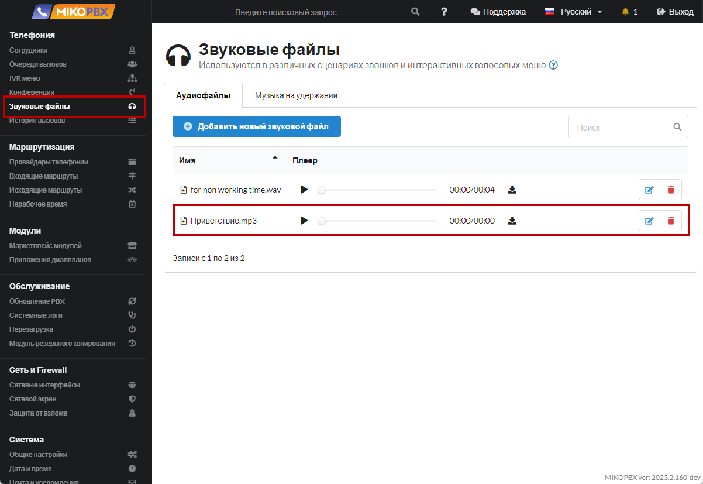
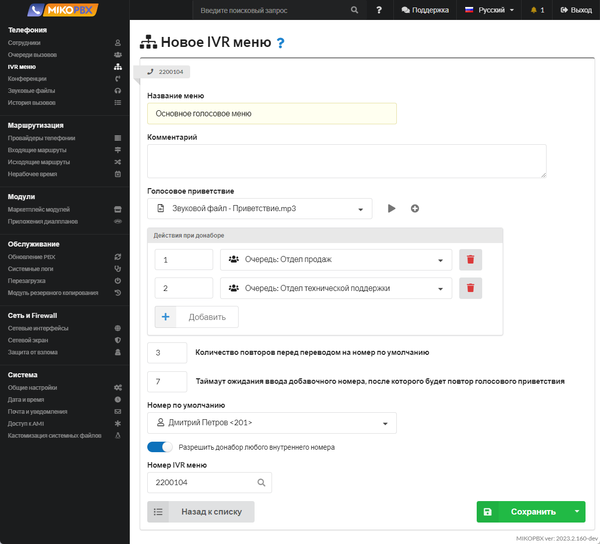
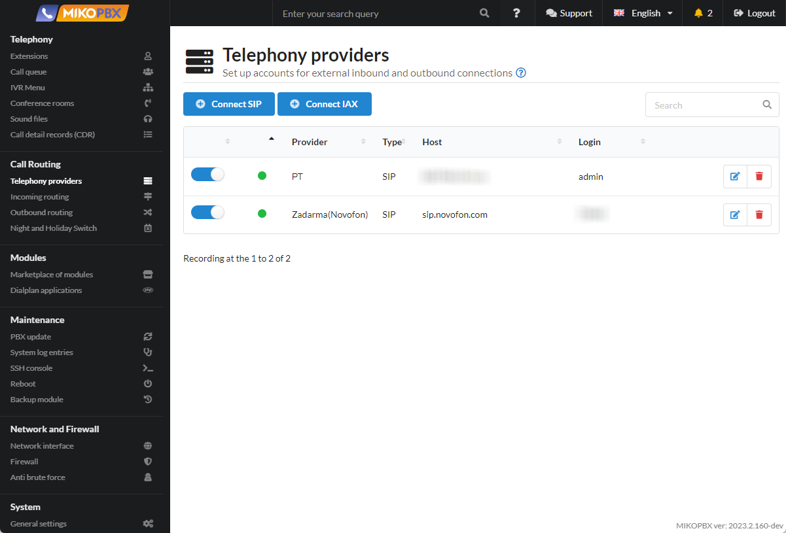
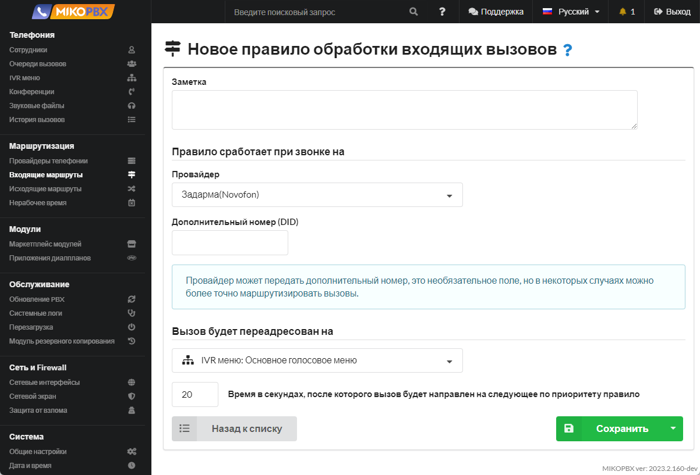

# Базовый пример IVR

## Постановка задачи 

Клиент звонит в компанию, звучит приветственное сообщение (голосовое приветствие).

Во время проигрывания голосового приветствия клиент может набрать любой внутренний номер, например, добавочный номер сотрудника.

Также клиент может ввести с телефона цифры:

* **1** - вызов в этом случае направится на сотрудника с внутренним номером 201.
* **2** - вызов направится на сотрудника с внутренним номером 202.

Если клиент ничего не ввел / некорректно набрал номер, то происходит переадресация на **номер по умолчанию** - сотрудника с внутренним номером 201.

Схематично задачу можно представить следующим образом:

<figure><figcaption>
Схема поставленной задачи 
</figcaption></figure>

## Решение 

&#x20;1\. Создаем **учетные записи сотрудников** по [инструкции](../../manual/telefoniya/extensions.md). Подключаем программные или аппаратные телефоны к данным учетным записям.

<figure><figcaption>
Сотрудники 
</figcaption></figure>

2. Добавляем **звуковой файл** приветствия по [инструкции](../../manual/telefoniya/sound-files.md), который будет слышать клиент при звонке на номер компании.

<figure><figcaption>
Меню "Звуковые файлы"
</figcaption></figure>

3. Добавляем новое **IVR-меню** по [инструкции](../../manual/telefoniya/ivr-menu.md).

<figure><figcaption>
IVR меню
</figcaption></figure>

При звонке на голосовое меню (**Номер IVR меню**) начинает проигрываться звуковой файл «**Голосовое приветствие**».

**Во время проигрывания голосового меню** можно набрать:

* любой внутренний номер, например, добавочный номер сотрудника. За эту возможность отвечает флаг **Разрешить донабор любого внутреннего номера**.
* цифру 1 - вызов направится на сотрудника с внутренним номером 201
* цифру 2 - вызов направится на сотрудника с внутренним номером 202

Если **во время** проигрывания голосового меню клиент **ничего не ввел**, то **после проигрывания** голосового меню происходит ожидание **7 секунд** для набора комбинации цифр.\
«Общее время для набора номера» = «Длительность звукового файла» + 7 секунд.

Если «Общее время для набора номера» истекло, то происходит переадресация на «**Номер по умолчанию**», т.е. на сотрудника с внутренним номером 101.

Если необходимо **повторно** воспроизвести голосовое приветствие и дать клиенту возможность снова ввести номер, то установите **«Количество повторов, перед переводом на номер по умолчанию»** в значение 2 и более. Происходит повторное голосовое оповещение и ожидание 7 секунд, то есть следующая попытка IVR. Как только попытки превышают указанное значение - происходит переадресация на «**Номер по умолчанию**».

Если пользователь **некорректно** набирает номер или вообще ничего не набирает, то происходит повторное голосовое оповещение (в случае если **Количество повторов** установлено **больше 2-х**), либо происходит переадресация на «**Номер по умолчанию**» (в случае если **Количество повторов** равно **1**).

4. Добавляем **учетную запись провайдера**, через которого будут совершаться звонки, по [инструкции](../../manual/routing/providers.md). Примеры подключения провайдеров приведены [здесь](../providers/).

<figure><figcaption>
Провайдеры телефонии
</figcaption></figure>

5. Настраиваем прием всех **входящих звонков** через заведенного провайдера на IVR-меню.

<figure><figcaption>
Новое правило обработки входящих вызовов 
</figcaption></figure>


Инструкции по настройке входящей маршрутизации доступны по [ссылке](./).

