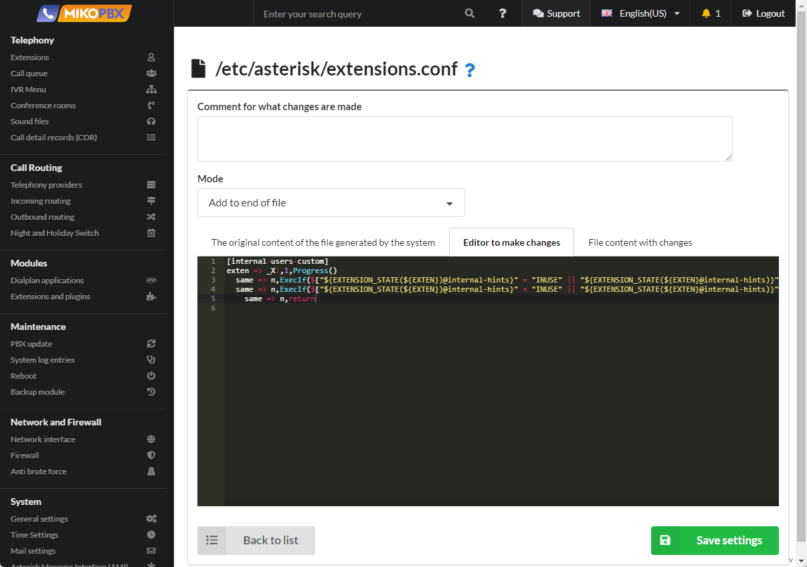

# Черные и белые списки

1. Перейдите в раздел **Система** → **Кастомизация системных файлов**.

<figure><figcaption><p>Раздел "Кастомизация системных файлов"</p></figcaption></figure>

2. Откройте для редактирования конфигурационный файл **extensions.conf**.

<figure><figcaption><p>Редактирование конфигурационного файла "Extensions.conf" </p></figcaption></figure>

3. Установите режим "Добавлять в конец файла" и вставьте следующий код:

```php
[add-trim-prefix-clid-custom]
exten => _X!,1,NoOp(...)
    ; Черный список номеров. Вызов будет завершен. 
    same => n,ExecIf($["${CALLERID(num)}" == "72942293042"]?Hangup())
    same => n,ExecIf($["${CALLERID(num)}" == "72942293043"]?Hangup())
    same => n,ExecIf($["${CALLERID(num)}" == "72942293044"]?Hangup())
    same => n,return
```

<figure><figcaption><p>Код для файла "extnsions.conf"</p></figcaption></figure>

Белый список номеров иногда требуется описать для конкретных провайдеров:

```php
[ID-ПРОВАЙДЕРА-incoming-custom]
exten => _X!,1,NoOp(...)
    ; Белый список номеров. 
    same => n,ExecIf($["${CALLERID(num)}" == "72942291111"]?return)
    same => n,ExecIf($["${CALLERID(num)}" == "72942291112"]?return)
    same => n,ExecIf($["${CALLERID(num)}" == "72942291113"]?return)
    same => n,Hangup()
```

<figure><figcaption></figcaption></figure>

* **ID-ПРОВАЙДЕРА** - значение, которое вы можете найти в адресной строке в момент конфигурации провайдера

<figure><figcaption><p>Как найти ID провайдера:</p></figcaption></figure>

