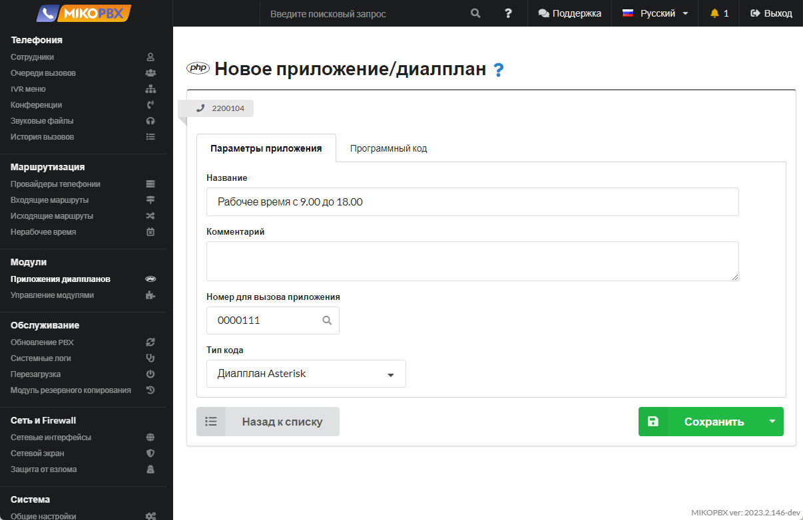
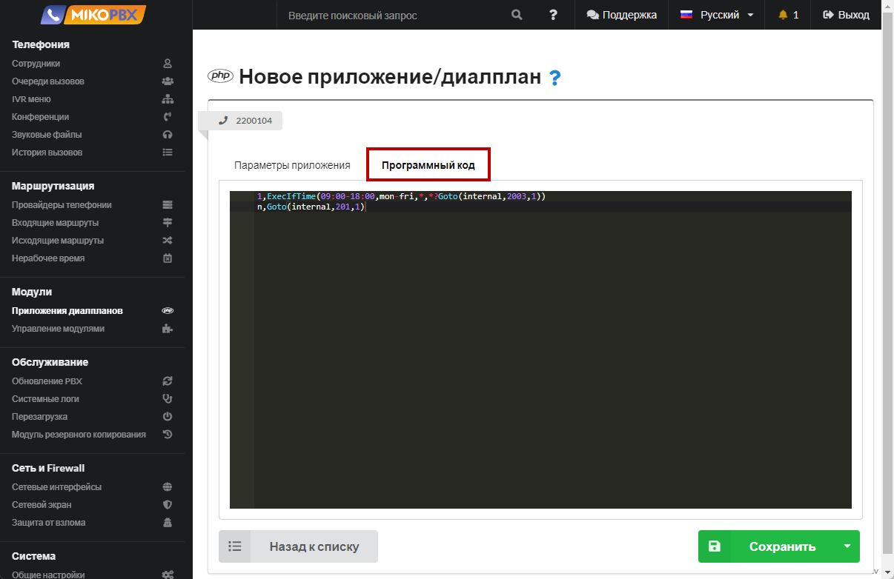
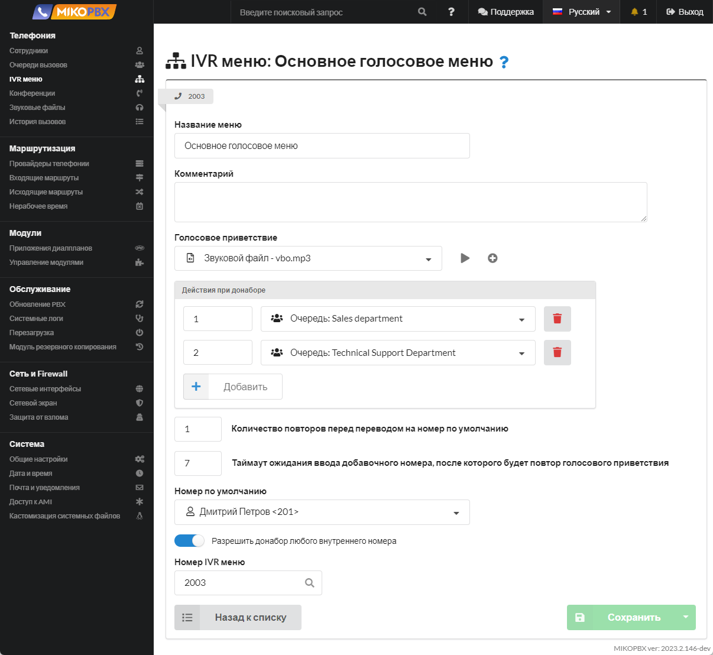

# Настройка индивидуального нерабочего времени для учетной записи провайдера

## Постановка задачи <a href="#postanovka_zadachi" id="postanovka_zadachi"></a>

В MikoPBX в разделе **Маршрутизация** → **Нерабочее время** настроены правила маршрутизации вызовов в нерабочее время. Данные правила распространяются на все вызовы, независимо от того на какой номер компании позвонил клиент. Необходимо для провайдера Zadarma настроить индивидуальное нерабочее время. Рабочее время для данного провайдера: с 9.00 до 18.00 по МСК.

## Решение <a href="#reshenie" id="reshenie"></a>

### Способ 1 <a href="#sposob_1" id="sposob_1"></a>

1. Перейдите в раздел **Модули** → **Приложения диалпланов**. Создайте новое приложение (диалплан Asterisk) по [инструкции](../../manual/modules/dialplan-applications.md). Параметры приложения принимают вид:

<figure><figcaption><p>Параметры создаваемого диалплана </p></figcaption></figure>

2. Программный код созданного приложения:

```php
1,ExecIfTime(09:00-18:00,mon-fri,*,*?Goto(internal,2003,1))
n,Goto(internal,201,1)
```

<figure><figcaption><p>Программный код создаваемого приложения</p></figcaption></figure>

Команда **ExecIfTime** выполняет указанное приложение Asterisk, если текущее время соответствует заданной спецификации времени. Если нам позвонят с 9:00 до 18:00 в любой будний день (с понедельника по пятницу), то мы перенаправляем вызов ([команда Goto](http://asterisk.ru/knowledgebase/Asterisk+cmd+goto)) на номер 2003. **2003** - это номер IVR-меню.

<figure><figcaption><p>Настройки в IVR меню</p></figcaption></figure>

Иначе вызов направится сотруднику с внутренним номером 201.

3. Настраиваем правила входящей маршрутизации для созданного провайдера. Переходим в раздел **Маршрутизация** → **Входящие маршруты**. Направляем все входящие вызовы на созданное приложение.

<figure><figcaption><p>Настройки входящих маршрутов </p></figcaption></figure>

### Способ 2 <a href="#sposob_2" id="sposob_2"></a>

1. Найдите и скопируйте ID-провайдера. Чтобы это сделать - перейдите в конфигурацию необходимого провайдера. В нашем примере - это **SIP-1687941868**

<figure><figcaption><p>ID провайдера</p></figcaption></figure>

2. Перейдите в раздел **Система** -> **Конфигурация системных файлов**

<figure><figcaption><p>Раздел "Кастомизация системных файлов"</p></figcaption></figure>

3. Откройте для редактирования конфигурационный файл **extensions.conf**. Установите режим «**Добавлять в конец файла**».

<figure><figcaption><p>Конфигурационный файл "extensions.conf"</p></figcaption></figure>

4. В черное окно добавьте следующий фрагмент кода:

```php
[SIP-1687941868-incoming-custom]
exten => _.!,1,NoOp(check time)
    same => n,ExecIfTime(00:00-09:00,mon-fri,*,*?Macro(playback-exit,/offload/asterisk/sounds/other/out_work_times))
    same => n,ExecIfTime(18:00-23:59,mon-fri,*,*?Macro(playback-exit,/offload/asterisk/sounds/other/out_work_times))
    same => n,return
```

<figure><figcaption><p>Код для extensions.conf</p></figcaption></figure>

В выше приведенном фрагменте кода Вам необходимо составить правильное наименование контекста.\
Формат создаваемого контекста:

```php
[ID-ПРОВАЙДЕРА-incoming-custom]
```

* **ID-ПРОВАЙДЕРА** - значение, которое вы сохранили на втором шаге данной инструкции. В нашем примере это **SIP-1687941868**.

Рабочее время с 9.00 до 18.00, следовательно необходимо задать два интервала для нерабочего времени: 00:00-09:00 и 18:00-23:59.

### Команда ExecIfTime

Более подробно разберём команду **ExecIfTime**. Эта команда выполняет указанное приложение Asterisk, если текущее время соответствует заданной спецификации времени. В нашем случае команда выполняет проигрывание звукового файла, расположенного в директории **/offload/asterisk/sounds/other/out\_work\_times** в MikoPBX.\
Синтаксис команды:

```php
ExecIfTime(times,weekdays,mdays,months?appname[(appargs)])
```

* **times** - Диапазоны времени в 24-часовом формате
* **weekdays** - Дни недели (mon, tue, wed, thu, fri, sat, sun)
* **mdays** - Дни месяца (1-31)
* **months** - Месяцы (jan, feb, mar, apr и т. д.)
* **appname\[(appargs)]** - команда Asterisk с указанием параметров вызова

В нашем примере указаны диапазон времени, диапазон дней недели. Вместо указания дней месяцев и месяцев введены \*. Этот символ означает «для всех остальных случаев».

```php
ExecIfTime(00:00-08:00,mon-fri,*,*?Macro(playback-exit,/offload/asterisk/sounds/other/out_work_times))
```
