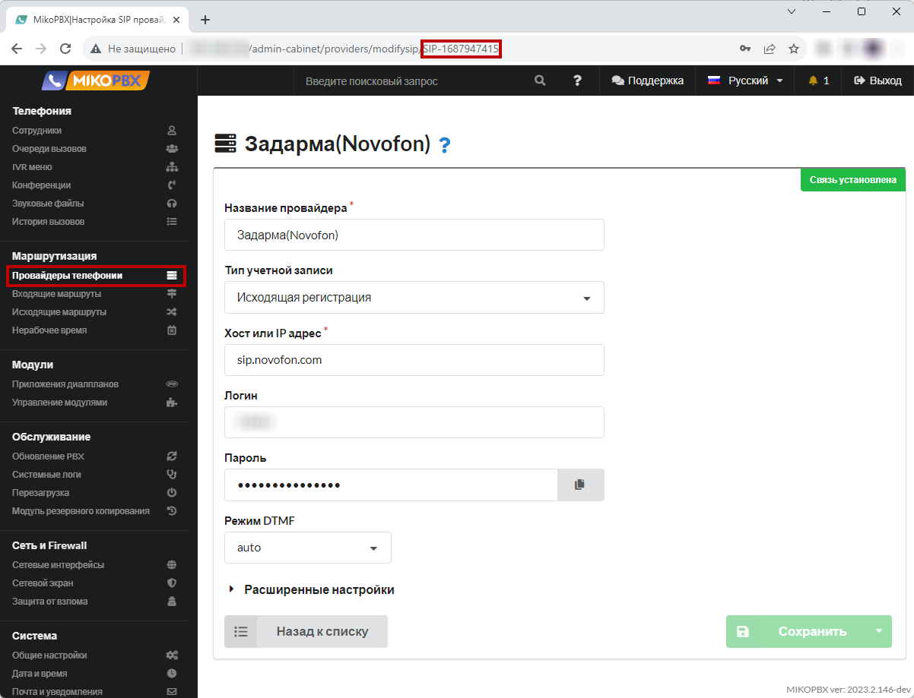

# Нормализация входящего номера телефона

При подключении к MikoPBX более одного провайдера может сложится ситуация, что номер телефона клиентов поступает в различном формате:

* В 7и значном виде - **2293042**
* Через «+», к пример **+79257184444**
* Через «8», к примеру **89257184444**

Появляется необходимость привести все к одному формату.

1. Перейдите в раздел **Маршрутизация** → **Провайдеры телефонии**. Откройте для редактирования учетную запись провайдера для редактирования. Скопируйте в адресной строке **ID провайдера**, через которого абоненты звонят Вам в компанию. Обращаем Ваше внимание, что в нашем примере используется **единственный** провайдер. Если у Вас настроено подключение **нескольких** провайдеров, то ниже описанные действия необходимо выполнить **для каждого провайдера**.

<figure><figcaption><p>Где найти ID провайдера </p></figcaption></figure>

В нашем примере ID провайдера принимает вид: **SIP-1687947415**

2. Перейдите в раздел **Система** → **Кастомизация системных файлов**.

<figure><figcaption><p>Раздел "Кастомизация системных файлов"</p></figcaption></figure>

3. &#x20;Откройте для редактирования конфигурационный файл **extensions.conf**.

<figure><figcaption><p>Редактирование конфигурационного файла "extensions.conf"</p></figcaption></figure>

4. Выберите режим "**Добавлять в конец файла**". В черное окно добавьте следующий фрагмент кода:


```php
[SIP-1687947415-incoming-custom]
exten => _.!,1,NoOp(---)
    ; Отсекаем плюс
    same => n,Set(CALLERID(num)=${REPLACE(CALLERID(num),"+")})
    ; Для 11ти значного номера отсекаем первую цифру и добавляем 7
    same => n,ExecIf($[ ${LEN(${CALLERID(num)})} == 11 ]?Set(CALLERID(num)=7${CALLERID(num):1}))
    ; Для 7ми значного номера добавляем код страны 7 и код города 495
    same => n,ExecIf($[ ${LEN(${CALLERID(num)})} == 7 ]?Set(CALLERID(num)=7495${CALLERID(num)}))
    same => n,return
; Если номер звонящего начинается с 886142 (11 значный), то отрезать код города "886142" 
exten => _.X!/_886142XXXXX,1,Set(CALLERID(num)=${CALLERID(num):5})
    same => n,return
```


В выше приведенном фрагменте кода Вам необходимо составить правильное наименование контекста.\
Формат создаваемого контекста:

```php
[ID-ПРОВАЙДЕРА-incoming-custom]
```

* **ID-ПРОВАЙДЕРА** - значение, которое вы сохранили на первом шаге данной инструкции. В нашем примере это **SIP-1687947415.**

<figure><figcaption><p>Код для exensions.conf</p></figcaption></figure>


Обращаем Ваше внимание, если у Вас в MikoPBX подключено несколько провайдеров, выше описанный фрагмент кода нужно составить для каждого провайдера, учитывая уникальность ID каждого из провайдеров.


Если необходимо добавить нормализацию для всех провайдеров сразу, то достаточно описать контекст «**add-trim-prefix-clid-custom**». Пример, все 10ти значным АОН добавить 7ку:


```php
[add-trim-prefix-clid-custom]
exten => _.X!,1,ExecIf($[ ${LEN(${CALLERID(num)})} == 10 ]?Set(CALLERID(num)=7${CALLERID(num)}))
	same => n,return
```

