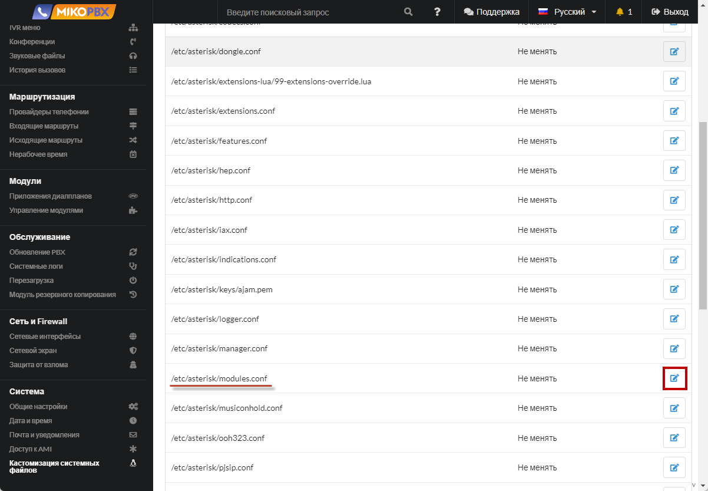
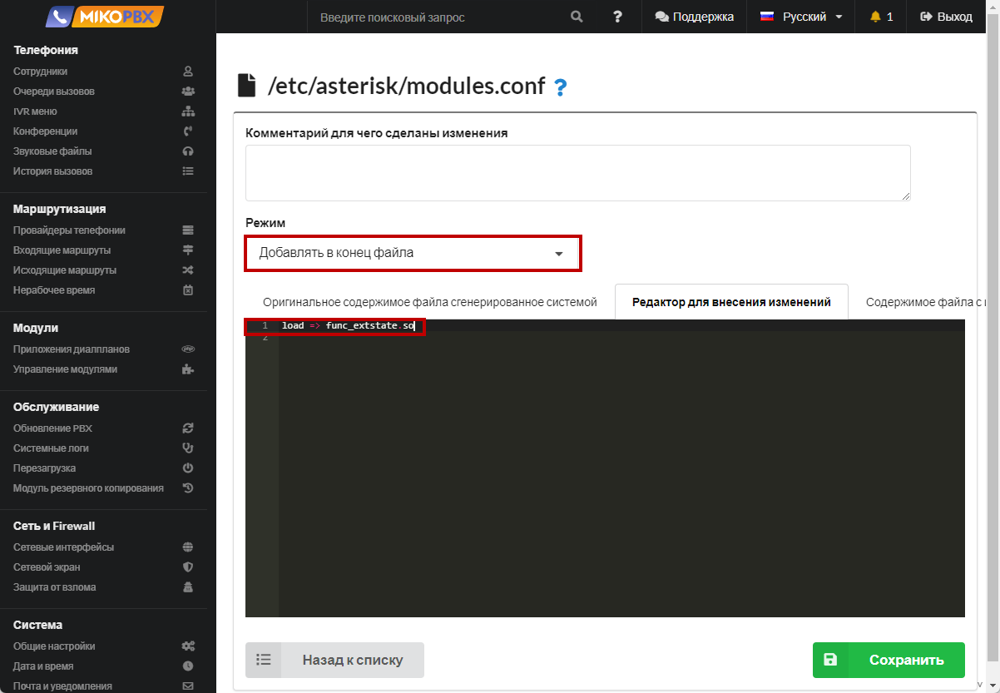
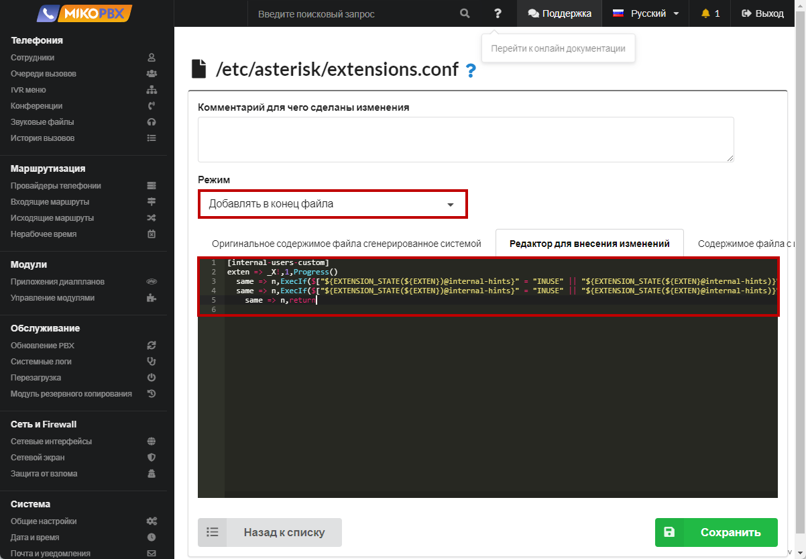
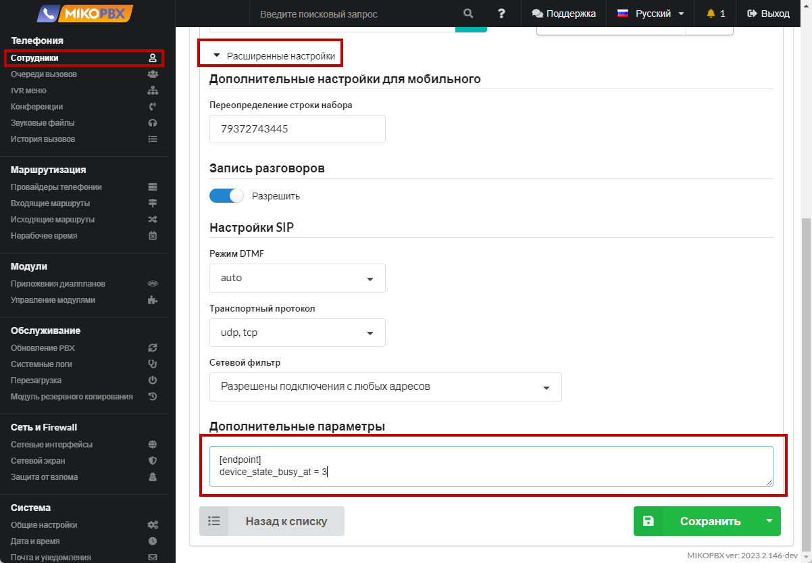

# Уведомление о занятости, Call Waiting

1. Перейдите в раздел [Кастомизация системных файлов](../../manual/system/custom-files.md)

<figure><figcaption><p>Раздел "Кастомизация системных файлов"</p></figcaption></figure>

2. Перейдите к редактированию файла "**modules.conf**"

<figure><figcaption><p> Редактирование файла "modules.conf"</p></figcaption></figure>

3. Добавьте в конец файла следующий код:

```php
load => func_extstate.so
```

<figure><figcaption><p>Код для "modules.conf"</p></figcaption></figure>

4. Перейдите к редактированию файла "**extensions.conf**"

<figure><figcaption><p>Редактирование файла "extensions.conf"</p></figcaption></figure>

5. Добавьте в конец файла следующий код:

```php
[internal-users-custom]
exten => _X!,1,Progress()
  same => n,ExecIf($["${EXTENSION_STATE(${EXTEN})@internal-hints}" = "INUSE" || "${EXTENSION_STATE(${EXTEN}@internal-hints)}" = "RINGINUSE"]?Playback(beep))
  same => n,ExecIf($["${EXTENSION_STATE(${EXTEN})@internal-hints}" = "INUSE" || "${EXTENSION_STATE(${EXTEN}@internal-hints)}" = "RINGINUSE"]?Set(TRANSFER_OPTIONS=${TRANSFER_OPTIONS}m))
    same => n,return
```

<figure><figcaption><p>Код для "extensions.conf"</p></figcaption></figure>

6. В карточке сотрудника, в поле «**Расширенные настройки**» - «**Дополнительные параметры**» установите значение

```
[endpoint]
device_state_busy_at = 3
```

<figure><figcaption></figcaption></figure>

Если сотрудник будет занят, то звонящему будет проигран файл **beep** (короткий гудок), затем вместо гудков будет проигрываться музыка, пока сотрудник не ответит на вызов


**device\_state\_busy\_at** - это то количество разговоров, при котором следует считать сотрудника «занятым», в этом случае начнут работать правила «**Настройки маршрутизации**», описанные в карточке сотрудника.


В случае некорректной работы решения задачи, измените код в **extensions.conf** на:

```php
[internal-users-custom]
exten => _X!,1,Progress()
same => n,NoOp(${EXTEN})
same => n,NoOp(${DEVICE_STATE(PJSIP/${EXTEN})})
same => n,ExecIf($["${DEVICE_STATE(PJSIP/${EXTEN})}" = "INUSE" || "${DEVICE_STATE(PJSIP/${EXTEN})}" = "RINGINUSE"]?Background(nomer&zanjat))
same => n,ExecIf($["${DEVICE_STATE(PJSIP/${EXTEN})}" = "INUSE" || "${DEVICE_STATE(PJSIP/${EXTEN})}" = "RINGINUSE"]?Set(TRANSFER_OPTIONS=${TRANSFER_OPTIONS}m(callwaiting)))
same => n,return
```
