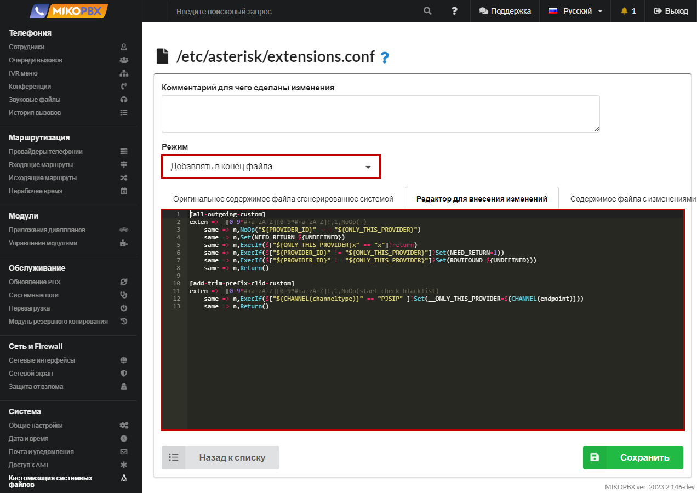

# Выбор провайдера при переадресации на мобильный

**Задача**: На АТС заведено несколько провайдеров А,Б,В,Г…\
Вызов поступает на MikoPBX через провайдера А.\
При наборе мобильного номера сотрудника вызов должен также идти через провайдера А.\
**Провайдер должен поддерживать более одного одновременного вызова.**

1. Перейдите в раздел **Система** → **Кастомизация системных файлов**

<figure><figcaption><p>Меню кастомизации системных файлов</p></figcaption></figure>

2. Откройте для редактирования конфигурационный файл **extensions.conf**.

<figure><figcaption><p>Редактирование файла Extensions.conf</p></figcaption></figure>

3. Установите режим «**Добавлять в конец файла**». В черное окно добавьте следующий фрагмент кода:

```php
[all-outgoing-custom]
exten => _[0-9*#+a-zA-Z][0-9*#+a-zA-Z]!,1,NoOp(-)
    same => n,NoOp("${PROVIDER_ID}" --- "${ONLY_THIS_PROVIDER}")
    same => n,Set(NEED_RETURN=${UNDEFINED})
    same => n,ExecIf($["${ONLY_THIS_PROVIDER}x" == "x"]?return)
    same => n,ExecIf($["${PROVIDER_ID}" != "${ONLY_THIS_PROVIDER}"]?Set(NEED_RETURN=1))
    same => n,ExecIf($["${PROVIDER_ID}" != "${ONLY_THIS_PROVIDER}"]?Set(ROUTFOUND=${UNDEFINED}))
    same => n,Return()
    
[add-trim-prefix-clid-custom]
exten => _[0-9*#+a-zA-Z][0-9*#+a-zA-Z]!,1,NoOp(start check blacklist)
    same => n,ExecIf($["${CHANNEL(channeltype)}" == "PJSIP" ]?Set(__ONLY_THIS_PROVIDER=${CHANNEL(endpoint)}))
    same => n,Return()
```

<figure><figcaption><p>Код для extension.conf</p></figcaption></figure>

4. Для каждого провайдера необходимо описать [исходящий маршрут](../../manual/routing/outbound-routes.md)
5. Заполните для сотрудников мобильные номера [см. документацию](../../manual/telefoniya/extensions.md)
6. Ограничьте использование исходящих маршрутов для пользователей, используйте модуль «[Группы пользователей](../../modules/miko/module-users-groups.md)»
7. Теперь если выходящий вызов направить на мобильный сотрудника, к примеру через [IVR меню](../../manual/telefoniya/ivr-menu.md), то вызов будет направлен через того же провайдера, через которого пришел


ВНИМАНИЕ: Инструкции актуальны только для MikoPBX **2022.2.96**+

