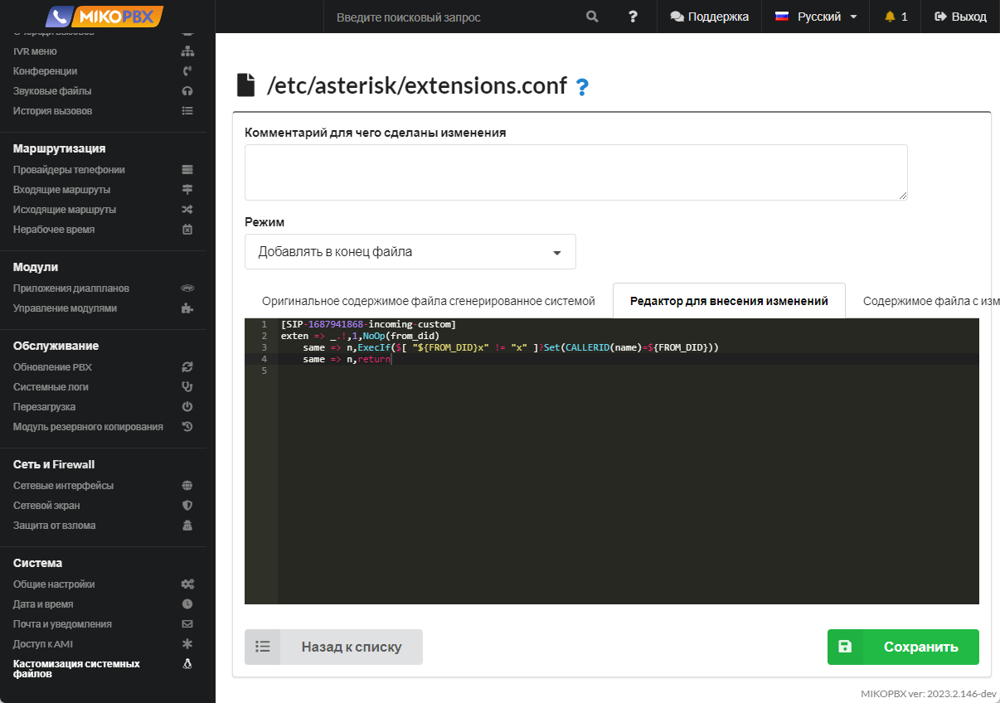
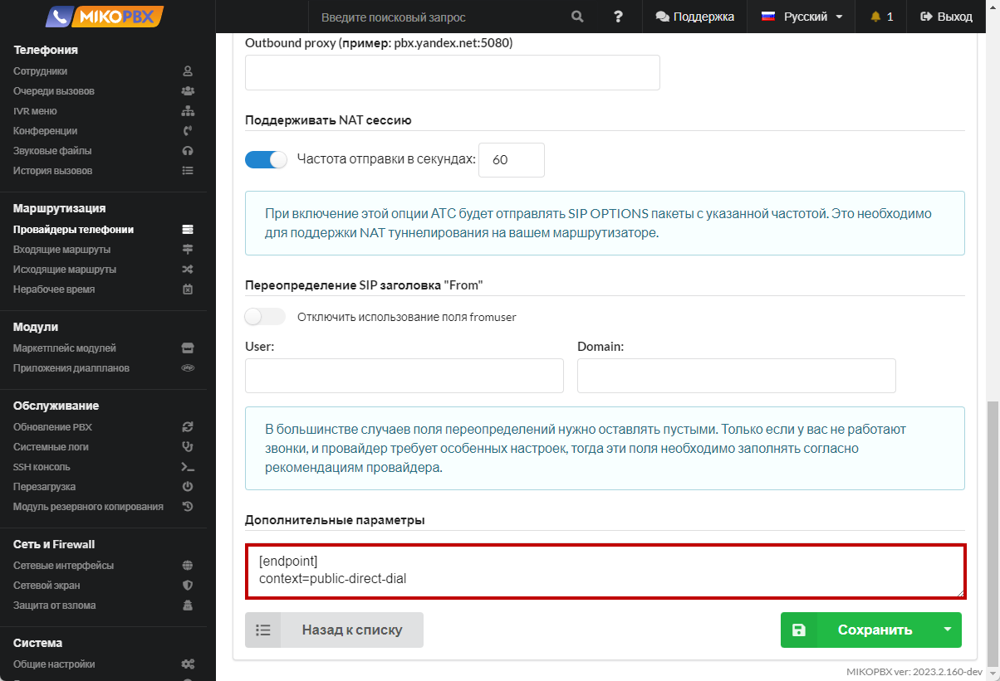
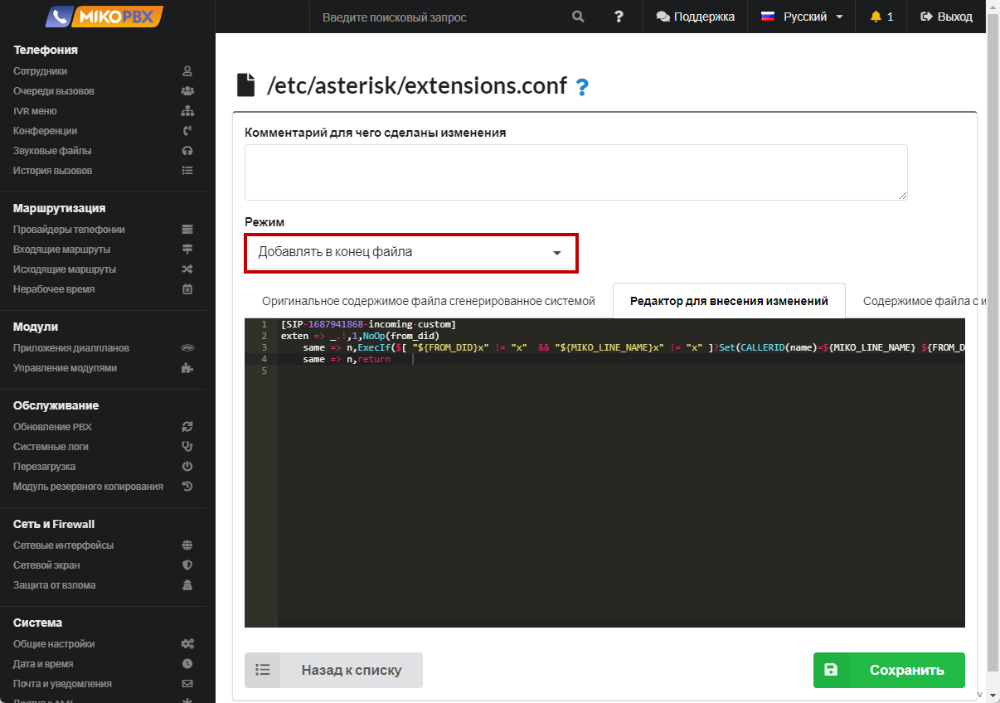

# Вывод информации о did-номере

## Постановка задачи <a href="#postanovka_zadachi" id="postanovka_zadachi"></a>

MikoPBX может определить номер телефона, на который пришел звонок от клиента. Например, сотрудникам компании при поступлении входящего звонка от клиента необходимо понимать, на какой номер позвонил клиент. Данная информация должна выводиться при поступлении звонка от клиента и отображаться на телефоне. Номер, на который позвонил клиент, называется did-номером. Далее в инструкции рассмотрим, каким образом вывести информацию о did-номере на экране Вашего телефона.

### Отображение DID-номера при внешнем входящем звонке <a href="#otobrazhenie_did-nomera_pri_vneshnem_vxodjaschem_zvonke" id="otobrazhenie_did-nomera_pri_vneshnem_vxodjaschem_zvonke"></a>

1. Перейдите в раздел **Маршрутизация** → **Провайдеры телефонии**. Откройте для редактирования учетную запись провайдера для редактирования. Скопируйте в адресной строке **ID провайдера**, через которого абоненты звонят Вам в компанию. Обращаем Ваше внимание, что в нашем примере используется **единственный** провайдер. Если у Вас настроено подключение **нескольких** провайдеров, то ниже описанные действия необходимо выполнить **для каждого провайдера**.\
   \
   В нашем примере ID провайдера принимает вид: **SIP-1687941868**

<figure><figcaption><p>ID провайдера</p></figcaption></figure>

2. Перейдите в раздел **Система** -> **Кастомизация системных файлов**

<figure><figcaption><p>Раздел "Кастомизация системных файлов"</p></figcaption></figure>

3. Откройте для редактирования конфигурационный файл **extensions.conf**.&#x20;

<figure><figcaption><p>Конфигурационный файл "extensions.conf"</p></figcaption></figure>

4. Установите режим «**Добавлять в конец файла**». В черное окно добавьте следующий фрагмент кода:

```php
[SIP-1687941868-incoming-custom]
exten => _.!,1,NoOp(from_did)
    same => n,ExecIf($[ "${FROM_DID}x" != "x" ]?Set(CALLERID(name)=${FROM_DID}))
    same => n,return
```

<figure><figcaption><p>Код для extensions.conf</p></figcaption></figure>

В выше приведенном фрагменте кода Вам необходимо составить правильное наименование контекста.\
Формат создаваемого контекста:

```
[ID-ПРОВАЙДЕРА-incoming-custom]
```

* **ID-ПРОВАЙДЕРА** - значение, которое вы сохранили на первом шаге данной инструкции. В нашем примере это **SIP-1687941868**.

### Добавление к did-номеру наименование линии <a href="#dobavlenie_k_did-nomeru_naimenovanie_linii" id="dobavlenie_k_did-nomeru_naimenovanie_linii"></a>

Помимо did-номера можно вывести наименование провайдера / линии, через которую прошел вызов. Для этого необходимо выполнить следующие действия:

1. Перейдите в раздел **Маршрутизация** → **Провайдеры телефонии**. Откройте учетную запись провайдера для редактирования. В поле **Дополнительные параметры** задайте переменную с указанием наименования провайдера.

```php
[endpoint]
set_var=MIKO_LINE_NAME=PT
```

В нашем примере наименование линии будет идентично наименованию провайдера - **PT**.

<figure><figcaption><p>Дополнительные параметры для провайдера </p></figcaption></figure>

2. Перейдите в раздел **Система** -> **Кастомизация системных файлов**

<figure><figcaption><p>Раздел "Кастомизация системных файлов"</p></figcaption></figure>

3. Откройте для редактирования конфигурационный файл **extensions.conf**.

<figure><figcaption><p>Конфигурационный файл "extensions.conf"</p></figcaption></figure>

4. Установите режим «**Добавлять в конец файла**». В черное окно добавьте следующий фрагмент кода:

```php
[SIP-1687941868-incoming-custom]
exten => _.!,1,NoOp(from_did)
    same => n,ExecIf($[ "${FROM_DID}x" != "x"  && "${MIKO_LINE_NAME}x" != "x" ]?Set(CALLERID(name)=${MIKO_LINE_NAME} ${FROM_DID}))
    same => n,return	
```

<figure><figcaption><p>Код для extensions.conf</p></figcaption></figure>

В выше приведенном фрагменте кода Вам необходимо составить правильное наименование контекста.\
Формат создаваемого контекста:

```
[ID-ПРОВАЙДЕРА-incoming-custom]
```

* **ID-ПРОВАЙДЕРА** - значение, которое вы сохранили на первом шаге данной инструкции. В нашем примере это **SIP-1687941868**.
