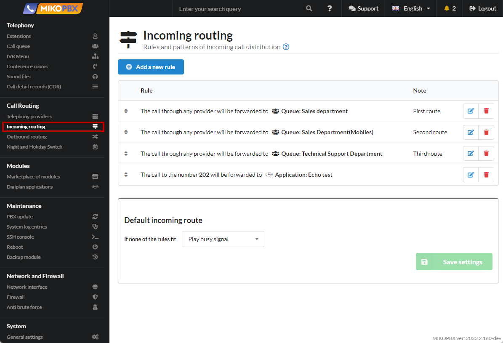
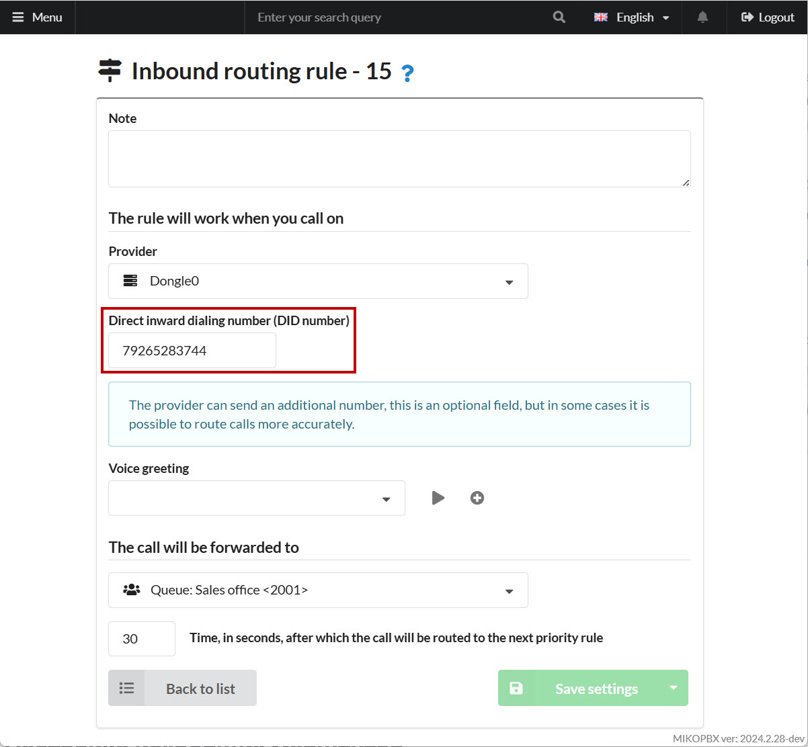
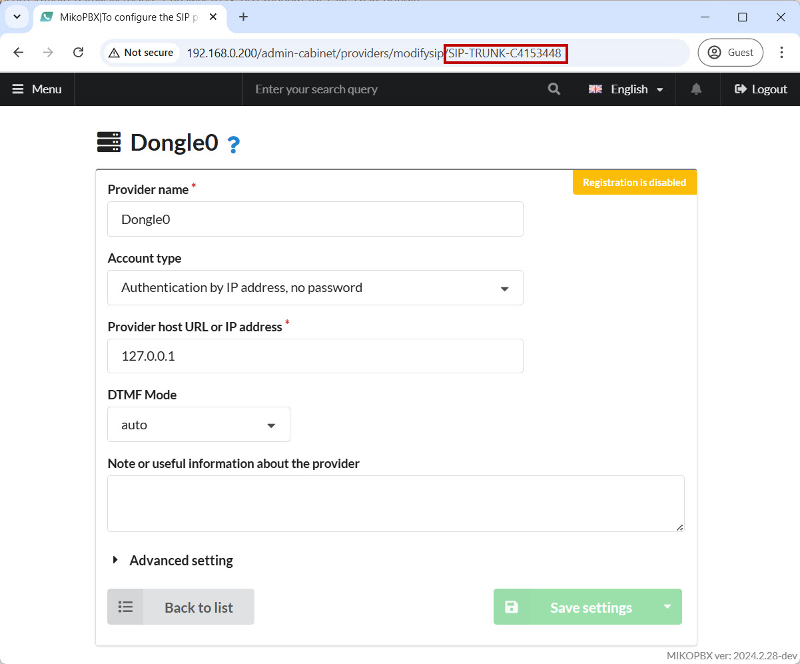
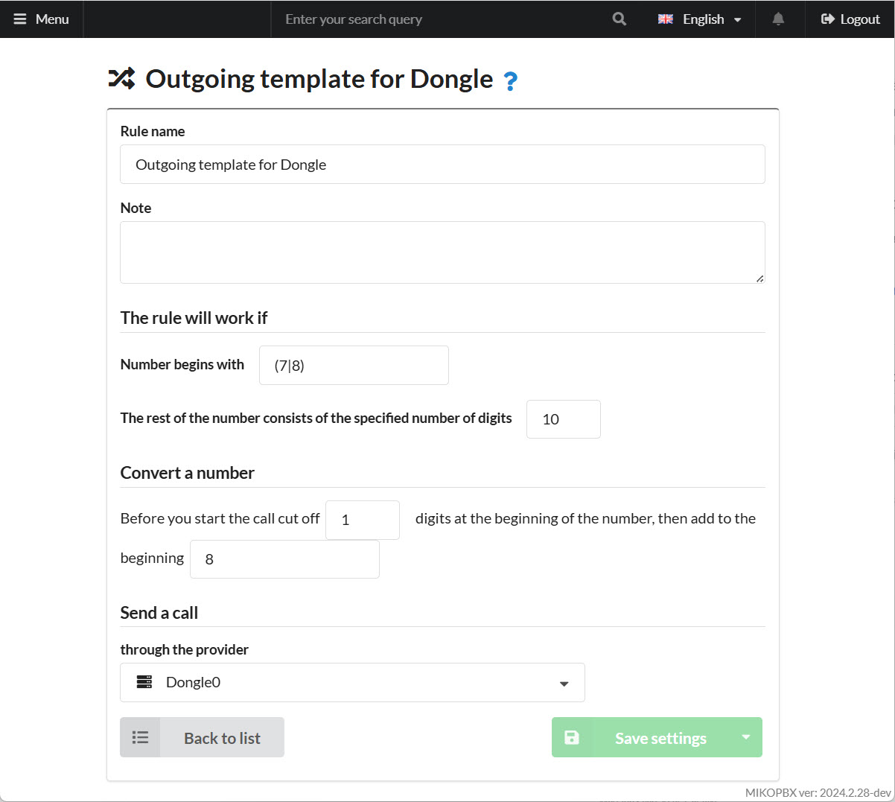
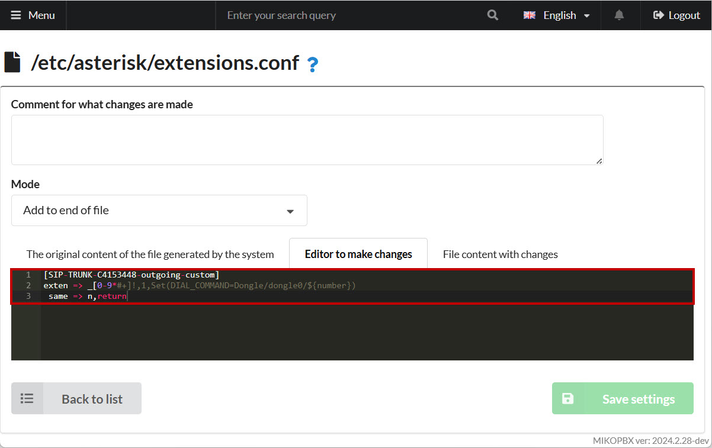

# Using a Huawei E173 USB Modem for Calls (chan\_dongle)

The **Huawei E173** is a USB 3G modem from Huawei that is compatible with the **chan\_dongle** module for Asterisk. By using this modem with chan\_dongle, you can configure Asterisk to make voice calls and send SMS messages over the GSM network, effectively turning the modem into a full-fledged GSM gateway.


Dongle modems can be unstable. They require reliable, stable power and a strong GSM signal.


## Preparing the USB Modem

1. First, let’s see which USB devices are connected to the PC:

```php
lsusb
Bus 001 Device 002: ID 12d1:1001 Huawei Technologies Co., Ltd. E169/E620/E800 HSDPA Modem
Bus 001 Device 001: ID 1d6b:0002 Linux Foundation 2.0 root hub
Bus 002 Device 003: ID 0e0f:0002 VMware, Inc. Virtual USB Hub
Bus 002 Device 002: ID 0e0f:0003 VMware, Inc. Virtual Mouse
Bus 002 Device 001: ID 1d6b:0001 Linux Foundation 1.1 root hub
```

We’re interested in the device **"12d1:1001 Huawei Technologies..."**.

* **12d1** – the vendor ID.
* **1001** – the product ID.

For the modem to function properly, you need to switch it to **"1001"** (modem-only mode).

2. Next, search for device info using the vendor ID **"12d1"**:

```
dmesg | grep 12d1
[    2.828272] usb 1-1: New USB device found, idVendor=12d1, idProduct=1001, bcdDevice= 0.00
```

3. Then check for info by the USB device number **"usb 1-1"**:

```php
dmesg | grep 'usb 1-1'

[    2.262750] usb 1-1: new high-speed USB device number 2 using ehci-pci
[    2.828272] usb 1-1: New USB device found, idVendor=12d1, idProduct=1001, bcdDevice= 0.00
[    2.828479] usb 1-1: New USB device strings: Mfr=3, Product=2, SerialNumber=0
[    2.828641] usb 1-1: Product: HUAWEI Mobile
[    2.828754] usb 1-1: Manufacturer: HUAWEI Technology
[    2.856994] usb 1-1: GSM modem (1-port) converter now attached to ttyUSB0
[    2.861194] usb 1-1: GSM modem (1-port) converter now attached to ttyUSB1
[    2.864265] usb 1-1: GSM modem (1-port) converter now attached to ttyUSB2
```

We see the modem’s serial devices: **ttyUSB0, ttyUSB1, ttyUSB2**.


If these devices appear, half the work is done. If they’re missing, the modem may be in a mode other than **1001**. The product ID can vary with different firmware versions.

On some devices, modem-only mode may appear as **"140c"**.


## Checking the Modem Settings

```
minicom -D /dev/ttyUSB0
```

You’ll see something like:

```
Welcome to minicom 2.8

OPTIONS: I18n
Compiled on Apr 26 2021, 18:06:16.
Port /dev/ttyUSB0, 12:30:42

Press CTRL-A Z for help on special keys
```

You can now enter **AT** commands to manage and configure the modem.

## Example Commands

* **AT^CARDLOCK?** – Checks SIM lock status and the remaining attempts to enter an unlock code. (The modem’s response: `CARDLOCK: A,B,0`. If A=2, modem is unlocked; A=1, locked — SimLock; A=3, you either used all 10 attempts or have a customized firmware. B is the remaining number of attempts, typically 10.)
* **AT^CARDLOCK="NCK Code"** – Unlock the modem to work with all mobile operators (if you have the code).
* **AT^CVOICE=?** – Checks the modem’s voice support state (0 means voice is enabled).
* **AT^CVOICE=0** – Enables voice functions on the modem.
* **AT^U2DIAG=0** – Switch the modem into **modem-only** mode.

## What to Verify?

1. Confirm the modem **supports voice** functions.
2. The modem must be in **"modem-only"** mode (ID **1001**).
3. If possible (and if you have a code), **unlock** the modem for use with any operator.

## chan\_dongle for Asterisk

1. In the MikoPBX web interface, go to **System → Customize System Files**.
2. Open **`/etc/asterisk/modules.conf`**.
3. Set the mode to **"Append to the end of the file"**.
4. Add:

```
load => chan_dongle.so
```

5. Open **`/etc/asterisk/dongle.conf`** for editing.
6. Choose **"Replace Completely"**.
7. Paste the following configuration:

```php
[general]
interval=15

[defaults]
context=public-direct-dial
group=0
rxgain=0
txgain=0
autodeletesms=yes
resetdongle=yes
u2diag=-1
usecallingpres=yes
callingpres=allowed_passed_screen
disablesms=no

language=en
smsaspdu=yes
mindtmfgap=45
mindtmfduration=80
mindtmfinterval=200

callwaiting=auto
disable=no
initstate=start
dtmf=relax

[dongle0]
audio=/dev/ttyUSB1
data=/dev/ttyUSB2
```

8. Re-open **`/etc/asterisk/modules.conf`**.
9. Again choose **"Append to the end of the file"**.
10. Add contexts for **SMS** and **USSD** handling:

```php
[dongle-incoming-ussd]
exten => ussd,1,Noop(Incoming USSD: ${BASE64DECODE(${USSDBASE64})})
exten => ussd,n,Hangup()

[dongle-incoming-sms]
exten => sms,1,Noop(Incoming SMS from ${CALLERID(num)} ${BASE64_DECODE(${SMS_BASE64})})
exten => sms,n,Hangup()
```

11. After configuring **dongle.conf**, you must **restart** your PBX.


**Helpful resources:**

* See the [dongle.conf file](https://github.com/haha8x/asterisk-chan-dongle-16/blob/master/etc/dongle.conf) for a description of configuration and options.
* More details in [chan\_dongle documentation](https://asterisk-service.com/en_US/page/chan-dongle-use).



* **dongle0** is an arbitrary name of the line. It will be used in the Dial command for outgoing calls.
* **audio** and **data** are the TTY device paths discovered in the previous step. You may need to swap them if there’s no audio.


## Configuring DID

Each **dongle** requires a DID number for correct inbound call handling.

1. Enter the Asterisk console:

```bash
asterisk -r
```

2. List the dongle devices:

```
mikopbx*CLI> dongle show devices
ID      Group State RSSI Model Firmware         IMEI IMSI Number
dongle0 0     Free  12   E173  11.126.15.00.209 ***  ***  79255283744
```

3. If the `Number` column is empty, run:

```bash
dongle cmd dongle0 AT+CPBS="ON"
dongle cmd dongle0 AT+CPBW=1,"79255283744",145
```


Replace **dongle0** with your line’s identifier, and **"79255283744"** with the SIM’s phone number.&#x20;


Restart your PBX afterwards.

## Configuring an Inbound Route

1. In the web interface, go to **Call** **Routing → Incoming Routing**.

<figure><figcaption><p>"Incoming routing" section</p></figcaption></figure>

2. Create a new rule. In the DID field, specify the SIM’s phone number you set earlier:

<figure><figcaption><p>DID Number field</p></figcaption></figure>

## Configuring Outbound Routes

1. In **Call** **Routing → Providers**, create a new **SIP** account with:
   * **Name** – “Dongle0” (or any name)
   * **Host or IP** – **127.0.0.1**
   * **Account Type** – “Authentication by IP address, no password”

<figure><figcaption><p>Provider Parameters</p></figcaption></figure>

2. Copy the **Provider ID** from the browser address bar (e.g., **SIP-TRUNK-C4153448**).

<figure><figcaption><p>Provider ID</p></figcaption></figure>

3. In **Call** **Routing → Outbound Routing**, create a new rule for sending calls via the modem:

<figure><figcaption><p>Outbound route</p></figcaption></figure>

4. Go to **System → System file customization** and open **`/etc/asterisk/extensions.conf`**. Choose “**Add to end of file**” and add:

```php
[SIP-TRUNK-C4153448-outgoing-custom]
exten => _[0-9*#+]!,1,Set(DIAL_COMMAND=Dongle/dongle0/${number})
 same => n,return
```


Replace **SIP-TRUNK-C4153448** and **dongle0** with your IDs.


<figure><figcaption><p>Code for the file "extensions.conf"</p></figcaption></figure>
