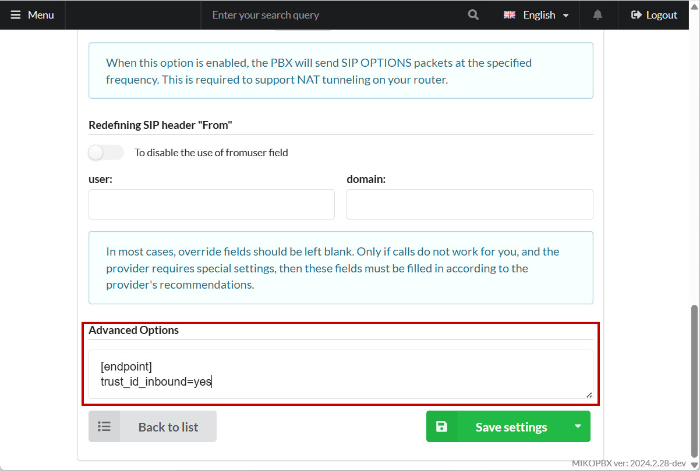
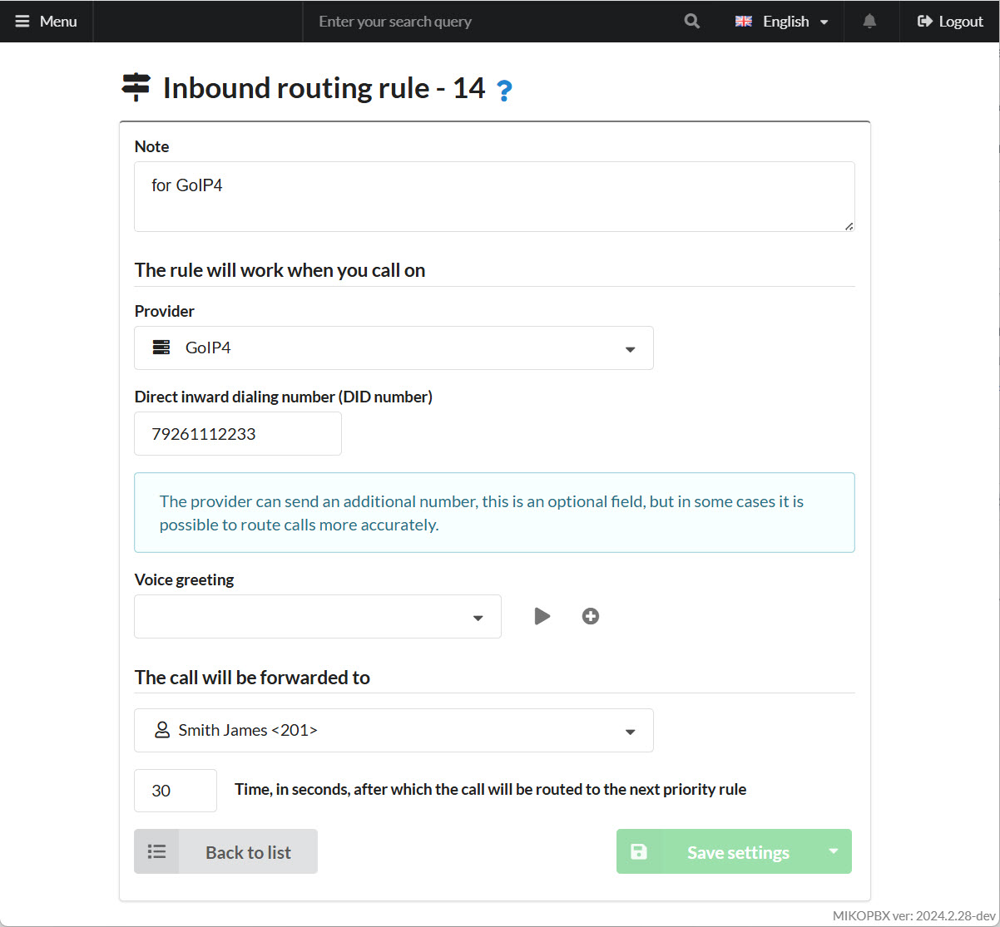
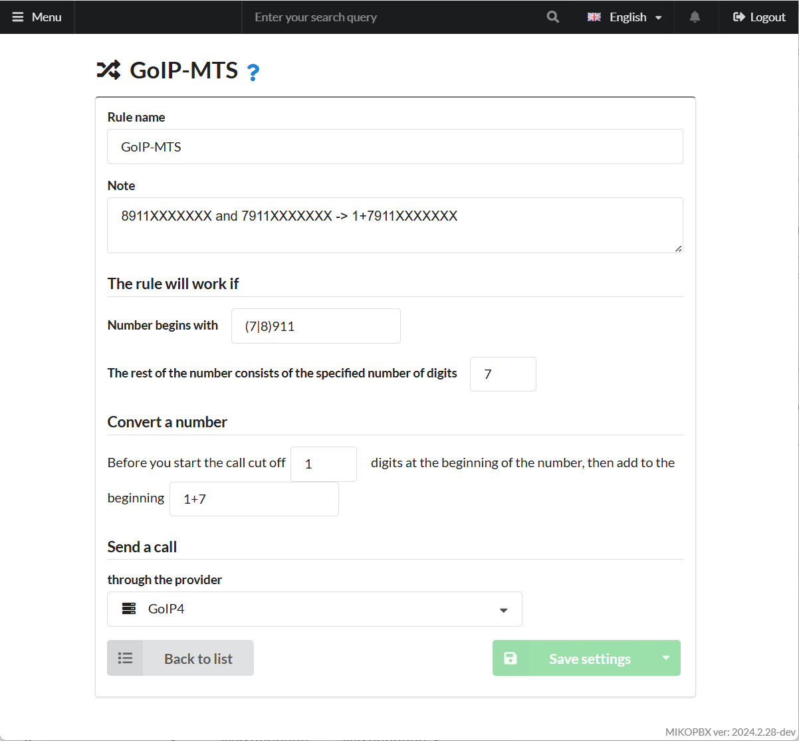
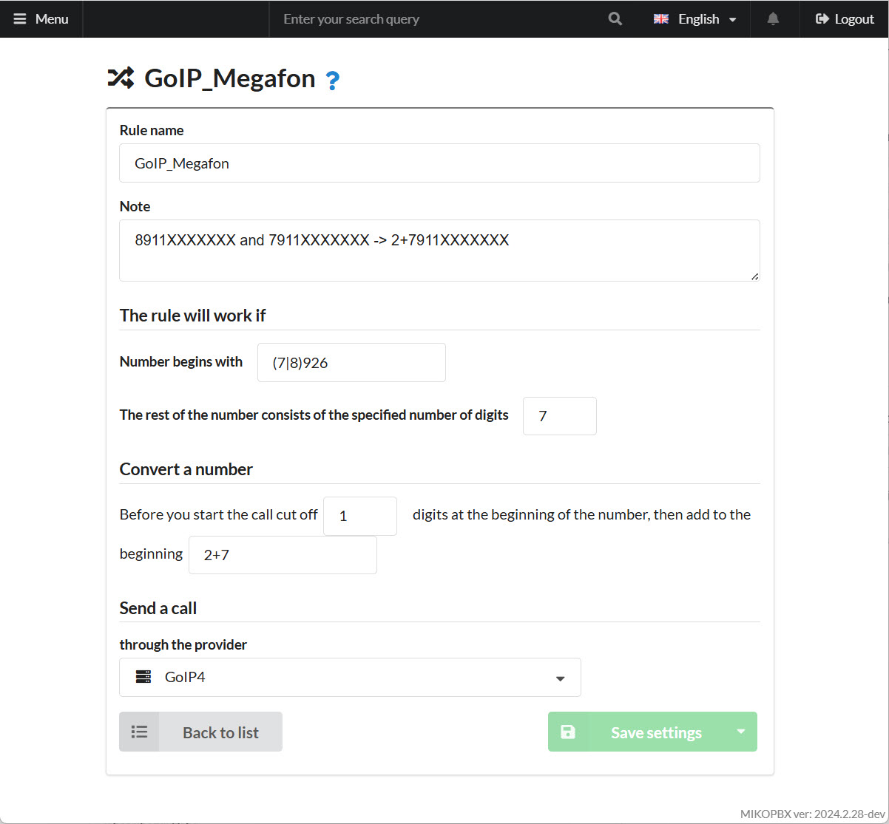

# GoIP4

**GoIP4** is a four-port gateway designed for constant connection between GSM and VoIP networks. It allows users to make both outbound and inbound calls between these networks.

## Before You Begin

1. Back up your current gateway settings.
2. Perform a factory reset on the gateway.

## Creating a Provider Account on MikoPBX

In this example, the GoIP4 gateway will register to MikoPBX.&#x20;

1. Create a provider (SIP) account on MikoPBX with these parameters:

* **Provider Name** – e.g., “GoIP4”
* **Account Type** – “Incoming Registration”
* **Username** – The provider ID (e.g., “SIP-TRUNK-53A707FC”)
* **Password** – A strong password for gateway registration on MikoPBX

<figure><figcaption><p>Provider Parameters</p></figcaption></figure>

2. In the provider’s **Advanced Settings**, under **Advanced Options**, add:

```
[endpoint]
trust_id_inbound=yes
```

Click **Save settings**.

<figure><figcaption><p>Advanced Options of provider</p></figcaption></figure>


When sending calls to MikoPBX, the gateway uses the **Remote Party ID** header to include the client’s phone number. MikoPBX uses this to set the CID.


## Gateway Configuration

Access the GoIP4 web interface to configure the gateway.

### Configurations → Preferences

Under **Configurations → Preferences**, set an appropriate time zone and disable IVR:

<figure><figcaption><p>Preferences of GoIP4</p></figcaption></figure>

### Configurations → Basic VoIP

In **Basic VoIP**, set the MikoPBX connection parameters:

* **Config Mode** – Single Server Mode
* **Authentication ID**, **Phone Number**, **Display Name** – Your MikoPBX provider ID (e.g., “SIP-TRUNK-XXXXX”)
* **Password** – The provider password
* **SIP Proxy**, **SIP Registrar**, **Home Domain** – MikoPBX’s IP address
* **Delete Callee Prefix while Dialing** – Disable
* **Routing Prefix** – Use prefix 1 for Line1, 2 for Line2, etc.


Later, you’ll define outbound routes in MikoPBX for each SIM card, adding the required prefix before the dialed number.


<figure><figcaption><p>Parameters of connection</p></figcaption></figure>

### Configurations → Call Out

Under **Call Out**, remove the prefix sent from MikoPBX:

* **CH1** → Dial Plan: **1:-1**
* **CH2** → **2:-2**
* Repeat for each channel **CH\***
* **CH8** → **8:-8**


A dial plan rule like “1:-1” removes the first digit when it starts with 1.


<figure><figcaption><p>Call Out Parameters</p></figcaption></figure>

### Configurations → Call In

Under **Call In**, configure incoming call forwarding:

* **CID Forward Mode** – “Use Remoe Party ID”
* For each channel **CH1**, **CH2**, etc., set **Forwarding to VoIP Number** to the SIM’s phone number (digits only).

<figure><figcaption><p>Call In Configuration</p></figcaption></figure>

This completes the gateway configuration.

### Status → Summary

Under **Status → Summary**, the **VoIP** column shows whether the gateway is registered to MikoPBX (**Y** indicates successful registration; e.g., **N** for channels without SIM cards):

<figure><figcaption><p>Summary configuration</p></figcaption></figure>

## MikoPBX Call Routing

### Inbound Route

In MikoPBX, go to **Call Routing → Incoming Routing** and create a new rule:

* **Provider** – Your GoIP4 provider
* **Direct inward dialing number (DID)** – The number you set in GoIP4’s **Forwarding to VoIP Number** for that channel
* **The call will be forwarded to** – The extension receiving inbound calls (e.g., extension 201)

Click **Save**.

<figure><figcaption><p>Inbound routing rule</p></figcaption></figure>

### Outbound Route

Go to **Routing → Outbound Routing**. Create a new rule for the **first** SIM:

For numbers matching **(7|8)911XXXXXXX**, route via GoIP4, adding prefix **1+** before dialing.

* **Begins with** – `(7|8)911`
* **The rest** – 7 digits
* **Cut off** – 1 digit
* **Then add** – `1+7`

Click **Save**.

<figure><figcaption><p>Outbound routing rule</p></figcaption></figure>

Add another rule for the **second** SIM (e.g., `(7|8)926XXXXXXX`) with prefix `2+`, etc.

<figure><figcaption><p>Outbound routing rule 2</p></figcaption></figure>

Repeat similarly for other SIM channels.


See [this article](../../manual/routing/outbound-routing.md) for a detailed explanation of outbound routing.


The gateway is now connected to MikoPBX. You can test inbound and outbound calls via the GSM gateway.


Using the [**Users Groups**](../../modules/miko/module-users-groups.md) module, you can assign each employee their own SIM card for outbound calls.

