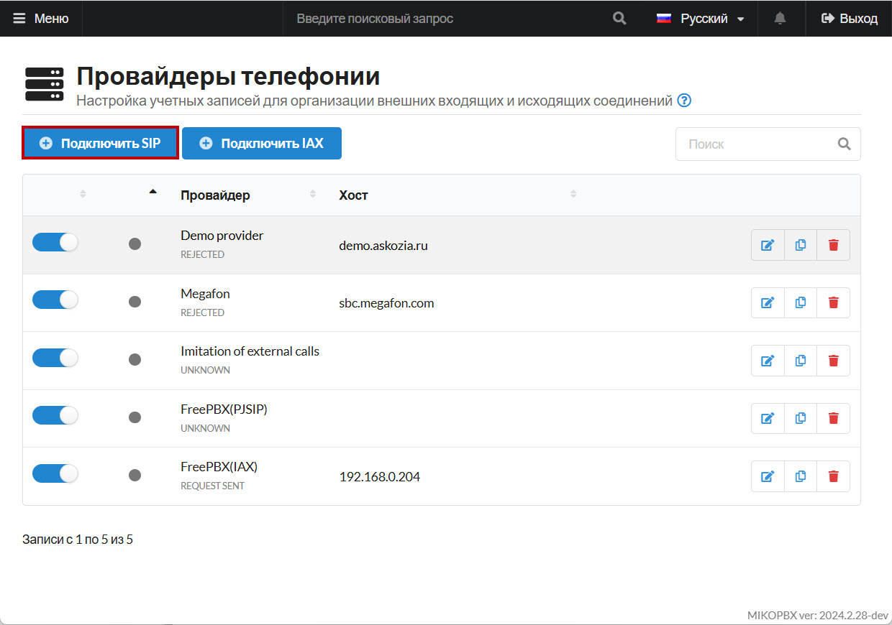
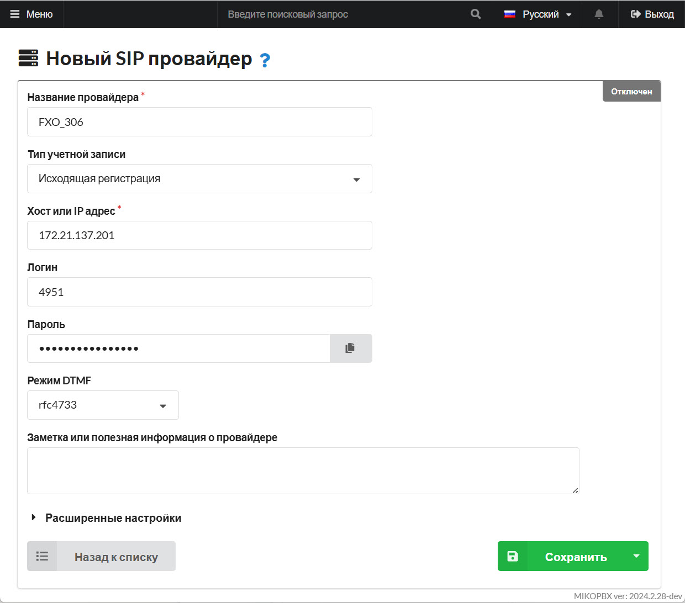
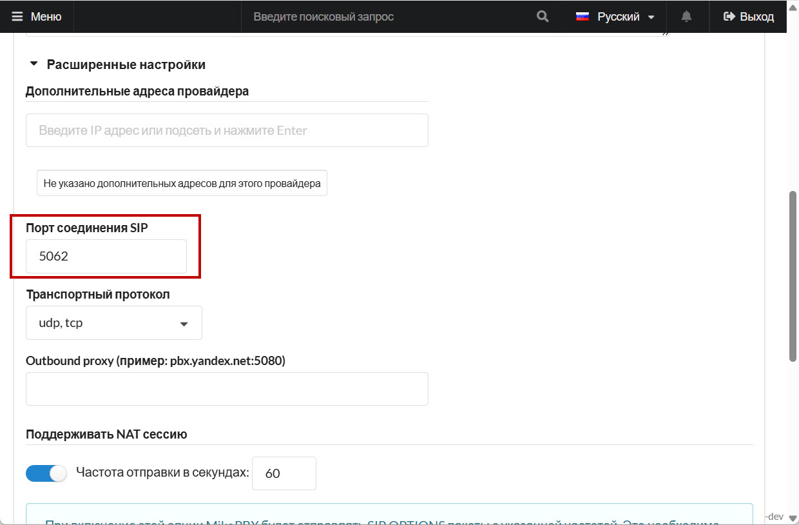
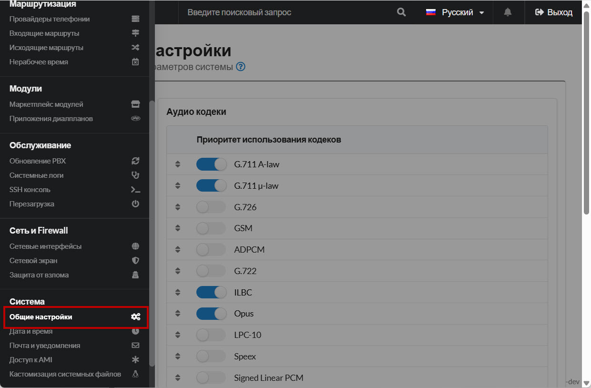
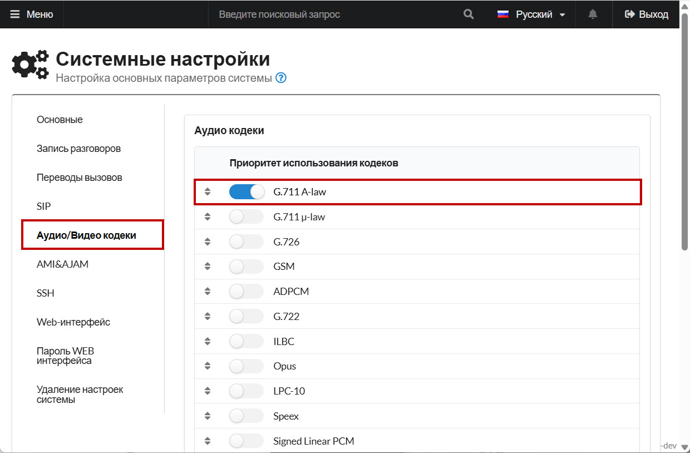

# Grandstream HT503

**Grandstream HT503** - FXS-FXO шлюз, подходит для подключения как одной городской линии, так и одного телефона. В шлюзе предусмотрена поддержка протокола T.38. Шлюз может выступать в роли роутера. В примере рассмотрим, как подключить к MikoPBX городскую линию через FXO порт шлюза Grandstream HT503.

Подключите сетевой шнур в WAN порт, городскую линию в порт LINE, подайте питание на шлюз.

## Подключение к WEB-интерфейсу шлюза

По умолчанию подключение к Web-интерфейсу отключено. Для доступа к Web-интерфейсу необходимо сделать следующие шаги:

1. Подключите аналоговый телефон к шлюзу и наберите `***` . Вы попадете в голосовое меню шлюза.
2. Наберите 12, затем 9, таким образом, Вы включите доступ к Web интерфейсу через WAN порт
3. Наберите `***`.
4. Затем 99, затем 9 – устройство перезагрузится.
5. Чтобы узнать IP-адрес WAN порта, наберите на аналоговом телефоне `***`, затем 02. Или посмотрите IP адрес на вашем роутере.
6. В адресной строке вашего браузера введите полученный IP адрес. Для входа в Web-интерфейс введите пароль - `admin`.

## Настройка шлюза в MikoPBX 

1. Перейдите в web-интерфейс MikoPBX на вкладку **"Маршрутизация" → "Провайдеры телефонии"**. Нажмите на кнопку **Подключить SIP** для добавления новой учетной записи для шлюза:

<figure><figcaption>
Новое SIP подключение в MikoPBX
</figcaption></figure>

2. В web-интерфейсе шлюза перейдите на страницу **STATUS**. Здесь отображается информация о IP адресе шлюза. Скопируйте его.

<figure><figcaption>
IP-адрес шлюза
</figcaption></figure>

3. Заполните следующие параметры:

* **Название провайдера** - произвольное
* **Тип учетной записи** - Исходящая регистрация
* **Хост или IP адрес** - IP-адрес шлюза
* **Логин, пароль** - произвольные
* **Режим DTMF** - rfc4733

<figure><figcaption>
Параметры провайдера
</figcaption></figure>

4. Перейдите в Расширенные настройки. Укажите порт соединения - **5062**

Сохраните настройки.

<figure><figcaption>
Параметры порта соединения
</figcaption></figure>

5. Перейдите в раздел "**Система**" -> "**Общие настройки**".

<figure><figcaption>
Раздел "<strong>Общие настройки</strong>"
</figcaption></figure>

6. Перейдите в раздел "**Аудио/Видео кодеки**". Оставьте включенным только кодек "**G.711 A-law**":

<figure><figcaption>
Раздел "<strong>Аудио/Видео кодеки</strong>"
</figcaption></figure>

