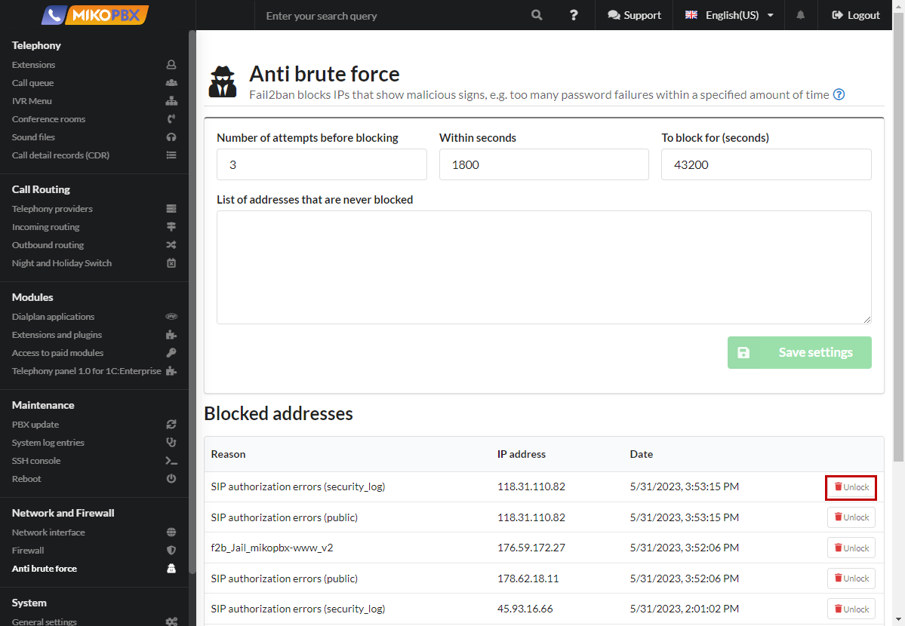

# Защита от взлома

Fail2ban включается вместе с Сетевым экраном переключателем в разделе **Сеть и FireWall** → **Сетевой экран**.

<figure><figcaption></figcaption></figure>

Сервис Fail2ban блокирует IP адреса с нестандартной активностью.\
При неудачной попытке авторизации в лог АТС попадет информация об ошибке, Fail2ban анализирует все неудачные попытки авторизации и считает их. Когда количество неудачных попыток авторизации превышает максимально допустимое количество, IP-адрес отправляется в бан. Fail2ban способен снизить скорость неудачных попыток аутентификации.&#x20;


_Будьте внимательны, Fail2ban не поможет при использовании простых паролей._


**Настройки защиты от взлома можно найти в боковом меню:**

<figure><figcaption></figcaption></figure>

<figure><figcaption></figcaption></figure>

* Если происходит определенное число неудачных попыток входа (**Количество попыток для блокировки**) в течение определенного периода (**В течение (секунд)**), IP адрес будет заблокирован в течение заданного периода времени (**Блокировать на (секунд)**).
* Белый список адресов определяет IP - адреса, которые не будут заблокированы Fail2ban. Указывать можно как ip адрес 93.188.40.10, так и подсеть 93.188.40.10/32. В качестве разделителя используется «пробел».
* Обратите внимание, что если Вы в разделе «**Сетевой экран**» для подсети указали настройку «**Никогда не блокировать адреса из этой сети**», то подсеть автоматом попадает в белый список и добавлять ее вручную не требуется. Не нужно пытаться наполнять вручную список белых IP-адресов, желательно в исключительных случаях прописывать IP-адреса.

Список **заблокированных адресов** показывает , какие IP-адреса в настоящее время заблокированы.

<figure><figcaption></figcaption></figure>

Так же вы можете разблокировать адрес кликом на соответствующую иконку в таблице

<figure><figcaption></figcaption></figure>

\

\
