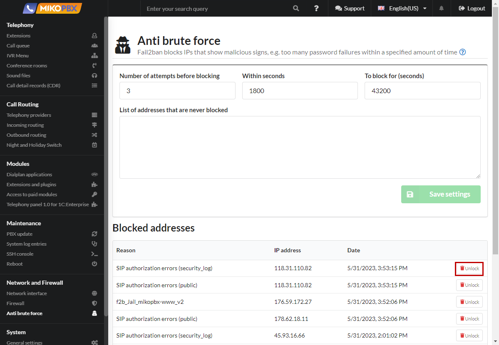

# Anti brute force

Fail2ban is enabled together with the Network Firewall switch in the "**Network and Firewall"** → "**Firewall"** section.

<figure><figcaption>
"Firewall and anti-hacking protection are enabled" switch
</figcaption></figure>

Fail2ban blocks IP addresses with abnormal activity. When there is a failed authentication attempt, information about the error will be logged in the PBX. Fail2ban analyzes all failed attempts and keeps track of them. When the number of failed attempts exceeds the maximum allowed authentication attempts, the IP address is banned. Fail2ban is capable of slowing down the rate of failed authentication attempts.


Please note that Fail2ban will not help with the use of simple passwords.


The Anti brute force settings can be found at the bottom of the "**Network Firewall settings"**:

<figure><figcaption>
"Anti brute force" section
</figcaption></figure>

* If a certain number of failed login attempts (**Number of attempts for blocking**) occurs within a specific period (**Within (seconds)**), the IP address will be blocked for a specified duration (**Block for (seconds)**).
* The whitelist of addresses defines IP addresses that will not be blocked by Fail2ban. You can specify individual IP addresses like 93.188.40.10 or subnet like 93.188.40.10/32. The separator used is a 'space'.
* Please note that if you have set the '**Never block addresses from this network**' option in the **'Network Firewall'** section for a subnet, that subnet is automatically added to the whitelist, and you don't need to add it manually. It is not recommended to manually populate the whitelist of IP addresses. It is preferable to specify IP addresses only in exceptional cases.

<figure><figcaption>
Parameters of the Anti Brute Force rule
</figcaption></figure>

The list of blocked addresses shows which IP addresses are currently blocked.

<figure><figcaption>
Blocked addresses list
</figcaption></figure>

You can also unblock an address by clicking on the corresponding icon in the table.

<figure><figcaption>
Unlock button
</figcaption></figure>


**In Docker (bridge mode)** fail2ban writes bans to Redis but the
container cannot manage host iptables — web-interface bans are not
applied automatically. To project them to the host, run an external
bouncer (see
[External firewall for Docker](../../security/external-firewall-enforcement.md)).
SIP protection works normally.

