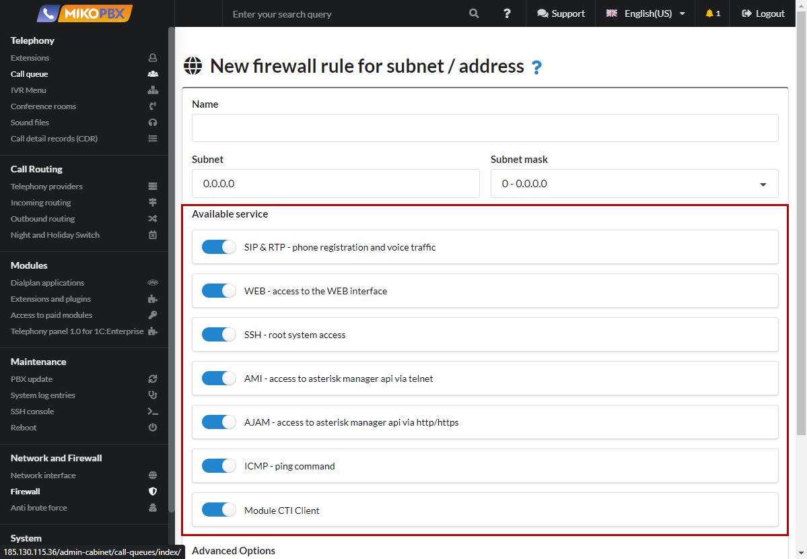
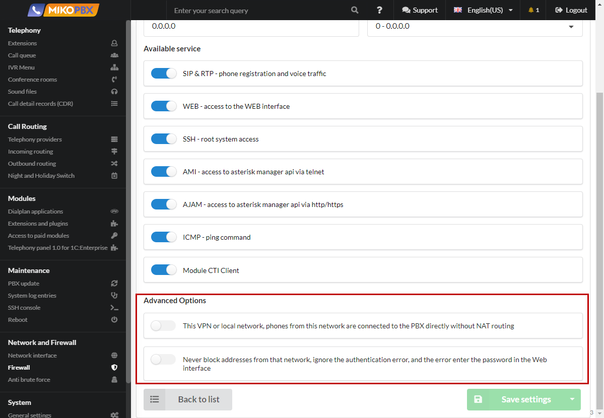

# Network Firewall

"In MikoPBX, all local subnets can be configured in the 'Network and Firewall' → 'Network Firewall' section. The network firewall is designed to restrict access to the station based on traffic type and subnets."

<figure><figcaption></figcaption></figure>

To add a new rule, you need to click on the button:

<figure><figcaption></figcaption></figure>

## General settings

<figure><figcaption></figcaption></figure>

You can give the rule any custom name. To the right of the subnet address, there is a field for Subnet Mask in CIDR format.&#x20;

## Available services

<figure><figcaption></figcaption></figure>

* SIP\&RTP - registration of phones and voice traffic. Session Initiation Protocol is used for establishing connections between VoIP phones.
* &#x20;WEB - access to the administrative interface for configuring the PBX. SSH - root access to the system.&#x20;
* SSH (Secure Shell) allows accessing the MikoPBX console.
* &#x20;AMI - access to Asterisk Manager API via telnet. Asterisk Manager Interface (AMI) provides access to Asterisk via TCP/IP protocol.&#x20;
* AJAM - access to Asterisk Manager API via HTTP or HTTPS.
* &#x20;ICMP - communication check using the 'ping' command.&#x20;
* CTICLIENT - connection of the telephony panel 2 for 1C.

## Advanced Options

<figure><figcaption></figcaption></figure>

* Each subnet has a flag 'Is it a VPN or a local network'. When this flag is set, MikoPBX will present itself as a local IP to all local subnets instead of external ones.&#x20;
* The flag 'Never block addresses from this network' should be enabled only for trusted subnets. If this flag is enabled, intrusion prevention rules will not apply to this subnet
