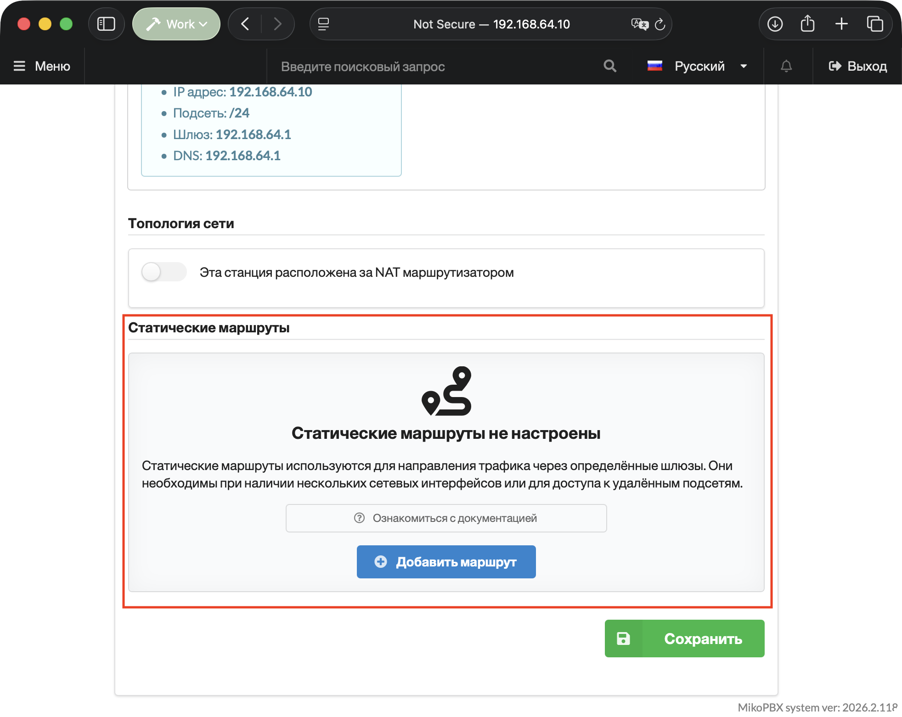
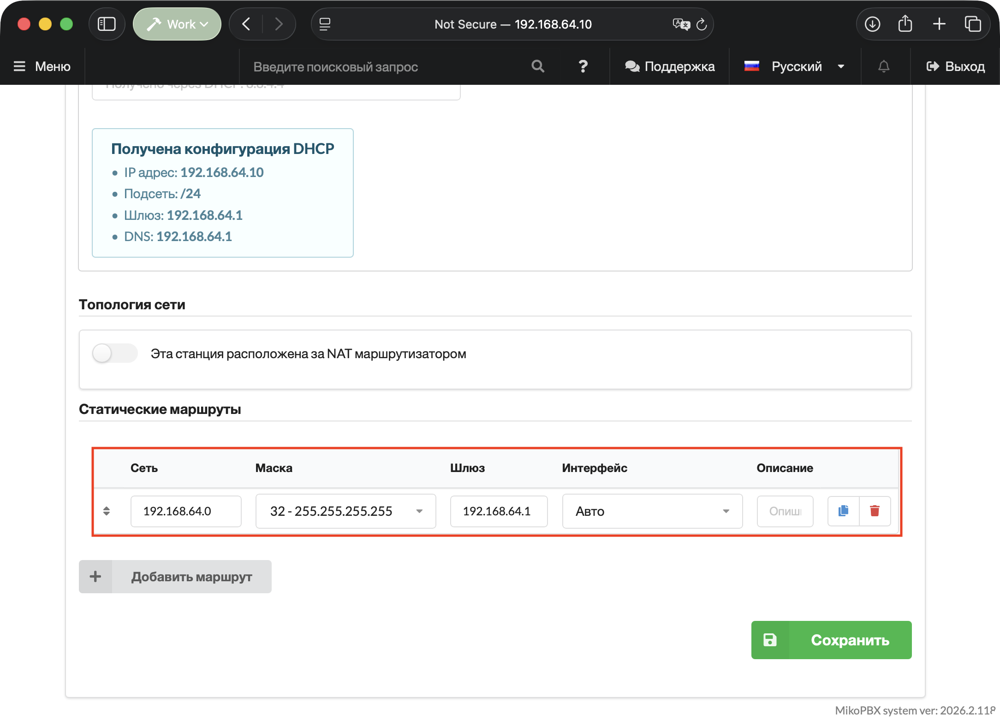

# Сетевые интерфейсы

Раздел **«Сетевые интерфейсы»** в MikoPBX — это интерфейс для настройки параметров сетевых подключений системы. Здесь администраторы могут управлять IP-адресами, масками подсети, шлюзами и другими сетевыми настройками для каждого сетевого интерфейса. Это позволяет корректно интегрировать MikoPBX в сеть организации и обеспечить ее стабильную работу в соответствии с требованиями сетевой инфраструктуры.

Раздел находится в "**Сеть и Firewall**" -> "**Сетевые интерфейсы**":

<figure><figcaption><p>Раздел "<strong>Сетевые интерфейсы</strong>"</p></figcaption></figure>

## Параметры

**Имя хоста** - это имя машины. Если значение не указано, то используется имя **mikopbx.local**.

<figure><figcaption><p>Локальное имя хоста</p></figcaption></figure>

## Сетевые интерфейсы

Существует два способа настроить IP-адрес в MikoPBX:

1. **DHCP (Dynamic Host Configuration Protocol)** - это протокол, который позволяет автоматически настраивать IP-адрес. Рекомендуется использовать этот способ, если вы не хотите заниматься ручной настройкой. Просто включите опцию "**Использовать DHCP для получения настроек сети**" и система автоматически получит IP-адрес от DHCP сервера.
2. **Ручная настройка** - если вы не хотите использовать DHCP или хотите задать IP-адрес вручную, вы можете выполнить ручную настройку сети. Для этого вам понадобятся некоторые знания о топологии сети. В поле IP-адрес введите желаемый IP-адрес, а рядом с ним укажите маску подсети в формате CIDR. Например, /24 соответствует маске подсети 255.255.255.0.

"**VLAN ID**" - Кроме того, MikoPBX поддерживает виртуальные сетевые интерфейсы, известные как VLAN. Эта функция особенно полезна, если у вас есть только один физический сетевой интерфейс, но вам требуется использовать несколько виртуальных интерфейсов. С помощью VLAN можно создать виртуальные интерфейсы, которые работают поверх физического интерфейса. Преимуществом использования VLAN является возможность направлять телефонные разговоры через него, в то время как сетевое оборудование может осуществлять отдельную обработку трафика VLAN, обеспечивая стабильное соединение.

Важно отметить, что количество сетевых интерфейсов в MikoPBX не ограничено, и вы можете настроить и использовать несколько интерфейсов в соответствии с вашими потребностями.

<figure><figcaption><p>Раздел "<strong>Сетевые интерфейсы</strong>"</p></figcaption></figure>

## Топология сети

"**Сетевой интерфейс с доступом в интернет**" - это основной интерфейс, через который MikoPBX будет получать доступ к внешним адресам, то есть адресам вне вашей локальной сети.

Если вы не указали адрес **DNS-сервера**, MikoPBX будет использовать сервер 8.8.8.8 по умолчанию. DNS-серверы отвечают за преобразование доменных имен в IP-адреса, позволяя устройствам находить нужные ресурсы в сети.

В зависимости от топологии вашей сети, вам потребуется выполнить определенные настройки MikoPBX. Вариант, когда АТС находится за сетевым маршрутизатором, является наиболее распространенным. Это означает, что MikoPBX подключена к вашей локальной сети, и для доступа к интернету используется маршрутизатор. Другой вариант - АТС находится на публичном IP, то есть имеет прямой доступ к интернету без промежуточного маршрутизатора.

В обоих случаях необходимо настроить MikoPBX соответствующим образом, чтобы обеспечить правильное функционирование и доступ к внешним ресурсам.

* Если АТС находится **за маршрутизатором**, то необходимо установить галку «**Эта станция расположена за NAT маршрутизатором**»
* Если нам известен **внешний адрес** станции (ip или доменное имя)и **проброшены порты** АТС во внешний мир, то имеет смысл заполнить поля «**Внешний IP адрес Вашего маршрутизатора**» или «**Внешнее имя хоста вашего маршрутизатора**».

Всем адресам, которые не являются для АТС локальными, станция будет представляться внешним адресом:

* Если «Внешний IP адрес Вашего маршрутизатора» пустое, а «Внешнее имя хоста вашего маршрутизатора» заполнено, то АТС будет представляться именно этим полем (Внешнее имя).


Внешний IP-адрес обязателен для заполнения. Если указано доменное имя - то приоритет за ним и Внешний IP адрес не используется.


<figure><figcaption><p>Раздел "<strong>Топология сети</strong>"</p></figcaption></figure>


Когда вы включаете опцию «**Эта станция расположена за NAT маршрутизатором**», важно указать внешний адрес или имя хоста вашего маршрутизатора. Это необходимо для правильной настройки связи между внешней сетью и вашей АТС. Помимо этого, на самом маршрутизаторе необходимо выполнить проброс портов SIP 5060 и RTP 10000-10200 на локальный адрес АТС. Проброс портов позволяет маршрутизатору правильно направлять сетевой трафик SIP и RTP к вашей АТС.

Однако, если ваш провайдер позволяет вам регистрироваться без использования NAT и у вас нет необходимости подключать внешних абонентов, то вы можете не включать опцию «**Эта станция расположена за NAT маршрутизатором**». Даже если ваша АТС находится за NAT-маршрутизатором, но вы не нуждаетесь во внешних подключениях, эта опция не обязательна.

Важно учитывать требования вашего провайдера и особенности вашей сети при выборе и настройке этой опции.


## Ручная настройка сетевых маршрутов

Статические маршруты используются, когда MikoPBX должна отправлять трафик к определенной сети через отдельный шлюз, а не через основной интернет-шлюз. Чаще всего это требуется в таких случаях:

* у АТС несколько сетевых интерфейсов;
* телефония, VPN или удаленные офисы доступны через отдельный маршрутизатор;
* нужно направить трафик в конкретную подсеть провайдера или филиала;
* основной шлюз используется для интернета, а отдельные внутренние сети должны быть доступны через другой шлюз.

### Где находится настройка в интерфейсе

1. Перейдите в раздел **Сеть и Firewall** → **Сетевые интерфейсы**.
2. В нижней части формы найдите блок **Статические маршруты**.

<figure><figcaption><p>Раздел настройки статических маршрутов</p></figcaption></figure>


В Docker-установках блок **Статические маршруты** может быть скрыт, так как сетевой стек управляется контейнером или хостовой системой.


### Как добавить маршрут

1. В блоке **Статические маршруты** нажмите **Добавить маршрут**.
2. Заполните строку маршрута.
3. При необходимости добавьте несколько маршрутов. Порядок строк можно менять перетаскиванием; он сохраняется как приоритет.
4. Нажмите **Сохранить** внизу формы.

<figure><figcaption><p>Добавление статического маршрута</p></figcaption></figure>

### Описание полей

| Поле          | Описание                                                                                                                                                                                                                |
| ------------- | ----------------------------------------------------------------------------------------------------------------------------------------------------------------------------------------------------------------------- |
| **Сеть**      | Адрес сети назначения. Например, для удаленной подсети укажите **192.168.10.0**. Если маршрут нужен к одному конкретному IP-адресу, укажите этот IP и выберите маску **32 - 255.255.255.255**.                          |
| **Маска**     | CIDR-маска сети назначения. В интерфейсе она выбирается из списка, например **24 - 255.255.255.0** для подсети /24 или **32 - 255.255.255.255** для одного адреса.                                                      |
| **Шлюз**      | IP-адрес маршрутизатора, через который MikoPBX должна отправлять трафик в указанную сеть. Шлюз должен быть доступен со стороны выбранного интерфейса.                                                                   |
| **Интерфейс** | Сетевой интерфейс, через который будет использоваться маршрут. Можно оставить значение **Авто**, чтобы интерфейс выбрала операционная система, либо выбрать конкретный интерфейс, например **eth0** или VLAN-интерфейс. |
| **Описание**  | Комментарий для администратора. Используйте его, чтобы указать назначение маршрута, например **VPN в филиал** или **Сеть провайдера SIP**.                                                                              |

Пример маршрута к удаленной подсети:

| Поле          | Значение               |
| ------------- | ---------------------- |
| **Сеть**      | **192.168.10.0**       |
| **Маска**     | **24 - 255.255.255.0** |
| **Шлюз**      | **172.16.32.15**       |
| **Интерфейс** | **eth0** или **Авто**  |
| **Описание**  | **Офис VPN**           |

Пример маршрута к одному адресу:

| Поле          | Значение                 |
| ------------- | ------------------------ |
| **Сеть**      | **54.246.198.136**       |
| **Маска**     | **32 - 255.255.255.255** |
| **Шлюз**      | **172.16.32.15**         |
| **Интерфейс** | **eth0** или **Авто**    |

### Как проверить, что маршрут работает

Проверьте доступность нужного удаленного адреса или сервиса с MikoPBX: регистрация SIP-провайдера, соединение с удаленным телефоном, доступ к VPN-сети или другой рабочий сценарий, для которого добавлялся маршрут.

Если у вас есть доступ к консоли или SSH, можно дополнительно проверить, какой путь выбирает система:

```bash
ip route get 192.168.10.10
```

В выводе должен быть указан нужный шлюз или интерфейс. Для проверки доступности узла можно использовать:

```bash
ping 192.168.10.10
```

Также можно открыть **Обслуживание** → **Системные логи** → **Информация о системе** и проверить текущие сетевые настройки.

### Типичные ошибки

* **Неверный шлюз.** В поле **Шлюз** должен быть корректный IP-адрес. При ошибке MikoPBX может показать сообщение **Некорректный адрес шлюза**.
* **Шлюз не находится в подсети выбранного интерфейса.** Если выбран конкретный **Интерфейс**, убедитесь, что указанный шлюз доступен через этот интерфейс. Иначе маршрут может сохраниться, но трафик не пойдет нужным путем.
* **Конфликт с основным шлюзом.** Не используйте статический маршрут как замену основному интернет-шлюзу. Основной шлюз задается в настройках интернет-интерфейса, а статические маршруты лучше использовать для отдельных сетей и адресов.
* **Неверная маска/CIDR.** Для сети указывайте сетевой адрес и подходящую **Маску**. Например, для подсети **192.168.10.0/24** используйте **192.168.10.0** и **24 - 255.255.255.0**; для одного IP-адреса используйте маску **32 - 255.255.255.255**.
* **Маршрут не применяется после сохранения.** Проверьте, что страница сохранилась без ошибок, маршрут остался в таблице **Статические маршруты**, выбранный шлюз доступен с MikoPBX, а **Интерфейс** выбран правильно или установлен в **Авто**.
