# Модуль резервного копирования

## Установка модуля <a href="#sozdanie_arxivnoj_kopii" id="sozdanie_arxivnoj_kopii"></a>

Для использования модуля его нужно установить.

1. Перейдите в пункт меню **Управление модулями**, найдите в списке **Модуль резервного копирования** и загрузите его.

<figure>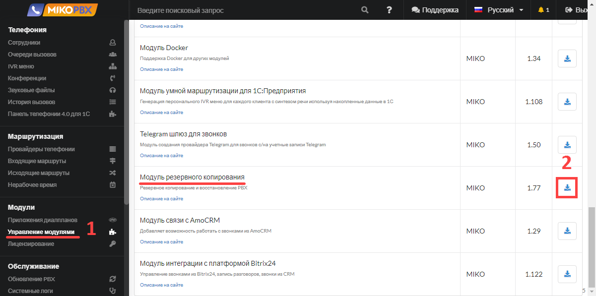<figcaption></figcaption></figure>

2. Затем включите его, нажав на переключатель. После обновления страницы браузера модуль появится в разделе **Обслуживание**.

<figure>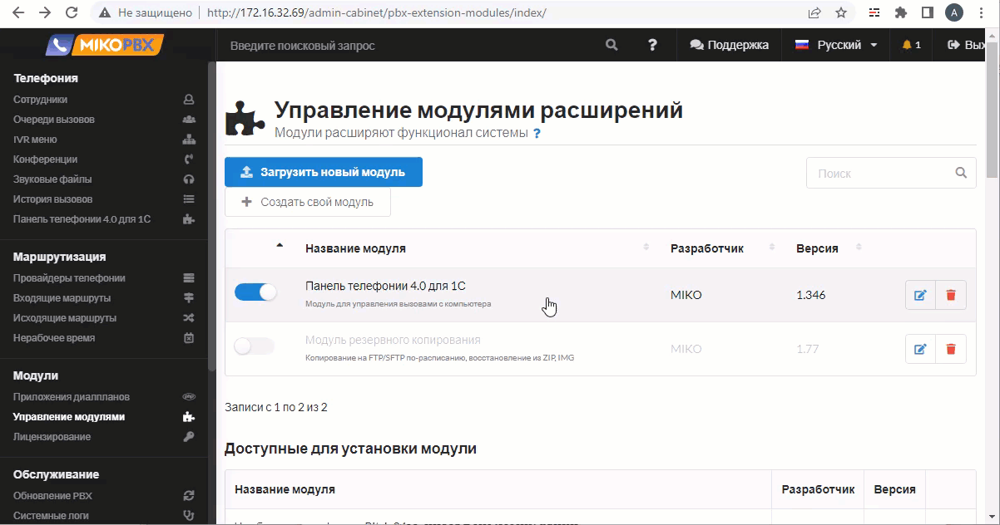<figcaption></figcaption></figure>

В разделе **Обслуживание** нажмите **Модуль резервного копирования** для открытия его главной страницы.

<figure>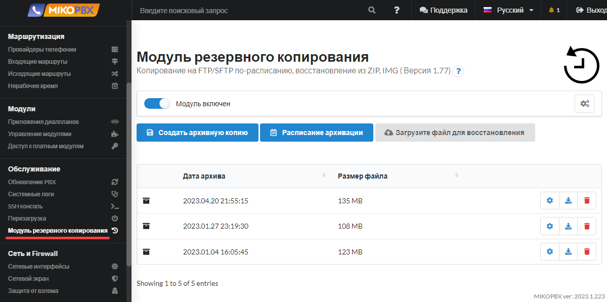<figcaption></figcaption></figure>

## Создание архивной копии <a href="#sozdanie_arxivnoj_kopii" id="sozdanie_arxivnoj_kopii"></a>

На главной странице модуля нажмите кнопку **Создать архивную копию.**

<figure>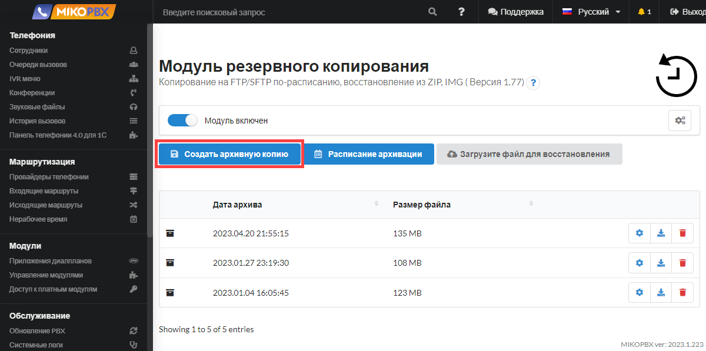<figcaption></figcaption></figure>

Затем, используя переключатели, необходимо выбрать, какие именно данные будут включены в архивную копию АТС, т.е. какие данные необходимо сохранить:

* **Настройки PBX** - все **настройки конфигурации** MikoPBX, которые были выполнены в web-интерфейсе в соответствующих разделах
* **История разговоров** - сохранение истории базы данных **cdr.db** (расположение: **/storage/usbdisk1/mikopbx/astlogs/asterisk/cdr.db**). Данная настройка не предполагает сохранение самих записей разговоров, т.е. будет сохранена вся информация на вкладке **Телефония** → **История вызовов** ([Документация](../telefoniya/call-detail-records.md)) без возможности прослушивания / скачивания файлов записей.
* **Файлы с записями разговоров** - сохранение всех записей разговоров в формате **\*.mp3**.
* **Звуковые файлы** - сохранение звуковых файлов, которые были загружены на АТС в разделе **Телефония** → **Звуковые файлы** ([Документация](../telefoniya/sound-files.md)).

<figure>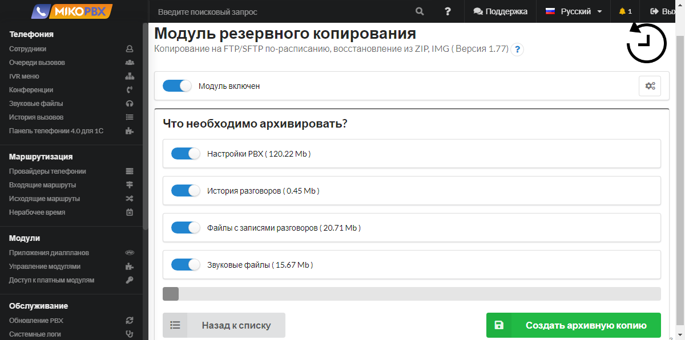<figcaption></figcaption></figure>

Нажмите **Создать архивную копию.**

<figure>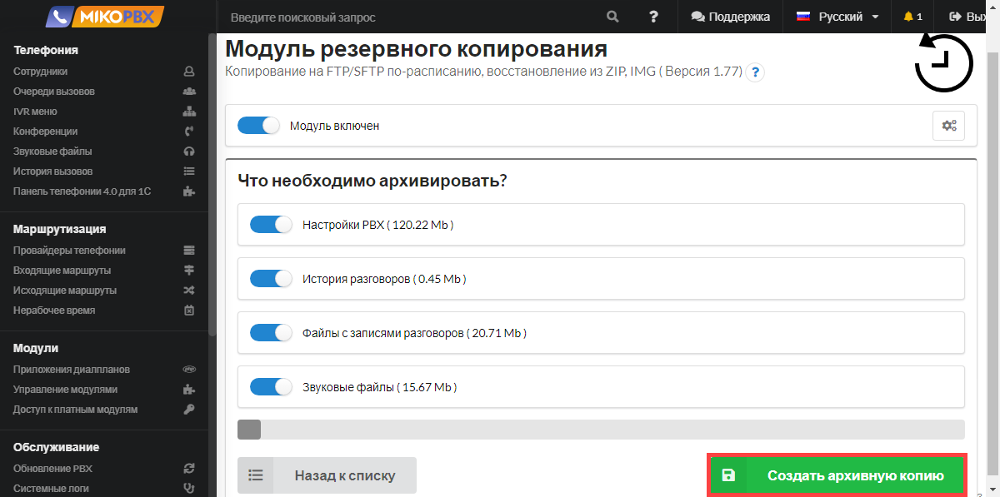<figcaption></figcaption></figure>

После завершения операции в списке резервных копий появится созданная копия.

<figure><figcaption></figcaption></figure>

## Управление файлами копий <a href="#upravlenie_fajlami" id="upravlenie_fajlami"></a>

В списке резервных копий есть возможность выполнить следующий действия:

* Восстановить из резервной копии
* Скачать резервную копию
* Удалить резервную копию

<figure>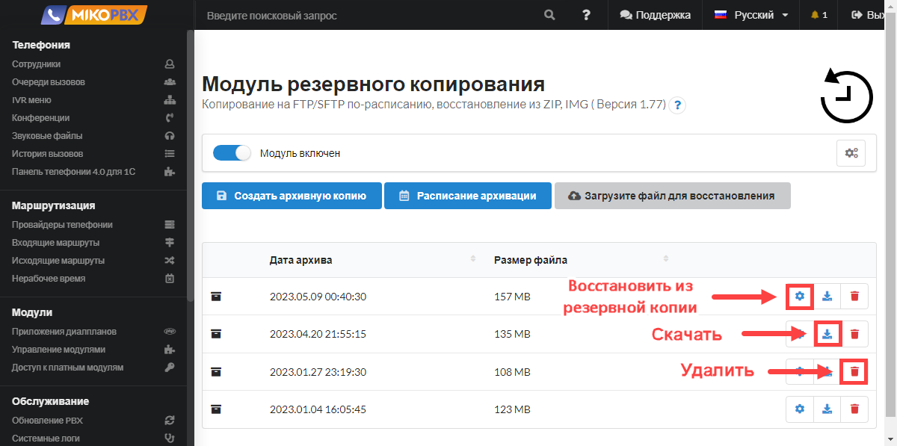<figcaption></figcaption></figure>

Восстановление из резервной копии

В списке резервных копий выберите нужную и выполните действие **Восстановить из резервной копии**

<figure>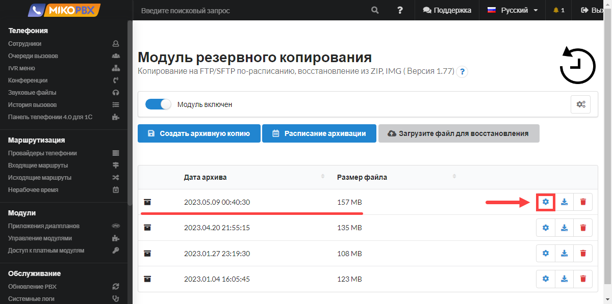<figcaption></figcaption></figure>

Выберите категории данных к восстановлению

<figure>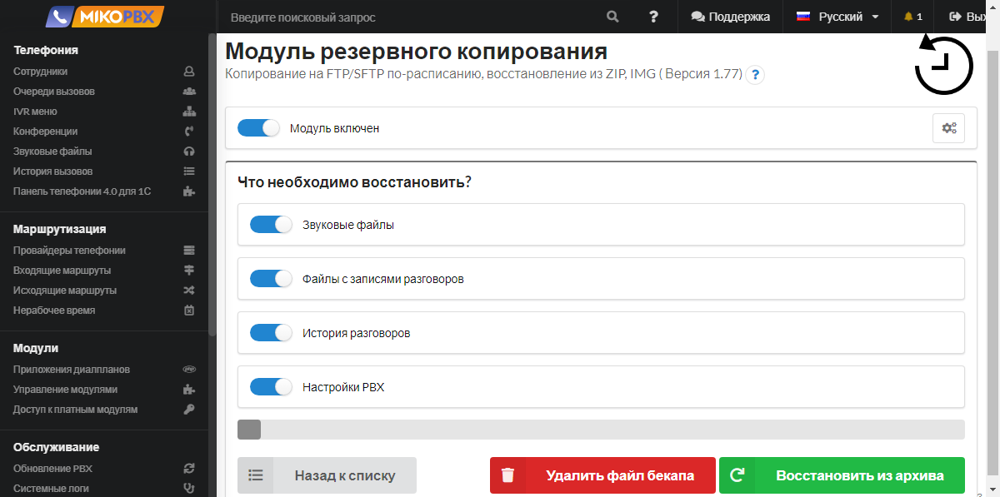<figcaption></figcaption></figure>

Нажмите  

Подтвердите действие, Нажав **ОK**.

<figure>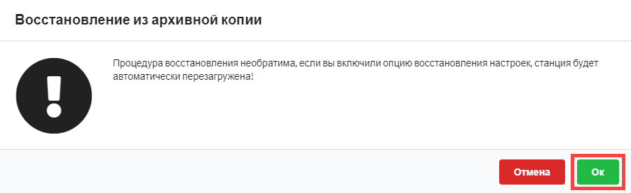<figcaption></figcaption></figure>

Будет запущен процесс восстановления, после завершения АТС будет перезагружена. Прогресс восстановления данных из архива будет отображен на текущей странице

<figure>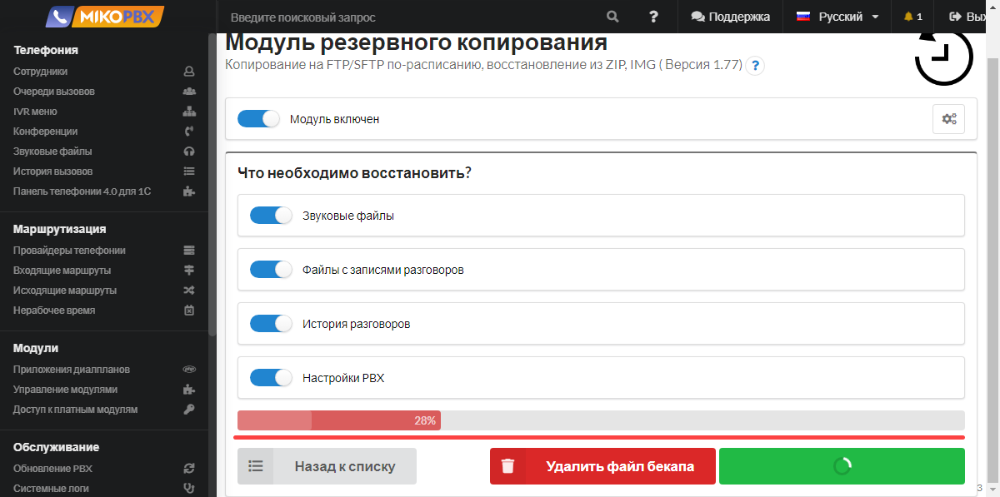<figcaption></figcaption></figure>


Рекомендуем восстанавливать данные в два этапа:

1. Восстановление **Звуковые файлы** + **Настройки PBX** + **История разговоров**
2. Восстановление **Файлы записи разговоров.** Это наиболее длительный этап


## Загрузка данных из CSV <a href="#zagruzka_dannyx_iz_csv" id="zagruzka_dannyx_iz_csv"></a>

1. Кликните по кнопке **Загрузить файл для восстановления**
2. Выберите файл, с расширением **\*.csv**
3. Дождитесь завершения операции

Формат файла должен быть следующим

```
extension;username;password;mobile-phone;ringtime;enable-forward
```

1. **extension** - <mark style="color:red;">обязательное</mark> поле, внутренний номер пользователя
2. **username** - <mark style="color:red;">обязательное</mark> поле, имя пользователя, допускает кириллица
3. **password** - <mark style="color:red;">обязательное</mark> поле, пароль для SIP аккаунта
4. **mobile-phone** - мобильный номер телефона
5. **ringtime** - как долго звонить на внутренний номер
6. **enable-forward** - включить адресацию на мобильный после **ringtime**

Пример файла

```
701;Alex;password701@;89066643322;10;1
702;Петр (Sales);password@_702
```

## Загрузка данных из FreePBX <a href="#zagruzka_dannyx_iz_freepbx" id="zagruzka_dannyx_iz_freepbx"></a>

Функция позволяет загрузить из FreePBX все **Extensions**, которые будут преобразованы в **Сотрудников**

1. Установите в FreePBX модуль [Bulk Handler](https://wiki.freepbx.org/display/FPG/Bulk+Handler)
2. Перейдите в интерфейс модуля **Admin** -> **Bulk Handler.**
3. Экспортируйте данные **Extensions**

<figure>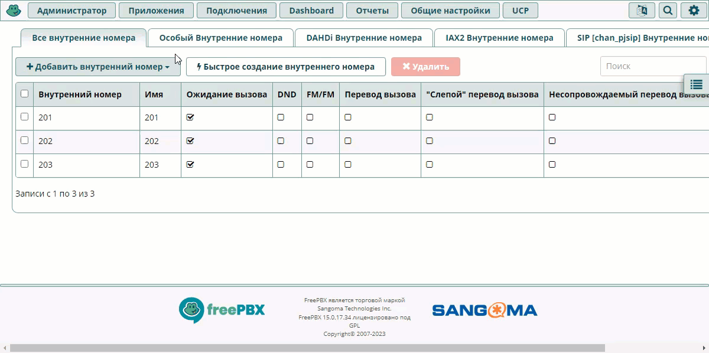<figcaption></figcaption></figure>

4. Откройте в MikoPBX интерфейс модуля резервного копирования
5. Кликните по кнопке **Загрузить файл для восстановления**
6. Выберите файл, с расширением **\*.csv**
7. Дождитесь завершения операции

<figure>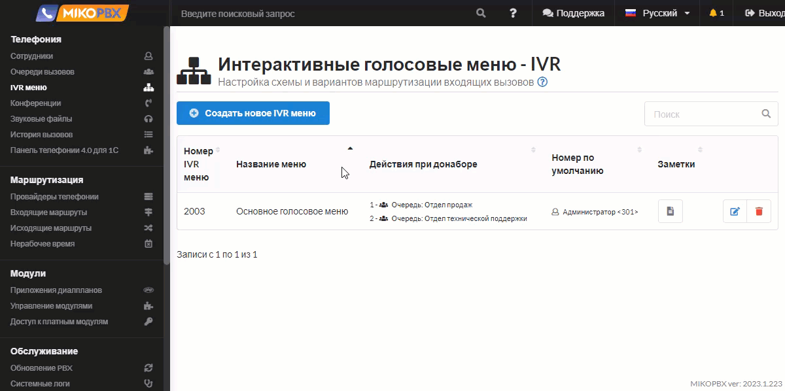<figcaption></figcaption></figure>

## Резервное копирование по расписанию <a href="#rezervnoe_kopirovanie_po_raspisaniju" id="rezervnoe_kopirovanie_po_raspisaniju"></a>


* Режим **FTP** - будет создан **ZIP** архив. Для данного режима необходимо наличие ftp-сервера.
* Режим **SFTP** - создается **IMG** контейнер. Для данного режима достаточно только самой MikoPBX.
* Режим **WebDav** - создается **IMG** контейнер.

**Наиболее быстрые варианты** резервного копирования по расписанию - **SFTP** и **WebDav**. FTP морально устарел, со временем возможность использования этого протокола будет исключена из модуля резервного копирования.


Для настройки автоматического резервного копирования на главной странице модуля нажмите кнопку **Расписание архивации.**

<figure>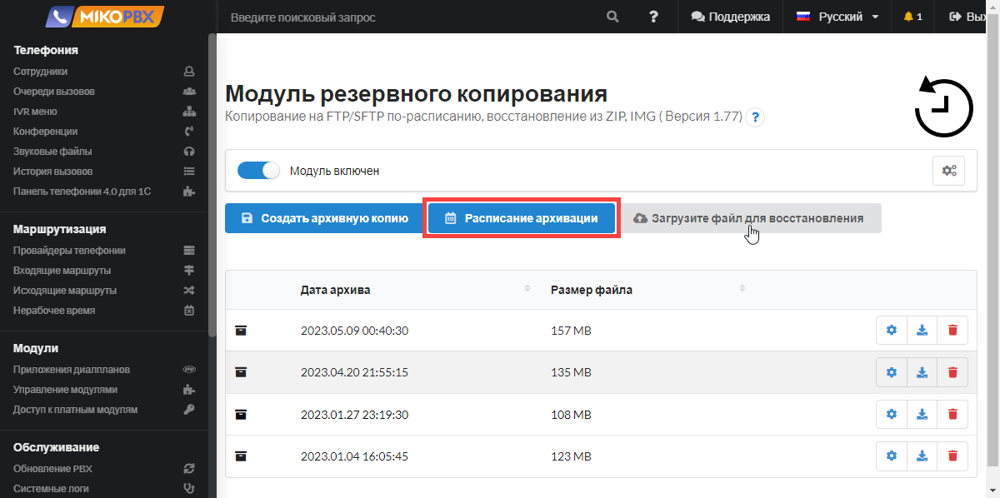<figcaption></figcaption></figure>

Для включения резервного копирования активируйте переключатель **Архивация по расписанию.**

<figure>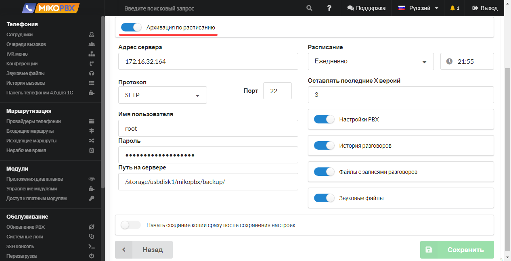<figcaption></figcaption></figure>

* **Адрес сервера** - IP-адрес MikoPBX, или адрес SFTP / FTP сервера
* **Порт** - для режима **SFTP** - порт **22.** При отключении флага «**Режим SFTP**» активируется режим **FTP** - порт **21**
* **Имя пользователя** - имя пользователя для авторизации на сервере. Для режима SFTP имя пользователя - **root.**
* **Пароль** - пароль для авторизации на сервере. Для режима SFTP пароль от пользователя **root.**
* **Путь на сервере** - директория, в которую будут сохраняться резервные копии. Рекомендуемый каталог на MikoPBX: **/storage/usbdisk1/mikopbx/backup/**


При использовании **WebDav** каталог из поля **Путь на сервере** необходимо создать заранее, вручную.


* **Расписание** - укажите в какой день выполнять резервное копирование и время, когда запустить операцию
* **Оставлять последние Х версий** - укажите, какое количество версий бекапа должно обязательно сохраняться
* **Настройки PBX** - все **настройки конфигурации** MikoPBX, которые были выполнены в web-интерфейсе в соответствующих разделах
* **История разговоров** - сохранение истории базы данных **cdr.db** (расположение: **/storage/usbdisk1/mikopbx/astlogs/asterisk/cdr.db**). Данная настройка не предполагает сохранение самих записей разговоров, т.е. будет сохранена вся информация на вкладке **Телефония** → [**История вызовов**](../telefoniya/call-detail-records.md) без возможности прослушивания / скачивания файлов записей
* **Файлы с записями разговоров** - сохранение всех записей разговоров в формате **\*.mp3**
* **Звуковые файлы** - сохранение звуковых файлов, которые были загружены на АТС в разделе **Телефония** → [**Звуковые файлы**](../telefoniya/sound-files.md)**.**
