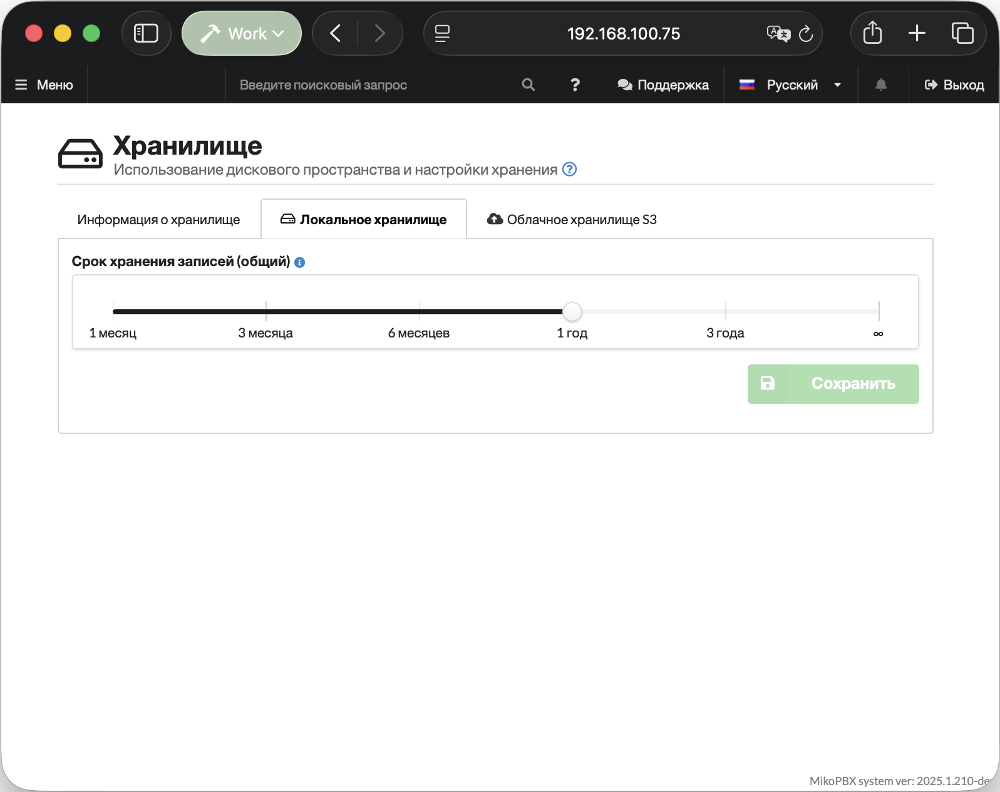

# Хранилище

Раздел «**Хранилище**» в MikoPBX позволяет контролировать использование дискового пространства и управлять настройками хранения данных. Здесь отображается подробная разбивка занятого места по категориям: записи разговоров, системные логи, резервные копии и другие файлы. Помимо мониторинга локального хранилища, раздел предоставляет возможность настроить автоматическую выгрузку записей в облачное хранилище S3.

Расположение раздела: "**Обслуживание**" -> "**Хранилище**".

<figure><figcaption>
Раздел "<strong>Обслуживание</strong>" -> "<strong>Хранилище</strong>"
</figcaption></figure>

### Информация о хранилище&#x20;

На вкладке **«Информация о хранилище»** отображается общая картина использования дискового пространства.

В верхней части страницы находится блок с горизонтальной диаграммой, которая наглядно показывает, какую долю от общего объёма диска занимает каждая категория данных.В примере занято 56.0 GB из 100.0 GB. Каждый сегмент диаграммы окрашен в свой цвет в соответствии с легендой:

* 🟠 Записи разговоров
* 🟣 История разговоров
* 🔵 Системные логи
* 🟢 Дополнительные модули
* 🩵 Резервные копии
* 🔴 Системные кеши
* ⚫ Прочие файлы

<figure><figcaption>
Раздел "<strong>Информация о хранилище</strong>"
</figcaption></figure>

В нижней части страницы находится список категорий данных и количество памяти, которая каждая из них занимает.

### Локальное хранилище

На вкладке "**Локальное хранилище**" доступно определение срока хранения записей разговоров на станции: передвигая ползунок, выберите необходимый период хранения:

* **30 дней (1 месяц)** - минимальный период хранения.
* **90 дней (3 месяца)** - рекомендуется для малого бизнеса.
* **1 год** - для соблюдения требований законодательства.
* **Бесконечно** - хранить все записи без ограничений.


Более длительные периоды хранения требуют больше дискового пространства.


<figure><figcaption>
Вкладка "<strong>Локальное хранилище</strong>". Выбор срока хранения записей разговора.
</figcaption></figure>

### Облачное хранилище S3

На этой вкладке настраивается автоматическая выгрузка записей разговоров во внешнее S3-совместимое хранилище (например: Amazon S3, Яндекс Cloud, VK Cloud).

В верхней части вкладки находится переключатель **«Автоматическая загрузка записей в облачное хранилище»** — он включает или отключает функцию выгрузки.

Для подключения к бакету необходимо заполнить следующие поля:

* **URL точки доступа S3** — адрес сервиса хранилища (например, `https://storage.yandexcloud.net` для Yandex Cloud S3).
* **Регион S3** — регион размещения бакета (например, `ru-central1`).
* **Имя бакета S3** — название бакета, в который будут загружаться записи.
* **Ключ доступа** и **Секретный ключ** — учётные данные сервисного аккаунта для авторизации.

Нажмите "**Сохранить**" для сохранения настроек.

<figure><figcaption>
Вкладка "Облачное хранилище S3"
</figcaption></figure>

Далее нажмите кнопку **«Проверить соединение»** — система выполнит тестовое подключение и отобразит результат в верхней части страницы. При успешном подключении появится сообщение «**Подключено к S3**» и начнется синхронизация записей телефонных разговоров.

<figure><figcaption>
Успешное соединение с S3 хранилищем
</figcaption></figure>

В нижней части вкладки расположен ползунок **«Локальное хранение (режим S3)»** — он определяет, как долго записи будут сохраняться локально на станции после выгрузки в облако, прежде чем автоматически удалятся. **Срок локального хранения не может превышать общий срок хранения.**


Более короткое локальное хранение быстрее освобождает дисковое пространство.


<figure><figcaption>
Ползунок "<strong>Локальное хранение (режим S3)</strong>"
</figcaption></figure>
