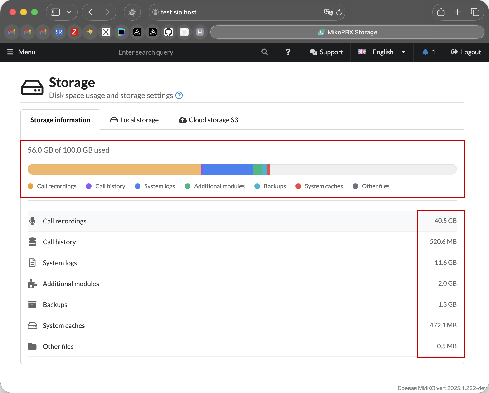
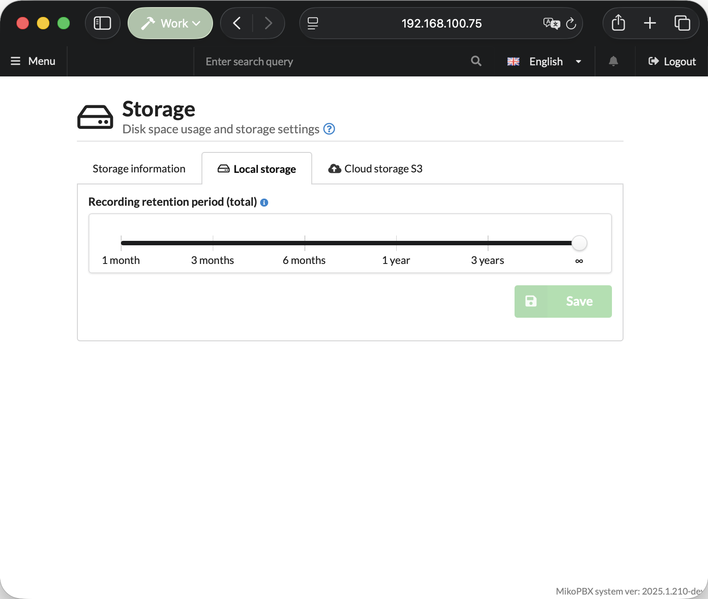
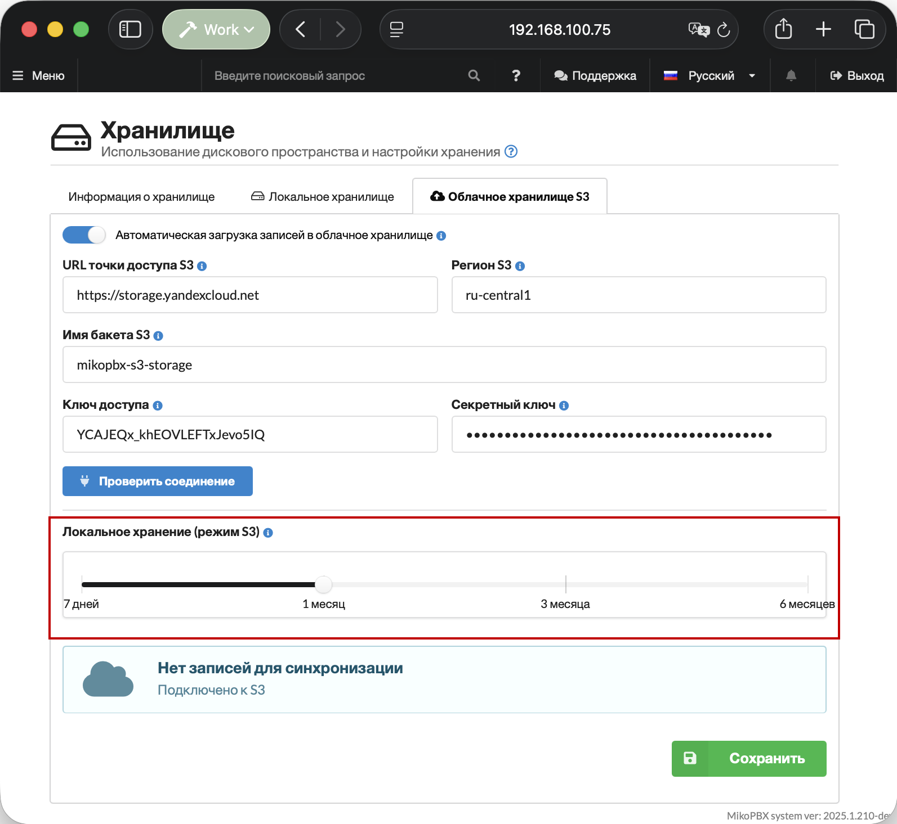

# Storage

The "**Storage**" section in MikoPBX allows you to monitor disk space usage and manage data storage settings. It provides a detailed breakdown of occupied space by category: call recordings, system logs, backups, and other files. In addition to local storage monitoring, the section allows you to configure automatic upload of recordings to an S3 cloud storage.

Section location: "**Maintenance**" -> "**Storage**".

<figure><figcaption>
"<strong>Maintenance</strong>" -> "<strong>Storage</strong>" section
</figcaption></figure>

### Storage information

The **"Storage information"** tab provides an overview of disk space usage.

At the top of the page there is a block with a horizontal chart that visually shows what share of the total disk volume each data category occupies. In the example, 56.0 GB out of 100.0 GB is used. Each segment of the chart is color-coded according to the legend:

* 🟠 Call recordings
* 🟣 Call history
* 🔵 System logs
* 🟢 Additional modules
* 🩵 Backups
* 🔴 System caches
* ⚫ Other files

<figure><figcaption>
"<strong>Storage information</strong>" tab
</figcaption></figure>

At the bottom of the page there is a list of data categories and the amount of storage each one occupies.

### Local Storage

The **"Local Storage"** tab allows you to set the retention period for call recordings on the station. Use the slider to select the desired period:

* **30 days (1 month)** — minimum retention period.
* **90 days (3 months)** — recommended for small businesses.
* **1 year** — for compliance with legal requirements.
* **Unlimited** — store all recordings without restrictions.


Longer retention periods require more disk space.


Click "**Save**" to save the settings.

<figure><figcaption>
"<strong>Local storage</strong>" tab
</figcaption></figure>

### S3 Cloud Storage

This tab is used to configure automatic upload of call recordings to an external S3-compatible storage (e.g.: Amazon S3, MinIO, Wasabi).

At the top of the tab there is a toggle **"Automatic recording upload to cloud storage"** — it enables or disables the upload feature.

To connect to a bucket, fill in the following fields:

* **S3 endpoint URL** — the address of the storage service (e.g., `https://storage.yandexcloud.net` for Yandex Cloud S3).
* **S3 region** — the region where the bucket is located (e.g., `ru-central1` in our case).
* **S3 bucket name** — the name of the bucket where recordings will be uploaded.
* **Access key** and **Secret key** — service account credentials for authorization.

Click "**Save**" to save the settings.

<figure><figcaption>
"<strong>Cloud storage S3</strong>" tab
</figcaption></figure>

Next, click the **"Test Connection"** button — the system will perform a test connection and display the result at the top of the page. Upon successful connection, the message "**S3 connection successful**" will appear and synchronization of call recordings will begin.

<figure><figcaption>
Successful connection to S3 storage
</figcaption></figure>

At the bottom of the tab there is a **"Local storage period (S3 mode)"** slider — it determines how long recordings will be stored locally on the station after being uploaded to the cloud before being automatically deleted. **The local retention period cannot exceed the total retention period.**


Shorter local storage duration frees up disk space faster.


<figure><figcaption>
"<strong>Local storage (S3 mode)"</strong> slider
</figcaption></figure>

#### Instructions for connecting cloud storage


[aws.md](aws.md)

