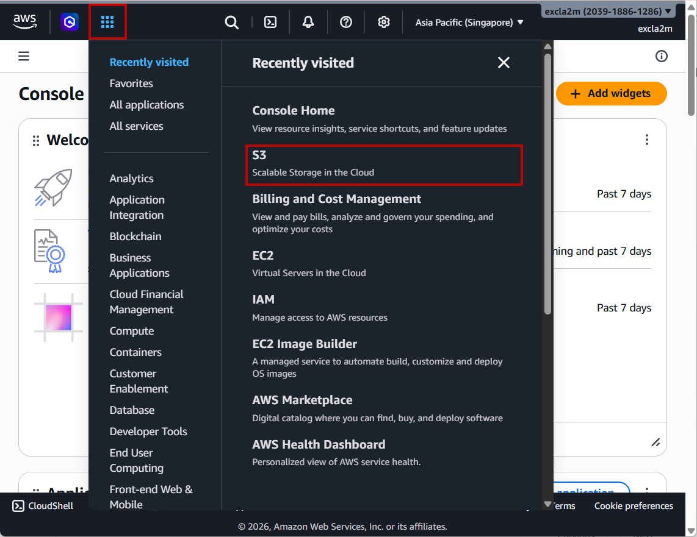
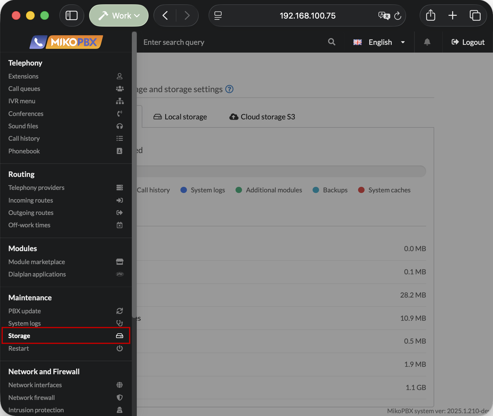
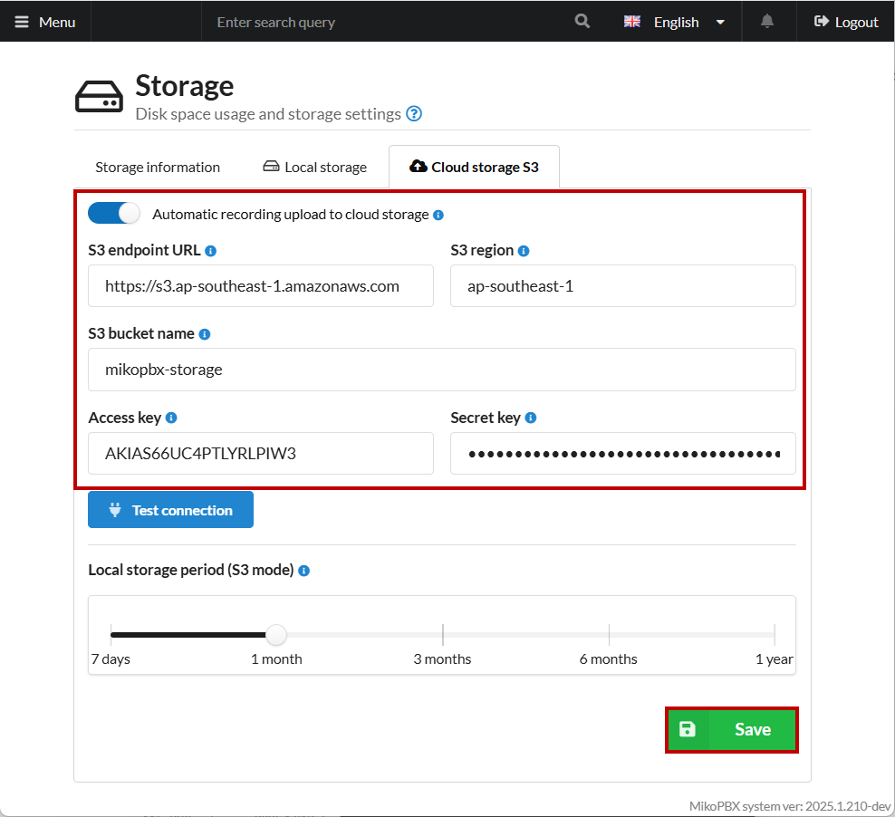
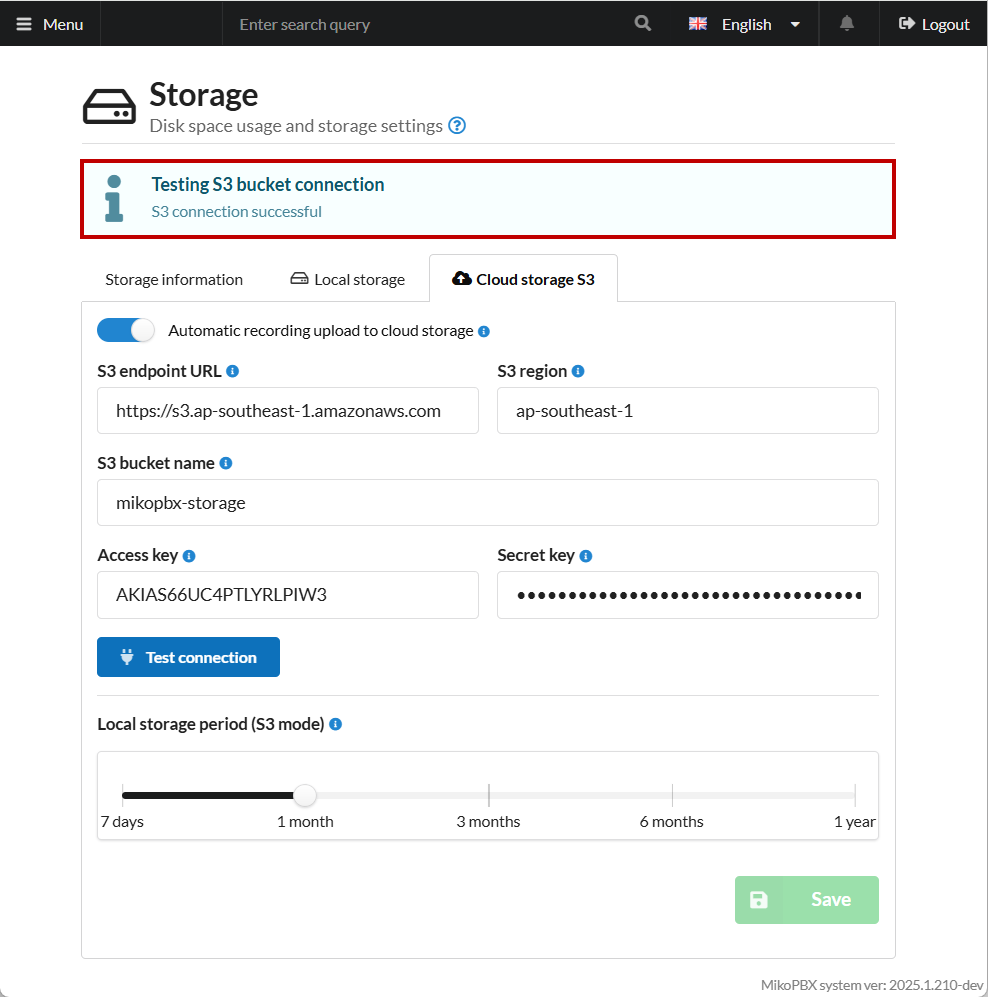

# Connecting AWS S3 Storage

### Creating a Bucket

1. Go to the AWS console ([link](https://console.aws.amazon.com/)). Navigate to **"All services"** -> **"Storage"** -> **"S3"**.

<figure><figcaption><p>"S3" section in AWS</p></figcaption></figure>

2. Click **"Create bucket"**.

<figure><figcaption><p>Button for creating a bucket</p></figcaption></figure>

3. Enter any name for the bucket (field **"Bucket name"**). Leave all other parameters as default and click **"Create bucket".**

<figure><figcaption><p>Parameters of the bucket being created</p></figcaption></figure>

### Creating an IAM User and Access Keys

1. Go to **"All services"** -> **"Security, Identity, & Compliance"** -> **"IAM"**.

<figure><figcaption><p>"IAM" section</p></figcaption></figure>

2. Next, create a new IAM user. Go to the **"Access Management"** tab, then **"Users"**. Click **"Create user"**.

<figure><figcaption><p>Creating a new IAM user</p></figcaption></figure>

3. Enter the name of the IAM user in the **"User name"** field.

Click **"Next"**.

<figure><figcaption><p>"Specify user details" tab</p></figcaption></figure>

4. Select **"Attach policies directly"** as the **"Permissions options"**. Scroll down the page.

<figure><figcaption><p>Selecting "Permissions options"</p></figcaption></figure>

5. In the **"Permissions policies"** section click **"Create policy"**.

<figure><figcaption><p>"Create policy" button</p></figcaption></figure>

6. In the newly opened tab, in the **"Policy editor"**, select **"JSON"** as the format and paste the following content into the parameters field:

```json
{
  "Version": "2012-10-17",
  "Statement": [
    {
      "Effect": "Allow",
      "Action": [
        "s3:PutObject",
        "s3:GetObject",
        "s3:DeleteObject",
        "s3:ListBucket"
      ],
      "Resource": [
        "arn:aws:s3:::your-bucket-name",
        "arn:aws:s3:::your-bucket-name/*"
      ]
    }
  ]
}
```


Replace **"your-bucket-name"** with the name of the bucket you created earlier (in this guide — **"aws-s3-mikopbxstorage"**).


Click **"Next"**.

<figure><figcaption><p>Creating a new policy. Step 1</p></figcaption></figure>

7. Next, specify any name for the policy being created.

Click **"Next"**.

<figure><figcaption><p>Creating a new policy. Step 2</p></figcaption></figure>

8. Return to the user creation tab, refresh the policy list, and select the previously created policy (in this guide — **"access-mikopbx"**).

Click **"Next"**.

<figure><figcaption><p>Selecting the previously created policy</p></figcaption></figure>

9. Confirm user creation: click **"Create user"**.

<figure><figcaption><p>Confirming user creation</p></figcaption></figure>

10. Open the page of the created user by clicking on the username.

<figure><figcaption><p>Opening the created user's page</p></figcaption></figure>

11. Go to the **"Security credentials"** section. Click **"Create access key"**.

<figure><figcaption><p>Creating an access key</p></figcaption></figure>

12. Select **"Application running outside AWS"**. Click **"Next"**.

<figure><figcaption><p>Selecting parameters when creating the key</p></figcaption></figure>

13. Enter a description for the key so that you can identify it later. Click **"Create access key"**.

<figure><figcaption><p>Key description</p></figcaption></figure>

The **Access key** and **Secret access key** will be displayed. Save them — they will be needed later when configuring MikoPBX.


The secret access key can only be viewed or downloaded now. It cannot be recovered later.


<figure><figcaption><p>Access key and Secret access key</p></figcaption></figure>

### Connecting to MikoPBX

1. Go to the **"Maintenance"** -> **"Storage"** tab.

<figure><figcaption><p>"Maintenance" -> "Storage" section</p></figcaption></figure>

2. Open the **"S3 Cloud Storage"** tab and fill in the following fields:

* **Automatic recording upload to cloud storage** — enable the switch.
* **S3 endpoint URL** — enter the S3 AWS endpoint depending on the region of your bucket ([link](https://docs.aws.amazon.com/general/latest/gr/s3.html) to the table with all URLs). In this guide — `https://s3.ap-southeast-1.amazonaws.com`
* **S3 region** — specify the **region of your bucket**. In this guide — `ap-southeast-1`
* **S3 bucket name** — enter the name of the bucket created in AWS (for example `aws-s3-mikopbxstorage` in this guide)
* **Access key** and **Secret key** — paste the values obtained when creating the service account access key.

Configure the **“Local storage period (S3 mode)”** slider — choose how long recordings will be stored locally before being deleted after uploading to the cloud.


Shorter local storage periods free up disk space faster.


Click **“Save”**.

<figure><figcaption><p>Parameters for connecting S3 cloud storage in MikoPBX</p></figcaption></figure>

After saving the settings, click **"Test connection"**. If the connection is successful, the message **“S3 connection successful”** will appear and synchronization of call recordings will begin.

<figure><figcaption><p>Successful connection</p></figcaption></figure>
