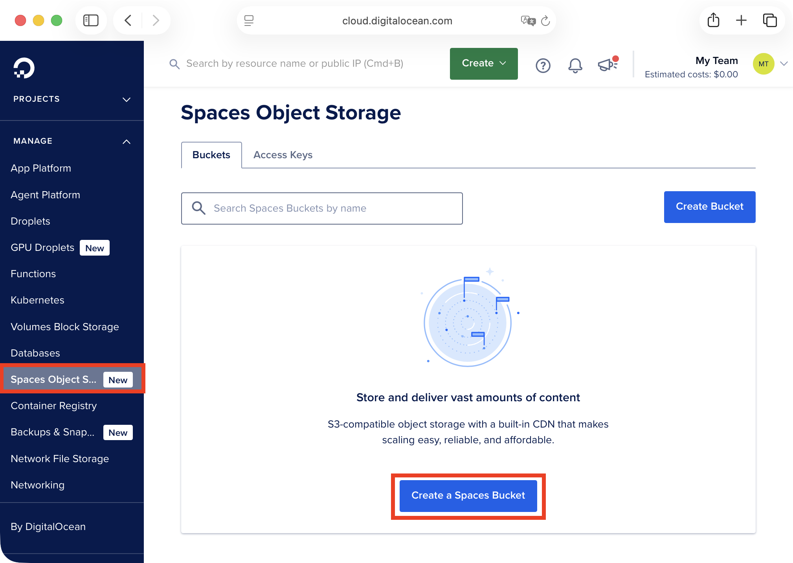
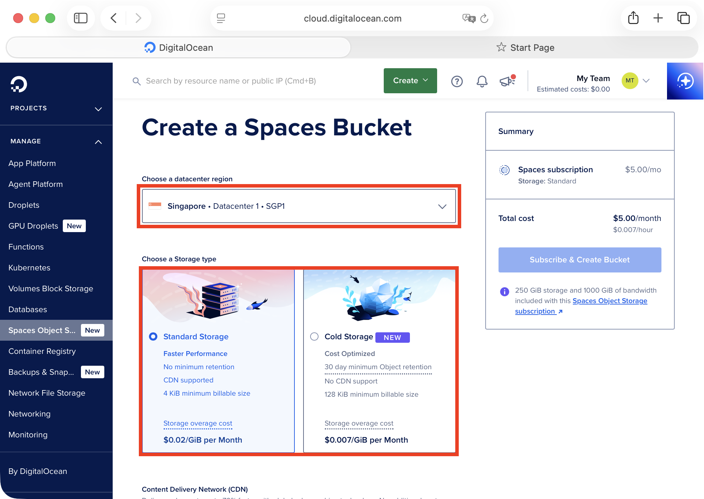
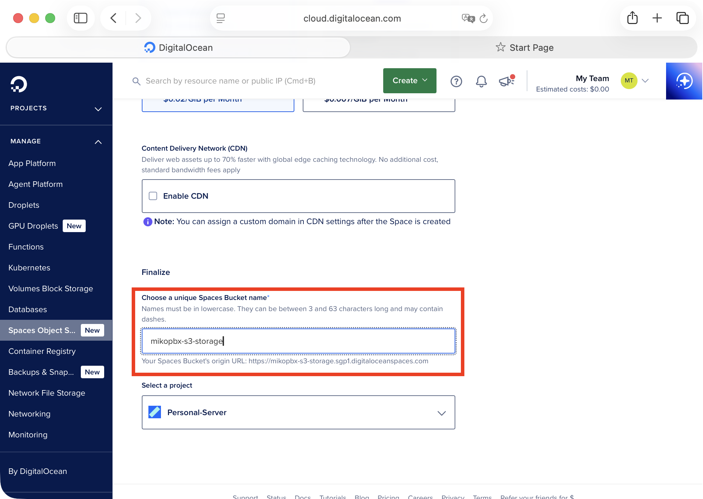
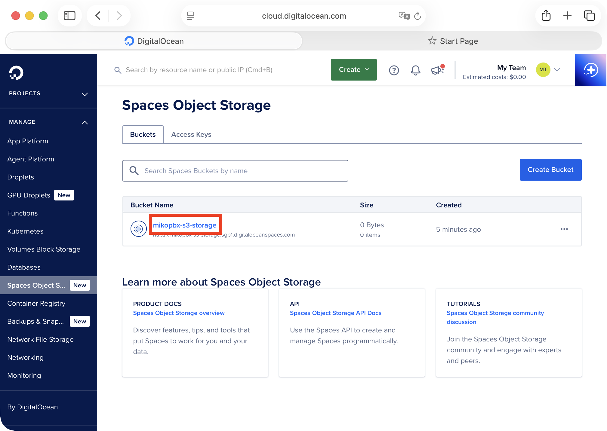
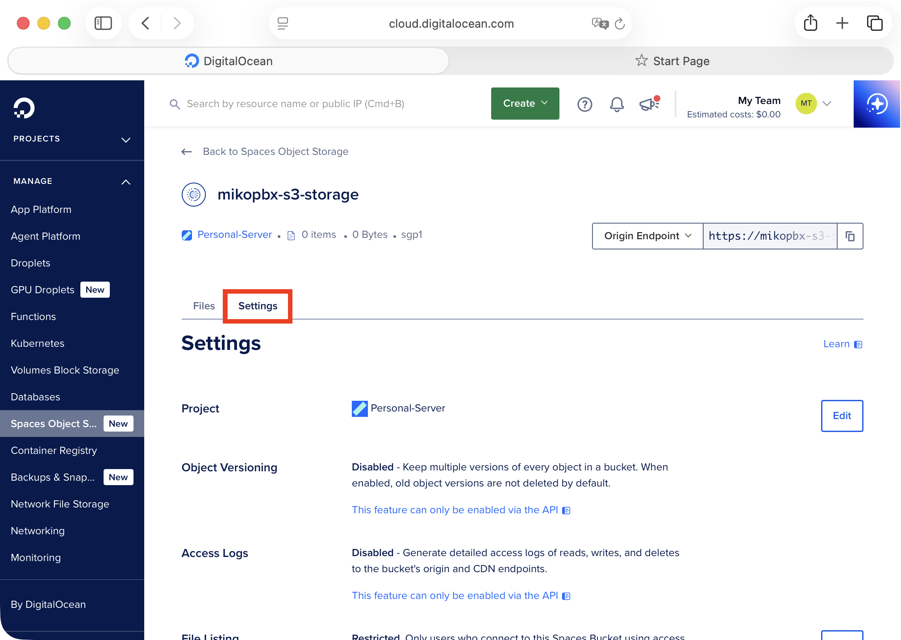
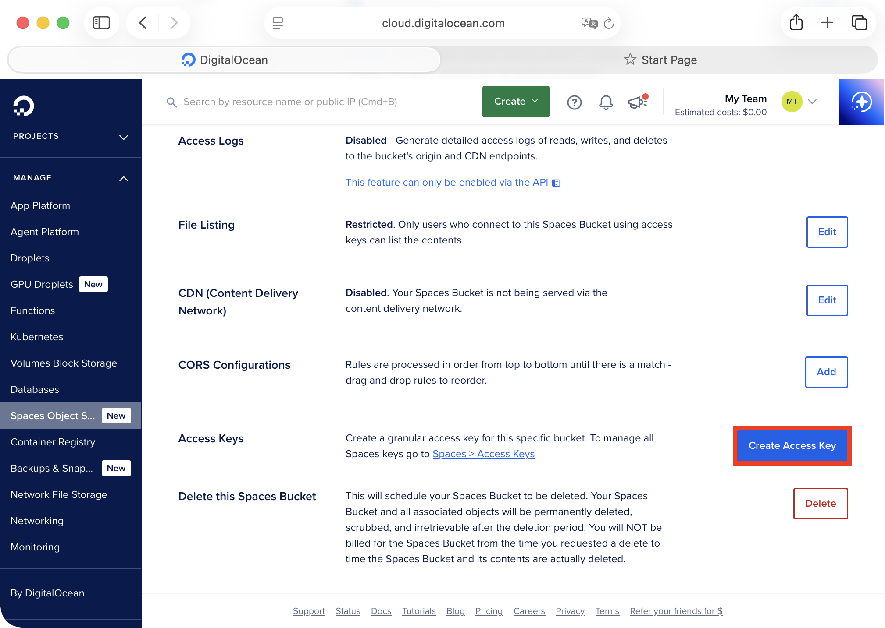
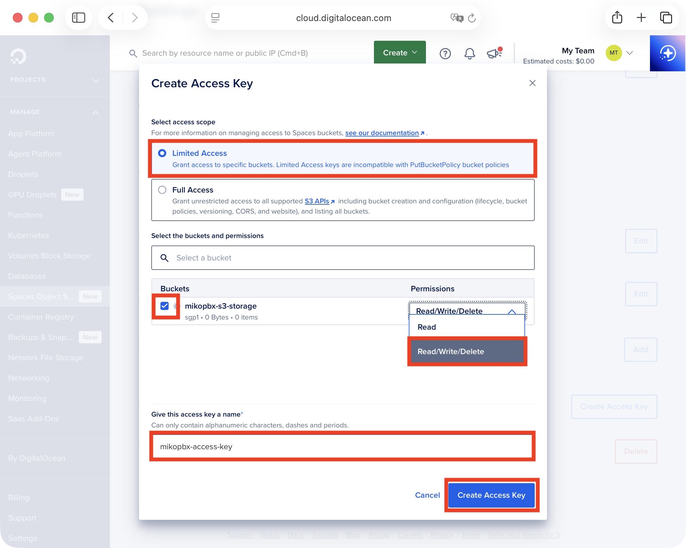
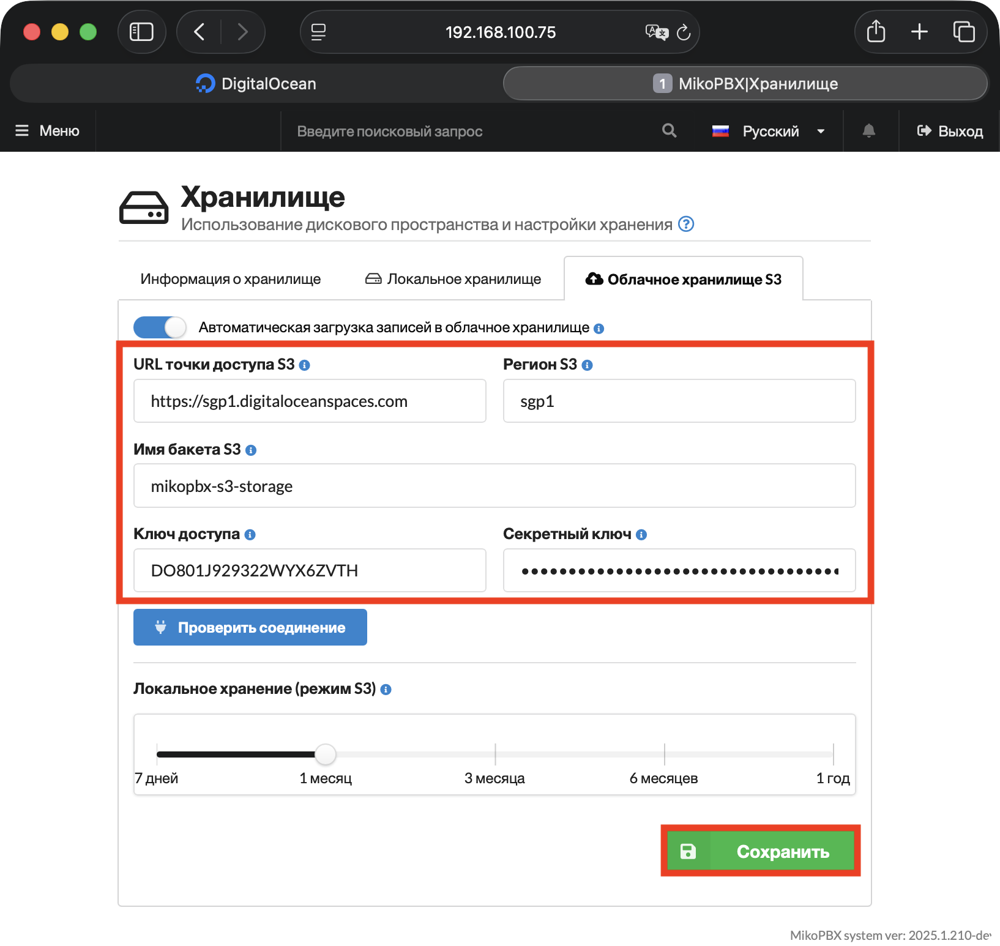
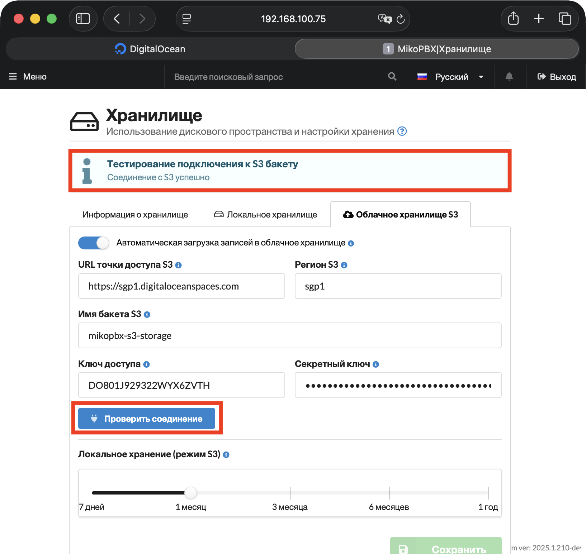

# Подключение S3 хранилища DigitalOcean

## Создание бакета и ключей

1. Перейдите в консоль DigitalOcean ([ссылка](https://cloud.digitalocean.com/)).
2. Перейдите в раздел "**Manage**" -> "**Spaces Object Storage**". Нажмите "**Create a Spaces Bucket**" для создания нового бакета.

<figure><figcaption>
Раздел "Spaces Object Storage"
</figcaption></figure>

3. На странице создания бакета, в разделе "**Choose a datacenter region**", выберите ближайший к серверу MikoPBX регион. Выберите "**Standart Storage**".


Запомните название Вашего региона (**sgp1** на скриншоте ниже), оно понадобится в будущем для настройки внутри MikoPBX.


<figure><figcaption>
Параметры создаваемого бакета #1
</figcaption></figure>

4. В поле "**Choose a unique Spaces Bucket name**" укажите произвольное название для бакета.

Нажмите "**Subscribe & Create Bucket**".

<figure><figcaption>
Параметры создаваемого бакета #2
</figcaption></figure>

5. Перейдите на страницу созданного бакета (нажмите на его название в разделе "**Buckets**").

<figure><figcaption>
Созданный бакет в разделе "Buckets".
</figcaption></figure>

6. Перейдите на вкладку "**Settings**".

<figure><figcaption>
Вкладка "Settings" на странице созданного бакета
</figcaption></figure>

7. Пролистайте до раздела "**Access Keys**". Нажмите "**Create Access Key**" для создания новой связки ключей.

<figure><figcaption>
Раздел "Access Keys"
</figcaption></figure>

8. Заполните необходимые параметры для создаваемого ключа:

* **Select access scope** - Limited Access.
* **Buckets** - выберите ранее созданный бакет.
* **Permissions** - Read/Write/Delete.
* **Give this access key a name** - укажите произвольное название для идентификации связки ключей.

Нажмите "**Create Access Key**".

<figure><figcaption>
Параметры создаваемой связки ключей
</figcaption></figure>

Будет отображены значения связки ключей (Access Key ID и Secret Key). Сохраните эти значения, они понадобятся в будущем при настройке на стороне MikoPBX.

<figure><figcaption>
Связка access ключей
</figcaption></figure>

#### Подключение к MikoPBX 

1. Перейдите во вкладку "**Обслуживание**" -> "**Хранилище**".

<figure><figcaption>
Раздел "Хранилище"
</figcaption></figure>

2. Перейдите на вкладку "**Облачное хранилище S3**" и заполните следующие поля:

* **Автоматическая загрузка записей в облачное хранилище** — включите переключатель.
* **URL точки доступа S3** — введите `https://sgp1.digitaloceanspaces.com` - замените sgp1 на Ваш регион.
* **Регион S3** — укажите регион Вашего бакета в DigitalOcean, в этой инструкции - `sgp1`.
* **Имя бакета S3** — укажите имя бакета, созданного в DigitalOcean (например, `mikopbx-s3-storage` в этой инструкции)
* **Ключ доступа** и **Секретный ключ** — вставьте значения, полученные в первой части этой инструкции (связка Access ключей).

Настройте ползунок **«Локальное хранение (режим S3)»** — выберите, как долго записи будут храниться локально до удаления после выгрузки в облако.


Более короткое локальное хранение быстрее освобождает дисковое пространство.


Нажмите **«Сохранить»**.

<figure><figcaption>
Параметры для подключения S3 DigitalOcean
</figcaption></figure>

После сохранения настроек нажмите "**Проверить соединение**". При успешном подключении появится сообщение «**Соединение с S3 успешно**» и начнется синхронизация записей телефонных разговоров.

<figure><figcaption>
Успешное подключение
</figcaption></figure>
