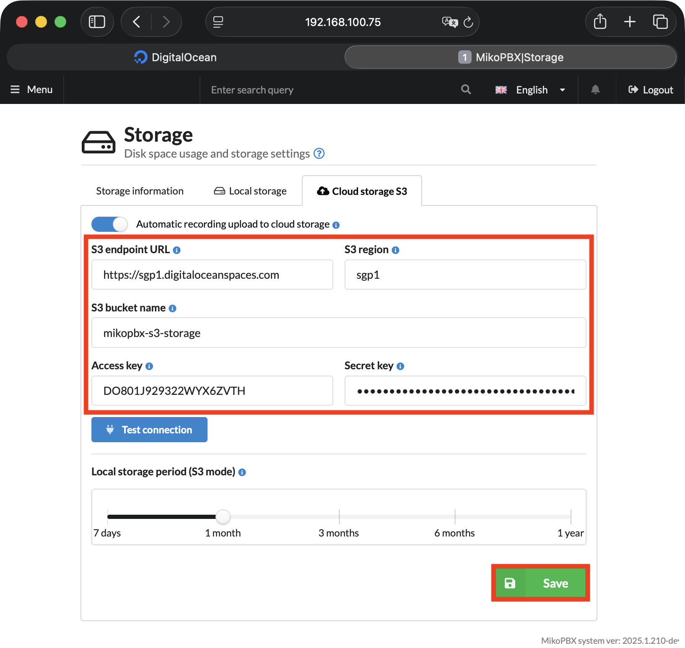
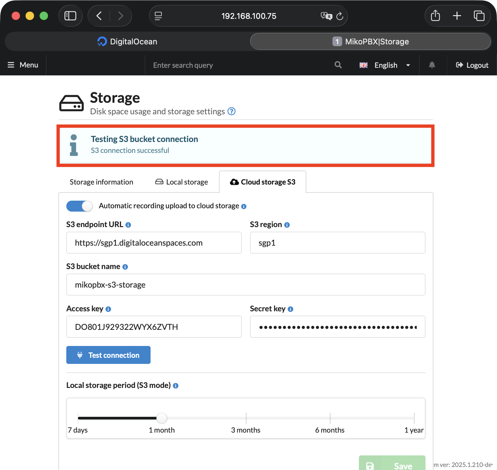

# Connecting DigitalOcean S3 Storage

### Creating a Bucket and Access Keys

1. Go to the DigitalOcean console ([link](https://cloud.digitalocean.com/)).
2. Navigate to **Manage** → **Spaces Object Storage**. Click **Create a Spaces Bucket** to create a new bucket.

<figure><figcaption>
Spaces Object Storage section
</figcaption></figure>

3. On the bucket creation page, under **Choose a datacenter region**, select the region closest to your MikoPBX server. Choose **Standard Storage**.


Remember your region name (**sgp1** in the screenshot below) — you will need it later when configuring MikoPBX.


<figure><figcaption>
Bucket creation parameters #1
</figcaption></figure>

4. In the **Choose a unique Spaces Bucket name** field, enter a name of your choice for the bucket.

Click **Subscribe & Create Bucket**.

<figure><figcaption>
Bucket creation parameters #2
</figcaption></figure>

5. Open the page of the newly created bucket by clicking its name in the **Buckets** section.

<figure><figcaption>
Created bucket in the Buckets section
</figcaption></figure>

6. Go to the **Settings** tab.

<figure><figcaption>
Settings tab on the created bucket page
</figcaption></figure>

7. Scroll down to the **Access Keys** section. Click **Create Access Key** to generate a new key pair.

<figure><figcaption>
Access Keys section
</figcaption></figure>

8. Fill in the required parameters for the new key:

* **Select access scope** — Limited Access.
* **Buckets** — select the bucket you created earlier.
* **Permissions** — Read/Write/Delete.
* **Give this access key a name** — enter an arbitrary name to identify this key pair.

Click **Create Access Key**.

<figure><figcaption>
Access key creation parameters
</figcaption></figure>

Your key pair values (**Access Key ID** and **Secret Key**) will be displayed. Save these values — you will need them when configuring MikoPBX.

<figure><figcaption>
Access key pair
</figcaption></figure>

### Connecting to MikoPBX

1. Go to the **Maintenance** → **Storage** tab.

<figure><figcaption>
Storage section in MikoPBX web-interface
</figcaption></figure>

2. Open the **S3 Cloud Storage** tab and fill in the following fields:

* **Automatically upload recordings to cloud storage** — enable the toggle.
* **S3 Endpoint URL** — enter `https://sgp1.digitaloceanspaces.com`, replacing `sgp1` with your region.
* **S3 Region** — enter the region of your DigitalOcean bucket (e.g. `sgp1` in this guide).
* **S3 Bucket Name** — enter the name of the bucket you created in DigitalOcean (e.g. `mikopbx-s3-storage` in this guide).
* **Access Key** and **Secret Key** — paste the values obtained in the first part of this guide.

Use the **Local Storage (S3 mode)** slider to configure how long recordings are kept locally before being deleted after upload to the cloud.


A shorter local retention period frees up disk space faster.


Click **Save**.

<figure><figcaption>
DigitalOcean S3 connection parameters
</figcaption></figure>

After saving the settings, click **Test Connection**. If the connection is successful, you will see the message **"S3 connection successful"** and synchronization of call recordings will begin.

<figure><figcaption>
Successful connection
</figcaption></figure>
