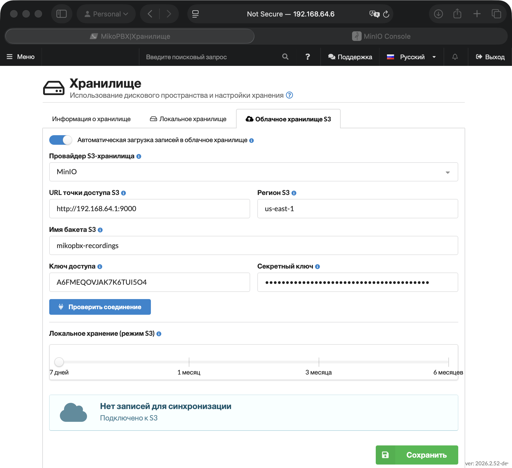
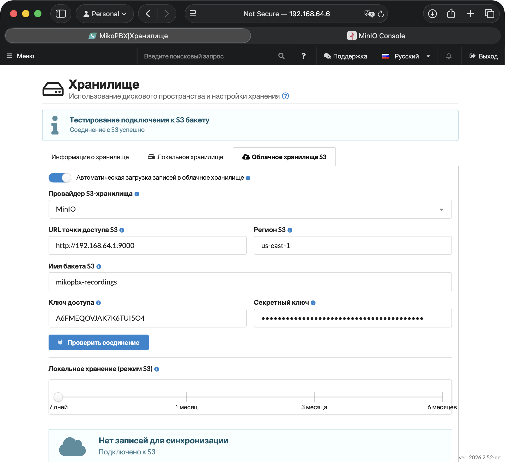

# Подключение S3 хранилища MinIO (self-hosted)

В данной инструкции описан процесс развёртывания локального S3-хранилища MinIO и его подключения к MikoPBX. Все действия выполняются на macOS - для других операционных систем официальная документация доступна [по ссылке](https://docs.min.io/aistor/installation/).

### Установка MinIO на MacOS

1. Откройте терминал и выполните команду:

```bash
brew install minio/stable/minio
```

По завершении установки терминал отобразит подтверждение:

```bash
🍺  /opt/homebrew/Cellar/minio/RELEASE.2025-09-06T17-38-46Z_1: 4 files, 108.2MB, built in 3 seconds
```

2. Создайте директорию для данных.

```bash
mkdir -p ~/minio-data
```

3. Запустите сервер:

```bash
MINIO_ROOT_USER=minioadmin MINIO_ROOT_PASSWORD=minioadmin \
  minio server ~/minio-data --console-address ":9001"
```

Вы увидите следующий вывод с полезной информацией; в том числе адрес WebUI для дальнейшей удобной работой с хранилищем.

<pre class="language-bash"><code class="lang-bash">MinIO Object Storage Server
Copyright: 2015-2026 MinIO, Inc.
License: GNU AGPLv3 - https://www.gnu.org/licenses/agpl-3.0.html
Version: RELEASE.2025-09-06T17-38-46Z (go1.24.6 darwin/arm64)

API: http://192.168.100.114:9000  http://192.168.64.1:9000  http://127.0.0.1:9000
   RootUser: minioadmin
   RootPass: minioadmin

WebUI: <a data-footnote-ref href="#user-content-fn-1">http://192.168.100.114:9001 http://192.168.64.1:9001 http://127.0.0.1:9001</a>
   RootUser: minioadmin
   RootPass: minioadmin

CLI: https://docs.min.io/community/minio-object-store/reference/minio-mc.html#quickstart
   $ mc alias set 'myminio' 'http://192.168.100.114:9000' 'minioadmin' 'minioadmin'

Docs: https://docs.min.io
</code></pre>

После запуска оставьте окно терминала открытым — закрытие остановит сервер.

> Чтобы MinIO запускался автоматически при старте системы, выполните:
>
> ```bash
> brew services start minio/stable/minio
> ```

4. Откройте браузер и перейдите по адресу WebUI.&#x20;

Введите учётные данные:

* **Username:** `minioadmin`
* **Password:** `minioadmin`

<figure><figcaption><p>Веб-интерфейс MiniO</p></figcaption></figure>

### Создания бакета в MinIO

1. Нажмите "**Create Bucket**" в левом меню.

<figure><figcaption><p>Кнопка "Create Bucket" в Web-интерфейсе MiniO</p></figcaption></figure>

2. Введите имя бакета, например `mikopbx-recordings`.

Нажмите "**Create Bucket**".

<figure><figcaption><p>Указание имени для создаваемого бакета</p></figcaption></figure>

Для создания access key и настройки прав доступа потребуется консольная утилита `mc`.

Установите MinIO Client:

```bash
brew install minio/stable/mc
```

После установки проверьте версию:

```bash
mc --version
```

### Подключение MinIO Client к локальному серверу

Добавьте локальный MinIO-сервер как alias:

```bash
mc alias set local http://127.0.0.1:9000 minioadmin minioadmin
```


Параметры здесь:

* local — произвольное имя подключения
* http://127.0.0.1:9000 — API-адрес MinIO.
* minioadmin — root-пользователь
* minioadmin — root-пароль


Проверьте подключение:

```bash
mc admin info local
```

Если подключение выполнено успешно, в терминале появится информация о MinIO-сервере.

<figure><figcaption><p>Информация о MinIO-сервере</p></figcaption></figure>

### Создание пользователя и политики доступа к бакету

Не рекомендуется использовать root-пользователя MinIO для подключения внешних приложений.&#x20;

1. Создайте отдельного пользователя для MikoPBX:


Замените `strong-password` на надёжный пароль.


```bash
mc admin user add local mikopbx-user 'strong-password'
```

2. Создайте файл политики:

<pre class="language-bash"><code class="lang-bash">nano <a data-footnote-ref href="#user-content-fn-2">mikopbx-recordings</a>-policy.json
</code></pre>

3. Добавьте в него содержимое:

<pre class="language-json"><code class="lang-json">{
  "Version": "2012-10-17",
  "Statement": [
    {
      "Effect": "Allow",
      "Action": [
        "s3:ListBucket",
        "s3:GetBucketLocation"
      ],
      "Resource": [
        "arn:aws:s3:::<a data-footnote-ref href="#user-content-fn-2">mikopbx-recordings</a>"
      ]
    },
    {
      "Effect": "Allow",
      "Action": [
        "s3:PutObject",
        "s3:GetObject",
        "s3:DeleteObject"
      ],
      "Resource": [
        "arn:aws:s3:::<a data-footnote-ref href="#user-content-fn-2">mikopbx-recordings</a>/*"
      ]
    }
  ]
}
</code></pre>

4. Сохраните файл:

```
Ctrl + O
Enter
Ctrl + X
```

5. Создайте политику в MinIO:

```bash
mc admin policy create local mikopbx-recordings-rw mikopbx-recordings-policy.json
```

6. Назначьте политику пользователю:

```bash
mc admin policy attach local mikopbx-recordings-rw --user mikopbx-user
```

### Создание Access Key для MikoPBX

Создайте access key для пользователя `mikopbx-user`:

```bash
mc admin accesskey create local/ mikopbx-user
```

В ответе MinIO отобразит данные доступа:

```bash
Access Key: A6FMEQOVJAK7K6TUI5O4
Secret Key: HuKLsNh7hmS+3xdLzlpYaFjxu5wVxLPkM8XUTgsj
Expiration: NONE
Name: 
Description: 
```

Сохраните `Access Key` и `Secret Key`. Они понадобятся для подключения MinIO к MikoPBX.

> Secret Key отображается только при создании.&#x20;

### Подключение к MikoPBX

1. Перейдите во вкладку "**Обслуживание**" -> "**Хранилище**".

<figure><figcaption><p>Раздел "Хранилище" в Web-интерфейсе MikoPBX</p></figcaption></figure>

2. Перейдите на вкладку "**Облачное хранилище S3**" и заполните следующие поля:

* **Автоматическая загрузка записей в облачное хранилище** — включите переключатель.
* **Провайдер S3-хранилища** — MinIO
* **URL точки доступа S3** — `http://192.168.64.1:9000`
* **Регион S3** — оставьте us-east-1 или введите любое значение (если не указали иное в параметрах MiniO)
* **Имя бакета S3** — укажите имя бакета, созданного в MiniO (`mikopbx-recordings` в этой инструкции)
* **Ключ доступа** и **Секретный ключ** — вставьте значения, полученные в предедущей части этой инструкции (связка ключей).

Настройте ползунок **«Локальное хранение (режим S3)»** — выберите, как долго записи будут храниться локально до удаления после выгрузки в облако.


Более короткое локальное хранение быстрее освобождает дисковое пространство.


Нажмите **«Сохранить»**.

<figure><figcaption><p>Параметры для подключения S3 MiniO</p></figcaption></figure>

После сохранения настроек нажмите "**Проверить соединение**". При успешном подключении появится сообщение «**Соединение с S3 успешно**» и начнется синхронизация записей телефонных разговоров.

<figure><figcaption><p>Успешное подключение к S3 бакету</p></figcaption></figure>

[^1]: Адреса для доступа в Web-интерфейс

[^2]: Замените на название Вашего бакета
