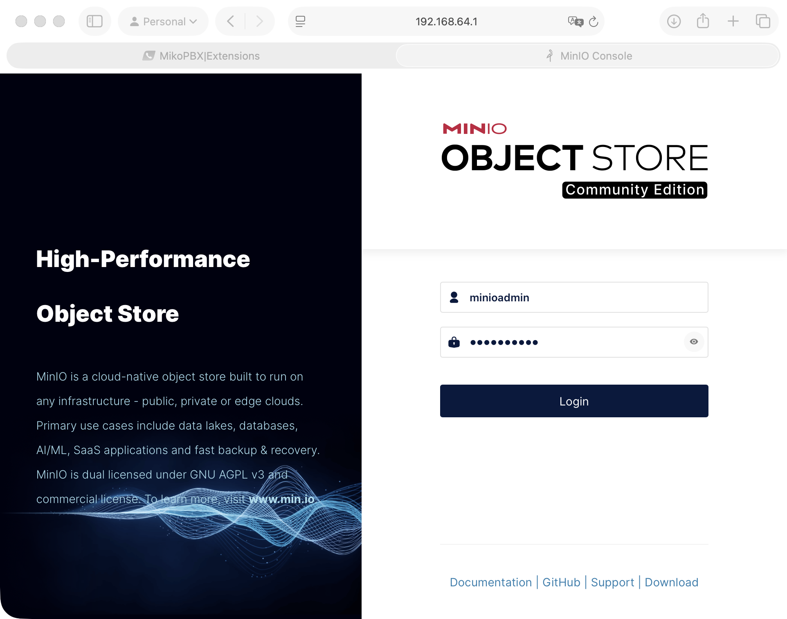
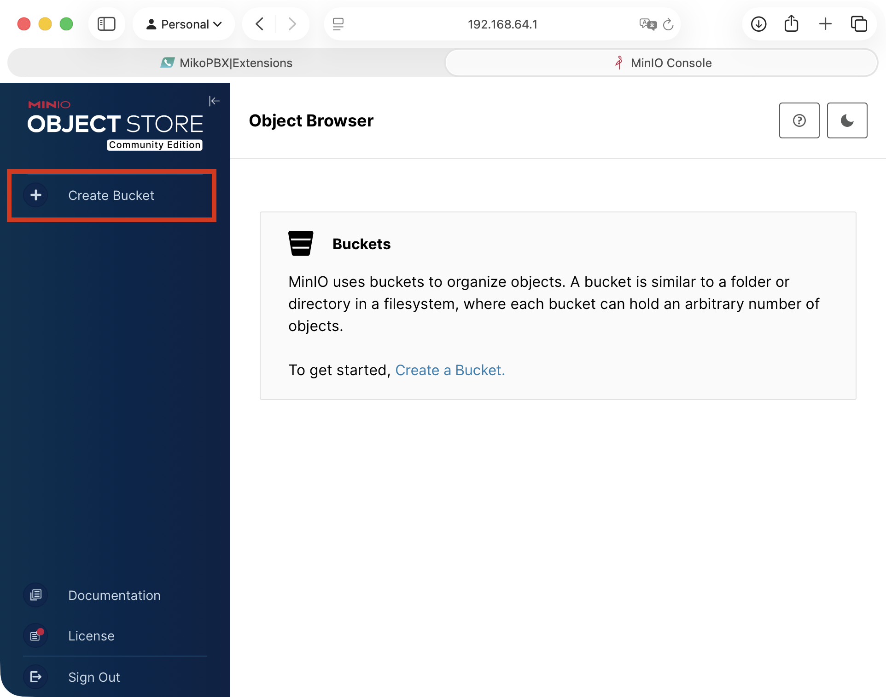
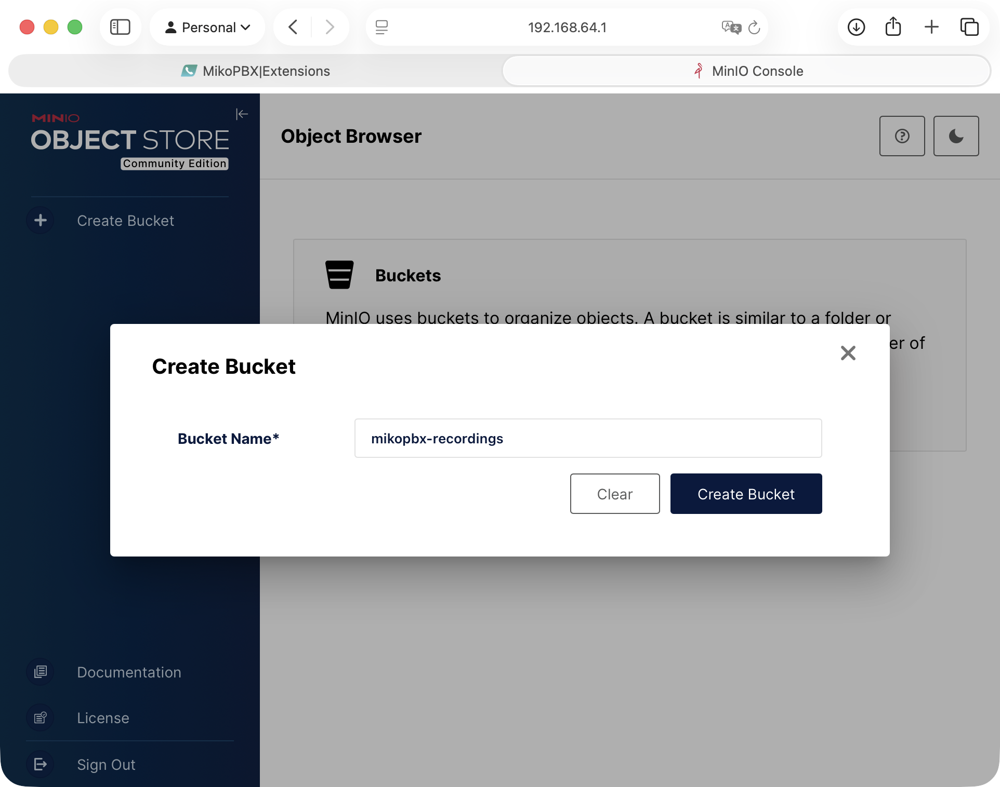
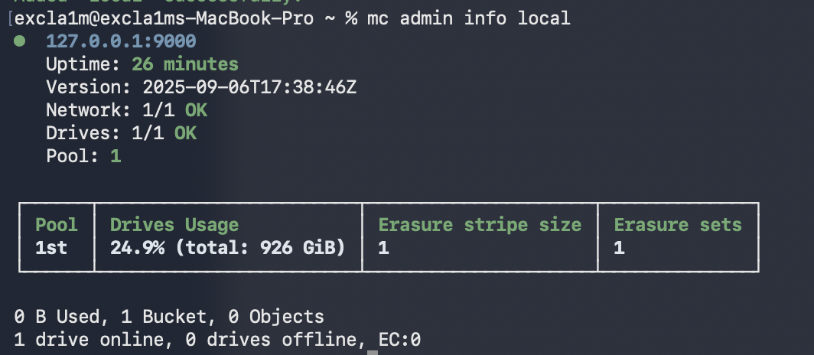
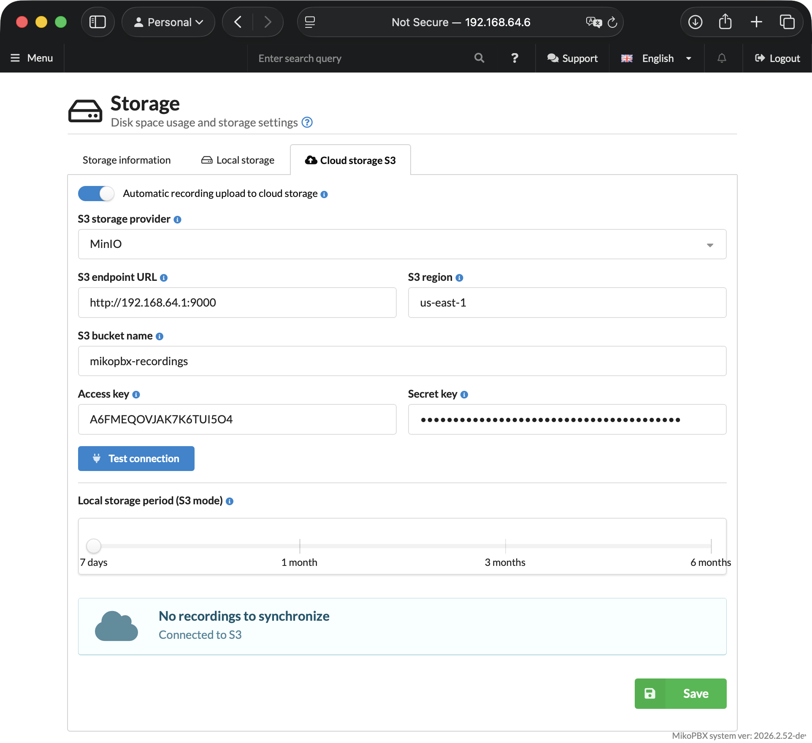
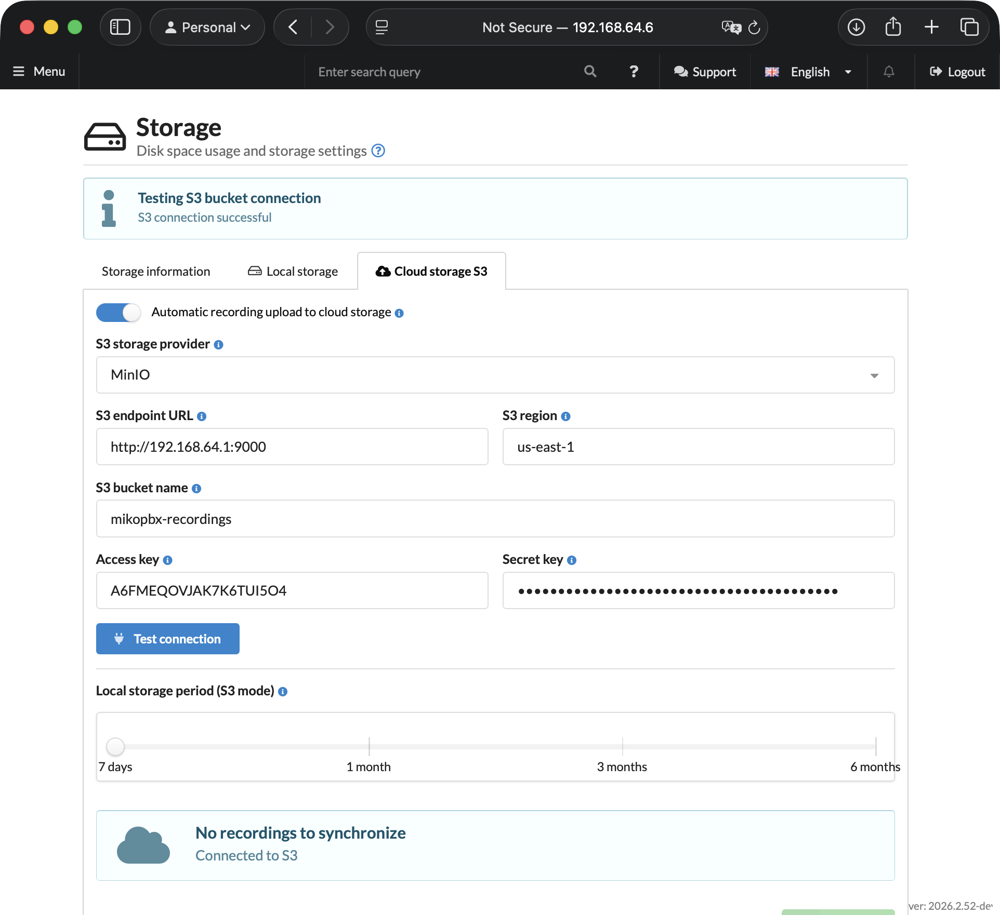

# Connecting MinIO S3 Storage (self-hosted)

This guide describes the process of deploying local MinIO S3 storage and connecting it to MikoPBX. All actions are performed on macOS - for other operating systems, the official documentation is available [at the link](https://docs.min.io/aistor/installation/).

### Installing MinIO on macOS

1. Open the terminal and run the command:

```bash
brew install minio/stable/minio
```

After the installation is complete, the terminal will display a confirmation:

```bash
🍺  /opt/homebrew/Cellar/minio/RELEASE.2025-09-06T17-38-46Z_1: 4 files, 108.2MB, built in 3 seconds
```

2. Create a directory for data.

```bash
mkdir -p ~/minio-data
```

3. Start the server:

```bash
MINIO_ROOT_USER=minioadmin MINIO_ROOT_PASSWORD=minioadmin \
  minio server ~/minio-data --console-address ":9001"
```

You will see the following output with useful information, including the WebUI address for convenient further work with the storage.

<pre class="language-bash"><code class="lang-bash">MinIO Object Storage Server
Copyright: 2015-2026 MinIO, Inc.
License: GNU AGPLv3 - https://www.gnu.org/licenses/agpl-3.0.html
Version: RELEASE.2025-09-06T17-38-46Z (go1.24.6 darwin/arm64)

API: http://192.168.100.114:9000  http://192.168.64.1:9000  http://127.0.0.1:9000
   RootUser: minioadmin
   RootPass: minioadmin

WebUI: <a data-footnote-ref href="#user-content-fn-1">http://192.168.100.114:9001 http://192.168.64.1:9001 http://127.0.0.1:9001</a>
   RootUser: minioadmin
   RootPass: minioadmin

CLI: https://docs.min.io/community/minio-object-store/reference/minio-mc.html#quickstart
   $ mc alias set 'myminio' 'http://192.168.100.114:9000' 'minioadmin' 'minioadmin'

Docs: https://docs.min.io
</code></pre>

After starting, leave the terminal window open - closing it will stop the server.

> To start MinIO automatically when the system starts, run:
>
> ```bash
> brew services start minio/stable/minio
> ```

4. Open a browser and go to the WebUI address.&#x20;

Enter the credentials:

* **Username:** `minioadmin`
* **Password:** `minioadmin`

<figure><figcaption><p>MinIO web interface</p></figcaption></figure>

### Creating a Bucket in MinIO

1. Click "**Create Bucket**" in the left menu.

<figure><figcaption><p>"Create Bucket" button in the MinIO web interface</p></figcaption></figure>

2. Enter a bucket name, for example `mikopbx-recordings`.

Click "**Create Bucket**".

<figure><figcaption><p>Specifying the name for the bucket being created</p></figcaption></figure>

To create an access key and configure access permissions, you will need the `mc` console utility.

Install MinIO Client:

```bash
brew install minio/stable/mc
```

After installation, check the version:

```bash
mc --version
```

### Connecting MinIO Client to the Local Server

Add the local MinIO server as an alias:

```bash
mc alias set local http://127.0.0.1:9000 minioadmin minioadmin
```


Parameters here:

* local - an arbitrary connection name
* http://127.0.0.1:9000 - MinIO API address.
* minioadmin - root user
* minioadmin - root password


Check the connection:

```bash
mc admin info local
```

If the connection is successful, information about the MinIO server will appear in the terminal.

<figure><figcaption><p>Information about the MinIO server</p></figcaption></figure>

### Creating a User and Bucket Access Policy

It is not recommended to use the MinIO root user for connecting external applications.&#x20;

1. Create a separate user for MikoPBX:


Replace `strong-password` with a strong password.


```bash
mc admin user add local mikopbx-user 'strong-password'
```

2. Create a policy file:

<pre class="language-bash"><code class="lang-bash">nano <a data-footnote-ref href="#user-content-fn-2">mikopbx-recordings</a>-policy.json
</code></pre>

3. Add the following content to it:

<pre class="language-json"><code class="lang-json">{
  "Version": "2012-10-17",
  "Statement": [
    {
      "Effect": "Allow",
      "Action": [
        "s3:ListBucket",
        "s3:GetBucketLocation"
      ],
      "Resource": [
        "arn:aws:s3:::<a data-footnote-ref href="#user-content-fn-2">mikopbx-recordings</a>"
      ]
    },
    {
      "Effect": "Allow",
      "Action": [
        "s3:PutObject",
        "s3:GetObject",
        "s3:DeleteObject"
      ],
      "Resource": [
        "arn:aws:s3:::<a data-footnote-ref href="#user-content-fn-2">mikopbx-recordings</a>/*"
      ]
    }
  ]
}
</code></pre>

4. Save the file:

```
Ctrl + O
Enter
Ctrl + X
```

5. Create the policy in MinIO:

```bash
mc admin policy create local mikopbx-recordings-rw mikopbx-recordings-policy.json
```

6. Attach the policy to the user:

```bash
mc admin policy attach local mikopbx-recordings-rw --user mikopbx-user
```

### Creating an Access Key for MikoPBX

Create an access key for the `mikopbx-user` user:

```bash
mc admin accesskey create local/ mikopbx-user
```

MinIO will display access data in response:

```bash
Access Key: A6FMEQOVJAK7K6TUI5O4
Secret Key: HuKLsNh7hmS+3xdLzlpYaFjxu5wVxLPkM8XUTgsj
Expiration: NONE
Name:
Description:
```

Save `Access Key` and `Secret Key`. They will be needed to connect MinIO to MikoPBX.

> Secret Key is displayed only when it is created.&#x20;

### Connecting to MikoPBX

1. Go to the **"Maintenance"** -> **"Storage"** tab.

<figure><figcaption><p>"Storage" section in the MikoPBX web interface</p></figcaption></figure>

2. Open the **"Cloud storage S3"** tab and fill in the following fields:

* **Automatic recording upload to cloud storage** - enable the switch.
* **S3 storage provider** - MinIO
* **S3 endpoint URL** - `http://192.168.64.1:9000`
* **S3 region** - leave `us-east-1` or enter any value (if you did not specify another one in the MinIO settings)
* **S3 bucket name** - specify the bucket name created in MinIO (`mikopbx-recordings` in this guide)
* **Access key** and **Secret key** - paste the values obtained in the previous part of this guide (key pair).

Configure the **"Local storage period (S3 mode)"** slider - choose how long recordings will be stored locally before being deleted after uploading to the cloud.


Shorter local storage frees up disk space faster.


Click **"Save"**.

<figure><figcaption><p>Parameters for connecting MinIO S3</p></figcaption></figure>

After saving the settings, click "**Test connection**". If the connection is successful, the message "**S3 connection successful**" will appear and synchronization of call recordings will begin.

<figure><figcaption><p>Successful connection to the S3 bucket</p></figcaption></figure>

[^1]: Addresses for access to the web interface

[^2]: Replace with the name of your bucket
