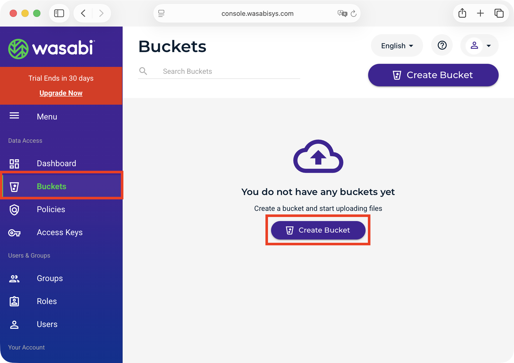
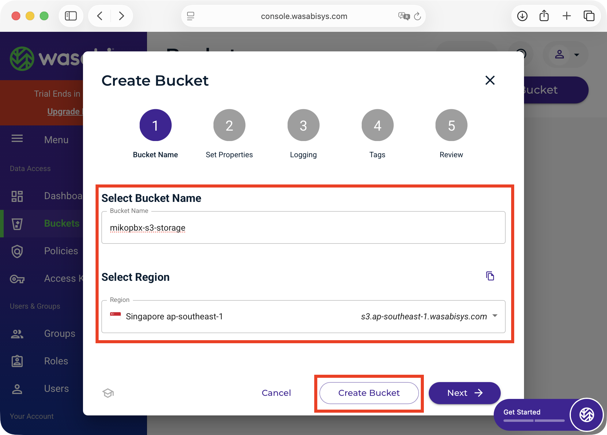
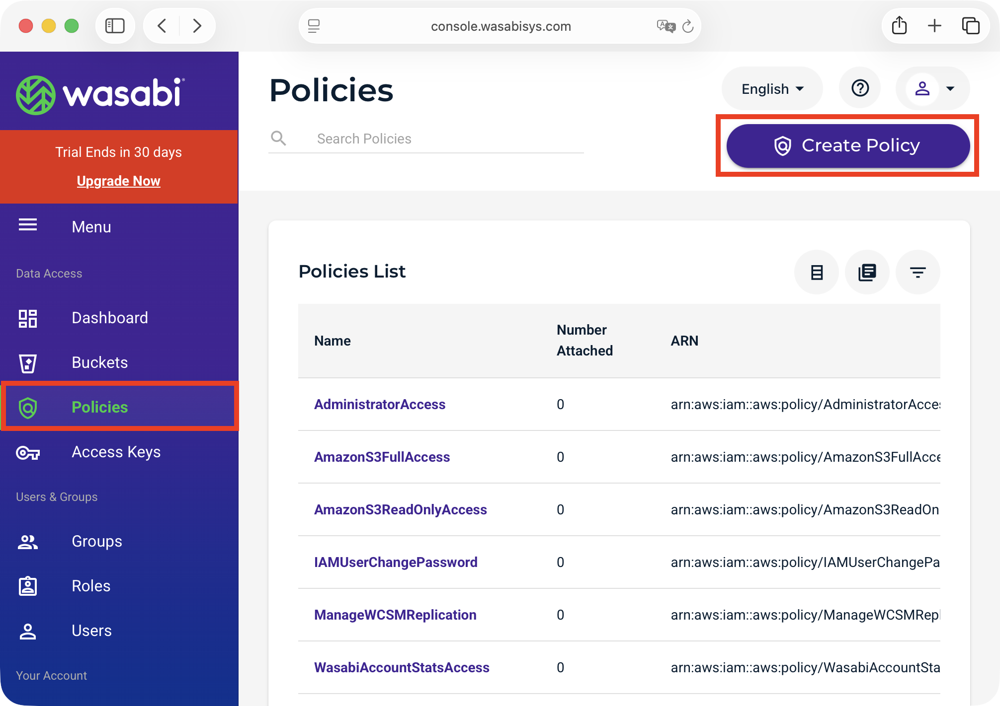
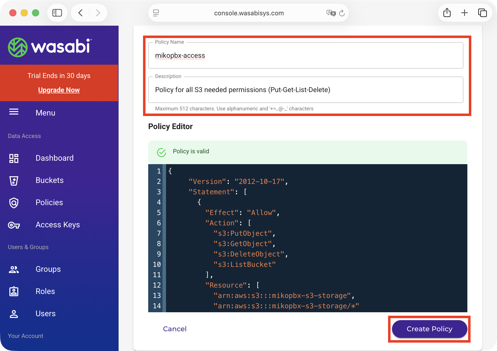
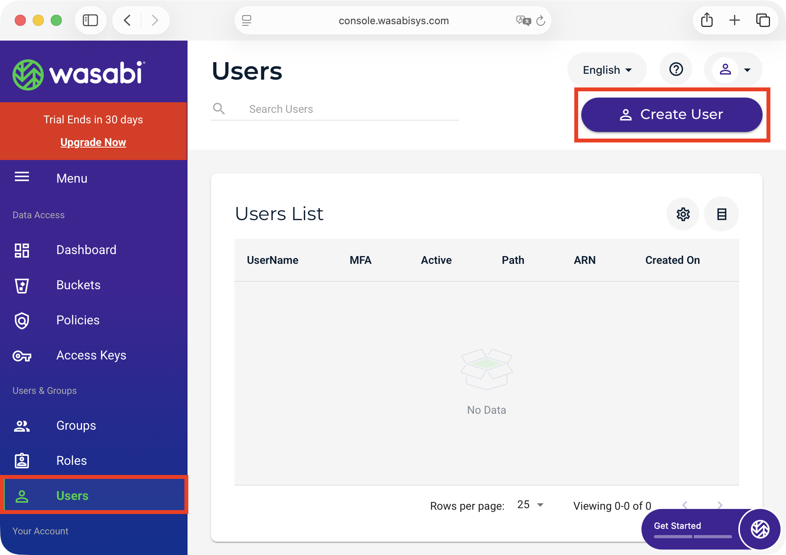
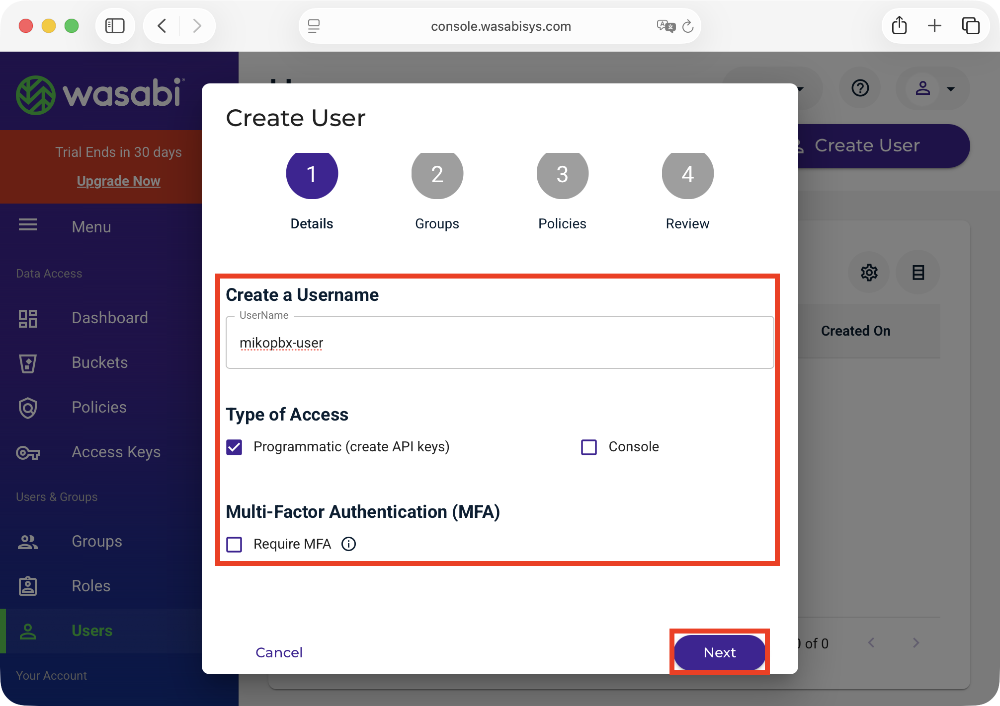
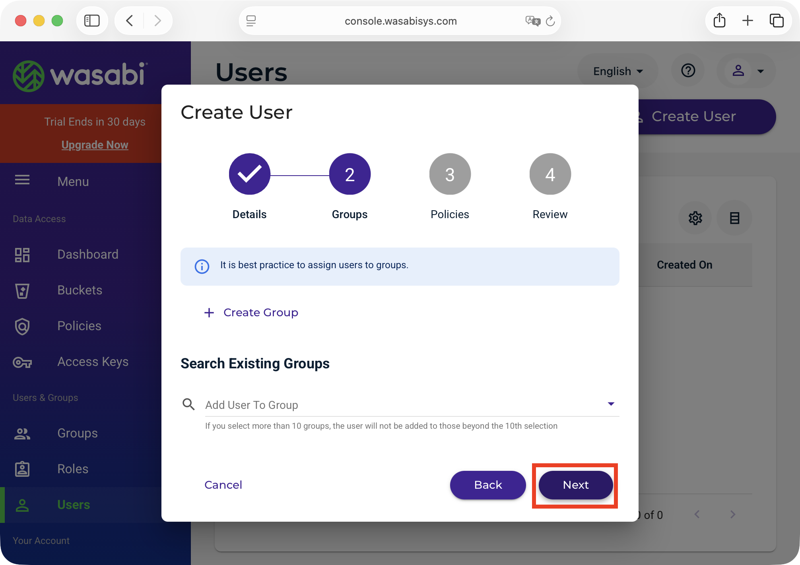
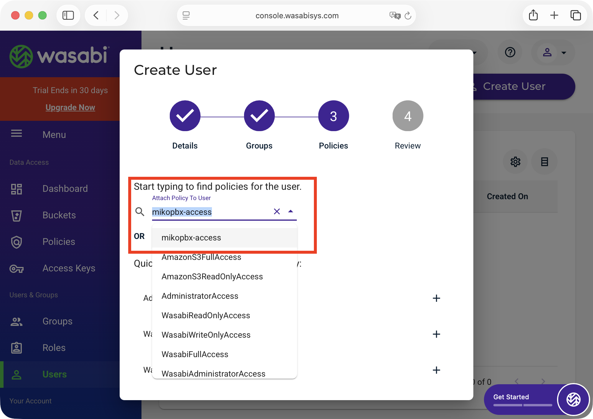
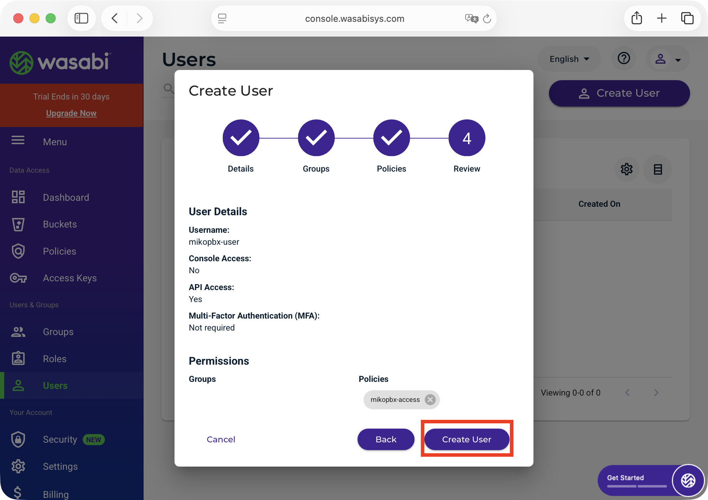
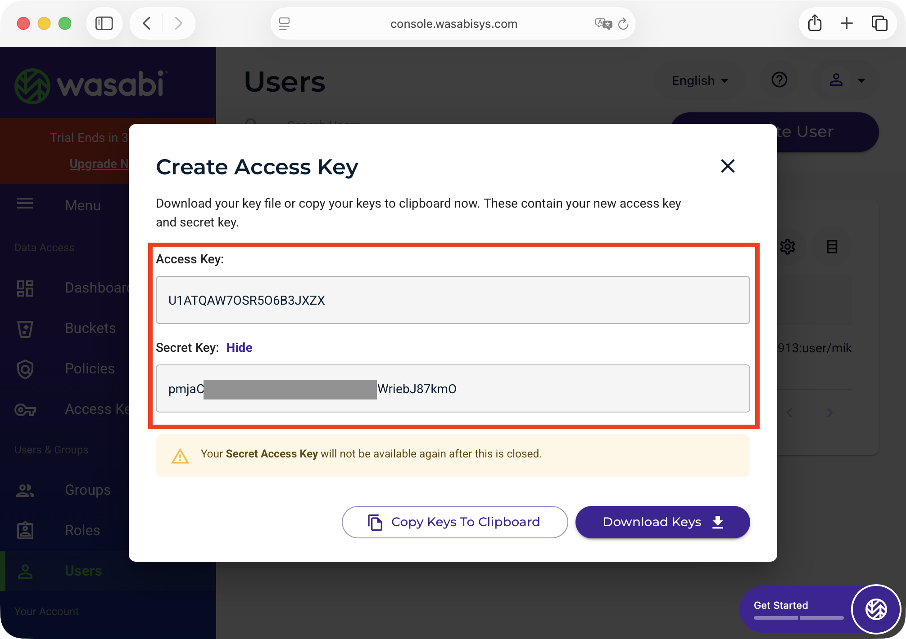

# Подключение S3 хранилища Wasabi (In dev)

### Создание бакета и ключей

1. Перейдите в консоль Wasabi ([ссылка](https://console.wasabisys.com/)).
2. В левом меню выберите раздел **"Buckets"** и нажмите кнопку **"Create Bucket"**.

<figure><figcaption><p>Создание нового бакета</p></figcaption></figure>

2. На странице создания бакета укажите:

* **Bucket Name** - произвольное уникальное имя для бакета (например, `mikopbx-s3-storage`).
* **Region** - выберите регион, ближайший к станции MikoPBX.


**Запомните название Вашего региона** (например, `ap-southest-1`), оно понадобится при настройке внутри MikoPBX.


Нажмите **"Create Bucket"**.

<figure><figcaption><p>Параметры создаваемого бакета</p></figcaption></figure>

3. После создания бакета необходимо создать политику доступа. Перейдите в раздел **"Policies"** в левом меню и нажмите **"Create Policy"**.

<figure><figcaption><p>Создание новой политики доступа</p></figcaption></figure>

4. Задайте название для создаваемой политики (**Policy Name**), придумайте ее описание для будущей идентификации (**Description**). В поле "**Policy Editor**" вставьте следующий набор правил:&#x20;

```json
{
  "Version": "2012-10-17",
  "Statement": [
    {
      "Effect": "Allow",
      "Action": [
        "s3:PutObject",
        "s3:GetObject",
        "s3:DeleteObject",
        "s3:ListBucket"
      ],
      "Resource": [
        "arn:aws:s3:::YOUR-BUCKET-NAME",
        "arn:aws:s3:::YOUR-BUCKET-NAME/*"
      ]
    }
  ]
}
```


Замените "YOUR-BUCKET-NAME" на название ранее созданного бакета (mikopbx-s3-storage в этой инструкции)


<figure><figcaption><p>Параметры создаваемой политики</p></figcaption></figure>

5. Перейдите в раздел **"Users"** в левом меню (блок "Users & Groups") и нажмите **"Create User"**.

<figure><figcaption><p>Создание нового пользователя</p></figcaption></figure>

6. На первом шаге "**Details"** заполните параметры:

* **UserName** - укажите произвольное имя пользователя (например, `mikopbx-user`).
* **Type of Access** - отметьте только **"Programmatic (create API keys)"**.
* **Require MFA** - оставьте выключенным.

Нажмите **"Next"**.

<figure><figcaption><p>Вкладка "Details" при создании пользователя</p></figcaption></figure>

7. На шаге **Groups** - пропустите, нажмите **"Next"**.

<figure><figcaption><p>Вкладка "Groups" при создании пользователя</p></figcaption></figure>

8. На шаге **Policies** — выберите политику, созданную ранее (например, `mikopbx-access` в этой инструкции), и нажмите **"Next"**.

<figure><figcaption><p>Вкладка "Policies" при создании пользователя</p></figcaption></figure>

9. На шаге **Review** проверьте параметры и нажмите **"Create User"**.

<figure><figcaption><p>Вкладка "Review" при создании пользователя</p></figcaption></figure>

После создания пользователя будут отображены **Access Key** и **Secret Key**. **Сохраните эти значения, они понадобятся для настройки внутри MikoPBX.** <mark style="color:$warning;">Secret Key показывается только один раз</mark>.

<figure><figcaption><p>Access Key и Secret Key</p></figcaption></figure>

### Список регионов Wasabi

| Регион                     | Endpoint URL                              |
| -------------------------- | ----------------------------------------- |
| us-east-1 (N. Virginia)    | `https://s3.wasabisys.com`                |
| us-east-2 (N. Virginia)    | `https://s3.us-east-2.wasabisys.com`      |
| us-west-1 (Oregon)         | `https://s3.us-west-1.wasabisys.com`      |
| eu-central-1 (Amsterdam)   | `https://s3.eu-central-1.wasabisys.com`   |
| eu-central-2 (Frankfurt)   | `https://s3.eu-central-2.wasabisys.com`   |
| eu-west-1 (London)         | `https://s3.eu-west-1.wasabisys.com`      |
| eu-west-2 (Paris)          | `https://s3.eu-west-2.wasabisys.com`      |
| ap-northeast-1 (Tokyo)     | `https://s3.ap-northeast-1.wasabisys.com` |
| ap-northeast-2 (Osaka)     | `https://s3.ap-northeast-2.wasabisys.com` |
| ap-southeast-1 (Singapore) | `https://s3.ap-southeast-1.wasabisys.com` |
| ap-southeast-2 (Sydney)    | `https://s3.ap-southeast-2.wasabisys.com` |
