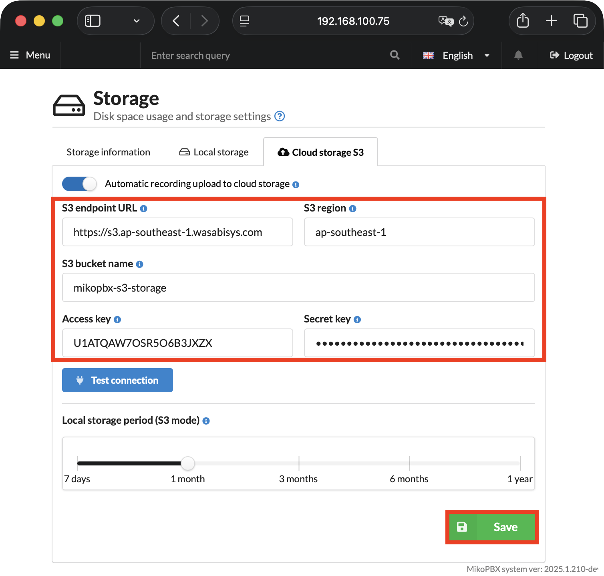
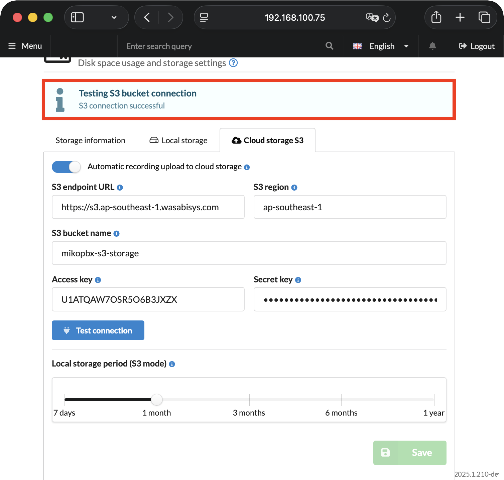

# Connecting Wasabi S3 Storage

### Creating a Bucket and Access Keys

1. Go to the Wasabi console ([link](https://console.wasabisys.com/)).
2. In the left menu, select **"Buckets"** and click **"Create Bucket"**.

<figure><figcaption><p>Creating a new bucket</p></figcaption></figure>

3. On the bucket creation page, specify:

* **Bucket Name** — enter any unique name for the bucket (e.g., `mikopbx-s3-storage`).
* **Region** — select the region closest to your MikoPBX server.


**Remember your region name** (e.g., `ap-southeast-1`), as you will need it when configuring MikoPBX.


Click **"Create Bucket"**.

<figure><figcaption><p>Bucket configuration parameters</p></figcaption></figure>

4. After creating the bucket, you need to create an access policy. Go to **"Policies"** in the left menu and click **"Create Policy"**.

<figure><figcaption><p>Creating a new access policy</p></figcaption></figure>

5. Enter a name for the policy (**Policy Name**) and a description for future identification (**Description**). In the **"Policy Editor"** field, paste the following set of rules:

```json
{
  "Version": "2012-10-17",
  "Statement": [
    {
      "Effect": "Allow",
      "Action": [
        "s3:PutObject",
        "s3:GetObject",
        "s3:DeleteObject",
        "s3:ListBucket"
      ],
      "Resource": [
        "arn:aws:s3:::YOUR-BUCKET-NAME",
        "arn:aws:s3:::YOUR-BUCKET-NAME/*"
      ]
    }
  ]
}
```


Replace "YOUR-BUCKET-NAME" with the name of the bucket you created earlier (e.g., `mikopbx-s3-storage` in this guide).


<figure><figcaption><p>Access policy configuration parameters</p></figcaption></figure>

6. Go to **"Users"** in the left menu (under "Users & Groups") and click **"Create User"**.

<figure><figcaption><p>Creating a new user</p></figcaption></figure>

7. On the first step **"Details"**, fill in the following parameters:

* **UserName** — enter any username (e.g., `mikopbx-user`).
* **Type of Access** — check only **"Programmatic (create API keys)"**.
* **Require MFA** — leave disabled.

Click **"Next"**.

<figure><figcaption><p>"Details" tab when creating a user</p></figcaption></figure>

8. On the **Groups** step — skip it and click **"Next"**.

<figure><figcaption><p>"Groups" tab when creating a user</p></figcaption></figure>

9. On the **Policies** step — select the policy you created earlier (e.g., `mikopbx-access` in this guide) and click **"Next"**.

<figure><figcaption><p>"Policies" tab when creating a user</p></figcaption></figure>

10. On the **Review** step, verify the parameters and click **"Create User"**.

<figure><figcaption><p>"Review" tab when creating a user</p></figcaption></figure>

After the user is created, the **Access Key** and **Secret Key** will be displayed. **Save these values — you will need them to configure MikoPBX.** <mark style="color:$danger;">The Secret Key is shown only once</mark>.

<figure><figcaption><p>Access Key and Secret Key</p></figcaption></figure>

### Connecting to MikoPBX

1. Go to the **"Maintenance"** tab → **"Storage"**.

<figure><figcaption><p>"Storage" section in MikoPBX</p></figcaption></figure>

2. Switch to the **"S3 Cloud Storage"** tab and fill in the following fields:

* **Automatically upload recordings to cloud storage** — enable the toggle.
* **S3 endpoint URL** — enter the endpoint for your region from the table below.\
  For example, for region `eu-central-1`: `https://s3.eu-central-1.wasabisys.com`
* **S3 region** — specify the region of your Wasabi bucket (e.g., `eu-central-1`).
* **S3 bucket Name** — specify the name of the bucket created in Wasabi (e.g., `mikopbx-s3-storage`).
* **Access Key** and **Secret Key** — paste the values obtained when creating the Access Key.
* Configure the **"Local storage (S3 mode)"** slider — select how long recordings will be stored locally before being deleted after upload to the cloud.

Click **"Save"**.

<table><thead><tr><th width="222.34375">Region</th><th>Endpoing URL</th></tr></thead><tbody><tr><td>us-east-1 (N. Virginia)</td><td><code>https://s3.wasabisys.com</code></td></tr><tr><td>us-east-2 (N. Virginia)</td><td><code>https://s3.us-east-2.wasabisys.com</code></td></tr><tr><td>us-west-1 (Oregon)</td><td><code>https://s3.us-west-1.wasabisys.com</code></td></tr><tr><td>eu-central-1 (Amsterdam)</td><td><code>https://s3.eu-central-1.wasabisys.com</code></td></tr><tr><td>eu-central-2 (Frankfurt)</td><td><code>https://s3.eu-central-2.wasabisys.com</code></td></tr><tr><td>eu-west-1 (London)</td><td><code>https://s3.eu-west-1.wasabisys.com</code></td></tr><tr><td>eu-west-2 (Paris)</td><td><code>https://s3.eu-west-2.wasabisys.com</code></td></tr><tr><td>ap-northeast-1 (Tokyo)</td><td><code>https://s3.ap-northeast-1.wasabisys.com</code></td></tr><tr><td>ap-northeast-2 (Osaka)</td><td><code>https://s3.ap-northeast-2.wasabisys.com</code></td></tr><tr><td>ap-southeast-1 (Singapore)</td><td><code>https://s3.ap-southeast-1.wasabisys.com</code></td></tr><tr><td>ap-southeast-2 (Sydney)</td><td><code>https://s3.ap-southeast-2.wasabisys.com</code></td></tr></tbody></table>

<figure><figcaption><p>S3 Wasabi connection parameters</p></figcaption></figure>

After saving the settings, click **"Test Connection"**. If the connection is successful, the message **"S3 connection successful"** will appear and synchronization of call recordings will begin.

<figure><figcaption><p>Successful connection</p></figcaption></figure>
