# Подключение S3 хранилища Yandex Cloud

### Создание бакета

1. Перейдите в консоль Yandex Cloud ([ссылка](https://console.yandex.cloud/)).
2. Перейдите в раздел "**Все сервисы**" -> "**Object Storage**".

<figure>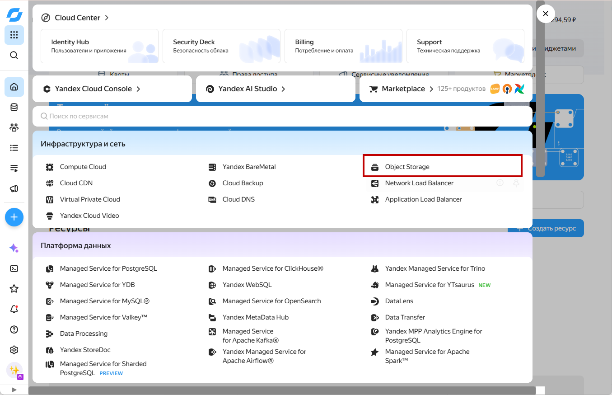<figcaption>
Раздел "Object Storage"
</figcaption></figure>

3. Нажмите "**Создать бакет**".

<figure>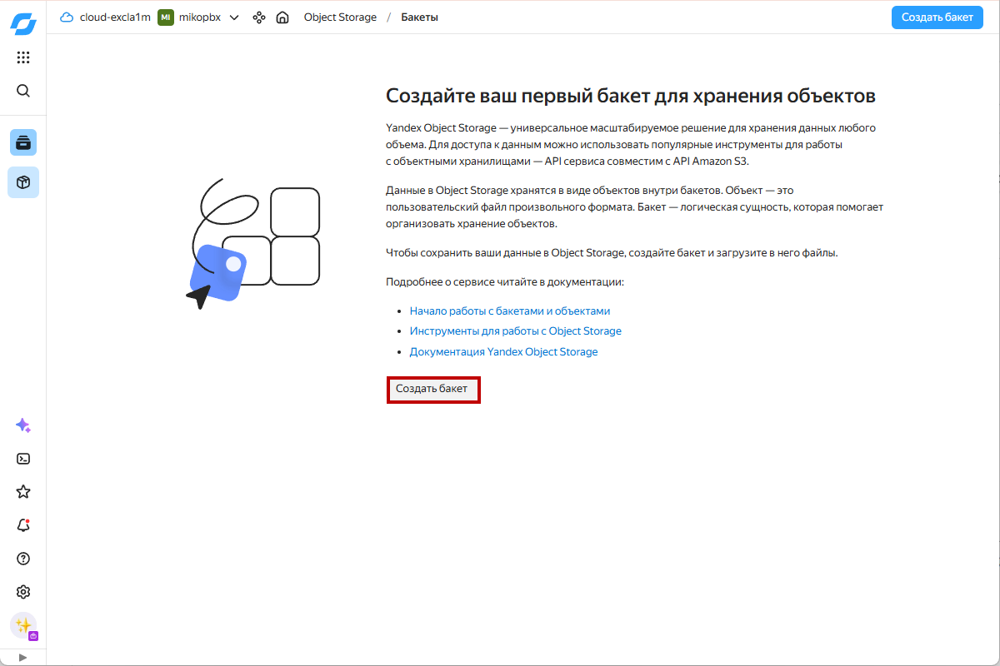<figcaption>
Кнопка "Создать бакет"
</figcaption></figure>

4. Заполните следующие параметры для создаваемого бакета:

* **Имя** — укажите название бакета (в нашем примере - `mikopbx-s3-storage`). Имя должно быть уникальным в рамках всего Yandex Cloud.
* **Макс. размер** — задайте максимальный объём бакета. Рекомендуется установить значение, соответствующее вашим потребностям (не менее 50 ГБ для рабочей станции), чтобы контролировать расход облачного пространства. Если ограничение не нужно — отметьте **«Без ограничения»**.
* **Доступ** — для всех трёх параметров (Чтение объектов, Чтение списка объектов, Чтение настроек) выберите значение **«С авторизацией»**.&#x20;

После заполнения всех параметров нажмите кнопку **«Создать бакет»**.

<figure>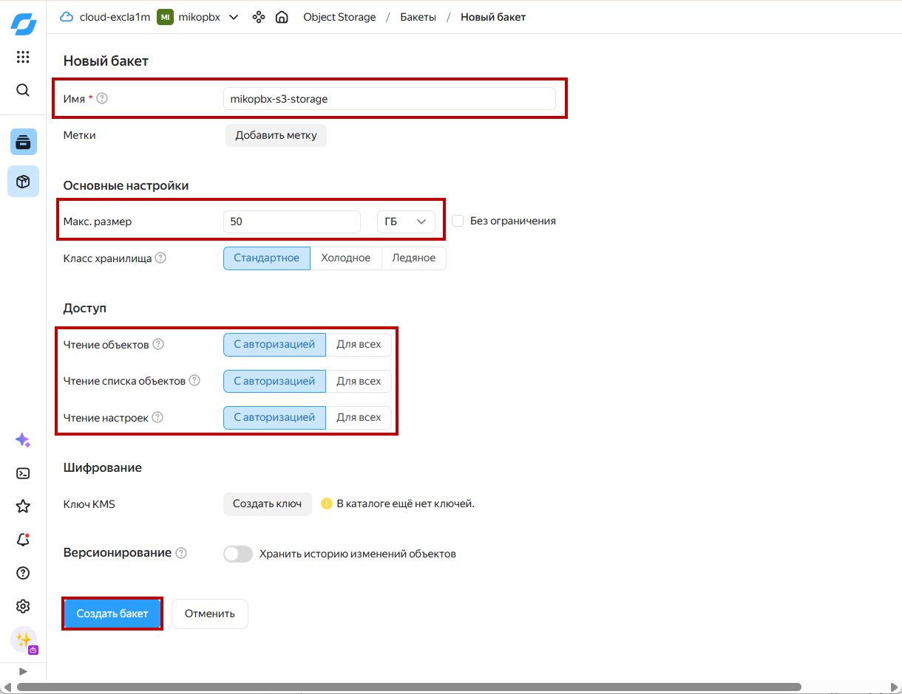<figcaption>
Параметры создаваемого бакета
</figcaption></figure>

### Создание сервисного аккаунта

1. Перейдите в раздел "**Все сервисы**" -> "**Identity and Access Management**".

<figure>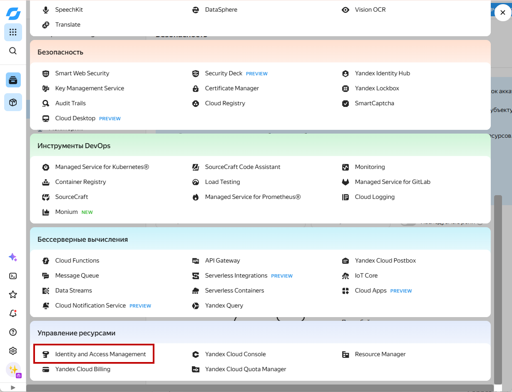<figcaption>
Раздел "<strong>Identity and Access Management</strong>"
</figcaption></figure>

2. Нажмите "**Создать сервисный аккаунт**".

<figure>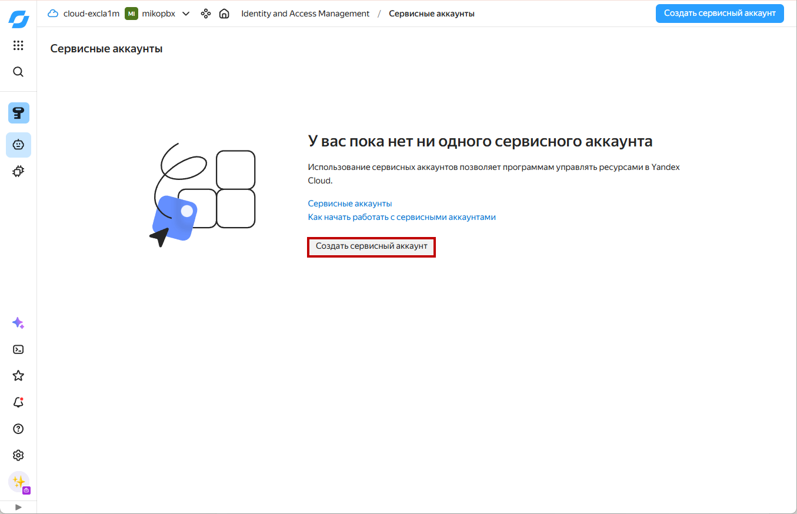<figcaption>
Кнопка "<strong>Создать сервисный аккаунт</strong>"
</figcaption></figure>

3. Укажите следующие параметры:

* **Имя** — введите название сервисного аккаунта (например, `mikopbx-s3-access`).
* **Роли в каталоге** — нажмите **«Добавить роль»**, в строке поиска введите `storage` и выберите роль **`storage.editor`**. Эта роль даёт необходимые права.

После заполнения параметров нажмите **«Создать»**.

<figure>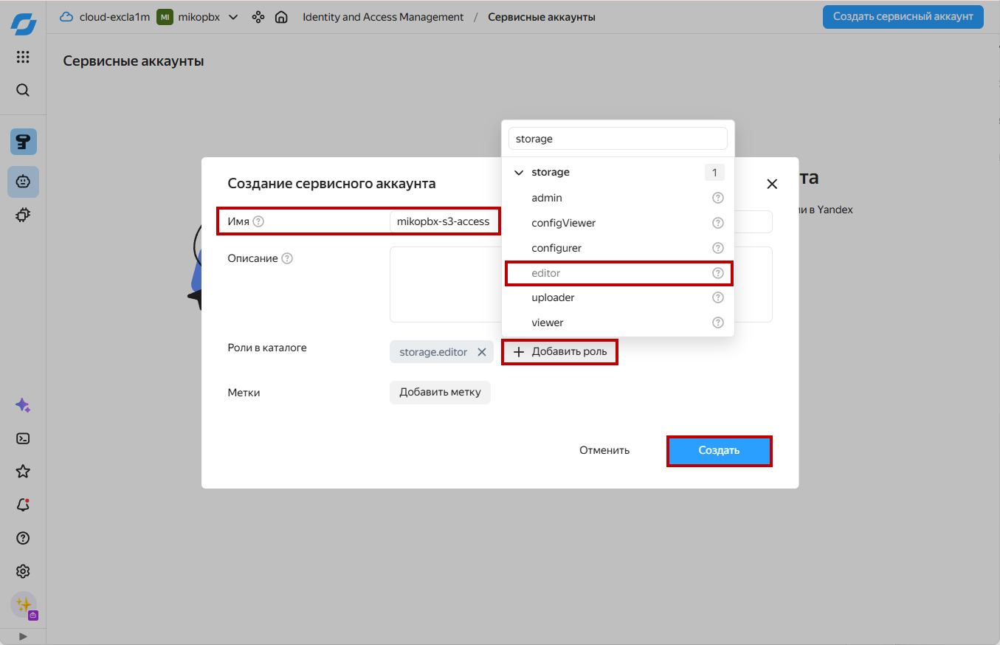<figcaption>
Параметры создаваемого сервисного аккаунта
</figcaption></figure>

4. Перейдите в дашбоард созданного сервисного аккаунта, нажав на его название.

<figure>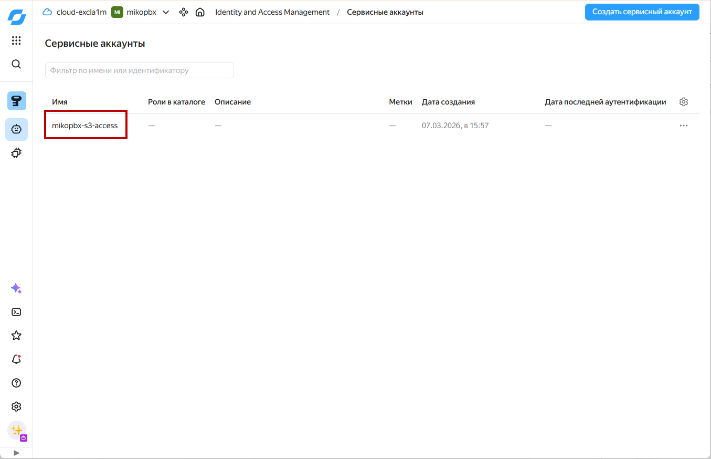<figcaption>
Созданный сервисный аккаунт
</figcaption></figure>

5. Нажмите "**Создать новый ключ**" -> "**Создать статический ключ доступа**".

<figure>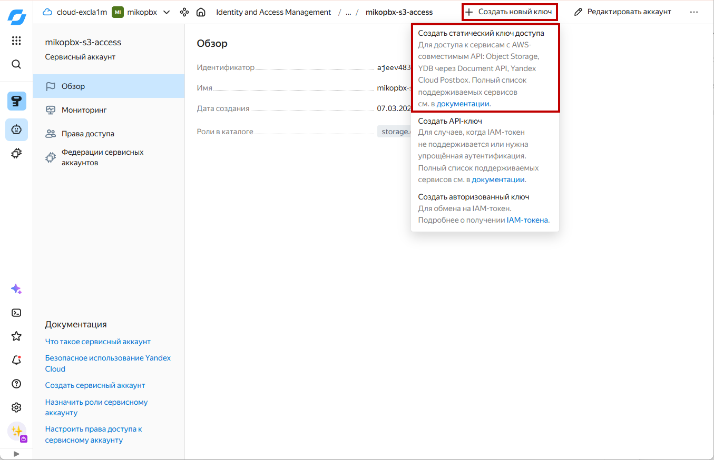<figcaption>
Создание нового ключа для сервисного аккаунта
</figcaption></figure>

6\. Введите описание для создаваемого ключа и нажмите "Создать".

<figure>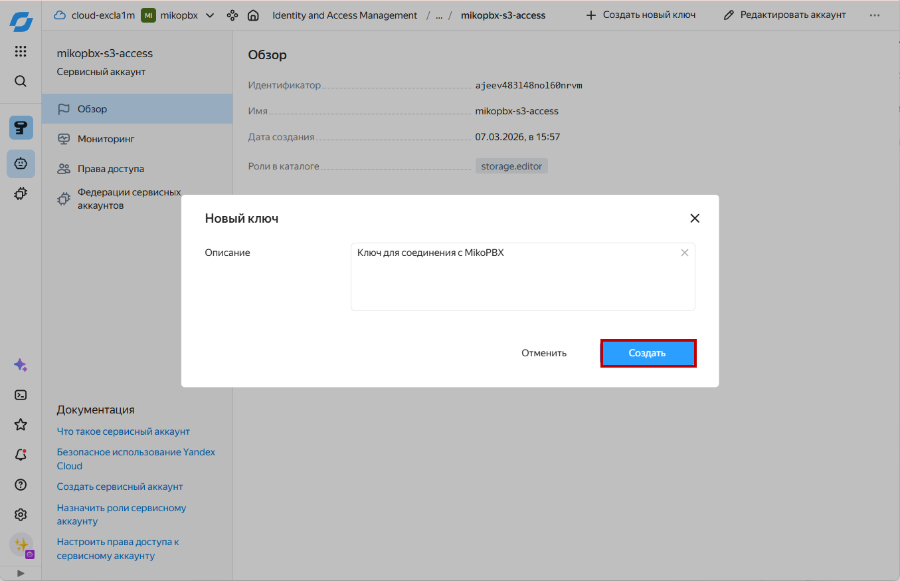<figcaption>
Описание создаваемого ключа
</figcaption></figure>

Будут отображены идентифкатор ключа и секретный ключ. Сохраните эти значения, они понадябтся позже для подключения хранилища к MikoPBX.


После закрытия диалога значение ключа будет недоступно.


<figure>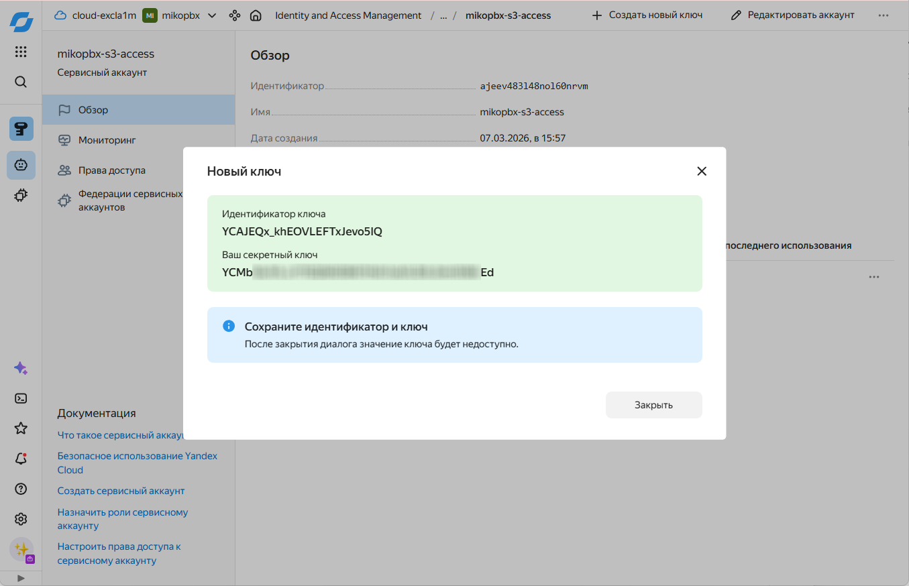<figcaption>
Созданный идентификатор и ключ
</figcaption></figure>

### Подключение к MikoPBX

1. Перейдите во вкладку "**Обслуживание**" -> "**Хранилище**".

<figure>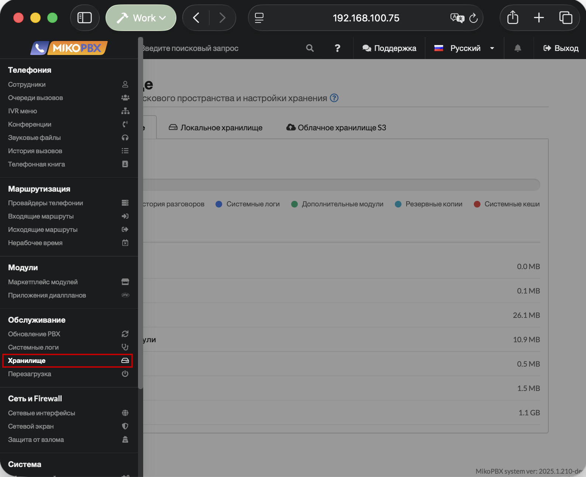<figcaption>
Раздел "<strong>Хранилище</strong>"
</figcaption></figure>

2. Перейдите на вкладку "**Облачное хранилище S3**" и заполните следующие поля:

* **Автоматическая загрузка записей в облачное хранилище** — включите переключатель.
* **URL точки доступа S3** — введите `https://storage.yandexcloud.net`
* **Регион S3** — укажите регион Вашего аккаунта в Yandex Cloud, в этой инструкции - `ru-central1`
* **Имя бакета S3** — укажите имя бакета, созданного в Яндекс Cloud (например, `mikopbx-s3-storage` в этой инструкции)
* **Ключ доступа** и **Секретный ключ** — вставьте значения, полученные при создании статического ключа сервисного аккаунта.

Настройте ползунок **«Локальное хранение (режим S3)»** — выберите, как долго записи будут храниться локально до удаления после выгрузки в облако.


Более короткое локальное хранение быстрее освобождает дисковое пространство.


Нажмите **«Сохранить»**.

<figure>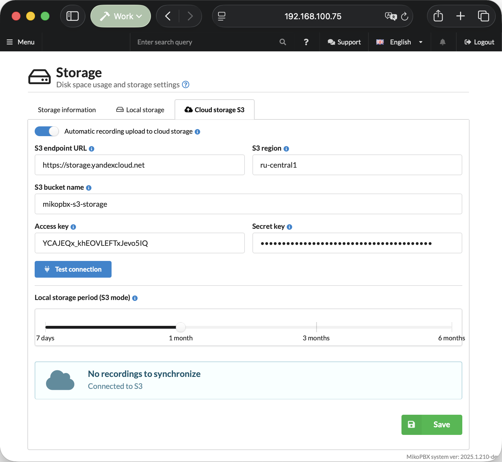<figcaption>
Параметры для подключения S3 Yandex Cloud
</figcaption></figure>

После сохранения настроек нажмите "Проверить соединение". При успешном подключении появится сообщение «**Подключено к S3**» и начнется синхронизация записей телефонных разговоров.

<figure>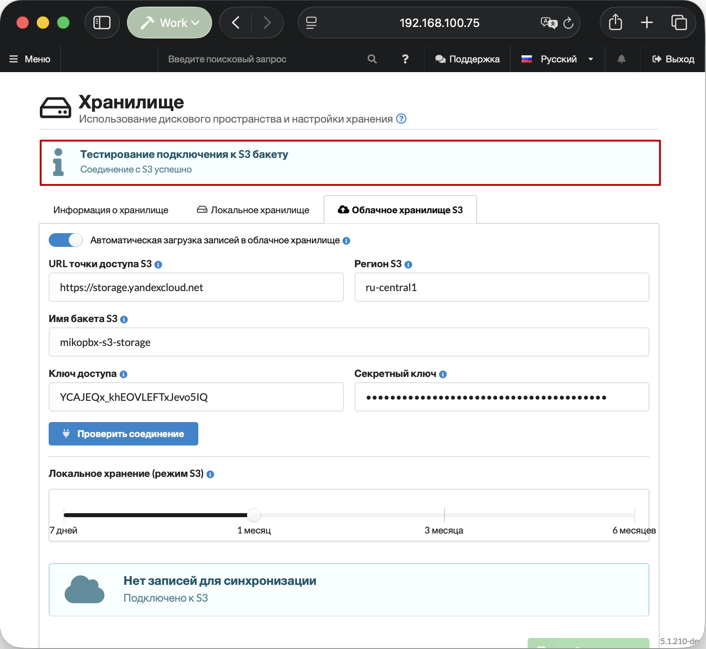<figcaption>
Успешное подключение
</figcaption></figure>
