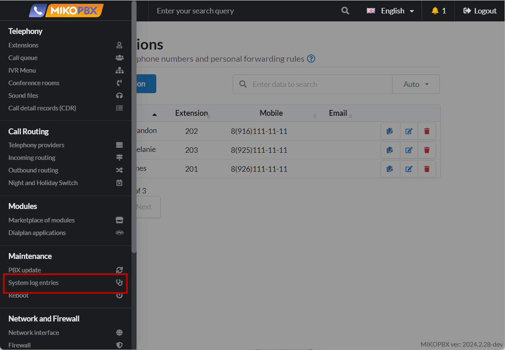
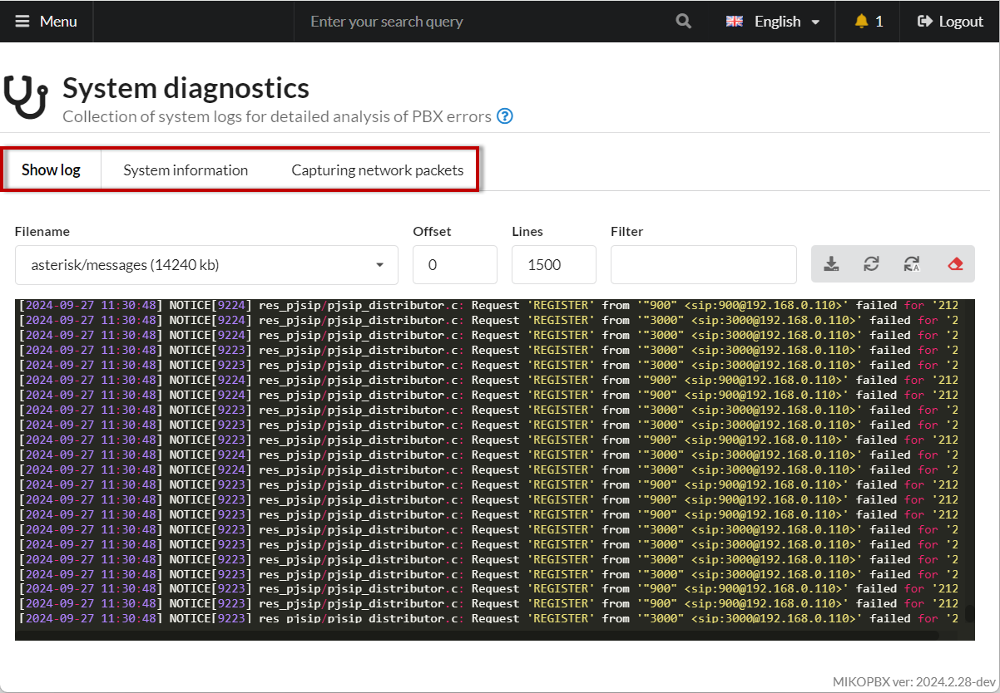
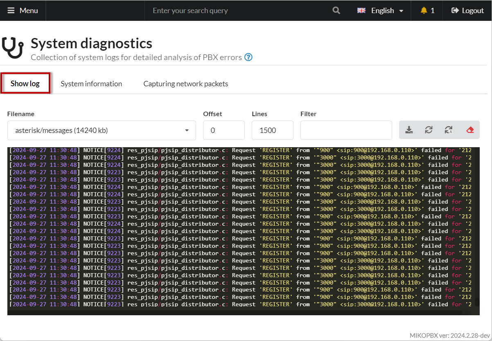
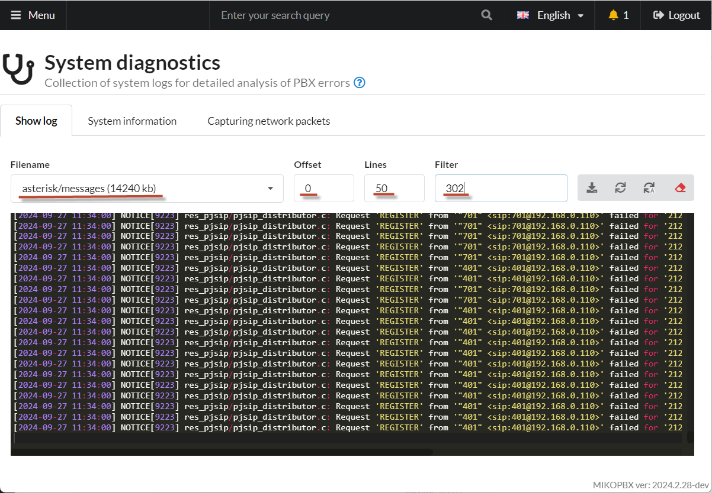
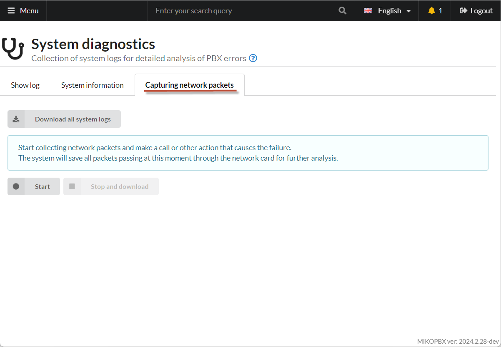
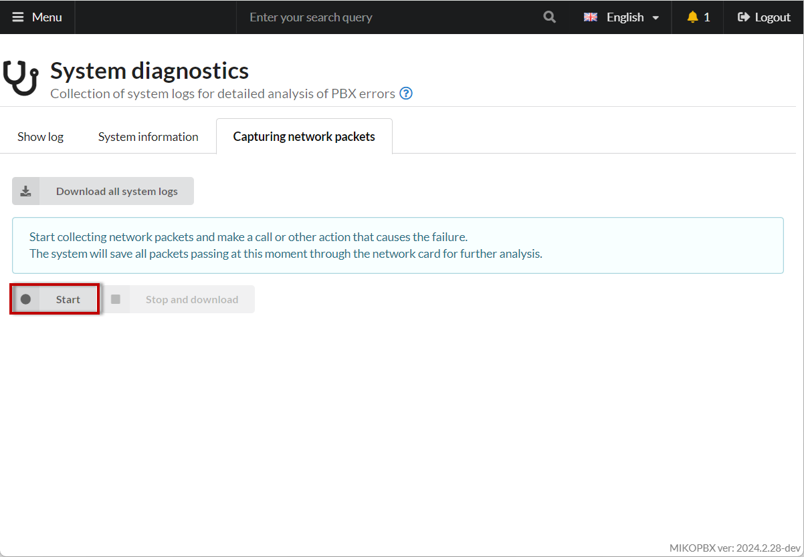
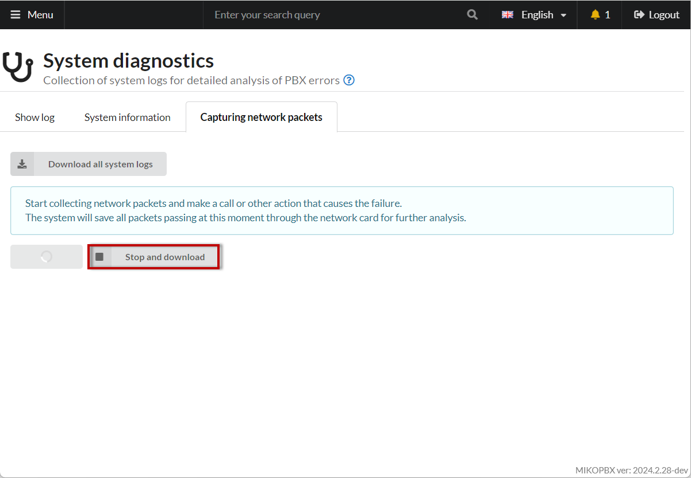
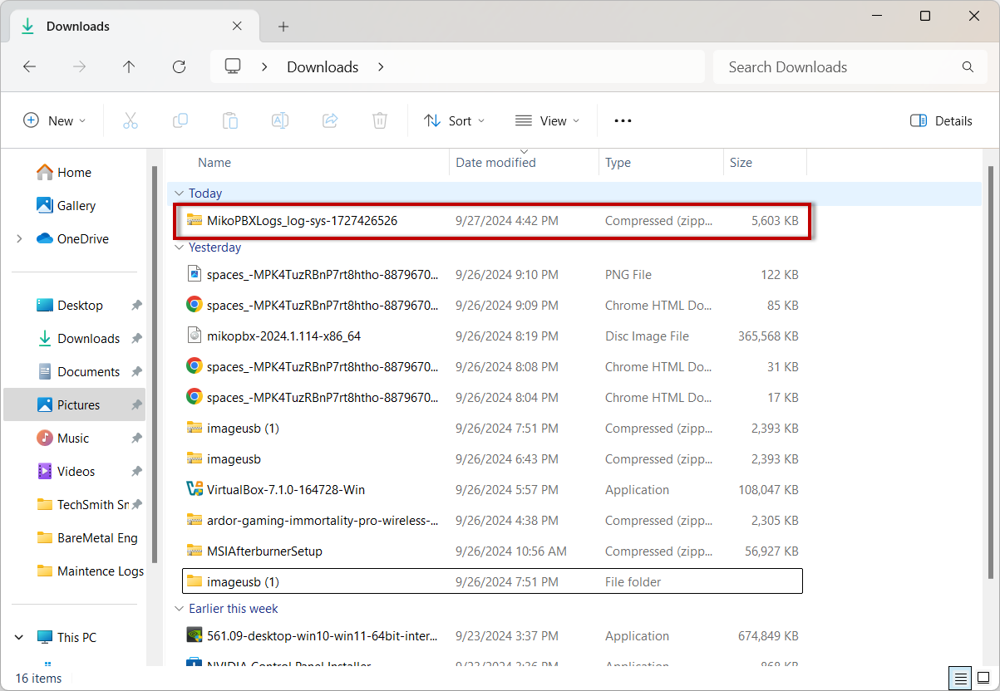
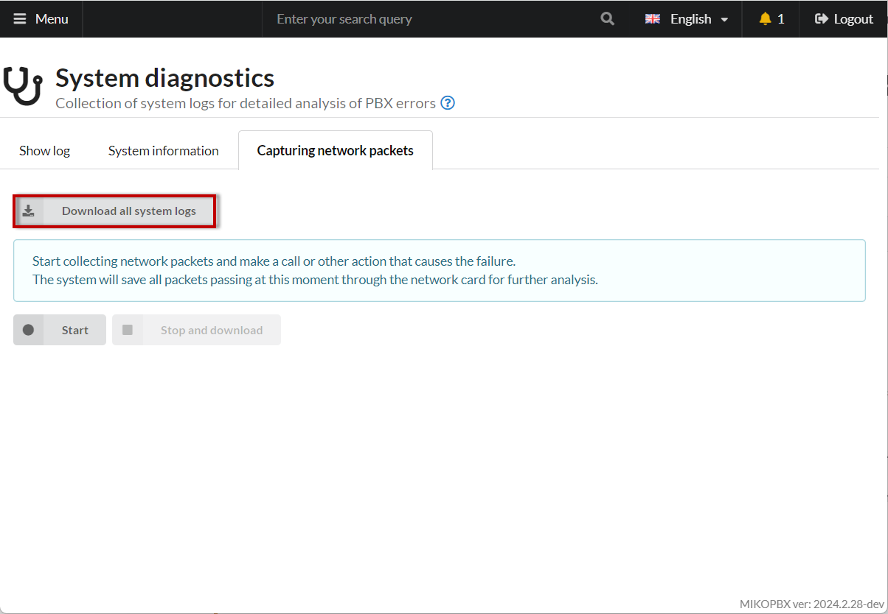

# System diagnostic

<figure><figcaption><p>System logs section</p></figcaption></figure>

Contains 3 tabs: _**Show log**_**, **_**System information**_**, **_**Capturing network packets**_.

<figure><figcaption><p>Three sections</p></figcaption></figure>

## Show log section <a href="#prosmotr_logov" id="prosmotr_logov"></a>

<figure><figcaption></figcaption></figure>

This section allows you to view log files for detailed analysis of PBX operations.

1. To start, select a **file**.
2. Set the **lines** for the number of lines to fetch.
3. Set the **offset** value to shift the selection.
4. Set the **filter** by entering a string to be included in the selection.

<figure><figcaption><p>Filters</p></figcaption></figure>

The following options are available:

1. **Download** the selected log as a file 
2. **Refresh** the log 
3. **Auto-refresh** the log 

### Example: Call Analysis <a href="#primer_analiz_zvonka" id="primer_analiz_zvonka"></a>

Suppose you need to analyze an outgoing call to the number **74952293042**.

1. Select the log file **asterisk/verbose**.
2. Set the phone number **74952293042** as the filter.
3. Set the **limit** to a sufficient value, such as **2000**, to ensure all log entries are included.
4. In the last line of the log selection, find the identifier:

```php
[2023-03-18 16:28:17] VERBOSE[21654][C-0000000f] app_stack.c: Spawn extension (SIP-1676196499-22-outgoing, 74952293042, 13) exited non-zero on 'PJSIP/302-0000001a'
```

5. In this example, the ID = **C-0000000f**.
6. Repeat the log query but use the filter **C-0000000f** this time.
7. You will receive the entire log of the dialplan process.
8. The obtained data can be sent to technical support for further assistance.

## System Information <a href="#informacija_o_sisteme" id="informacija_o_sisteme"></a>

<figure><figcaption><p>System information section</p></figcaption></figure>

The tab displays the following information:

* Network settings
* CPU load
* RAM usage
* iptables settings

### Campuring network packets <a href="#zaxvat_logov" id="zaxvat_logov"></a>

<figure><figcaption></figcaption></figure>

This section allows you to perform a detailed analysis of errors in PBX operation.

#### Capturing Network Packets

You can start capturing network packets passing through the network interface.

1. To start the process, press the **Start** button.

<figure><figcaption><p>"Start" button</p></figcaption></figure>

2. Reproduce your issue: make a call or perform an action that causes the error or failure.
3. Press the **Stop and Download** button.

<figure><figcaption><p>"Stop" button</p></figcaption></figure>

The network packets will automatically be saved in the archive **MikoPBXLogs\_log-tcpdump-XXXXXXXXXX**. They should also automatically save in your browser's **Downloads** folder.

<figure><figcaption></figcaption></figure>

If you cannot find the archive in the **Downloads** folder, you can [connect to the PBX via WinSCP](../../faq/troubleshooting/connecting-to-a-pbx-using-winscp.md) and download it from the **/storage/usbdisk1/mikopbx/tmp** directory - the file will be **log-tcpdump-XXXXXXXXXX.zip**.


You can use the search function in WinSCP by entering "**log-tcpdump\***" in the file name field and specifying the search directory as **"/storage"**&#x20;


#### **Download All System Logs**

You can download all system logs accumulated on the PBX. To do this, click the **Download All System Logs** button.

<figure><figcaption></figcaption></figure>

The system logs will automatically be saved in the archive **MikoPBXLogs\_log-sys-XXXXXXXXXX.zip**. The logs should also automatically save in your browser's **Downloads** folder.\
You can also obtain this log archive from the **/storage/usbdisk1/mikopbx/tmp** directory by connecting to the PBX using WinSCP. The file will be **log-sys-XXXXXXXXXX.zip**.


**Be careful**! If there are many calls or heavy network "load" on the PBX, logs can take up a significant amount of disk space.


Other ways to collect logs:

* Using an [SSH client](../../faq/troubleshooting/connecting-to-a-pbx-using-an-ssh-client.md)
* Using the [Wireshark utility](../../faq/troubleshooting/snyatie-loga-v-ats-s-pomoshyu-wireshark.md)
* Using the [tcpdump application](../../faq/troubleshooting/getting-logs-using-the-tcpdump-application.md)
