# Диагностика системы

<figure>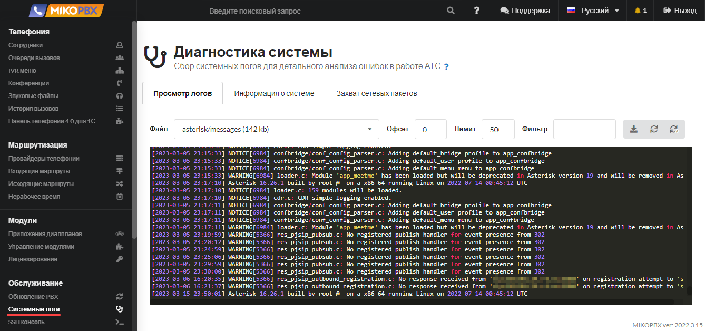<figcaption></figcaption></figure>

Содержит 3 вкладки: **просмотр логов, информация о системе, захват сетевых пакетов**.

<figure>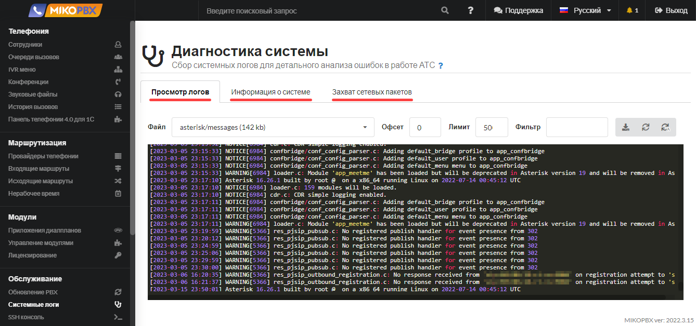<figcaption></figcaption></figure>

## Просмотр логов <a href="#prosmotr_logov" id="prosmotr_logov"></a>

<figure>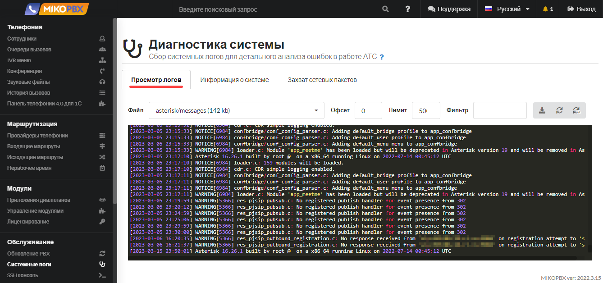<figcaption></figcaption></figure>

Раздел позволяет просмотреть файлы логов для детального анализа работы АТС

1. Для начала работы - выберите **файл**
2. Установите **лимит** строк для выборки
3. Установите **офсет -** значение сдвига в выборке
4. Установите **фильтр** по вхождению строки в выборку

<figure>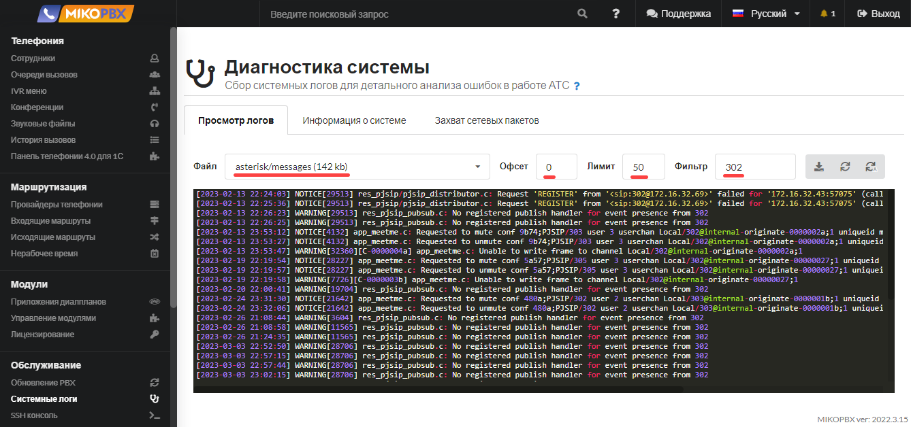<figcaption></figcaption></figure>

Доступны следующие возможности:&#x20;

1\. **Cкачать** полученную выборку в виде файла 

2\. **Обновить** выборку 

3\. **Автоматическое обновление** выборки 

### Пример. Анализ звонка <a href="#primer_analiz_zvonka" id="primer_analiz_zvonka"></a>

Допустим необходимо проанализировать прохождение исходящего звонка на номер **74952293042**

1. Выберите файл для анализа **asterisk/verbose**.
2. В качестве фильтра установите номер телефона **74952293042**.
3. В поле **лимит** укажите значение с запасом, к примеру **2000**, иначе могут быть выданы не все записи лога.
4. В последней строке выборке следует найти идентификатор:

```
[2023-03-18 16:28:17] VERBOSE[21654][C-0000000f] app_stack.c: Spawn extension (SIP-1676196499-22-outgoing, 74952293042, 13) exited non-zero on 'PJSIP/302-0000001a'
```

5. В данном примере ID = **C-0000000f**.
6. Повторяем запрос лога, но уже с фильтром **C-0000000f**.
7. Будет получен весь лог прохождения dialplan.
8. Полученные данные можно отправить специалисту технической поддержки.

## Информация о системе <a href="#informacija_o_sisteme" id="informacija_o_sisteme"></a>

<figure>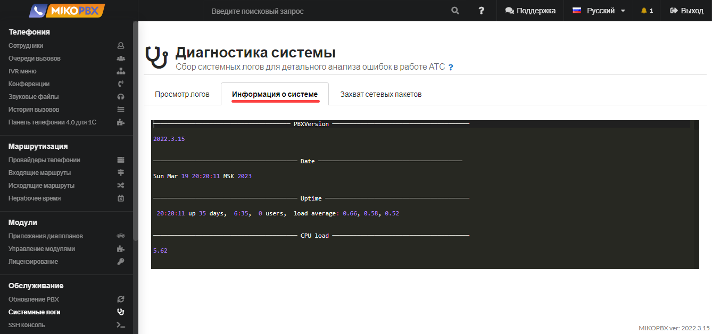<figcaption></figcaption></figure>

Вкладка отображает следующую информацию:

* Сетевые настройки
* Нагрузка на CPU
* Потребляемая оперативная память
* Настройки iptables

### Захват сетевых пакетов <a href="#zaxvat_logov" id="zaxvat_logov"></a>

<figure>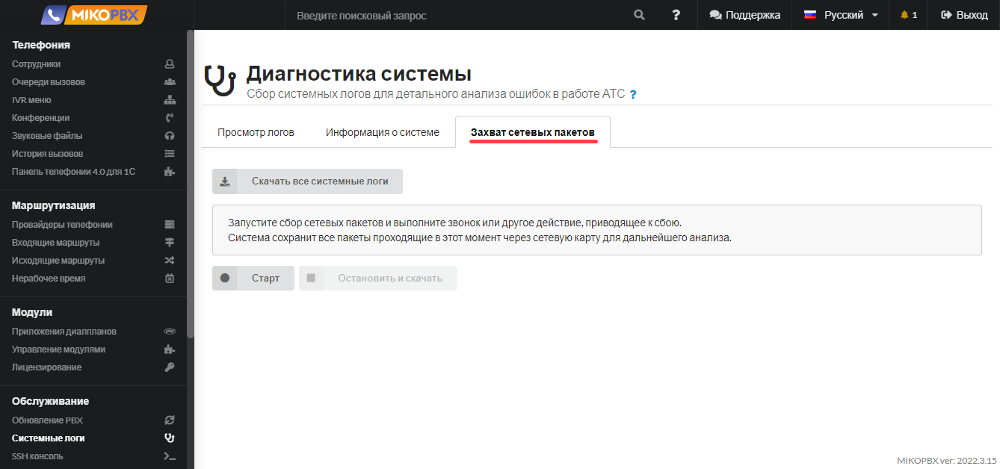<figcaption></figcaption></figure>

Данный раздел позволяет произвести детальный анализ ошибок в работе АТС.

#### Сбор сетевых пакетов

Вы можете запустить сбор сетевых пакетов, проходящих через сетевой интерфейс.

1. Для запуска процесса нажмите кнопку **Старт.**

<figure>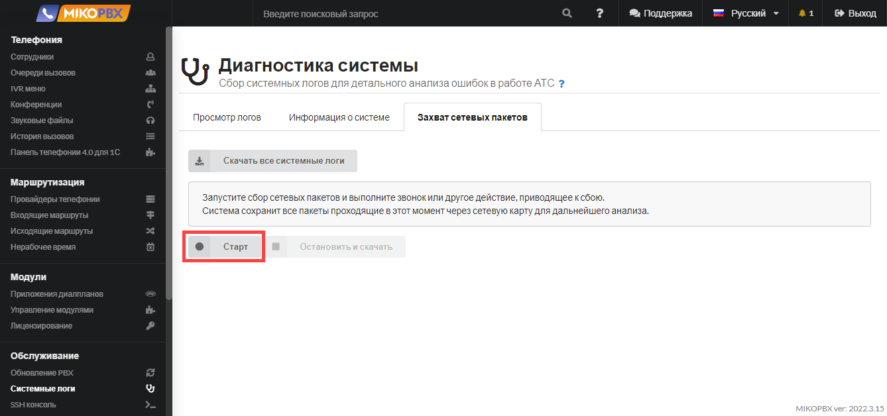<figcaption></figcaption></figure>

2. Воспроизведите вашу проблему: совершите звонок или иное действие, приводящее к сбою / ошибке.
3. Нажмите кнопку **Остановить и скачать**.

<figure>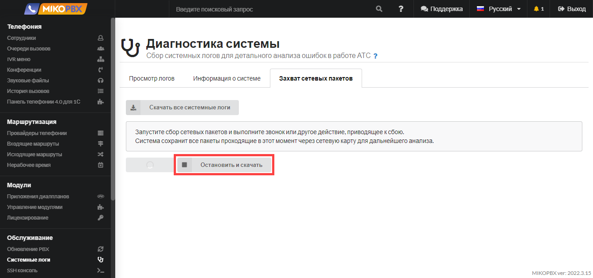<figcaption></figcaption></figure>

Сетевые пакеты будут автоматически сохранены в архив **MikoPBXLogs\_log-tcpdump-XXXXXXXXXX.** Также они должны автоматически сохраниться в папку **Загрузки** вашего браузера.&#x20;

<figure>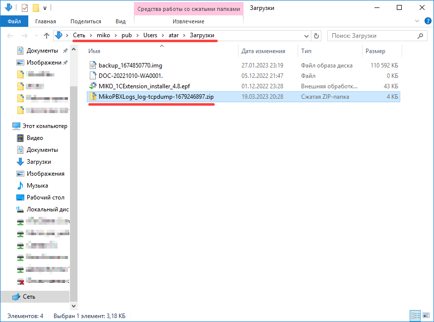<figcaption></figcaption></figure>

Если в папке **Загрузки** архив найти не удалось , можете [подключиться к АТС через WinSCP](../../faq/troubleshooting/podklyuchenie-k-ats-s-pomoshyu-winscp.md) и скачать его из директории **/storage/usbdisk1/mikopbx/tmp**  - файл **log-tcpdump-XXXXXXXXXX.zip**


Подсказка

Можете, воспользовавшись поиском в WinSCP, в поле имени искомого файла ввести "**log-tcpdump\*",** а в каталоге поиска ввести просто **"/storage**" 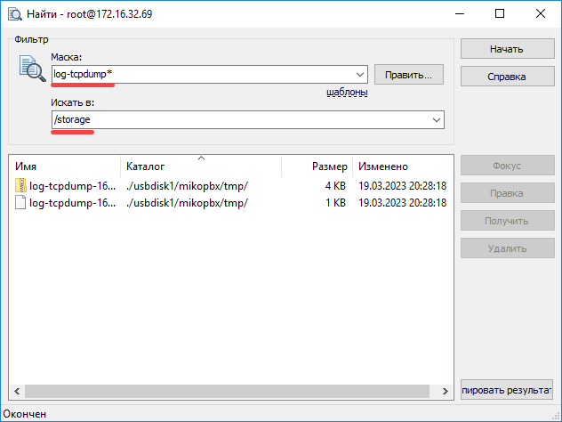


#### **Скачать все системные логи**

Вы можете скачать все накопленные на АТС системные логи. Для этого нажмите кнопку **Скачать все системные логи.**

<figure>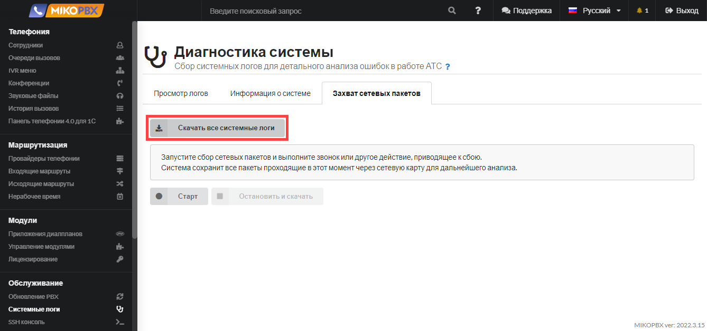<figcaption></figcaption></figure>

Системные логи будут автоматически сохранены в архив **MikoPBXLogs\_log-sys-XXXXXXXXXX.zip.** Логи автоматически должны сохраниться в папку **Загрузки** вашего браузера. \
Так же данный архив с логами можно получить из каталога **/storage/usbdisk1/mikopbx/tmp**, подключившись к АТС при помощи WinSCP. Файл - **log-sys-XXXXXXXXXX.zip**


**Будьте внимательны**! При большом объеме звонков или прочей сетевой «нагрузки» на АТС логи могут занять довольно много места на диске.


Другие способы снятия лога:

* С помощью [SSH-клиента](../../faq/troubleshooting/podklyuchenie-k-ats-s-pomoshyu-ssh-klienta.md)
* С помощью [утилиты Wireshark](../../faq/troubleshooting/snyatie-loga-v-ats-s-pomoshyu-wireshark.md)
* С помощью [приложения tcpdump](../../faq/troubleshooting/poluchenie-logov-s-pomoshyu-prilozheniya-tcpdump.md)
