# Обновление системы


Перед обновлением обязательно сделайте резервную копию настроек АТС. Делается это при помощи [**модуля резервного копирования**](backup.md).


## Обновление из web-интерфейса <a href="#obnovlenie_iz_web-interfejsa" id="obnovlenie_iz_web-interfejsa"></a>

В некоторых разделах интерфейса (например, **Сотрудники**) в правом нижнем углу указана текущая версия MikoPBX.

<figure><figcaption></figcaption></figure>

В web-интерфейсе АТС перейдите в **Обслуживание** → **Обновление PBX**.

<figure>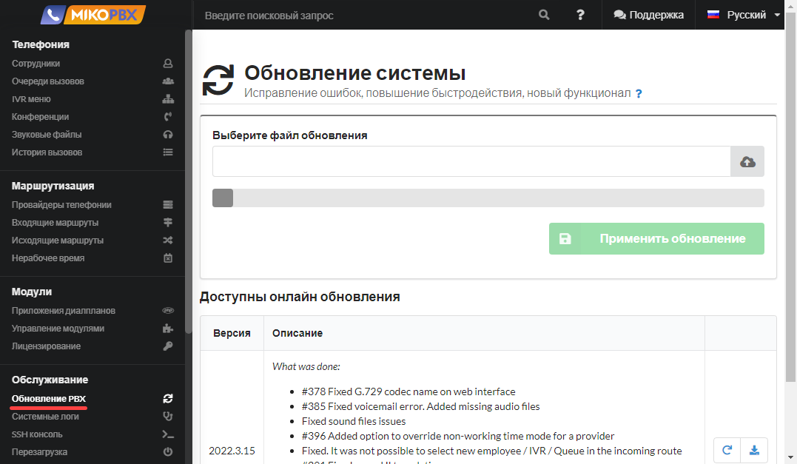<figcaption></figcaption></figure>

Если есть версии АТС новее вашей текущей, они будут отображены в таблице **Доступны онлайн обновления**, в которой в первом поле номер версии, а во втором - список изменений.


Рекомендуем проводить обновления последовательно, «не перепрыгивая» через релизы.


<figure>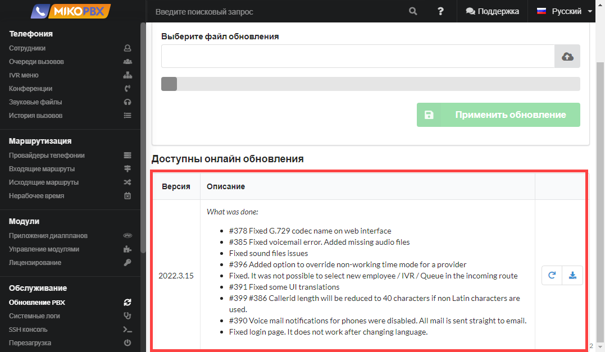<figcaption></figcaption></figure>

Далее возможны два варианта обновления: **обновление онлайн, обновление скачанным img-файлом**.

### Обновление онлайн


**Будьте внимательны**! Если система установлена на тот же диск, где хранятся записи разговоров, то могут быть сложности с обновлением. [см. форум](https://qa.askozia.ru/5061/%D0%BF%D1%80%D0%BE%D0%BF%D0%B0%D0%B4%D0%B0%D0%B5%D1%82-%D1%80%D0%B0%D0%B7%D0%B4%D0%B5%D0%BB-%D0%BF%D0%BE%D1%81%D0%BB%D0%B5-%D0%BE%D0%B1%D0%BD%D0%BE%D0%B2%D0%BB%D0%B5%D0%BD%D0%B8%D1%8F-%D0%BD%D0%B0-6-7-7-31)


Обновления загружаются на АТС и сразу же применяются.\
Для обновления таким способом нажмите кнопку  в нужной вам версии обновления.

<figure>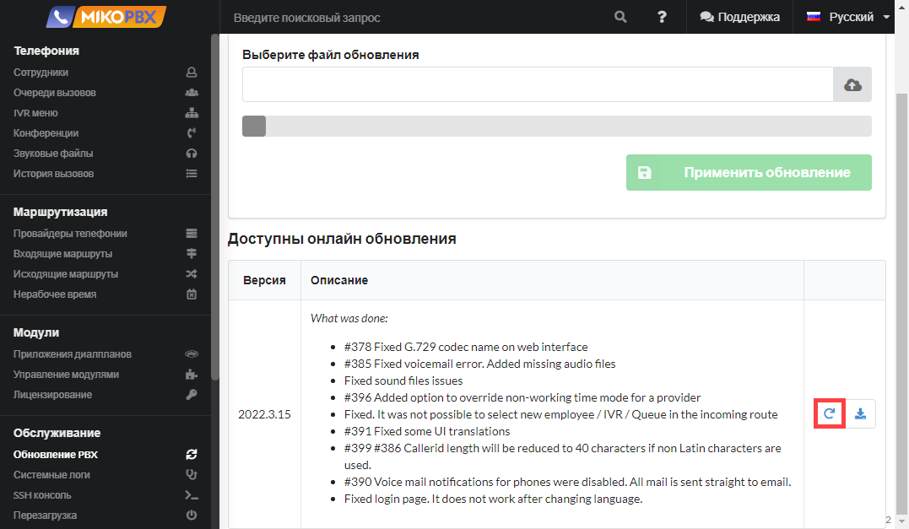<figcaption></figcaption></figure>

Появится окно предупреждения. Нажмите в нем **Обновить.**

<figure>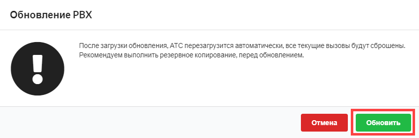<figcaption></figcaption></figure>

АТС загрузит и применит обновления, а затем перезагрузится.

### **Обновление скачанным img-файлом**


Следует сразу заметить, что данным способом можно выполнить не только обновление, но и откат на более прежнюю версию.


Для обновления данным способом нажмите кнопку  в нужной вам версии обновления.

<figure>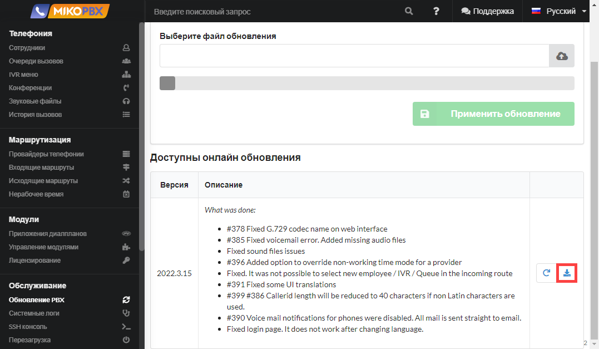<figcaption></figcaption></figure>

Начнется скачивание img-образа. Дождитесь завершения загрузки.

Затем нажмите кнопку  и выберите данный img-файл.

<figure>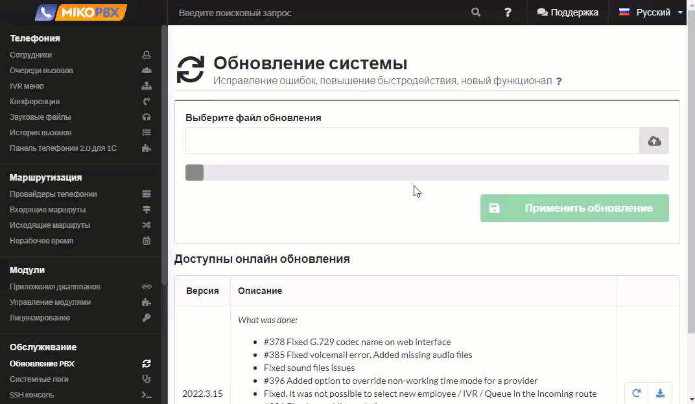<figcaption></figcaption></figure>

Затем нажмите **Применить обновление,** а в появившемся окне предупреждения нажмите **Обновить.**&#x20;

<figure>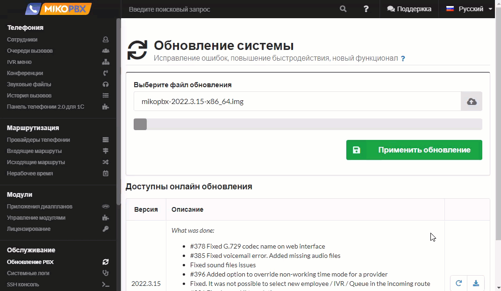<figcaption></figcaption></figure>

Начнется применение обновлений. После окончания которого АТС перезагрузится.

<figure>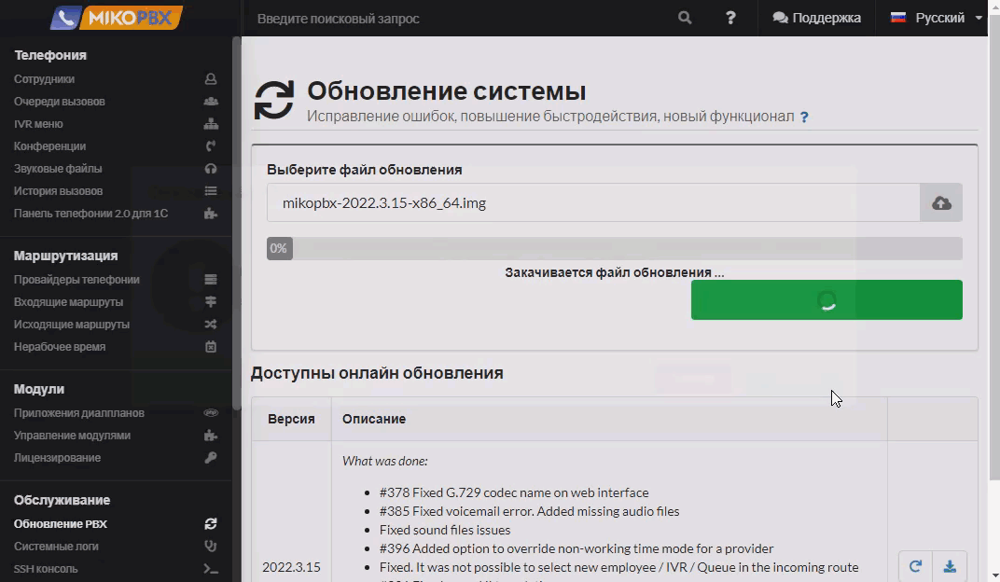<figcaption></figcaption></figure>

## Обновление из консоли MikoPBX <a href="#obnovlenie_iz_konsoli_mikopbx" id="obnovlenie_iz_konsoli_mikopbx"></a>

Ниже приведен пример с АТС, установленной на виртуальную машину VirtualBOX. Обновление производится с версии 2022.2.102 до версии 2022.3.15.\
Скачайте из [репозитория](https://github.com/mikopbx/Core/releases) iso-образ нужной вам версии АТС.

<figure><figcaption></figcaption></figure>

В программе VirtualBOX откройте настройки виртуальной машины на которой установлена АТС.\
Перейдите в раздел **Носители.**\
Выделите виртуальный оптический привод. \
Нажмите на значок  в группе **Атрибуты,** нажмите **Выбрать файл диска**.\
Выберите скачанный iso-образ АТС.\
Запустите машину.

<figure>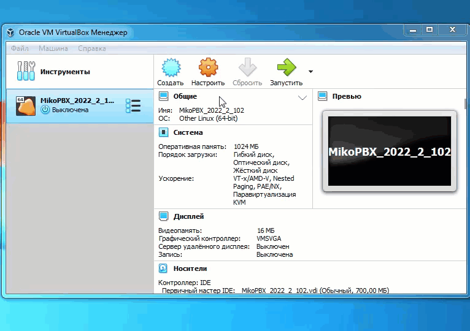<figcaption></figcaption></figure>

В консоли отобразится соответствующая строка "<mark style="color:red;">**The system loaded in Recovery mode**</mark>" («АТС загружена в режиме восстановления» на русском).

<figure>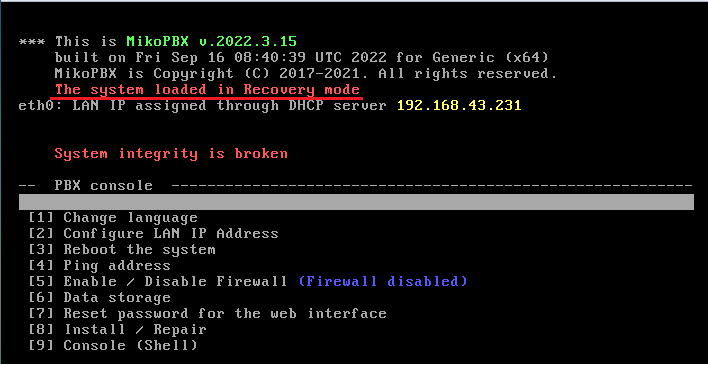<figcaption></figcaption></figure>

Выберите **Install / Repair** (или нажмите на клавиатуре цифру **8)** и нажмите «**Enter**».

Вам нужна команда "**Update to version \*\*\*\*.\*.\*\*".** Нажмите на клавиатуре цифру **2,** затем нажмите «**Enter**».\
Начнется установка обновления. Когда она завершится, АТС перезагрузится.

<figure>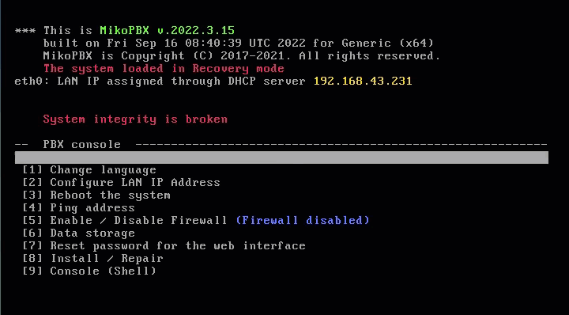<figcaption></figcaption></figure>

После перезагрузки АТС сообщения "<mark style="color:red;">**The system loaded in Recovery mode**</mark>" уже не будет, что означает, что АТС загрузилась с жесткого диска, а не с виртуального оптического привода.\
Вверху зеленым шрифтом будет обозначена установленная версия обновления.

<figure><figcaption></figcaption></figure>

## Обновление докер контейнера <a href="#docker-upgrade" id="docker-upgrade"></a>

\
Для обновления контейнера MikoPBX до последней версии, вы можете выполнить следующие шаги в командной строке. Эти шаги включают остановку текущего контейнера, скачивание новой версии образа и запуск контейнера с использованием обновлённого образа. Вот пример такого процесса:

#### Шаг 1: Остановка текущего контейнера

Для начала нужно корректно остановить работающий контейнер. Это позволяет избежать потери данных и гарантирует, что все процессы внутри контейнера завершатся правильно:

```bash
docker stop mikopbx
```

#### Шаг 2: Удаление текущего контейнера

После остановки контейнера его можно безопасно удалить. Удаление контейнера нужно для того, чтобы можно было запустить новый экземпляр с новыми настройками и образом:

```bash
docker rm mikopbx
```

#### Шаг 3: Скачивание последней версии образа

Следующий шаг — это скачивание последней версии образа MikoPBX. Использование тега `latest` обеспечивает получение самой свежей версии:

```bash
docker pull ghcr.io/mikopbx/mikopbx-x86-64:latest
```

#### Шаг 4: Запуск нового контейнера с обновлённым образом

Наконец, запускаем новый контейнер с использованием последней версии образа и теми же настройками, что и ранее (включая монтирование томов и прочие параметры сети):

```bash
docker run --cap-add=NET_ADMIN --net=host --name mikopbx --hostname mikopbx \
  -v mikopbx_cf:/cf \
  -v mikopbx_storage:/storage \ 
  -e SSH_PORT=23 \ 
  -e ID_WWW_USER="$(id -u www-user)" \ 
  -e ID_WWW_GROUP="$(id -g www-user)" \ 
  -it -d --restart always ghcr.io/mikopbx/mikopbx-x86-64:latest
```

#### Примечания:

* **Данные**: Поскольку данные сохраняются в Docker томах (`mikopbx_cf` и `mikopbx_storage`), они остаются нетронутыми при обновлении, что позволяет сохранить настройки и пользовательские данные.
* **Переменные окружения**: Убедитесь, что все необходимые переменные окружения передаются корректно.
* **Безопасность**: Перед обновлением всегда рекомендуется создать резервные копии ваших данных.

Эти шаги помогут обеспечить гладкое и безопасное обновление вашего контейнера MikoPBX.
