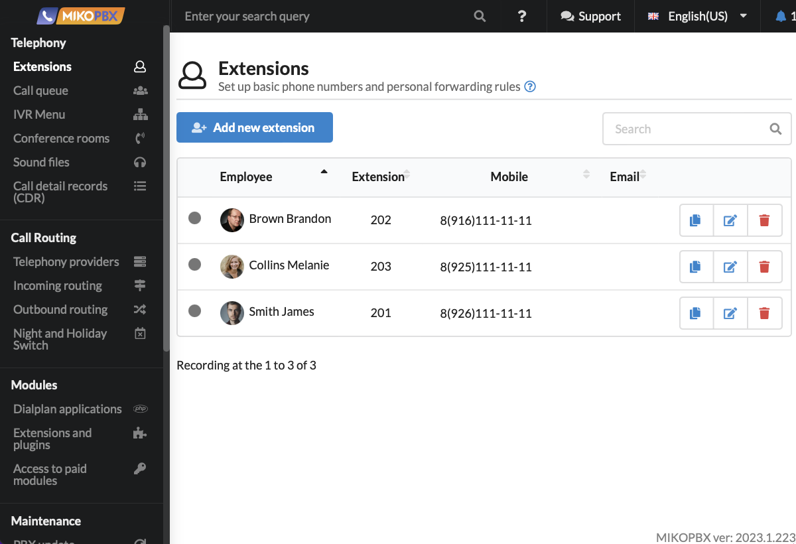
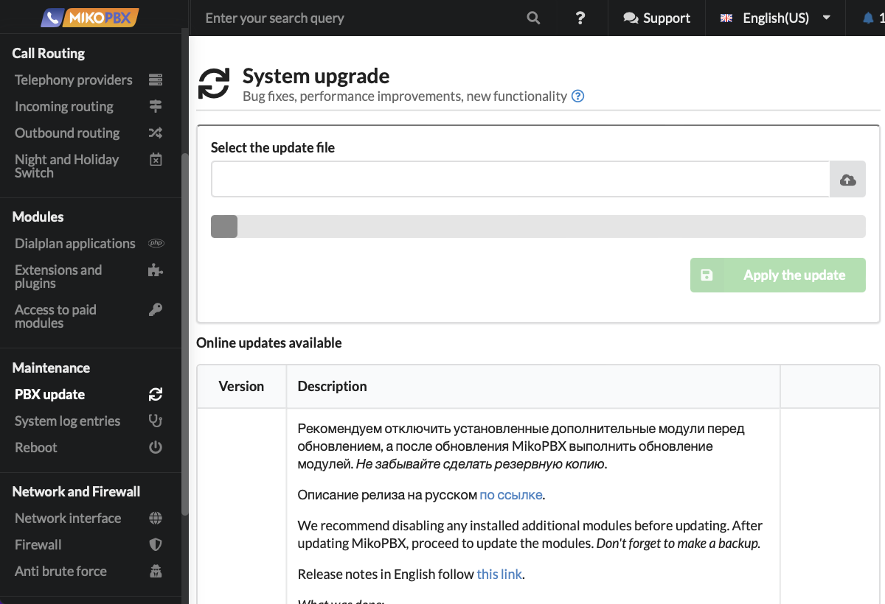
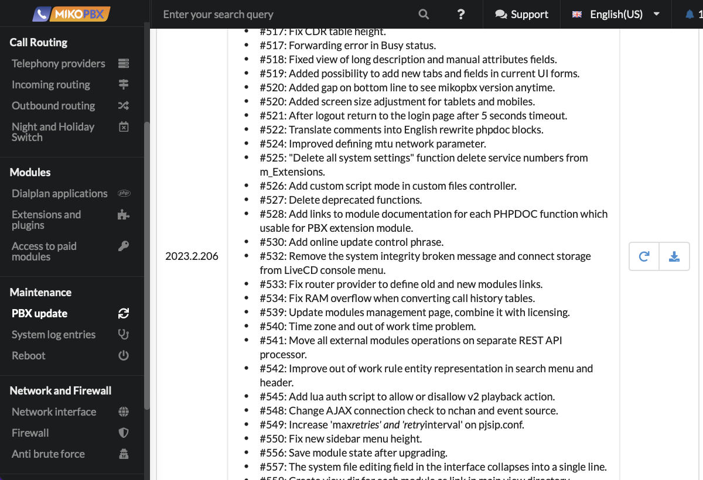
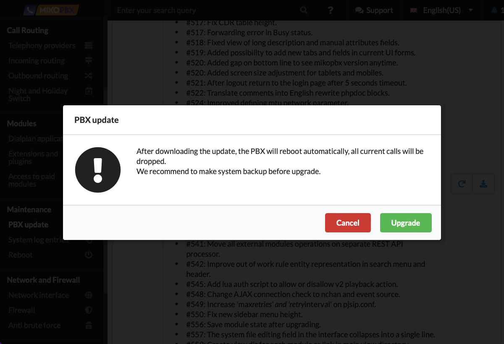
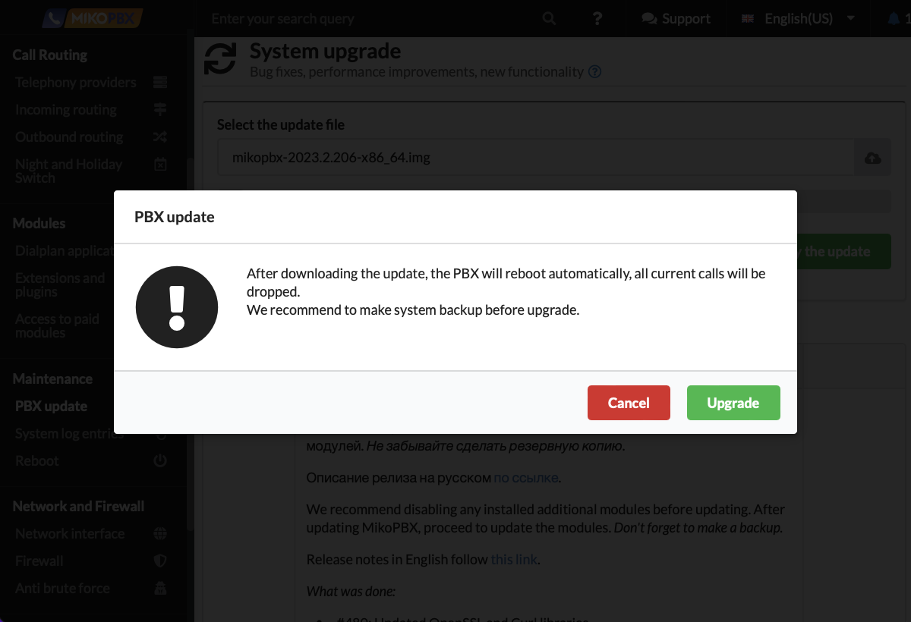
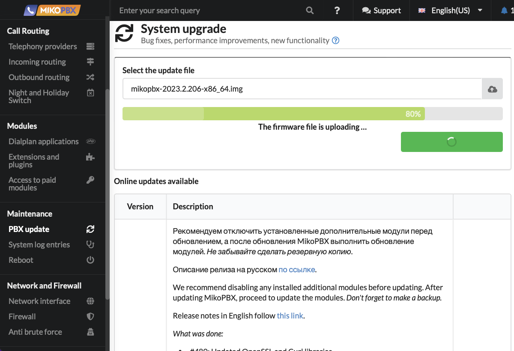

# System upgrade


Before updating, be sure to back up your PBX settings using the [**backup module**](backup.md).


## Updating from the web interface <a href="#web_interface_update" id="web_interface_update"></a>

In some sections of the interface (e.g., **Extensions**), the current version of MikoPBX is displayed in the lower right corner.

<figure><figcaption></figcaption></figure>

In the PBX web interface, go to **Maintenance** → **PBX update**.

<figure><figcaption></figcaption></figure>

If there are newer versions of the PBX available, they will be displayed in the **Online updates** **available** table, with the version number in the first field and the list of changes in the second.


We recommend performing updates sequentially without skipping releases.


<figure><figcaption></figcaption></figure>

There are two update options: **online update** and **update using a downloaded img file**.

### Online upgrade


**Be cautious**! If the system is installed on the same disk where call recordings are stored, there may be difficulties with the update. [See forum](https://qa.askozia.ru/5061/%D0%BF%D1%80%D0%BE%D0%BF%D0%B0%D0%B4%D0%B0%D0%B5%D1%82-%D1%80%D0%B0%D0%B7%D0%B4%D0%B5%D0%BB-%D0%BF%D0%BE%D1%81%D0%BB%D0%B5-%D0%BE%D0%B1%D0%BD%D0%BE%D0%B2%D0%BB%D0%B5%D0%BD%D0%B8%D1%8F-%D0%BD%D0%B0-6-7-7-31)


Updates are downloaded to the PBX and applied immediately.\
To update this way, click the button  for the desired version.

<figure><figcaption></figcaption></figure>

A warning window will appear. Click **Upgrade**.

<figure><figcaption></figcaption></figure>

The PBX will download and apply the updates, and then reboot.

### **Update using a downloaded img file**


Please note that this method can also be used to roll back to a previous version.


To update using this method, click the button  for the desired version.

<figure><figcaption></figcaption></figure>

The img file will start downloading. Wait for the download to complete.

Then click the button  and select the downloaded img file.

<figure><figcaption></figcaption></figure>

Then click **Apply the update**, and in the warning window, click **Upgrade**.

<figure><figcaption></figcaption></figure>

The updates will be applied, and the PBX will reboot upon completion.

<figure><figcaption></figcaption></figure>

## Updating from the MikoPBX console <a href="#console_update" id="console_update"></a>

Below is an example of a PBX installed on a VirtualBOX virtual machine, updated from version 2023.1.223 to version 2023.2.206.\
Download the iso image of the required PBX version from the [repository](https://github.com/mikopbx/Core/releases).

<figure><figcaption></figcaption></figure>

In VirtualBOX, open the settings of the virtual machine where the PBX is installed.\
Go to the **Storage** section.\
Select the virtual optical drive.\
Click the icon  in the **Attributes** group, and click **Choose Disk File**.\
Select the downloaded PBX iso image.\
Start the machine.

<figure><figcaption></figcaption></figure>

The console will display the line "<mark style="color:red;">**The system loaded in Recovery mode**</mark>".

<figure><figcaption></figcaption></figure>

Select **Install / Repair** (or press the number **8** on the keyboard) and press **Enter**.

You need the command "**Update to version \*\*\*\*.\*.\*\*".** Press the number **2** on the keyboard, then press **Enter**.\
The update installation will begin. When it is complete, the PBX will reboot.

<figure><figcaption></figcaption></figure>

After the PBX reboots, the message "<mark style="color:red;">**The system loaded in Recovery mode**</mark>" will no longer appear, indicating that the PBX has booted from the hard disk and not from the virtual optical drive.\
The installed update version will be displayed in green at the top.

<figure><figcaption></figcaption></figure>

## Updating the docker container <a href="#docker-upgrade" id="docker-upgrade"></a>

To update the MikoPBX container to the latest version, you can follow these steps in the command line. These steps include stopping the current container, downloading the new version of the image, and running the container with the updated image. Here is an example of the process:

#### Step 1: Stop the current container

First, you need to properly stop the running container. This prevents data loss and ensures that all processes within the container are correctly terminated:

```bash
docker stop mikopbx
```

#### Step 2: Remove the current container

After stopping the container, you can safely remove it. Removing the container allows you to start a new instance with new settings and the updated image:

```bash
docker rm mikopbx
```

#### Step 3: Download the latest version of the image

The next step is to download the latest version of the MikoPBX image. Using the `latest` tag ensures you get the most recent version:

```bash
docker pull ghcr.io/mikopbx/mikopbx-x86-64:latest
```

#### Step 4: Run the new container with the updated image

Finally, run the new container using the latest version of the image and the same settings as before (including volume mounts and other network parameters):

```bash
docker run --cap-add=NET_ADMIN --net=host --name mikopbx --hostname mikopbx \
  -v mikopbx_cf:/cf \
  -v mikopbx_storage:/storage \ 
  -e SSH_PORT=23 \ 
  -e ID_WWW_USER="$(id -u www-user)" \ 
  -e ID_WWW_GROUP="$(id -g www-user)" \ 
  -it -d --restart always ghcr.io/mikopbx/mikopbx-x86-64:latest
```

#### Notes:

* **Data**: Since data is stored in Docker volumes (`mikopbx_cf` and `mikopbx_storage`), it remains untouched during the update, preserving settings and user data.
* **Environment Variables**: Ensure that all necessary environment variables are correctly passed.
* **Safety**: Always create backups of your data before updating.

These steps will help ensure a smooth and safe update of your MikoPBX container.
