# Updating a physical server


We recommend updating sequentially, without skipping releases and versions.


This guide is intended for a dedicated computer or server running MikoPBX.

The primary method is updating through the web interface. If the PBX does not boot normally or the web interface is unavailable, use an ISO image written to a separate USB drive.


Before updating, be sure to create a backup of the settings and store it on another device. Also save a copy of the call recordings.


## Preparation

1. Make sure you have physical access to the server or a working console. Create a backup of the MikoPBX settings and call recordings.
2. Make sure at least **400 MB** is free on the Storage.
3. End active calls and schedule a maintenance window for the telephony system.

## Updating through the web interface

### Online update

1. In the web interface, open **"Maintenance"** → **"PBX update"**.

<figure>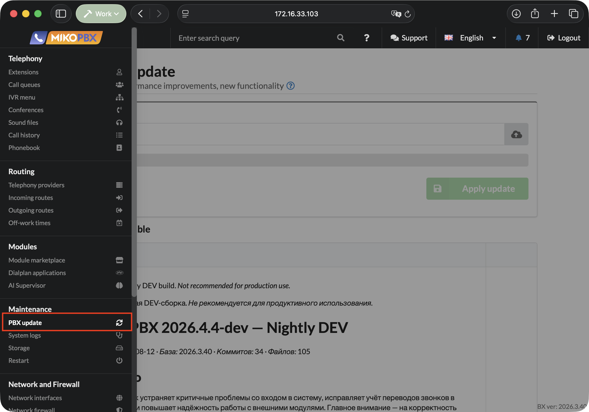<figcaption>
The "PBX update" section
</figcaption></figure>

2. Select the desired version in the list. Review the list of changes and start the update process.

<figure>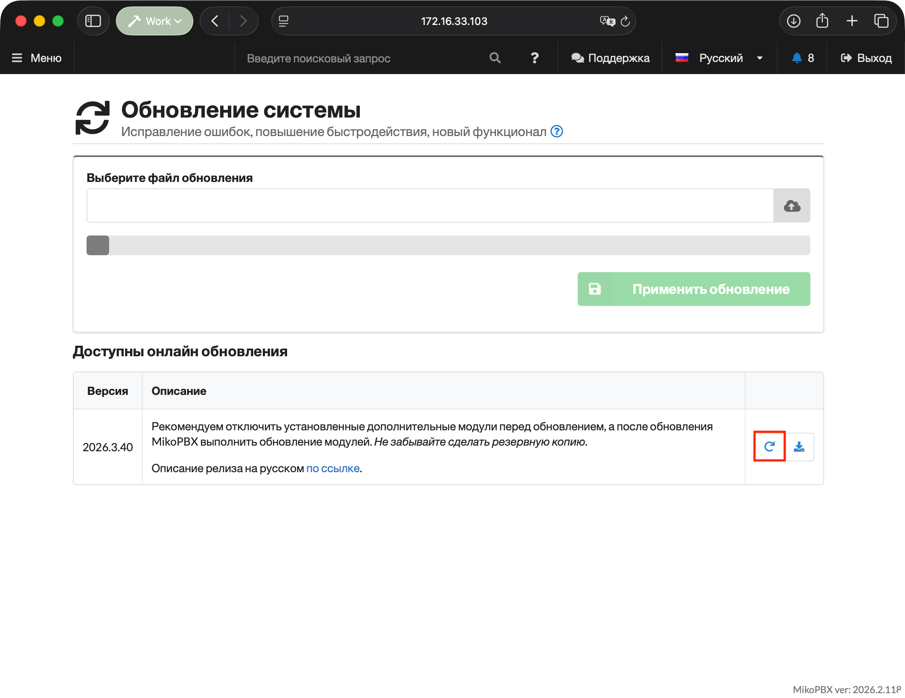<figcaption>
Button for updating the PBX from the web interface
</figcaption></figure>

3. Once the download is complete, enter the phrase **Yes, I have a backup**. Click **Update**.

<figure>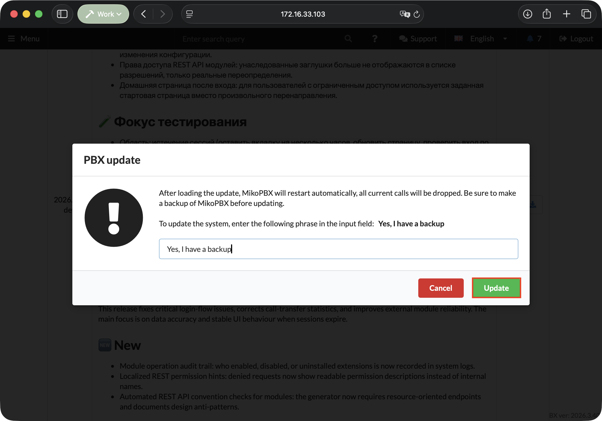<figcaption>
Confirmation that a backup exists
</figcaption></figure>

### Updating with a local IMG file

1. Download the `.img` file of the required version from the [MikoPBX releases](https://github.com/mikopbx/Core/releases) page.


Pay attention to the architecture of your MikoPBX: if you have an ARM MikoPBX, use the update file with "arm64" in its name. If you have an x86 MikoPBX, use the update file with "x86\_64" in its name.


<figure>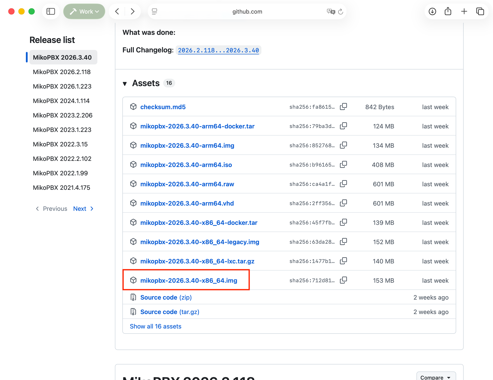<figcaption>
Downloading an .img for the update
</figcaption></figure>

2. Open **Maintenance** → **PBX update**.

<figure><figcaption>
The "PBX update" section
</figcaption></figure>

3. Select the downloaded `.img` file.

<figure>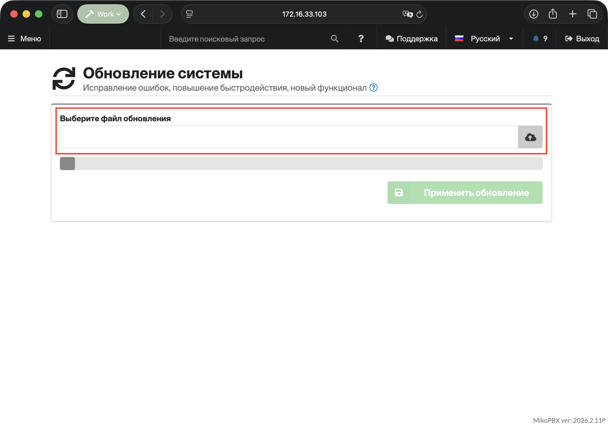<figcaption>
Selecting the update file
</figcaption></figure>

4. Click **Apply update**.

<figure>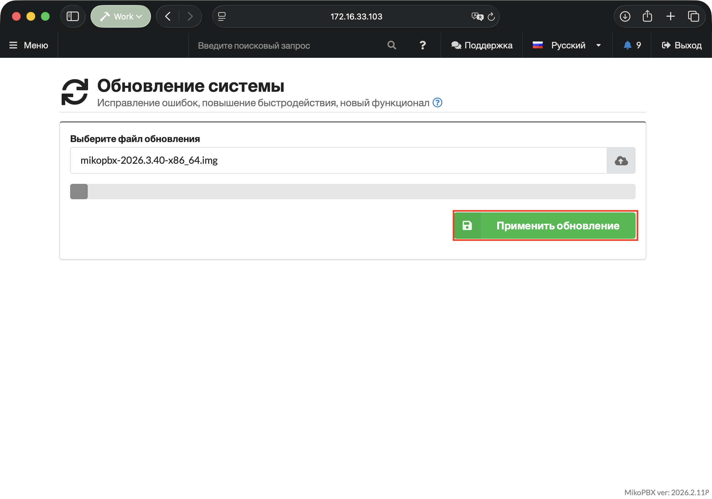<figcaption>
Button for applying the update
</figcaption></figure>

5. Enter the phrase **Yes, I have a backup** and confirm the operation.

<figure><figcaption>
Confirmation that a PBX backup exists
</figcaption></figure>

Wait for the PBX to reboot automatically after the update.

<figure>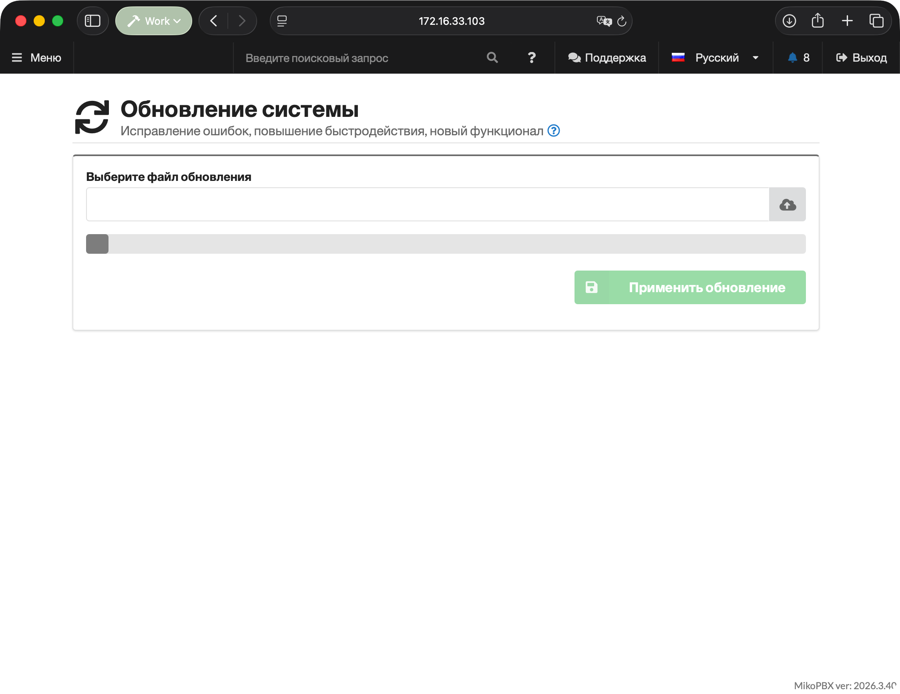<figcaption>
The PBX running the new version
</figcaption></figure>

## Updating from an ISO on a USB drive

This method is suitable for restoring and updating the PBX from the local console.

### Creating bootable media

1. Download the ISO of the required version from the [MikoPBX releases](https://github.com/mikopbx/Core/releases) page.


Pay attention to the architecture of your MikoPBX: if you have an ARM MikoPBX, use the update file with "arm64" in its name. If you have an x86 MikoPBX, use the update file with "x86\_64" in its name.


<figure>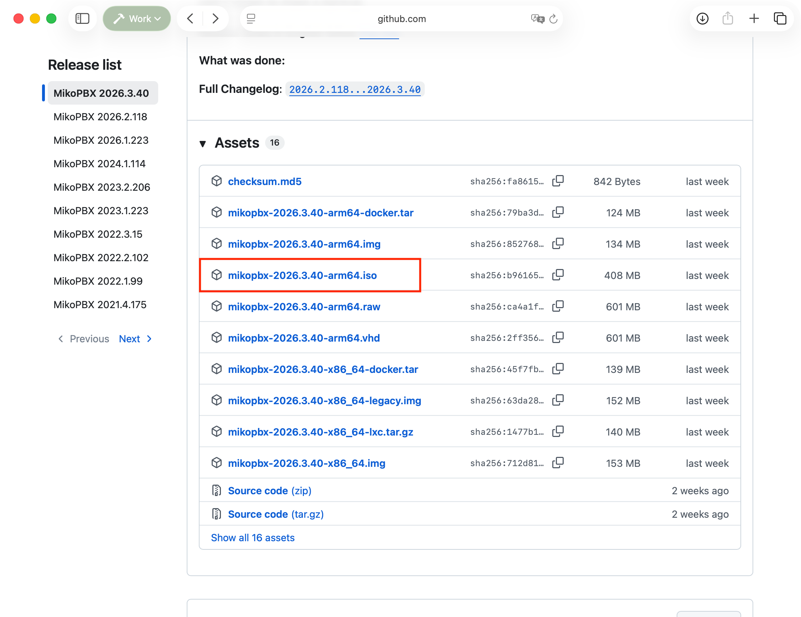<figcaption></figcaption></figure>

2. Connect a separate USB drive with a capacity of at least 1 GB.
3. Write the ISO in disk image mode using Rufus, balenaEtcher, or `dd`. Instructions for writing an ISO image can be found [here](../../../setup/bare-metal/live-usb.md#writing-the-image-to-a-usb-drive).


Writing the ISO will erase all data on the selected USB drive. Double-check the selected device.


### Running the update

1. Connect the prepared USB drive to the server. In the BIOS/UEFI or Boot Menu, select booting from USB.
2. Wait for MikoPBX to start in Recovery mode.

<figure>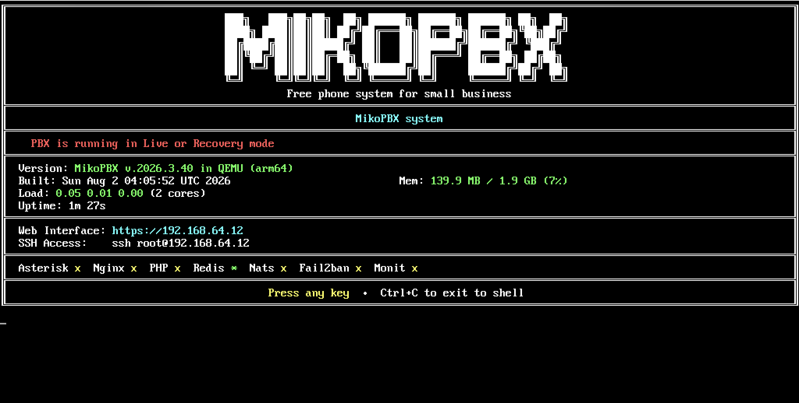<figcaption>
MikoPBX in Recovery mode
</figcaption></figure>

3. Press any key to open the console menu. Then open **"[4] Install or recover"**.

<figure>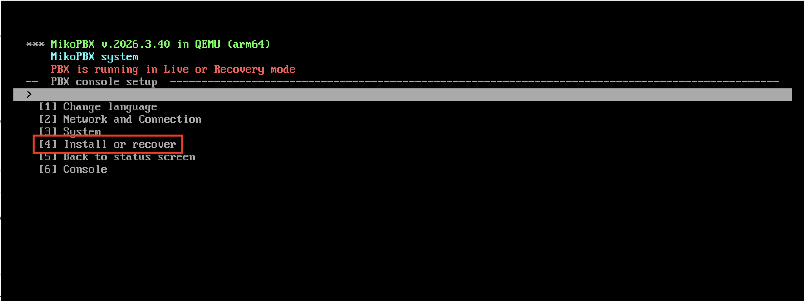<figcaption>
The "Install or recover" section in the MikoPBX console menu
</figcaption></figure>

4. Select **"2) Update to version..."**


The **Install** option is intended for a new installation and erases the data on the selected device. To update while keeping the settings, only choose **"Update to version..."**


<figure>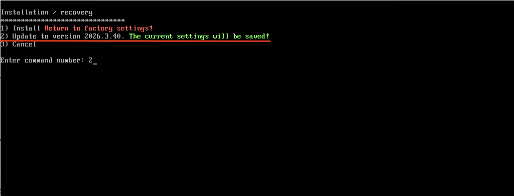<figcaption>
Updating to version 2026.3.40
</figcaption></figure>

5. Wait for the writing to finish and the reboot. Remove the USB drive or restore the system disk as the first boot device.

<figure>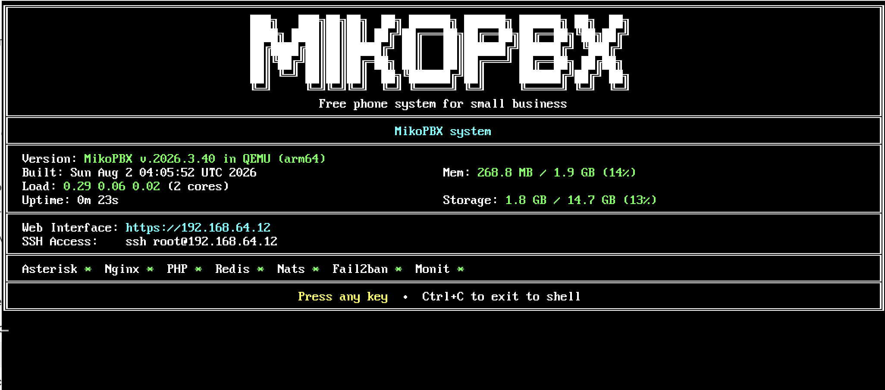<figcaption>
The PBX successfully updated to version 2026.3.40
</figcaption></figure>
