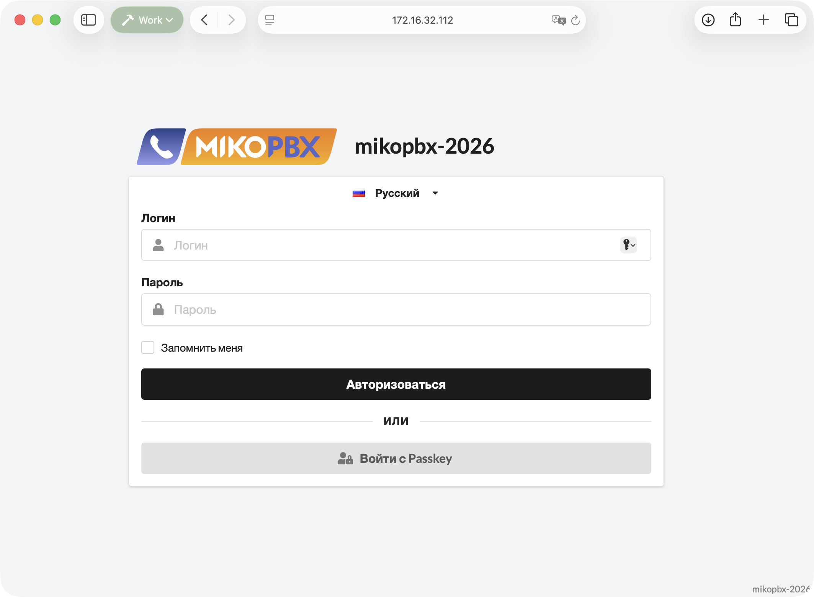

# Обновление LXC-контейнера

Эта инструкция предназначена для MikoPBX, установленной в LXC-контейнере Proxmox VE. Все действия выполняются через web-интерфейс Proxmox и MikoPBX.


Рекомендуется производить обновления последовательно, «не перепрыгивая» через релизы и версии. Если в описании релиза указана промежуточная версия, сначала обновитесь до неё.


## Как выполняется обновление

В LXC системные файлы MikoPBX и пользовательские данные находятся на разных томах:

| Том            | Содержимое                                                           | Действие при обновлении   |
| -------------- | -------------------------------------------------------------------- | ------------------------- |
| **Root Disk**  | Системные файлы текущей версии MikoPBX                               | Остаётся у старого CT     |
| **`/storage`** | Записи разговоров, история вызовов, модули, звуковые файлы и журналы | Переназначается новому CT |
| **`/cf`**      | Настройки MikoPBX и основная база данных                             | Переназначается новому CT |

Для обновления создаётся новый контейнер из актуального шаблона `lxc.tar.gz`. Старые тома `/storage` и `/cf` не копируются: Proxmox переназначает их новому контейнеру с помощью функции **Reassign Owner**.

В результате новая версия MikoPBX получает новую корневую файловую систему, но продолжает работать с прежними настройками, историей и записями разговоров.


Не обновляйте LXC-контейнер файлом `.img` в разделе **Обслуживание → Обновление PBX** и не подключайте ISO-образ. Эти способы рассчитаны на полноценный системный диск виртуальной или физической машины. Для LXC используйте новый шаблон `lxc.tar.gz`.



Метод подходит, если `/cf` и `/storage` созданы в Proxmox как отдельные управляемые **Mount Point** и оба контейнера находятся на одном узле Proxmox. Для bind mount, физического диска, сетевой папки или переноса на другой узел функция **Reassign Owner** может быть недоступна. В таком случае используйте резервное копирование и восстановление данных.


## Перед началом

Запланируйте техническое окно. После остановки старого CT телефония не будет работать до запуска нового контейнера.

Убедитесь, что у вас есть:

* доступ администратора к Proxmox VE;
* доступ администратора к MikoPBX;
* резервная копия, сохранённая вне обновляемого контейнера.


**Reassign Owner не создаёт резервную копию.** Операция только меняет владельца существующего тома. Ошибка администратора, повреждение хранилища или несовместимое изменение базы данных могут потребовать восстановления из резервной копии.


## Шаг 1. Запишите параметры старого контейнера

Откройте старый CT в Proxmox и сохраните его параметры.&#x20;

1. **Resources** - CPU, RAM, Swap, Root Disk (размер).
2. **Network** - bridge, IPv4/IPv6, VLAN, MAC-адрес и состояние Proxmox Firewall.
3. **DNS** - DNS-серверы.
4. **Options** — тип контейнера (привилигированный или нет)

В разделе **Resources** найдите строки, в которых указаны:

* `mp=/storage` — том с записями и пользовательскими данными;
* `mp=/cf` — том с конфигурацией.

Запишите их идентификаторы. Обычно это `mp0` и `mp1`, но порядок может отличаться.

## Шаг 2. Создайте резервные копии

### Резервная копия MikoPBX

1. Откройте **Модули → Маркетплейс модулей**

<figure><figcaption>
Раздел "Маркетплейс модулей" в MikoPBX
</figcaption></figure>

2. Убедитесь, что [**Модуль резервного копирования** ](../../../modules/miko/module-backup.md)установлен и включён.
3. Откройте модуль и нажмите **Создать архивную копию**.

<figure><figcaption>
Создание резервной копии
</figcaption></figure>

4. Создайте архив и скачайте его на компьютер администратора или во внешнее хранилище.

<figure><figcaption>
Загрузка резервной копии на компьютер
</figcaption></figure>

### Резервная копия Proxmox

1. В Proxmox откройте настройки старого контейнера (CT) → **Backup**. Нажмите **Backup now**.

<figure><figcaption>
Создание резервной копии контейнера
</figcaption></figure>

2. Выберите внешнее или отдельное хранилище резервных копий. Запустите backup и дождитесь сообщения **TASK OK**.


Перед запуском проверьте параметр **Backup** у mount points `/cf` и `/storage`. Если он включён, Proxmox добавит эти тома в архив, поэтому резервное копирование большого диска `/storage` может занять продолжительное время.\
Само обновление не создаёт вторую копию записей разговоров и выполняется быстро. Полный backup `/storage` - отдельная защитная мера. Если записи уже регулярно сохраняются в Proxmox Backup Server, S3 или другом внешнем хранилище, можно использовать существующую проверенную резервную копию.


<figure><figcaption>
Успешное создание резервной копии
</figcaption></figure>

## Шаг 3. Загрузите новый LXC-шаблон

1. Откройте страницу [релизов MikoPBX](https://github.com/mikopbx/Core/releases).
2. Найдите требуемую версию и скопируйте ссылку на файл, имя которого заканчивается на `lxc.tar.gz`.

<figure><figcaption>
Копирование ссылки на шаблон контейнера
</figcaption></figure>

3. В Proxmox выберите хранилище **local** → **CT Templates**. Нажмите **Download from URL**.

<figure><figcaption>
Опция загрузки шаблона CT контейнера по ссылке
</figcaption></figure>

4. Вставьте ссылку в поле **URL** и нажмите **Query URL**. Проверьте имя файла и нажмите **Download**.

<figure><figcaption>
Загрузка шаблона в Proxmox
</figcaption></figure>

5. Дождитесь сообщения **TASK OK**.

<figure><figcaption>
Успешная загрузка шаблона в Proxmox
</figcaption></figure>

## Шаг 4. Создайте новый контейнер

Нажмите **Create CT** в правом верхнем углу Proxmox.

### General

Выберите тот же узел Proxmox, на котором расположен старый CT:

* Укажите новый **CT ID**. Не используйте ID старого контейнера.
* Задайте отличающееся имя, например `mikopbx-update-test`.
* Установите такое же значение **Unprivileged container**, как у старого CT.

Нажмите **Next**.


После подключения старого `/cf` для входа в MikoPBX будут использоваться прежние учётные данные администратора.


<figure><figcaption>
Параметры нового контейнера
</figcaption></figure>

### Template

Выберите загруженный шаблон новой версии `lxc.tar.gz` и нажмите **Next**.

<figure><figcaption>
Выбор ранее загруженного шаблона для нового контейнера
</figcaption></figure>

### Disks

Создайте новый **Root Disk (rootfs)**. Выберите подходящее хранилище. Укажите размер системного диска -  **1 ГБ**.


Не добавляйте новые диски `/storage` и `/cf`: вместо них будут подключены существующие тома старого CT.


Нажмите **Next**.

<figure><figcaption>
Создание Root диска
</figcaption></figure>

### CPU и Memory

Укажите такое же количество ядер, Memory и Swap памяти, как у старого контейнера.

<figure><figcaption>
Указание параметров контейнера
</figcaption></figure>

### Network

Повторите сетевые настройки старого CT. На время проверки рекомендуется использовать свободный временный IP-адрес и новый MAC-адрес, чтобы исключить конфликт со старым контейнером.

Если используется DHCP, новый CT может получить другой адрес автоматически. Если адрес закреплён на DHCP-сервере по MAC, заранее создайте отдельную привязку для нового MAC-адреса.

<figure><figcaption>
Параметры сети для нового контейнера
</figcaption></figure>

### DNS и Confirm

Повторите DNS-настройки старого CT:

* На странице **Confirm** внимательно проверьте параметры.

Снимите флажок **Start after created**. Новый контейнер нельзя запускать до подключения `/cf` и `/storage`. Нажмите **Finish** и дождитесь сообщения **TASK OK**.

Откройте новый CT → **Resources**. На этом этапе в списке должен находиться новый **Root Disk**, но не должно быть mount points `/cf` и `/storage`.


Подробное описание мастера создания CT приведено в статье [Установка MikoPBX в Proxmox LXC](../../../setup/hypervisor/proxmox/lxc.md). При обновлении пропустите шаги добавления новых дисков `/storage` и `/cf`.


<figure><figcaption>
Пример содержания вкладки "Resources" при правильном создании нового контейнера
</figcaption></figure>

## Шаг 5. Переназначьте диск `/storage`

1. Откройте старый CT → **Resources**. Выберите строку **Mount Point**, в параметрах которой указано `mp=/storage`. Нажмите **Volume Action** → **Reassign Owner**.

<figure><figcaption>
Перемонтирование <em>/storage</em>
</figcaption></figure>

2. В поле **Target** выберите новый CT. В поле **Add as** оставьте **Mount Point**. Proxmox предложит свободный номер точки монтирования, например `mp0`. Убедитесь, что выбранный номер не занят.

Нажмите **Reassign Volume**.

<figure><figcaption>
Перемонтирование <em>/storage</em>
</figcaption></figure>

После операции том исчезнет из раздела **Resources** старого CT и появится у нового. Proxmox изменит владельца тома и при необходимости переименует его под новый CT ID. Содержимое диска при этом не копируется и не форматируется.

## Шаг 6. Переназначьте диск `/cf`

Повторите те же действия для Mount Point с параметром `mp=/cf`:

1. Откройте старый CT → **Resources**. Выберите строку **Mount Point**, в параметрах которой указано `mp=/cf`. Нажмите **Volume Action** → **Reassign Owner**.

<figure><figcaption>
Перемонтирование <em>/cf</em>
</figcaption></figure>

2. Выберите новый CT. Оставьте **Add as → Mount Point**. Выберите следующий свободный номер, например `mp1`. Нажмите **Reassign Volume.**

<figure><figcaption>
Перемонтирование <em>/cf</em>
</figcaption></figure>

3. Откройте новый CT → **Resources** и проверьте итоговую конфигурацию:

* **Root Disk** принадлежит новому CT;
* один Mount Point содержит `mp=/storage`;
* второй Mount Point содержит `mp=/cf`;
* размеры `/storage` и `/cf` совпадают с размерами старых томов.

Номера `mp0` и `mp1` могут располагаться в другом порядке. Важны пути `mp=/storage` и `mp=/cf`.

<figure><figcaption>
Пример вкладки Resources у нового контейнера
</figcaption></figure>

## Шаг 7. Выполните первый запуск

1. Выберите новый CT и нажмите **Start**. Откройте вкладку **Console**.

<figure><figcaption>
Переход во вкладку консоли и запуск контейнера
</figcaption></figure>

2. Дождитесь полной загрузки MikoPBX и появления адреса web-интерфейса.


Первый запуск может занять несколько минут. Новая версия проверит существующую конфигурацию, выполнит необходимые миграции базы данных и запустит службы телефонии. Не перезапускайте CT и не отключайте питание во время этого процесса.

Если web-интерфейс не открылся, сначала проверьте в **Resources**, что оба тома подключены с правильными путями. <mark style="color:$danger;">Не запускайте старый CT, пока тома принадлежат новому.</mark>


<figure><figcaption>
Консоль нового контейнера. Статус screen MikoPBX.
</figcaption></figure>

3. Откройте этот адрес в браузере и войдите с прежними логином и паролем MikoPBX.

<figure><figcaption>
Веб-интерфейс обновленной MikoPBX
</figcaption></figure>

## Шаг 8. Переключите рабочий IP-адрес

Если новый CT сразу получил прежний рабочий IP-адрес, пропустите этот шаг.

Если для проверки использовался временный адрес:

1. Остановите новый CT.
2. Ещё раз убедитесь, что старый CT остановлен.
3. Откройте новый CT → **Network** и выберите интерфейс `net0`.
4. Укажите прежний IPv4/IPv6-адрес MikoPBX.
5. Если адрес закреплён на DHCP-сервере, перенесите привязку на новый MAC или назначьте новому CT прежний MAC-адрес.
6. Проверьте bridge, VLAN, gateway и настройки Proxmox Firewall.
7. При необходимости переключите внешний NAT, DNS и правила межсетевого экрана на новый адрес.
8. Запустите новый CT.

Одинаковый IP- или MAC-адрес разрешается использовать только при полностью остановленном старом контейнере.

## Проверка после обновления

Не удаляйте старый CT, пока не выполнены все проверки.

1. В web-интерфейсе убедитесь, что отображается новая версия MikoPBX.
2. Проверьте сотрудников, SIP-аккаунты, провайдеров, входящие и исходящие маршруты.
3. Откройте **Телефония → История вызовов** и убедитесь, что старая история доступна.
4. Прослушайте несколько старых записей разговоров за разные даты.
5. Проверьте установленные модули, их лицензии и настройки.
6. Убедитесь, что телефоны и провайдеры зарегистрированы либо имеют ожидаемый статус.
7. Выполните внутренний, исходящий и входящий тестовые звонки.
8. Проверьте, что новый разговор появился в истории и его запись воспроизводится.
9. Перезагрузите новый CT через Proxmox.
10. После перезагрузки повторно проверьте web-интерфейс, сеть, регистрации и тестовый звонок.

## Откат на старый контейнер

Если новая версия работает некорректно:

1. Остановите новый CT.
2. В его разделе **Resources** выберите Mount Point `/storage`.
3. Выполните **Volume Action → Reassign Owner** и верните том старому CT.
4. Таким же способом верните старому CT том `/cf`.
5. Проверьте, что у старого CT снова присутствуют `mp=/storage` и `mp=/cf`.
6. Верните старые IP-, MAC-, DNS- и NAT-настройки.
7. Запустите старый CT и проверьте его работу.


Новая версия могла изменить структуру базы данных на `/cf`. Поэтому возврат томов не гарантирует совместимость со старой версией MikoPBX. Если старый CT не запускается корректно, восстановите его из Proxmox backup или восстановите настройки из архива MikoPBX, созданного до обновления.


## Завершение обновления

Сохраняйте старый остановленный CT и резервные копии несколько дней. Удалять старый контейнер рекомендуется только после того, как:

* новая версия стабильно работает;
* входящие и исходящие вызовы проверены;
* новые записи разговоров создаются и воспроизводятся;
* MikoPBX успешно пережила перезагрузку;
* создана свежая резервная копия уже обновлённой станции.

Перед удалением старого CT ещё раз откройте его **Resources** и убедитесь, что тома `/cf` и `/storage` действительно переназначены новому контейнеру. После этого старый Root Disk можно удалить вместе со старым CT.


При таком способе обновления многолетняя история записей остаётся на исходном диске `/storage`. Время переключения не зависит от объёма записей, поскольку Proxmox меняет владельца тома вместо копирования его содержимого.

