# Updating an LXC container

This guide is intended for MikoPBX installed in a Proxmox VE LXC container. All operations are performed through the Proxmox and MikoPBX web interfaces.


We recommend updating sequentially without skipping releases or versions. If a release description specifies an intermediate version, update to that version first.


## How the update works

In LXC, the MikoPBX system files and user data are stored on separate volumes:

| Volume         | Contents                                                      | Action during the update       |
| -------------- | ------------------------------------------------------------- | ------------------------------ |
| **Root Disk**  | System files for the current MikoPBX version                  | Remains attached to the old CT |
| **`/storage`** | Call recordings, call history, modules, audio files, and logs | Reassigned to the new CT       |
| **`/cf`**      | MikoPBX settings and the main database                        | Reassigned to the new CT       |

To update, create a new container from the current `lxc.tar.gz` template. The existing `/storage` and `/cf` volumes are not copied: Proxmox reassigns them to the new container using **Reassign Owner**.

As a result, the new MikoPBX version gets a new root file system while continuing to use the existing settings, history, and call recordings.


Do not update an LXC container with an `.img` file under **Maintenance → PBX update**, and do not attach an ISO image. These methods are intended for a full system disk in a virtual or physical machine. For LXC, use a new `lxc.tar.gz` template.



This method is suitable when `/cf` and `/storage` are separate Proxmox-managed **Mount Point** volumes and both containers are on the same Proxmox node. **Reassign Owner** may be unavailable for a bind mount, physical disk, network share, or migration to another node. In that case, back up and restore the data instead.


## Before you begin

Schedule a maintenance window. After the old CT is stopped, telephony will remain unavailable until the new container starts.

Make sure you have:

* administrator access to Proxmox VE;
* administrator access to MikoPBX;
* a backup stored outside the container being updated.


**Reassign Owner does not create a backup.** It only changes the owner of an existing volume. An administrator error, storage failure, or incompatible database change may require restoring from a backup.


## Step 1. Record the old container settings

Open the old CT in Proxmox and record its settings.

1. **Resources** — CPU, RAM, Swap, and Root Disk size.
2. **Network** — bridge, IPv4/IPv6, VLAN, MAC address, and Proxmox Firewall status.
3. **DNS** — DNS servers.
4. **Options** — whether the container is privileged or unprivileged.

Under **Resources**, find the entries containing:

* `mp=/storage` — the volume with recordings and user data;
* `mp=/cf` — the volume with the configuration.

Record their identifiers. They are usually `mp0` and `mp1`, but the order may differ.

## Step 2. Create backups

### MikoPBX backup

1. Open **Modules → Module marketplace**.

<figure>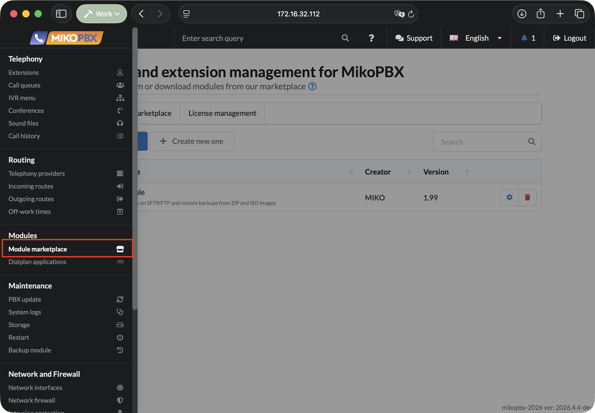<figcaption>
The Module marketplace section in MikoPBX
</figcaption></figure>

2. Make sure the [**Backup module**](../../../modules/miko/module-backup.md) is installed and enabled.
3. Open the module and click **Create backup copy**.

<figure>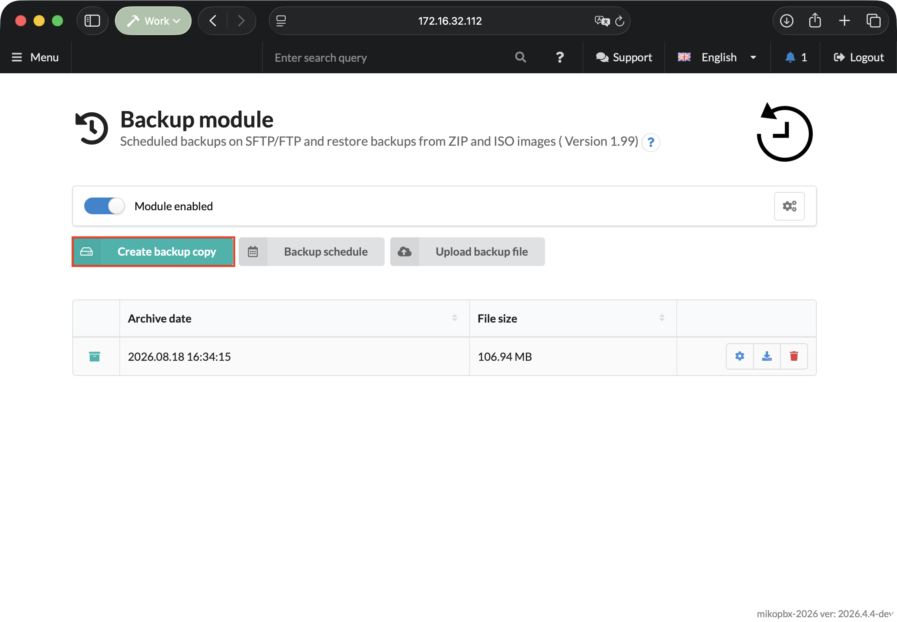<figcaption>
Creating a backup copy
</figcaption></figure>

4. Create the archive and download it to the administrator's computer or external storage.

<figure>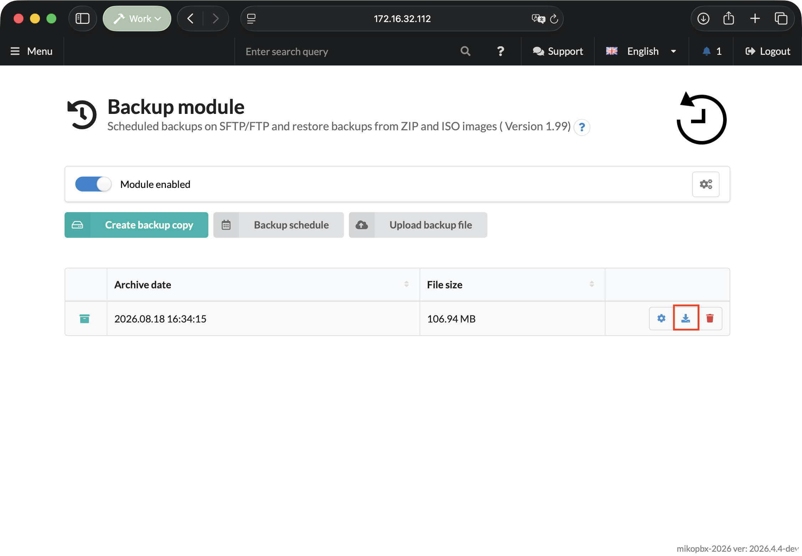<figcaption>
Downloading the backup copy to a computer
</figcaption></figure>

### Proxmox backup

1. In Proxmox, open the old container (CT) → **Backup** and click **Backup now**.

<figure>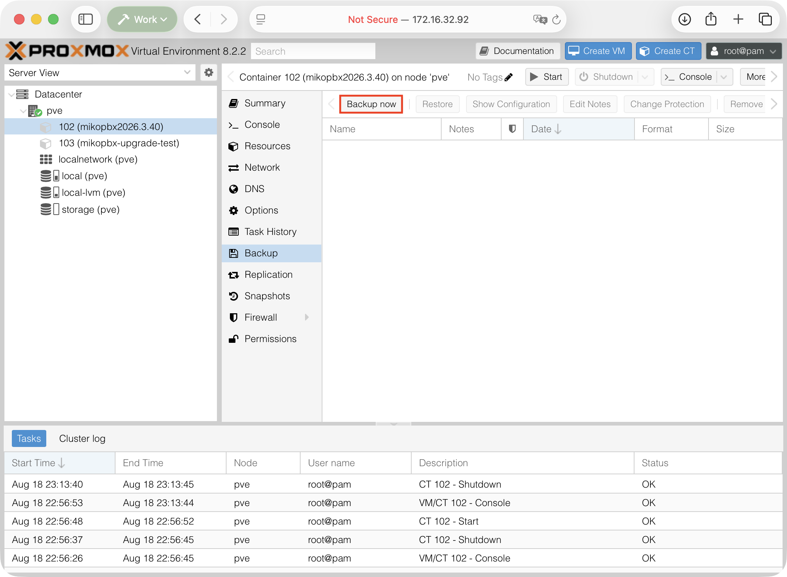<figcaption>
Creating a container backup
</figcaption></figure>

2. Select external or separate backup storage. Start the backup and wait for the **TASK OK** message.


Before starting, check the **Backup** option for the `/cf` and `/storage` mount points. If enabled, Proxmox includes these volumes in the archive, so backing up a large `/storage` disk may take a long time.\
The update itself does not create a second copy of the call recordings and completes quickly. A full `/storage` backup is a separate safety measure. If the recordings are already backed up regularly to Proxmox Backup Server, S3, or other external storage, you can use an existing verified backup.


<figure>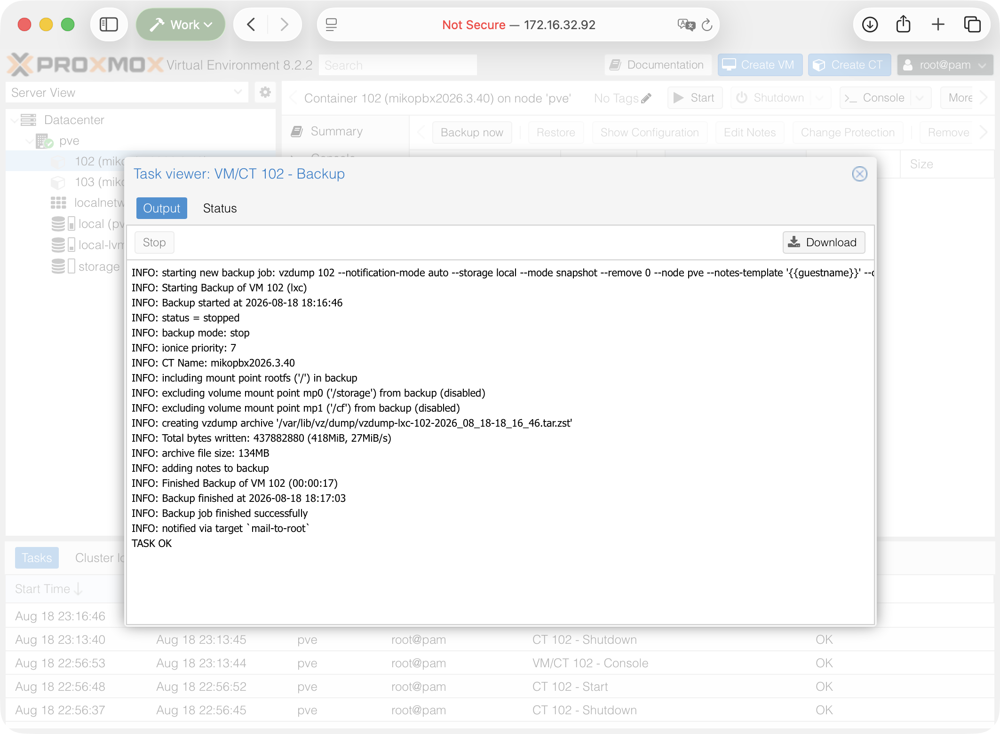<figcaption>
Container backup completed successfully
</figcaption></figure>

## Step 3. Download the new LXC template

1. Open the [MikoPBX releases](https://github.com/mikopbx/Core/releases) page.
2. Find the required version and copy the link to the file whose name ends with `lxc.tar.gz`.

<figure>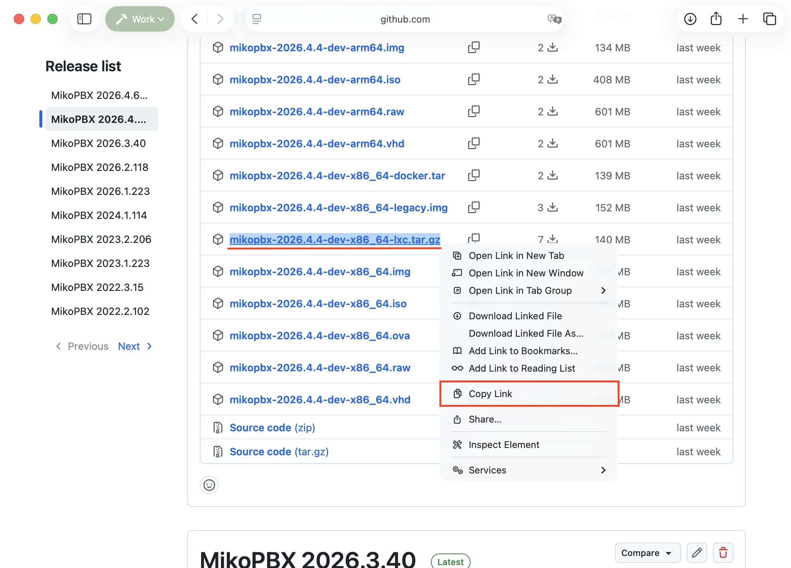<figcaption>
Copying the container template link
</figcaption></figure>

3. In Proxmox, select the **local** storage → **CT Templates** and click **Download from URL**.

<figure>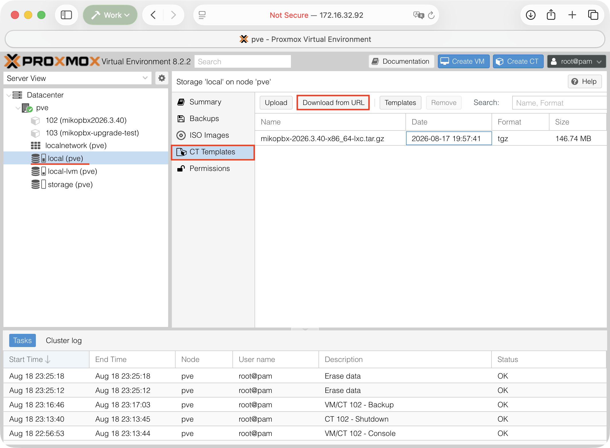<figcaption>
The option for downloading a CT template from a URL
</figcaption></figure>

4. Paste the link into the **URL** field and click **Query URL**. Verify the file name and click **Download**.

<figure>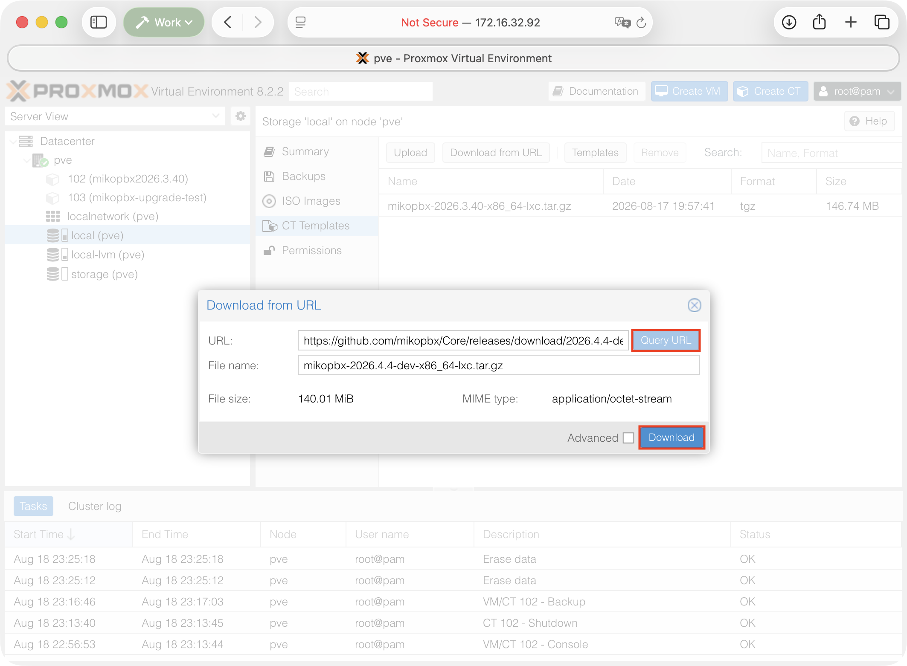<figcaption>
Downloading the template in Proxmox
</figcaption></figure>

5. Wait for the **TASK OK** message.

<figure>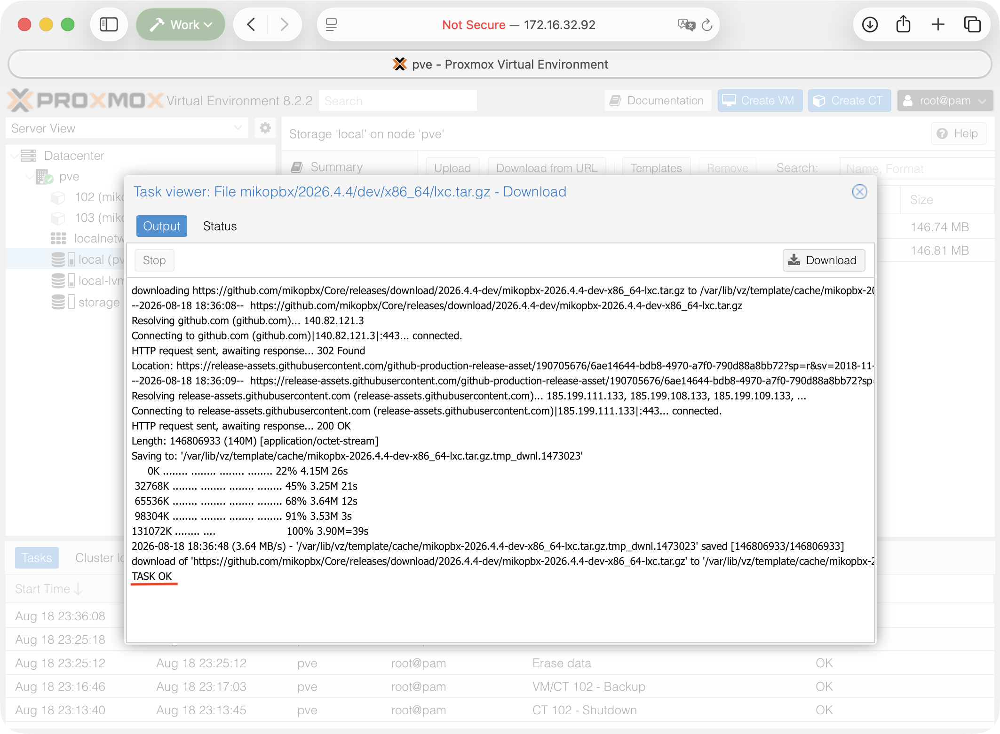<figcaption>
Template downloaded successfully in Proxmox
</figcaption></figure>

## Step 4. Create a new container

Click **Create CT** in the upper-right corner of Proxmox.

### General

Select the same Proxmox node that hosts the old CT:

* Specify a new **CT ID**. Do not use the ID of the old container.
* Enter a different name, such as `mikopbx-update-test`.
* Set **Unprivileged container** to the same value as on the old CT.

Click **Next**.


After the existing `/cf` volume is attached, the previous administrator credentials will be used to sign in to MikoPBX.


<figure>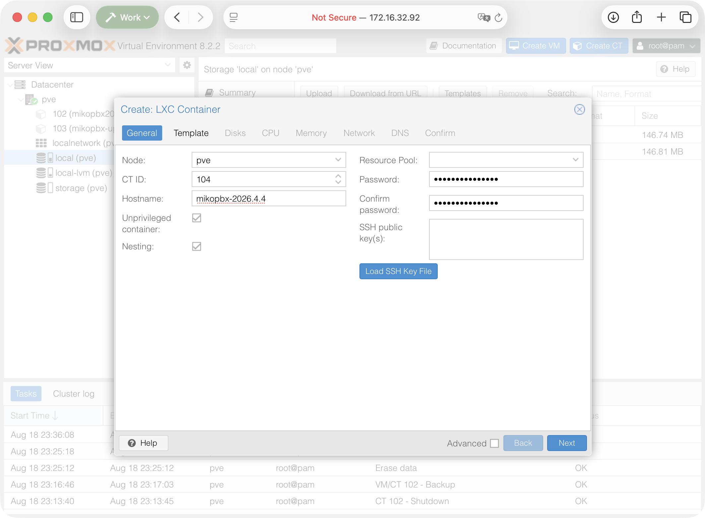<figcaption>
New container settings
</figcaption></figure>

### Template

Select the downloaded `lxc.tar.gz` template for the new version and click **Next**.

<figure>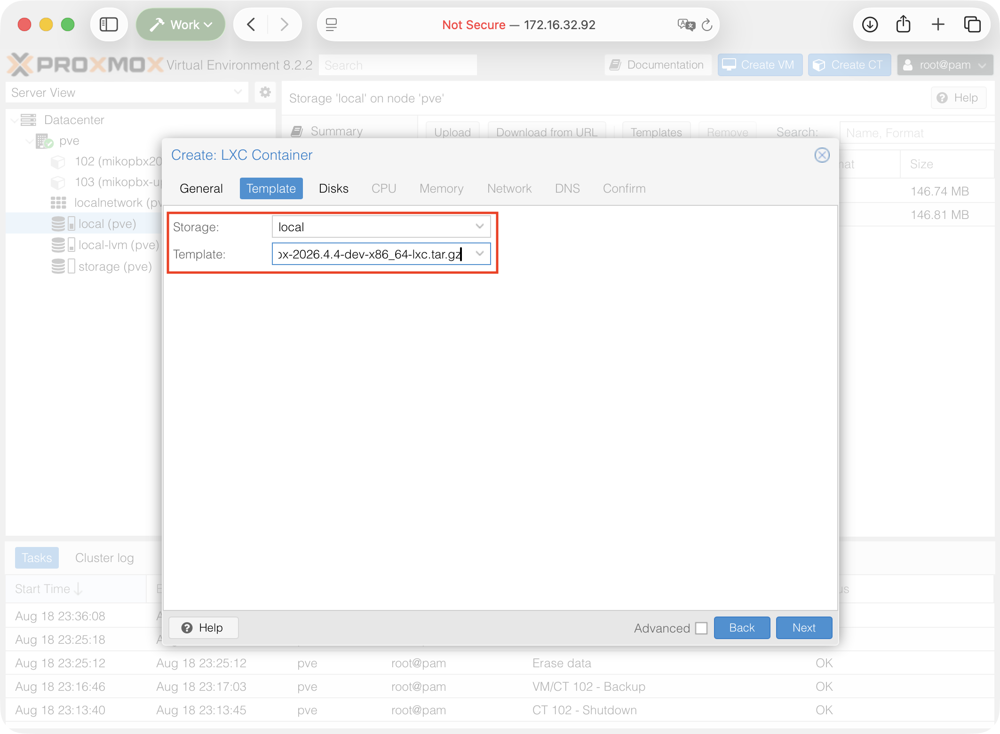<figcaption>
Selecting the previously downloaded template for the new container
</figcaption></figure>

### Disks

Create a new **Root Disk (rootfs)**. Select suitable storage and set the system disk size to **1 GB**.


Do not add new `/storage` and `/cf` disks: the existing volumes from the old CT will be attached instead.


Click **Next**.

<figure>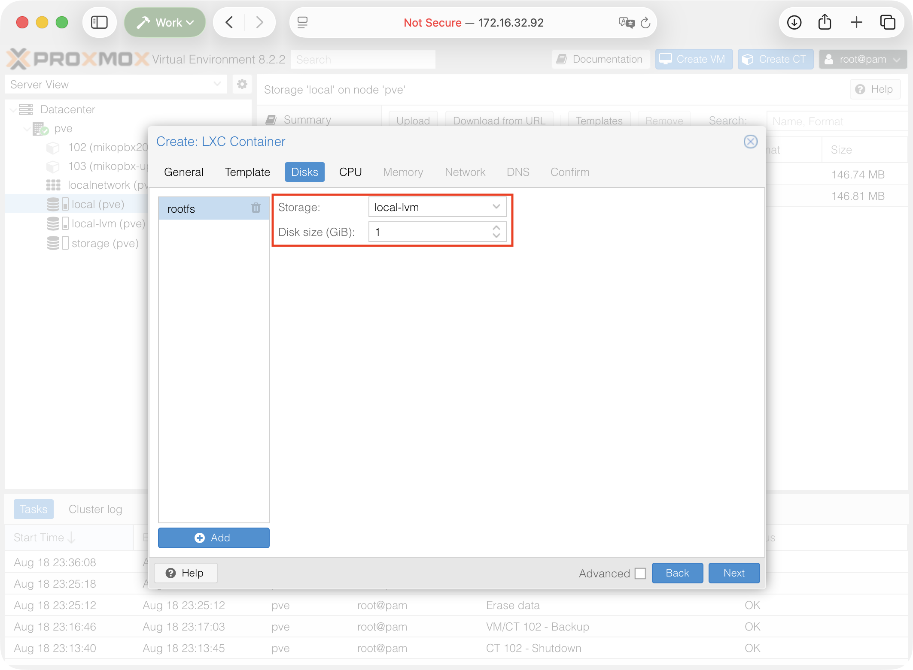<figcaption>
Creating the Root Disk
</figcaption></figure>

### CPU and Memory

Specify the same number of CPU cores and the same Memory and Swap values as on the old container.

<figure>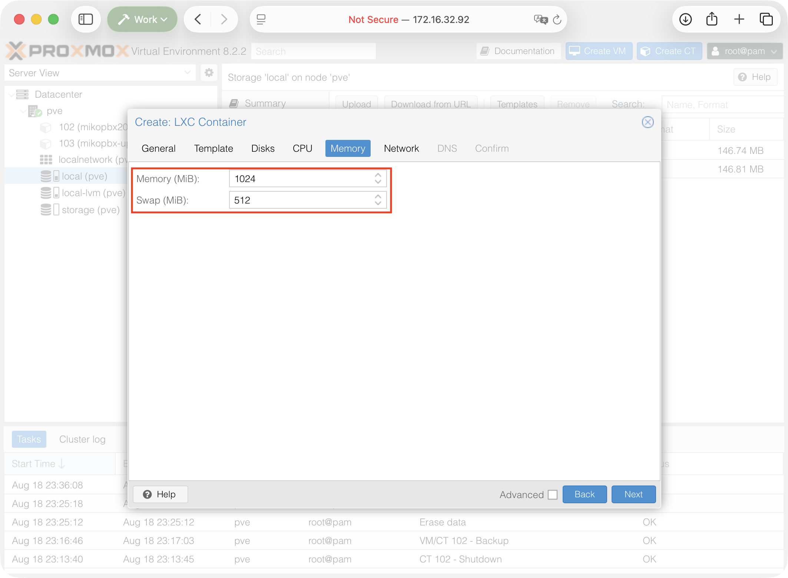<figcaption>
Specifying container resources
</figcaption></figure>

### Network

Reproduce the network settings of the old CT. For testing, we recommend using an available temporary IP address and a new MAC address to avoid a conflict with the old container.

If DHCP is used, the new CT may obtain a different address automatically. If the DHCP server reserves the address by MAC address, create a separate reservation for the new MAC address in advance.

<figure>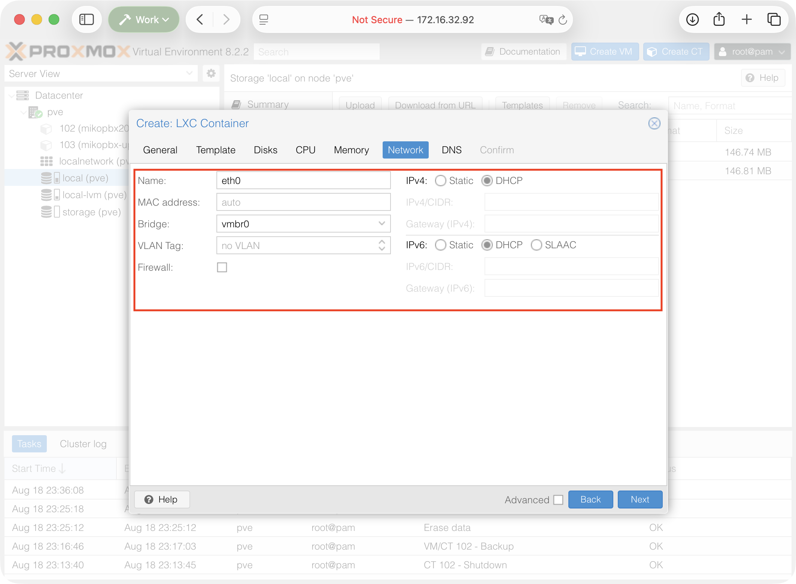<figcaption>
Network settings for the new container
</figcaption></figure>

### DNS and Confirm

Reproduce the DNS settings of the old CT:

* Carefully review the settings on the **Confirm** page.

Clear the **Start after created** checkbox. The new container must not be started before `/cf` and `/storage` are attached. Click **Finish** and wait for the **TASK OK** message.

Open the new CT → **Resources**. At this stage, the list must contain the new **Root Disk**, but it must not contain `/cf` or `/storage` mount points.


The [Installing MikoPBX in Proxmox LXC](../../../setup/hypervisor/proxmox/lxc.md) guide describes the CT creation wizard in detail. During an update, skip the steps for adding new `/storage` and `/cf` disks.


<figure>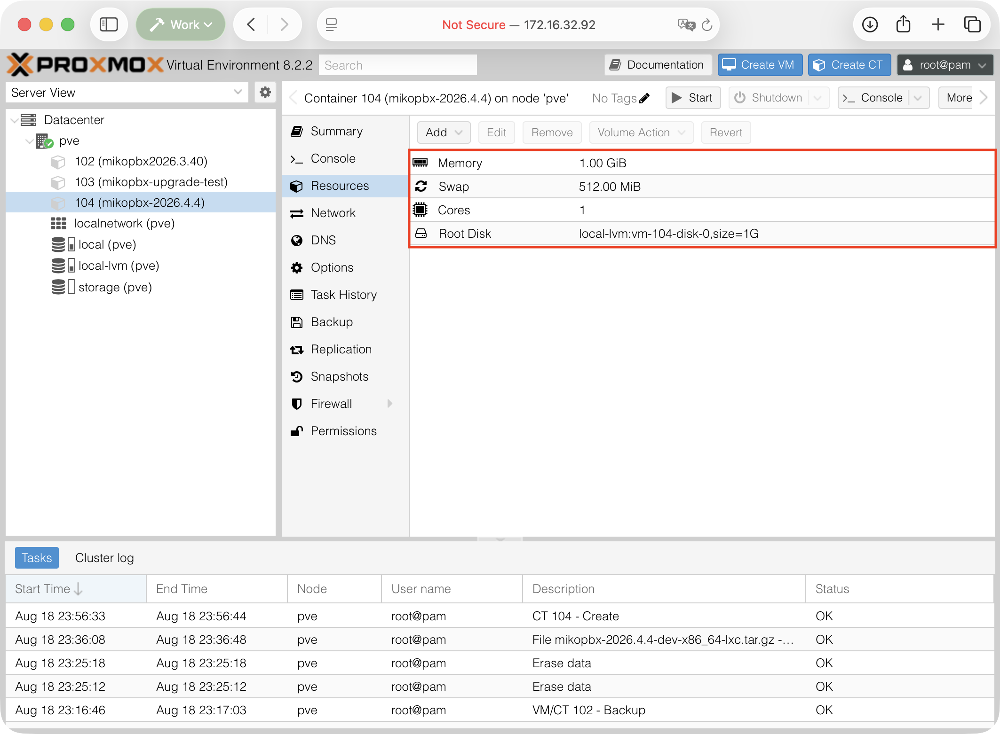<figcaption>
Example of the Resources tab after the new container is created correctly
</figcaption></figure>

## Step 5. Reassign the `/storage` disk

1. Open the old CT → **Resources**. Select the **Mount Point** entry whose settings contain `mp=/storage`. Click **Volume Action** → **Reassign Owner**.

<figure>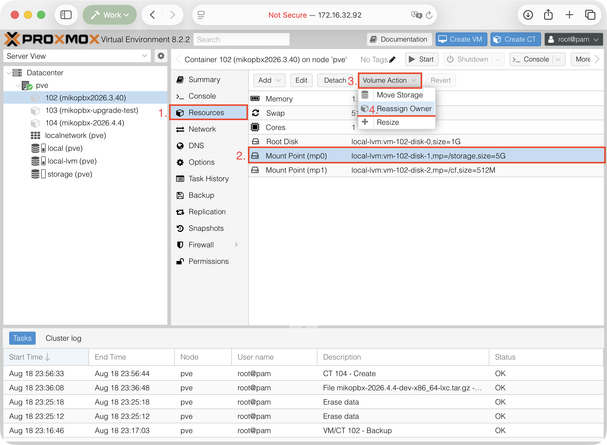<figcaption>
Reassigning <em>/storage</em>
</figcaption></figure>

2. In the **Target** field, select the new CT. Leave **Mount Point** selected in the **Add as** field. Proxmox suggests an available mount point number, such as `mp0`. Make sure the selected number is not already in use.

Click **Reassign Volume**.

<figure>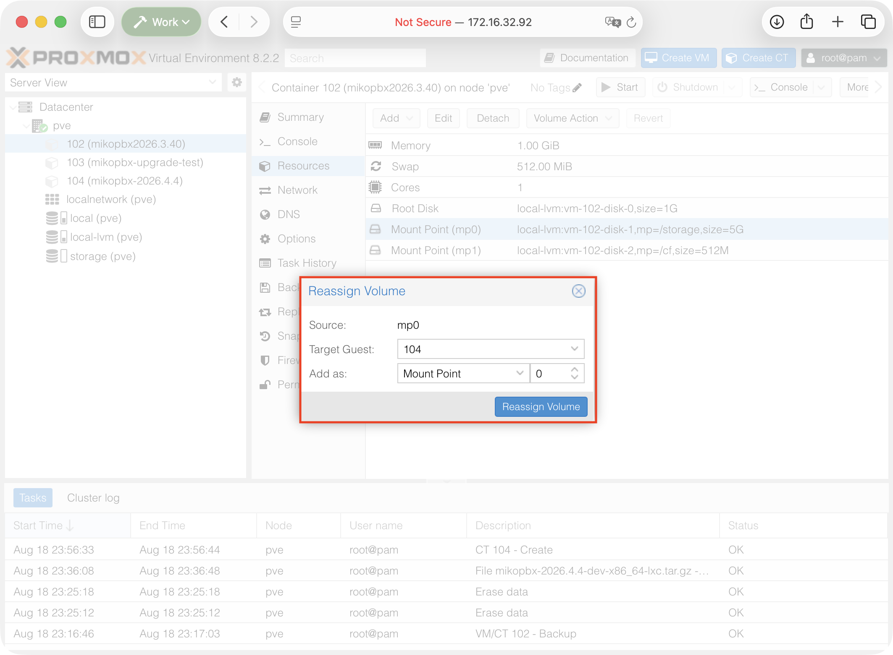<figcaption>
Reassigning <em>/storage</em>
</figcaption></figure>

After the operation, the volume disappears from the old CT's **Resources** section and appears under the new CT. Proxmox changes the volume owner and, if necessary, renames it for the new CT ID. The contents of the disk are neither copied nor formatted.

## Step 6. Reassign the `/cf` disk

Repeat the same procedure for the Mount Point whose settings contain `mp=/cf`:

1. Open the old CT → **Resources**. Select the **Mount Point** entry whose settings contain `mp=/cf`. Click **Volume Action** → **Reassign Owner**.

<figure>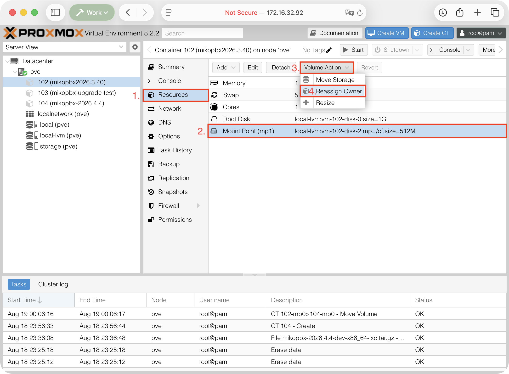<figcaption>
Reassigning <em>/cf</em>
</figcaption></figure>

2. Select the new CT. Leave **Add as → Mount Point** selected. Choose the next available number, such as `mp1`, and click **Reassign Volume**.

<figure>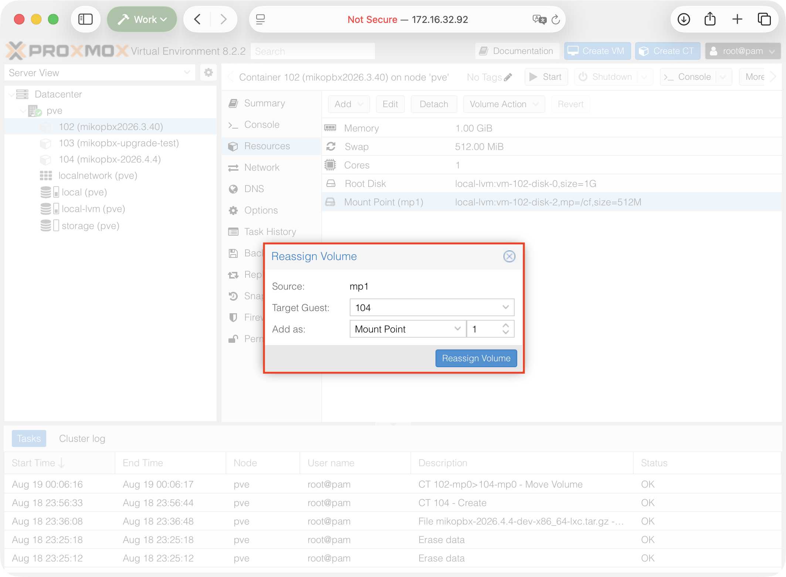<figcaption>
Reassigning <em>/cf</em>
</figcaption></figure>

3. Open the new CT → **Resources** and check the final configuration:

* **Root Disk** belongs to the new CT;
* one Mount Point contains `mp=/storage`;
* the other Mount Point contains `mp=/cf`;
* the `/storage` and `/cf` sizes match the sizes of the old volumes.

The `mp0` and `mp1` numbers may be in a different order. The `mp=/storage` and `mp=/cf` paths are what matter.

<figure>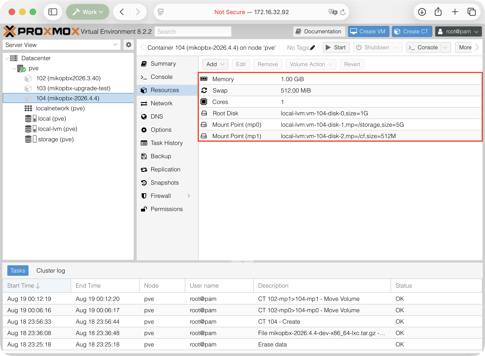<figcaption>
Example of the Resources tab on the new container
</figcaption></figure>

## Step 7. Perform the first boot

1. Select the new CT and click **Start**. Open the **Console** tab.

<figure>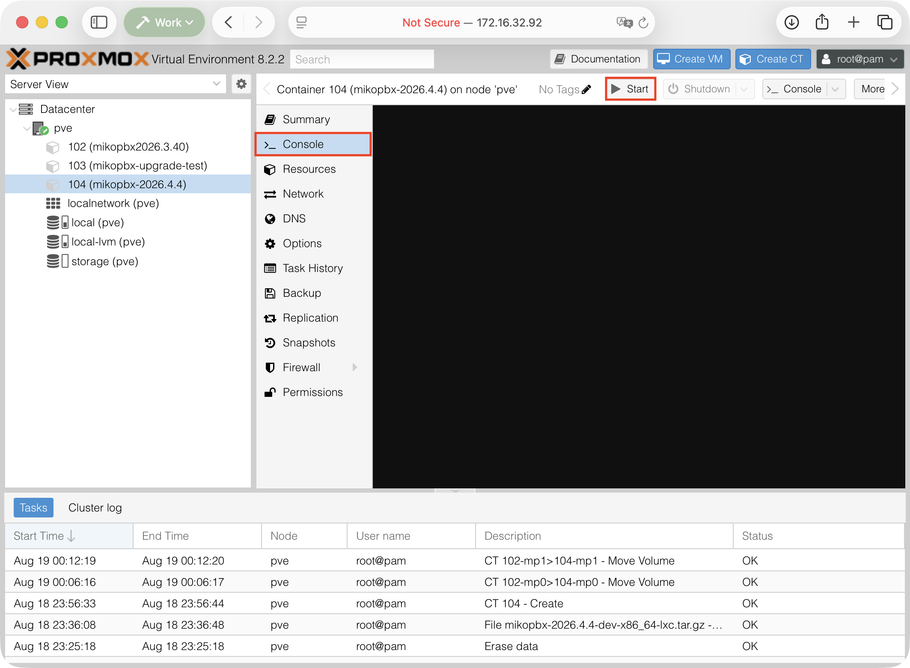<figcaption>
Opening the Console tab and starting the container
</figcaption></figure>

2. Wait for MikoPBX to finish booting and display the web interface address.


The first boot may take several minutes. The new version checks the existing configuration, performs the required database migrations, and starts the telephony services. Do not restart the CT or turn off its power during this process.

If the web interface does not open, first check under **Resources** that both volumes are attached with the correct paths. <mark style="color:$danger;">Do not start the old CT while the volumes belong to the new one.</mark>


<figure>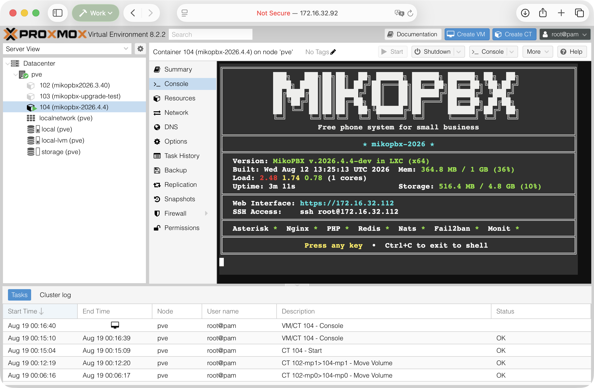<figcaption>
The new container console with the MikoPBX status screen
</figcaption></figure>

3. Open this address in a browser and sign in with the previous MikoPBX login and password.

<figure>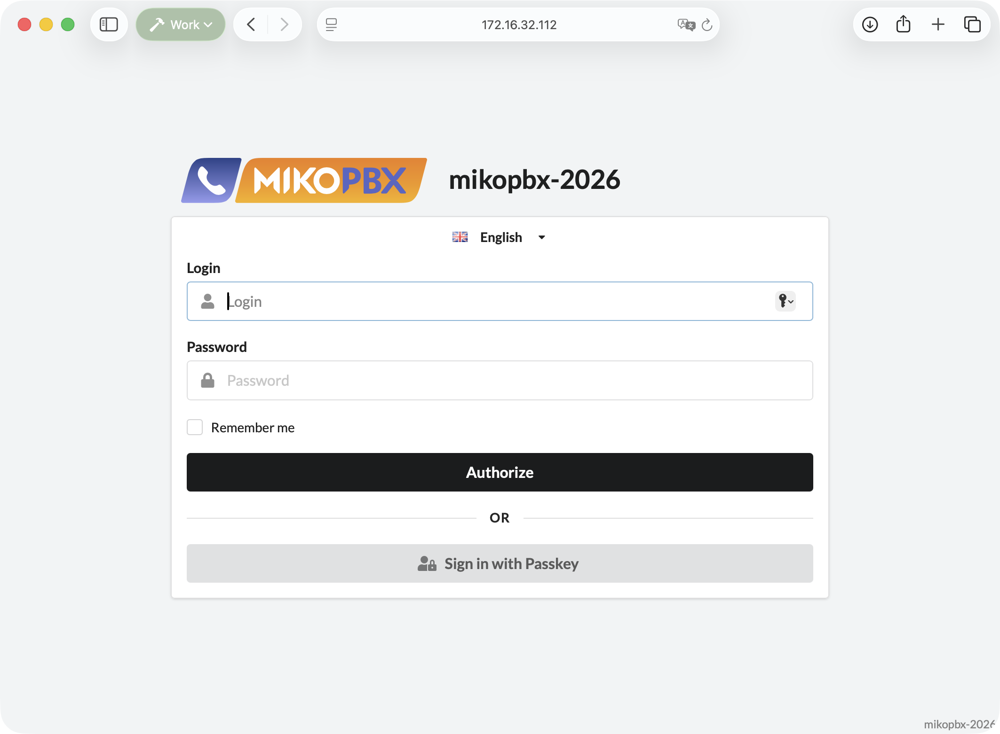<figcaption>
The updated MikoPBX web interface
</figcaption></figure>

## Step 8. Switch to the production IP address

If the new CT received the previous production IP address immediately, skip this step.

If a temporary address was used for testing:

1. Stop the new CT.
2. Make sure once again that the old CT is stopped.
3. Open the new CT → **Network** and select the `net0` interface.
4. Enter the previous MikoPBX IPv4/IPv6 address.
5. If the address is reserved on the DHCP server, move the reservation to the new MAC address or assign the old MAC address to the new CT.
6. Check the bridge, VLAN, gateway, and Proxmox Firewall settings.
7. If necessary, switch external NAT, DNS, and firewall rules to the new address.
8. Start the new CT.

The same IP or MAC address may be used only when the old container is completely stopped.

## Verification after the update

Do not delete the old CT until all checks have been completed.

1. Verify in the web interface that the new MikoPBX version is displayed.
2. Check the extensions, SIP accounts, providers, and inbound and outbound routes.
3. Open **Telephony → Call history** and make sure the previous call history is available.
4. Play several old call recordings from different dates.
5. Check the installed modules, their licenses, and settings.
6. Make sure the phones and providers are registered or have the expected status.
7. Make an internal, outbound, and inbound test call.
8. Check that the new call appears in the history and that its recording can be played.
9. Reboot the new CT through Proxmox.
10. After the reboot, check the web interface, network, registrations, and a test call again.

## Roll back to the old container

If the new version does not work correctly:

1. Stop the new CT.
2. Under its **Resources**, select the `/storage` Mount Point.
3. Select **Volume Action → Reassign Owner** and return the volume to the old CT.
4. Return the `/cf` volume to the old CT in the same way.
5. Verify that `mp=/storage` and `mp=/cf` are present on the old CT again.
6. Restore the old IP, MAC, DNS, and NAT settings.
7. Start the old CT and verify its operation.


The new version may have changed the database structure on `/cf`. Returning the volumes therefore does not guarantee compatibility with the old MikoPBX version. If the old CT does not start correctly, restore it from the Proxmox backup or restore the settings from the MikoPBX archive created before the update.


## Completing the update

Keep the old CT stopped and retain the backups for several days. Delete the old container only after:

* the new version has been running reliably;
* inbound and outbound calls have been tested;
* new call recordings are created and can be played;
* MikoPBX has rebooted successfully;
* a new backup of the updated PBX has been created.

Before deleting the old CT, open its **Resources** once more and make sure that `/cf` and `/storage` have actually been reassigned to the new container. The old Root Disk can then be deleted together with the old CT.


With this update method, years of call recordings remain on the original `/storage` disk. The switchover time does not depend on the volume of recordings because Proxmox changes the volume owner instead of copying its contents.

