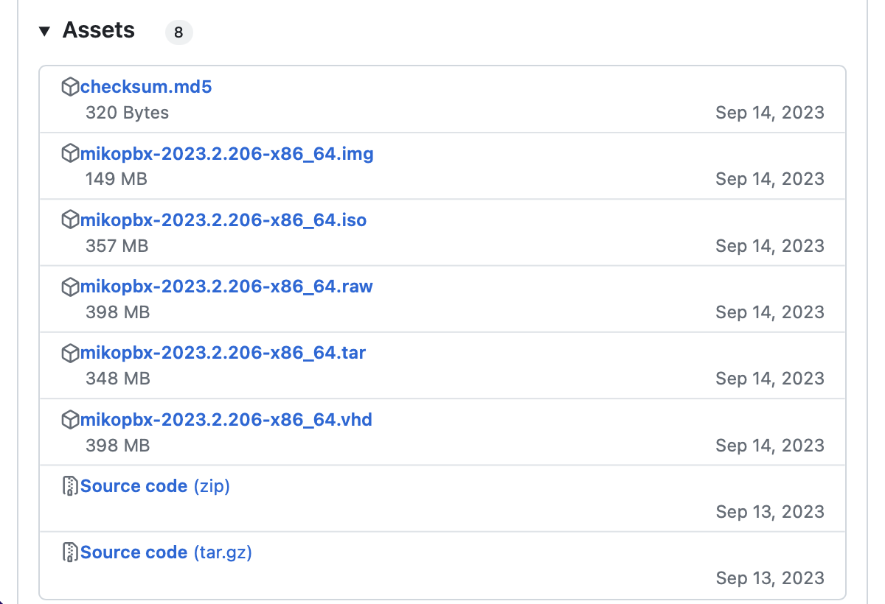
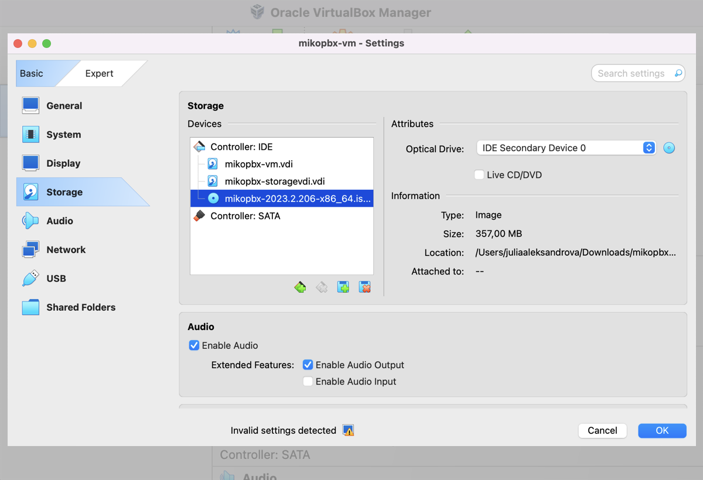
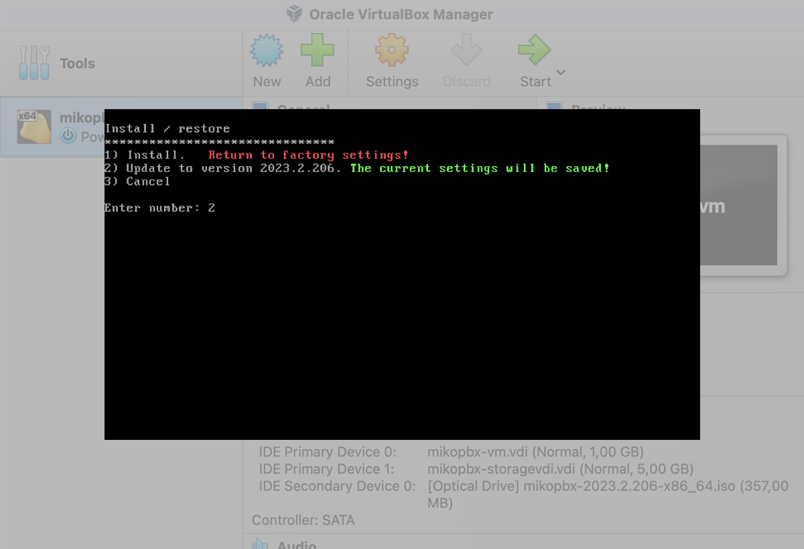
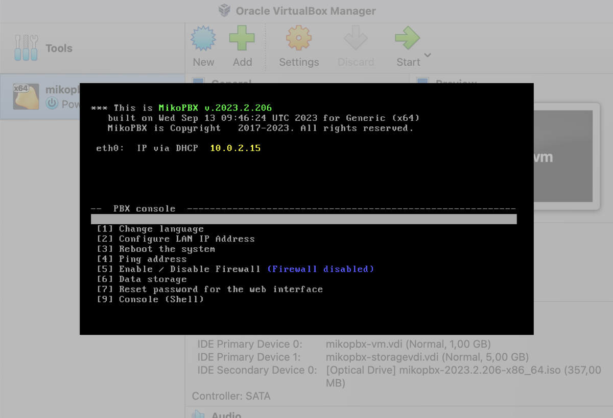

# Updating from the MikoPBX console

Below is an example of a PBX installed on a VirtualBOX virtual machine, updated from version 2023.1.223 to version 2023.2.206.\
Download the iso image of the required PBX version from the [repository](https://github.com/mikopbx/Core/releases).

<figure><figcaption></figcaption></figure>

In VirtualBOX, open the settings of the virtual machine where the PBX is installed.\
Go to the **Storage** section.\
Select the virtual optical drive.\
Click the icon  in the **Attributes** group, and click **Choose Disk File**.\
Select the downloaded PBX iso image.\
Start the machine.

<figure><figcaption></figcaption></figure>

The console will display the line "<mark style="color:red;">**The system loaded in Recovery mode**</mark>".

<figure><figcaption></figcaption></figure>

Select **Install / Repair** (or press the number **8** on the keyboard) and press **Enter**.

You need the command "**Update to version \*\*\*\*.\*.\*\*".** Press the number **2** on the keyboard, then press **Enter**.\
The update installation will begin. When it is complete, the PBX will reboot.

<figure><figcaption></figcaption></figure>

After the PBX reboots, the message "<mark style="color:red;">**The system loaded in Recovery mode**</mark>" will no longer appear, indicating that the PBX has booted from the hard disk and not from the virtual optical drive.\
The installed update version will be displayed in green at the top.

<figure><figcaption></figcaption></figure>
