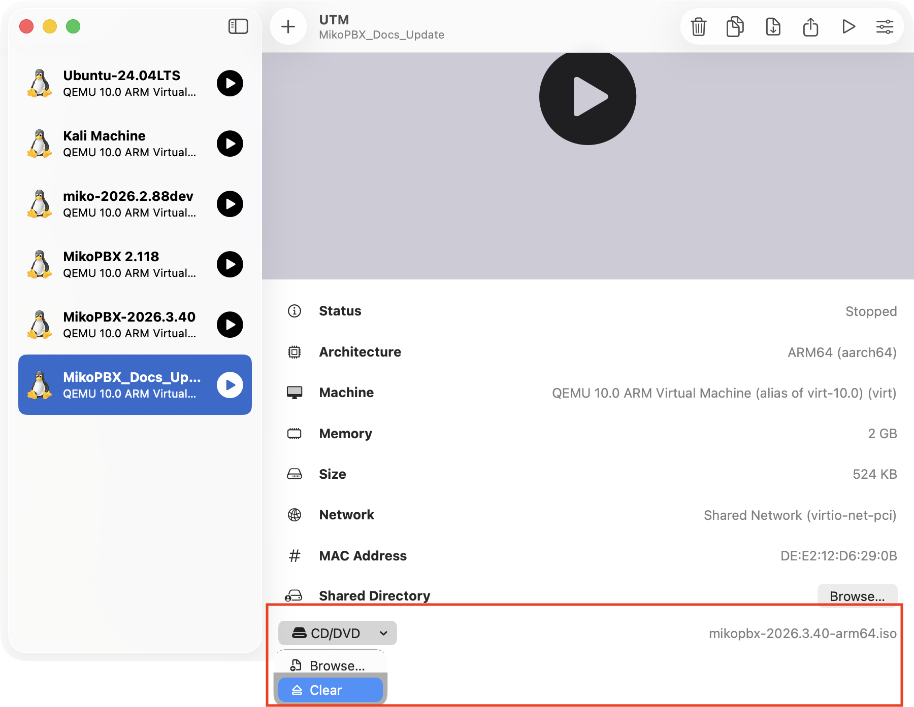

# Updating a virtual machine


We recommend updating sequentially, without skipping releases and versions.


This guide is intended for MikoPBX installed as a full-fledged virtual machine in VMware, VirtualBox, Hyper-V, KVM, Proxmox VE, and other hypervisors.

Two update methods are available for this type of installation:

* **through the web interface** — the primary and most convenient method;
* **from an ISO image** — a fallback method if the web interface is unavailable or the system needs to be recovered.


Before updating, be sure to create a backup of the MikoPBX settings. Additionally, it is recommended to create a virtual machine snapshot using the hypervisor's tools.


## Preparation

1. Make sure you have access to the web interface and the virtual machine console. Create a backup of the MikoPBX settings and call recordings.
2. Create a virtual machine snapshot. If the hypervisor allows, take it with the virtual machine powered off.
3. Make sure at least **400 MB** is free on the system disk.
4. Schedule a maintenance window: during the update, MikoPBX will reboot, and current calls will be dropped.


Do not power off the virtual machine and do not perform a forced reset while the update is being written.


## Updating through the web interface

### Updating to a version from the list

1. Open the MikoPBX web interface.
2. Go to **Maintenance** → **PBX update**.

<figure><figcaption>
The "PBX update" section
</figcaption></figure>

3. In the **"Online updates available"** table, find the version you need. Review the list of changes and click the update button next to the selected version.

<figure><figcaption>
Button for updating the PBX from the web interface
</figcaption></figure>

4. Wait for the image to download. Do not close the page until the confirmation dialog appears. Enter the phrase **"Yes, I have a backup"**. Click **Update**.

<figure><figcaption>
Confirmation that a backup exists
</figcaption></figure>

MikoPBX will prepare the update and reboot the virtual machine automatically.

### Updating with a local IMG file

This method is suitable if the required version is not in the list of online updates or the file has already been downloaded in advance.

1. Download the `.img` file of the required version from the [MikoPBX releases](https://github.com/mikopbx/Core/releases) page.


Pay attention to the architecture of your MikoPBX: if you have an ARM MikoPBX, use the update file with "arm64" in its name. If you have an x86 MikoPBX, use the update file with "x86\_64" in its name.


<figure><figcaption>
Downloading an .img for the update
</figcaption></figure>

2. In the web interface, open **Maintenance** → **PBX update**.

<figure><figcaption>
The "PBX update" section
</figcaption></figure>

3. In the file selection field, specify the downloaded `.img`.


The update form only accepts a `.img` file. ISO, RAW, VHD, and the LXC archive are not suitable for this method.


<figure><figcaption>
Field for selecting the update file
</figcaption></figure>

4. Click **Apply update**.

<figure><figcaption>
The "Apply update" button
</figcaption></figure>

5. Enter the phrase **"Yes, I have a backup"**. Confirm the update and wait for the reboot.

<figure><figcaption>
Confirmation that a backup exists
</figcaption></figure>

## Updating from an ISO image

Use this option if the PBX does not boot normally, the web interface is unavailable, or you need to perform the update from Recovery mode.

1. Download the ISO image of the required version from the [MikoPBX releases](https://github.com/mikopbx/Core/releases) page.


Pay attention to the architecture of your MikoPBX: if you have an ARM MikoPBX, use the update file with "arm64" in its name. If you have an x86 MikoPBX, use the update file with "x86\_64" in its name.


<figure><figcaption>
Downloading an .iso from the MikoPBX GitHub
</figcaption></figure>

2. Power off the virtual machine. In the hypervisor settings, connect the ISO to the virtual CD/DVD drive and set booting from the virtual CD/DVD before the system disk.

<figure><figcaption>
Example of a connected .iso in the UTM hypervisor
</figcaption></figure>

3. Start the virtual machine and open its console.
4. Wait for the message about booting in recovery mode — **System booted in recovery mode (Live CD)**.

<figure><figcaption>
MikoPBX booted in Recovery mode
</figcaption></figure>

5. Press any key to open the console menu. Then open **"[4] Install or recover"**.

<figure><figcaption>
The "Install or recover" section in the MikoPBX console menu
</figcaption></figure>

6. Select **"Update to version..."**


Do not select the **Install** option. It starts a new installation and warns that data on the selected disk will be erased. To update while keeping the settings, use the **Update to version ...** option.


<figure><figcaption>
Updating to version 2026.3.40
</figcaption></figure>

After the operation is complete:

1. Power off the virtual machine if the ISO was not disconnected automatically.
2. Disconnect the ISO from the virtual drive.
3. Restore booting from the system disk as the first boot device.
4. Start the virtual machine.

<figure><figcaption>
MikoPBX updated to version 2026.3.40
</figcaption></figure>
