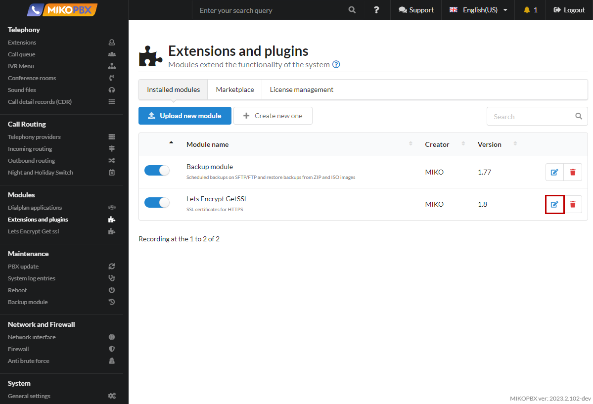

# Extensions and plugins

Additional modules allow you to expand the functionality of the main system.

<figure><figcaption></figcaption></figure>

If you do not have these modules connected and installed, the "**Marketplace**" section will be available to you. In front of each module there is a button for downloading and installing it.

<figure><figcaption></figcaption></figure>


If you are using the latest versions of modules, the list of "**Modules available for installation**" will be empty.


## Quick access to the module


The functionality is available for the MikoPBX **2019 version.4.94+**


Any module can be moved to the side menu of the interface:

<figure><figcaption></figcaption></figure>

1. Click on the edit icon to the right of the module

<figure><figcaption></figcaption></figure>

2. Click on the settings icon in the upper right part

<figure><figcaption></figcaption></figure>

3. Enable the "**Show module in sidebar menu**" option

Click "**Save**"

<figure><figcaption></figcaption></figure>
