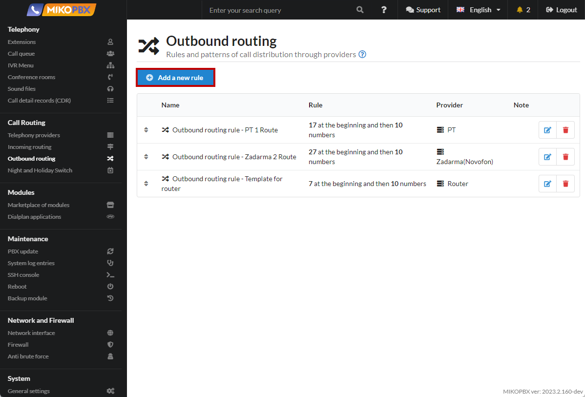
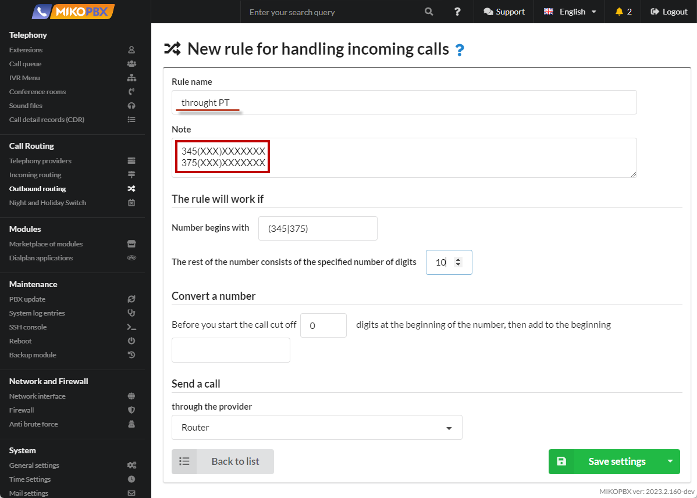
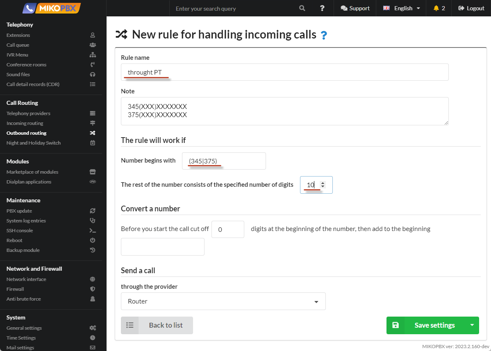
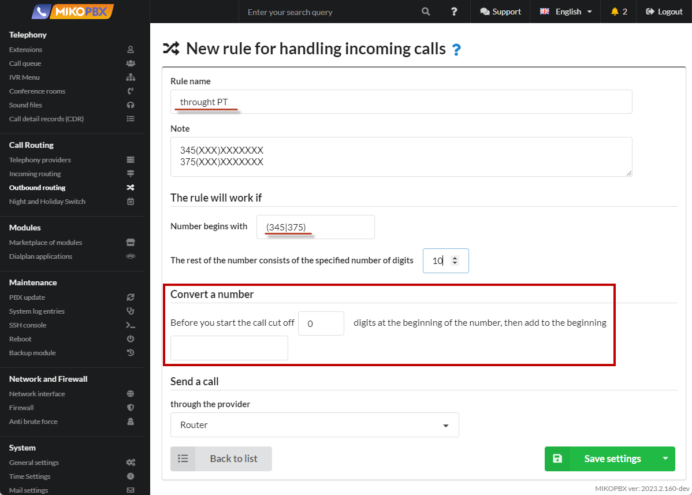
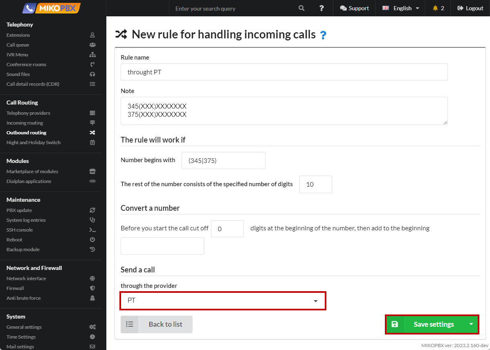
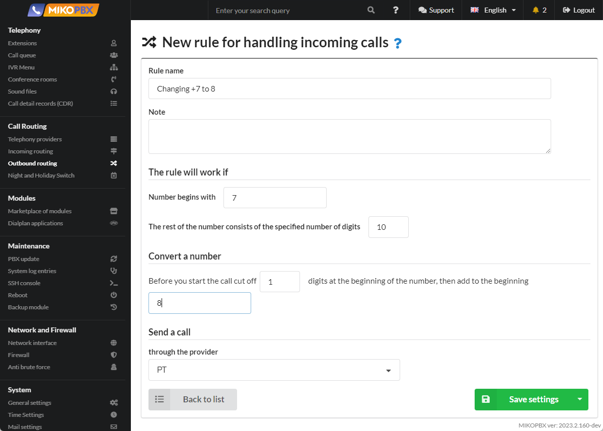
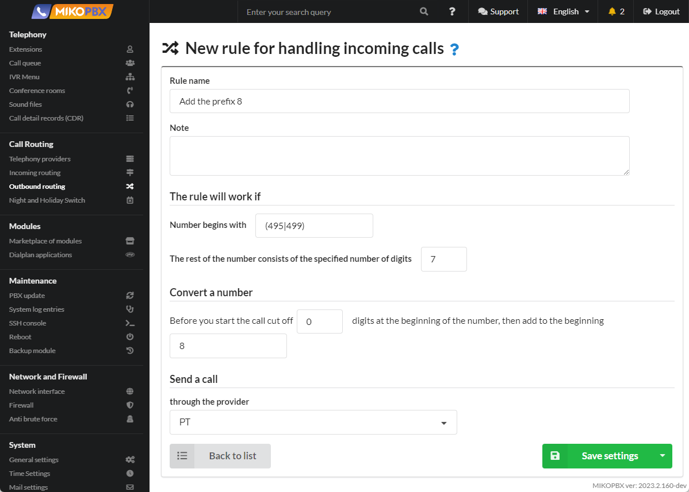

# Outbound routing

## Purpose

<figure><figcaption>
Outbound routing section
</figcaption></figure>

## Create a rule

In this section, you need to create rules and templates for distributing outgoing calls for providers connected to the PBX.

You can create an unlimited number of outbound routing rules.

You can create several rules for one provider.


Additional examples of configuring outgoing routing are available in the [FAQ ](broken-reference)section.


### Step 1: Add a new rule

To add a new outgoing routing rule, click the **Add a new rule** button.

<figure><figcaption>
New rule in outbound routing
</figcaption></figure>

### Step 2: Title and Note

The name of the rule can be set arbitrarily.

&#x20;In a note, you can describe the call route that you want to implement; this can help you in debugging in the future.

<figure><figcaption>
Step 2: Title and Note
</figcaption></figure>

### Step 3. Setting the number template

Set a template for outgoing calls. Read more about number templates in the [next paragraph](outbound-routing.md#primery-shablonov-nomerov).

<figure><figcaption>
Step 3: Setting the number template
</figcaption></figure>

The example in the picture above means the following: if the dialed number starts with "**345**" or "**375**" and the rest of the number consists of **10 digits.**


If the dialed number matches the rules of several routes, then the call will be made in the order of the route descriptions, one by one, until the call is answered, or until there are no more suitable routes.


### Step 4: Number Conversion

Convert number - this setting is intended to remove the number prefix and replace it with the desired prefix.

Set a template for outgoing calls. Read more about number templates in the [next paragraph](outbound-routing.md#primery-shablonov-nomerov).

<figure><figcaption>
Step 4: Number Conversaion
</figcaption></figure>

In the example given, digits **are not cut off at the beginning of the number and digits are not added.**

### Step 5. Selecting a provider

Select from the list the provider for which you configured outgoing routing and save the changes.

<figure><figcaption>
Step 5: Selecting a provider
</figcaption></figure>

## Examples

### Examples of number templates

<table data-full-width="true"><thead><tr><th width="262">The number starts with</th><th width="536.3333333333333">The rest of the number consists of the specified number of digits</th><th>Examples of numbers</th></tr></thead><tbody><tr><td>[7-8]{1}</td><td>10</td><td>79257184255, 84952293042</td></tr><tr><td>7925</td><td>leave the field blank</td><td>79257184255, 7925, 7925718…</td></tr><tr><td>7ХХ</td><td>0</td><td>700, 701, 702…</td></tr><tr><td>74952293042</td><td>0</td><td>74952293042</td></tr><tr><td>74(95|99)</td><td>7</td><td>74952293042, 74996382584…</td></tr><tr><td>(7|8)0{1}</td><td>1</td><td>700, 701, 802, 803…</td></tr><tr><td>(25|26)</td><td>0</td><td>25, 26</td></tr><tr><td>[0-9]{1}</td><td>0</td><td>digit from 0 to 9, occurrence once</td></tr><tr><td>[1-5]{2}</td><td>0</td><td>12, 15, 14, 25 digit from 1 to 5, occurrence twice</td></tr><tr><td>[8-9]+</td><td>0</td><td>8899, 888, 988888 digit from 8 to 9, occurrence one or more times</td></tr></tbody></table>

### Examples of changing number prefixes

#### Example 1. It is necessary to replace the number prefixes “+7” with “8”.

For example, the number **+7**4952293042 should be converted to the number **8**4952293042.

The implementation of the rule looks like this:

<figure><figcaption>
+7 to 8
</figcaption></figure>

#### Example 2. It is necessary to replace the number prefixes “8”, “7” with “+7”.

For example, the numbers **8**4952293042 and **7**4952293042 should be converted to **+7**4952293042.

The implementation of the rule looks like this:

<figure><figcaption>
7 and 8 to +7
</figcaption></figure>

#### Example 3: You need to add the prefix "8" to the number.

For example, the numbers 4952293042 and 4996382584 should be converted to **8**4952293042 and **8**4996382584 respectively.

The implementation of the rule looks like this:

<figure><figcaption>
Prefix 8
</figcaption></figure>

#### Example 4: You need to remove the area code "8495" or "7495" or "8499" or "7499" and leave the 7-digit number.&#x20;

For example, the numbers 84952293042 and 74996382584 should be converted to 2293042 and 6382584 respectively.

The implementation of the rule looks like this:

<figure><figcaption>
Remove prefix
</figcaption></figure>

