# Провайдеры телефонии

## Общие сведения

Чтобы совершать или принимать внешние телефонные звонки по телефонной сети общего пользования или Интернет, вы должны создать, по крайней мере, одну учетную запись провайдера.\
Каждая технология имеет свой тип учетной записи. Для добавления новой учетной записи или изменения существующей, перейдите в **Маршрутизация** -> **Провайдеры телефонии**.

<figure><figcaption></figcaption></figure>

Обзор провайдеров содержит список всех доступных поставщиков услуг. Зеленый значок перед именем поставщика означает, что MikoPBX зарегистрировала этого провайдера, и Вы можете начать работу с этим провайдером. \
С помощью переключателя слева можно включать использование провайдера и отключать соответственно.

<figure>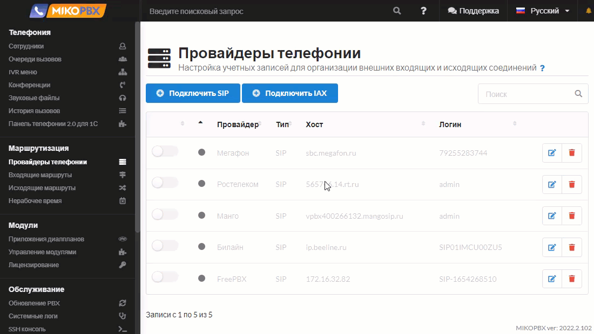<figcaption></figcaption></figure>

Для подключения новой учетной записи провайдера нажмите **Подключить SIP** или **Подключить IAX** в зависимости по типа подключаемой учетной записи.

<figure>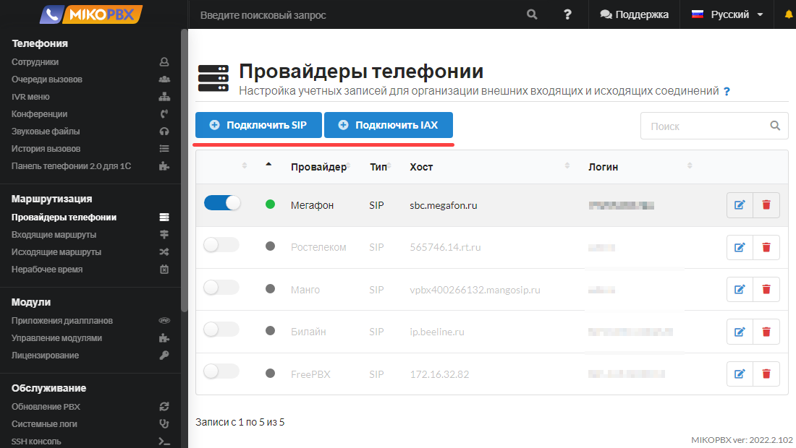<figcaption></figcaption></figure>

## Настройка SIP провайдера <a href="#nastrojka_sip_provajdera" id="nastrojka_sip_provajdera"></a>

### Общие настройки


Инструкции по подключению наиболее популярных поставщиков услуг можно найти в [нашем FAQ](../../faq/providers/).


<figure>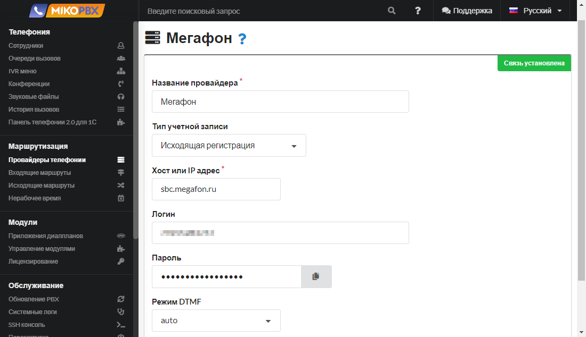<figcaption></figcaption></figure>

В общих настройках SIP провайдера укажите следующие настройки:

**Название провайдера** - произвольное удобное вам наименование. Оно будет отображаться в списках выбора в соответствующих меню.

**Тип учетной записи** - тип регистрации учетной записи провайдера. [Подробнее про тип регистрации](providers.md#podrobnee-pro-tip-registracii).

**Хост или IP адрес** - может быть либо URL либо IP-адресом

**Логин** и **Пароль**, который предоставляет ваш провайдер

**Режим DTMF** - определяет, как DTMF сигналы передаются через SIP. Cуществуют различные стандарты, используемые для передачи DTMF SIP-провайдерам. Попробуйте использовать различные стандарты для того, чтобы найти режим, который подойдет вам.\
**inband** передает нажатия клавиш в качестве «тона». Для использования этого стандарта вам необходим аудио кодек высокого качества. **Auto**, **rfc** и **info** передают нажатия клавиш в SIP кодирование.

### Расширенные настройки SIP провайдера <a href="#rasshirennye_nastrojki_sip_provajdera" id="rasshirennye_nastrojki_sip_provajdera"></a>

<figure>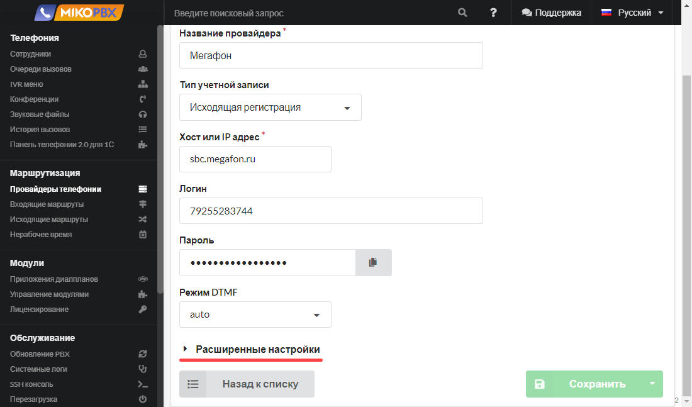<figcaption></figcaption></figure>

#### **Дополнительные адреса провайдера**

<figure>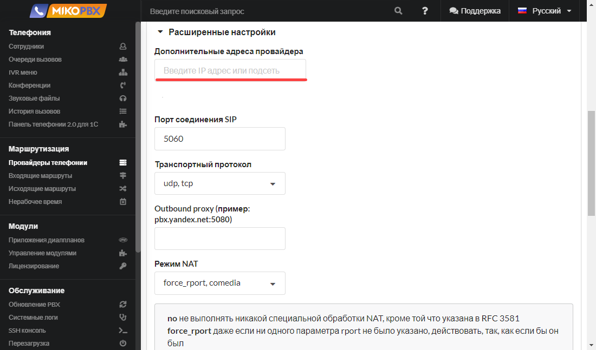<figcaption></figcaption></figure>

В этом разделе следует перечислить все адреса поставщика услуг связи, с которых могут приходит входящие звонки. Доступ для этих адресов к портам SIP и RTP будет автоматически открыт на firewall.

#### **Порт соединения SIP**

<figure>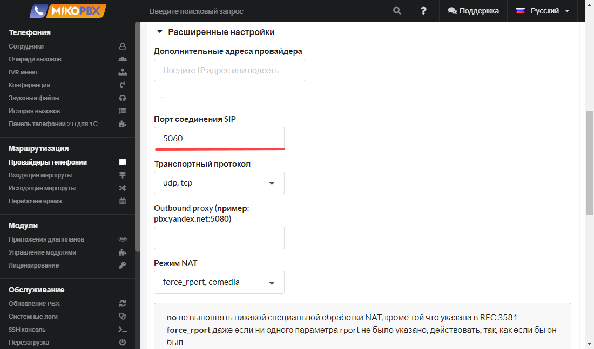<figcaption></figcaption></figure>

По умолчанию принимает значение **5060**. SIP протокол описывает, каким образом клиентское приложение (например, софтфон) может запросить начало соединения у другого, возможно, физически удалённого клиента, находящегося в той же сети, используя его уникальное имя.\
Протокол определяет способ согласования между клиентами об открытии каналов обмена на основе других протоколов, которые могут использоваться для непосредственной передачи информации (например, RTP).

#### **Транспортный протокол**&#x20;

<figure>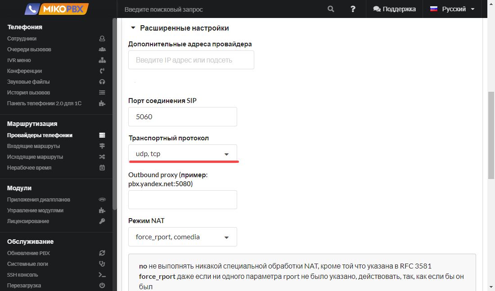<figcaption></figcaption></figure>

Позволяет указать используемый транспортный протокол для данной учетной записи провайдера.

#### **Outbound proxy**

<figure>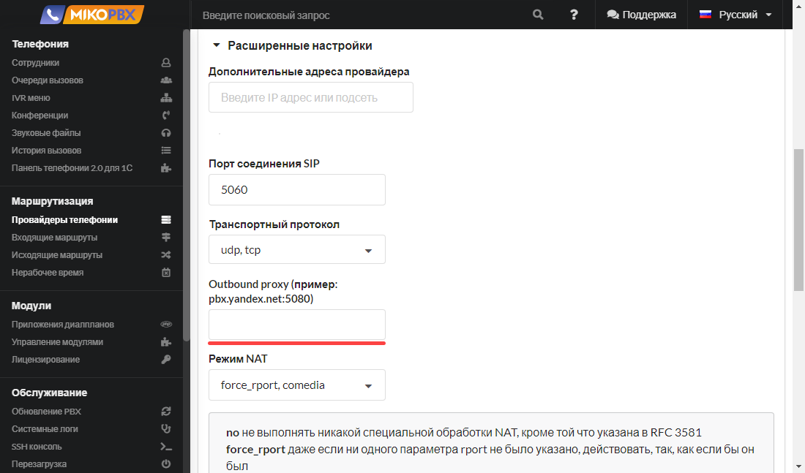<figcaption></figcaption></figure>

Это SIP прокси сервер провайдера для обработки запросов. Реальный SIP сервер, может отличаться от этого адреса. Outbound proxy принимает на себя первичные запросы и перенаправляет на нужный сервер.

#### **Режим NAT**&#x20;

<figure>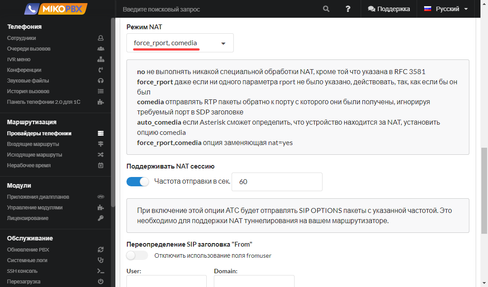<figcaption></figcaption></figure>

Режим NAT - Это механизм в сетях TCP/IP, позволяющий преобразовывать IP-адреса транзитных пакетов.

* **force\_rport,comedia** опция заменяющая nat=yes;
* **force\_rport** даже если ни одного параметра rport не было указано, действовать, так, как если бы он был;
* **comedia** отправлять RTP пакеты обратно к порту с которого они были получены, игнорируя требуемый порт в SDP заголовке;
* <mark style="color:red;"><mark style="background-color:red;">**auto\_comedia**<mark style="background-color:red;"></mark> <mark style="color:red;"></mark><mark style="color:red;">если Asterisk сможет определить, что устройство находится за NAT, установить опцию comedia;</mark>
* **no** не выполнять никакой специальной обработки NAT, кроме той что указана в RFC 3581.

#### **Поддерживать NAT сессию**&#x20;

<figure>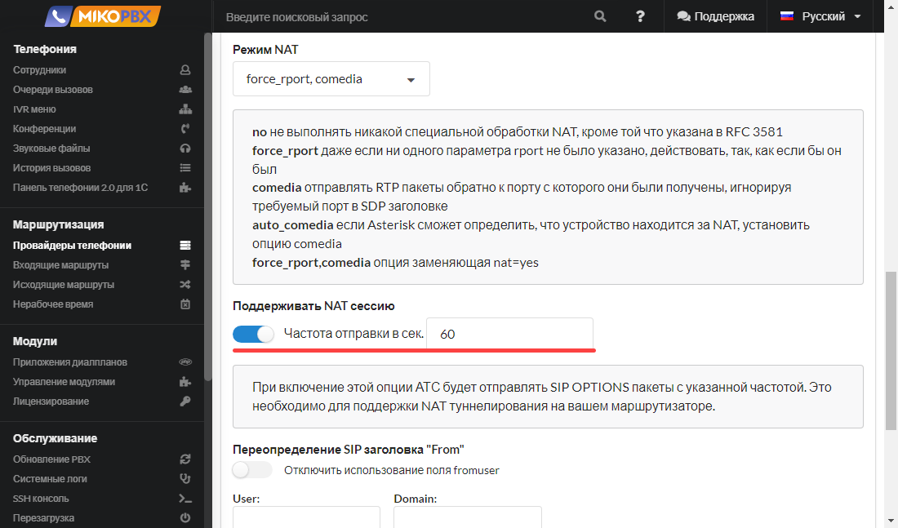<figcaption></figcaption></figure>

При включение этой опции Asterisk будет отправлять SIP Options пакеты. Это необходимо для поддержки NAT туннелирования на вашем маршрутизаторе.&#x20;

Укажите **частоту**, с которой Asterisk будет отправлять SIP сообщение типа OPTIONS для проверки, что данное устройство работает и доступно для совершения вызовов.&#x20;

Если данное устройство, не ответит в течение заданного периода (60 секунд по умолчанию), тогда Asterisk рассматривает это устройство как выключенное и недоступное для совершения вызовов.

#### **Переопределение SIP заголовка "From"**

Можно отключить использование поля **fromuser** заголовка SIP-пакета.

<figure>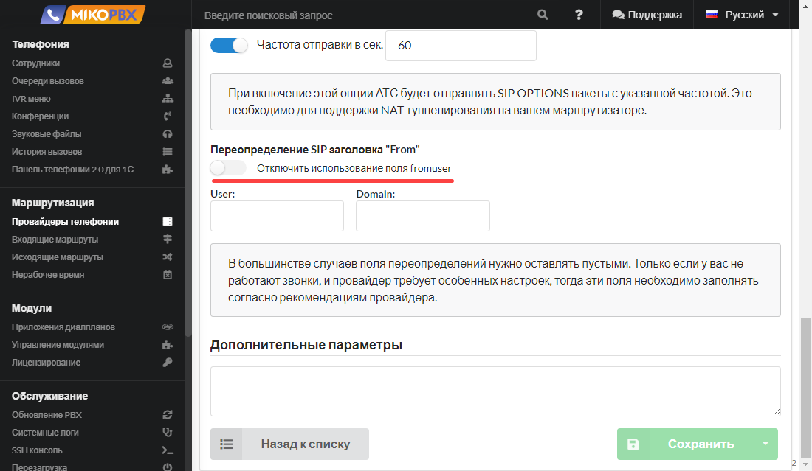<figcaption></figcaption></figure>

Параметры файла _pjsip.conf_ **fromuser** и **fromdomain** используются для вызовов исходящих от Asterisk в сторону SIP устройства.

Можно переопределить:&#x20;

* имя пользователя в поле From в SIP пакетах (**fromuser**);
* имя домена в поле From в SIP пакетах (**fromdomain**).

Для этого служат поля **User** и **Domain** соответственно.

<figure>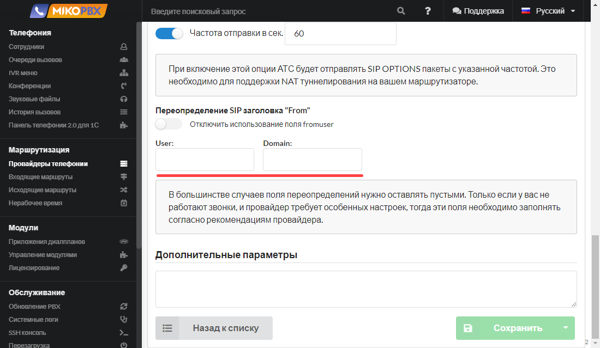<figcaption></figcaption></figure>

#### Дополнительные параметры <a href="#dopolnitelnye_parametry" id="dopolnitelnye_parametry"></a>


Актуально начиная с версии **2019.4**


<figure>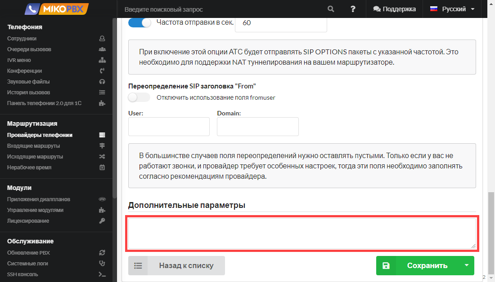<figcaption></figcaption></figure>

В этом поле вы можете изменять конфигурационные файлы Asterisk.

Переопределять можно практически все параметры. К примеру при использовании _chan\_pjsip_ провайдер описывается следующими секциями:


```
[REG-AUTH-***]
type = auth
; ----

[REG-***] 
type = registration
transport = transport-udp
; ----

[***-OUT]
type = auth
; ----

[***]
type = aor
max_contacts = 1
; ----

[***]
type = identify
; ----

[***]
type = endpoint
context = incoming
; ----
```


Для переопределения полей в секциях следует заполнить поле **Дополнительные параметры** следующим образом:


```
[registration-auth]
; описываем параметры авторизации для [REG-AUTH-***]

[registration]
; описываем параметры регистрации на удаленном сервере [REG-***]

[endpoint-auth]
; описываем параметры авторизации для исходящих звонков через провайдера

[identify]
; Секция отвечает за сопоставление регистрации и endpoint. При поступлении входящего звонка 
; согласно INVITE будет проведена проверка соответствия identify параметров с endpoint. 

[aor]
; Правка секции AOR для endpoint

[endpoint]
; Правка параметров endpoint
```


Для завершения настройки нажмите **Сохранить**.

<figure>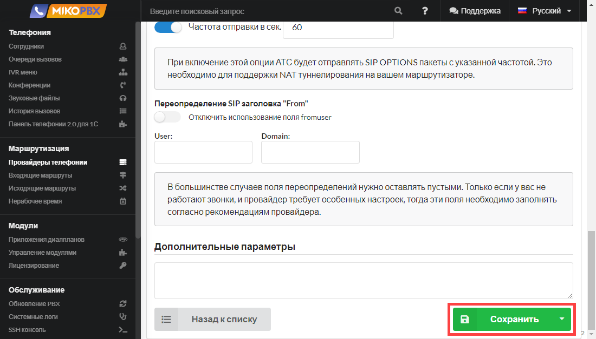<figcaption></figcaption></figure>

## Несколько провайдеров на одном IP <a href="#neskolko_provajderov_na_odnom_ip" id="neskolko_provajderov_na_odnom_ip"></a>


Актуально начиная с версии **2019.4**.\
Более общая версия инструкций, которая подойдет для более ранних версий доступна в статье <mark style="color:red;">Регистрация нескольких учетных записей от одного провайдера.</mark>


Бывают случаи, когда необходимо подключить несколько учетных записей одного поставщика услуг связи. В этом случае настройки **Хост или IP адрес** и **Порт соединения SIP** могут оказаться одинаковыми для всех учетных записей.

Asterisk такую ситуацию обыгрывает по-своему. АТС не сможет корректно «приземлить» вызов на нужного провайдера и вызов оборвется.

В качестве решения, в старых версиях АТС можно было для какой учетной записи описать дополнительные входящие маршруты и заполнить поле **Дополнительный номер (DID)** значением **Логин**. И так для каждой учетной записи требовалось создать N-ое количество дополнительных маршрутов, равное количеству аккаунтов провайдера.

Альтернатива инструкции <mark style="color:red;">Регистрация нескольких учетных записей от одного провайдера.</mark> Такой подход был не очевиден.

Поле **Логин** в большинстве случаев при входящем звонке будет использоваться в качестве номера назначения **Дополнительный номер (DID)**. И, учитывая, что выходящие маршруты для всех **Логин** будут описаны, вызов будет корректно обработан телефонной станцией.

## Подробнее про тип регистрации

#### **Исходящая регистрация**

Этот вариант используется при подключении большинства провайдеров.

Необходимость регистрации возникает в случае, когда провайдер не может знать, с какого IP-адреса будет подключаться клиент, к примеру, когда АТС расположена за NAT. Сервер провайдера обычно на публичном IP-адресе.

**Входящая регистрация**

Этот вариант актуален для работы некоторых FXO / GSM шлюзов **-** когда внешнее устройство должно подключиться к вашей АТС по логину и паролю.

Также этот вариант актуален, когда удаленное устройство находится за NAT и MikoPBX не может знать его IP адрес.

**Аутентификация по IP адресу, без пароля**

Актуально для безопасных частных сетей. Так к примеру Ростелеком часто ведет свой сетевой кабель и подключает клиента к своей локальной сети.

АТС и провайдер в данном случае должны находиться в одной и той же сети.

