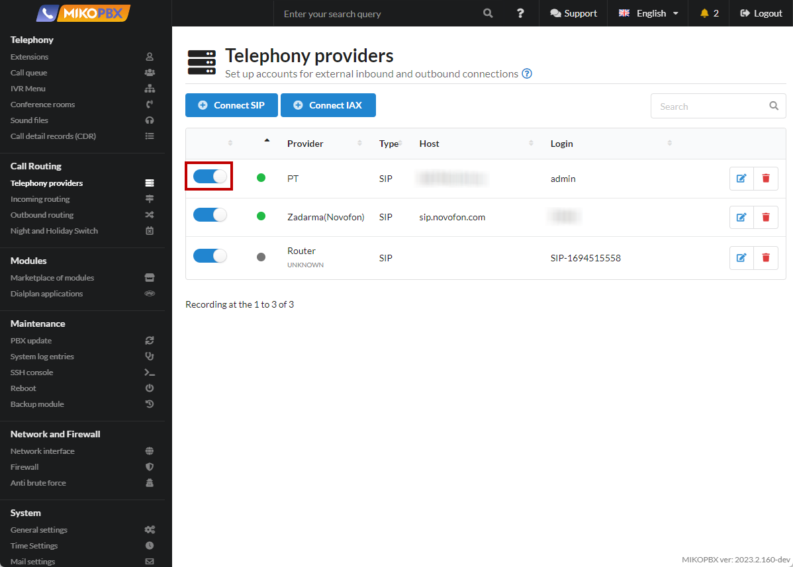
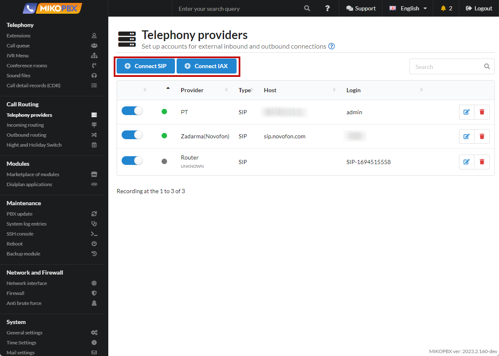
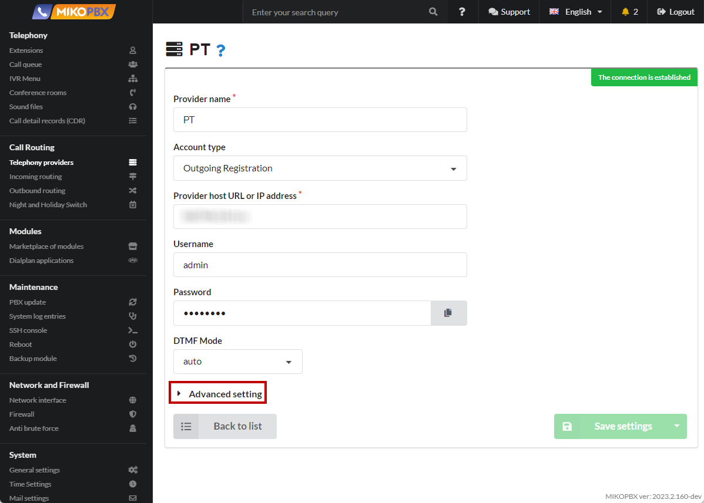
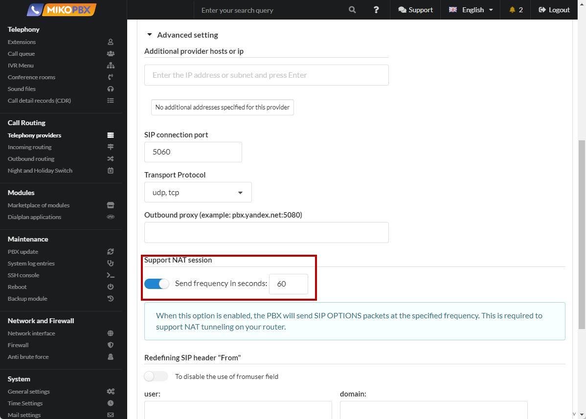
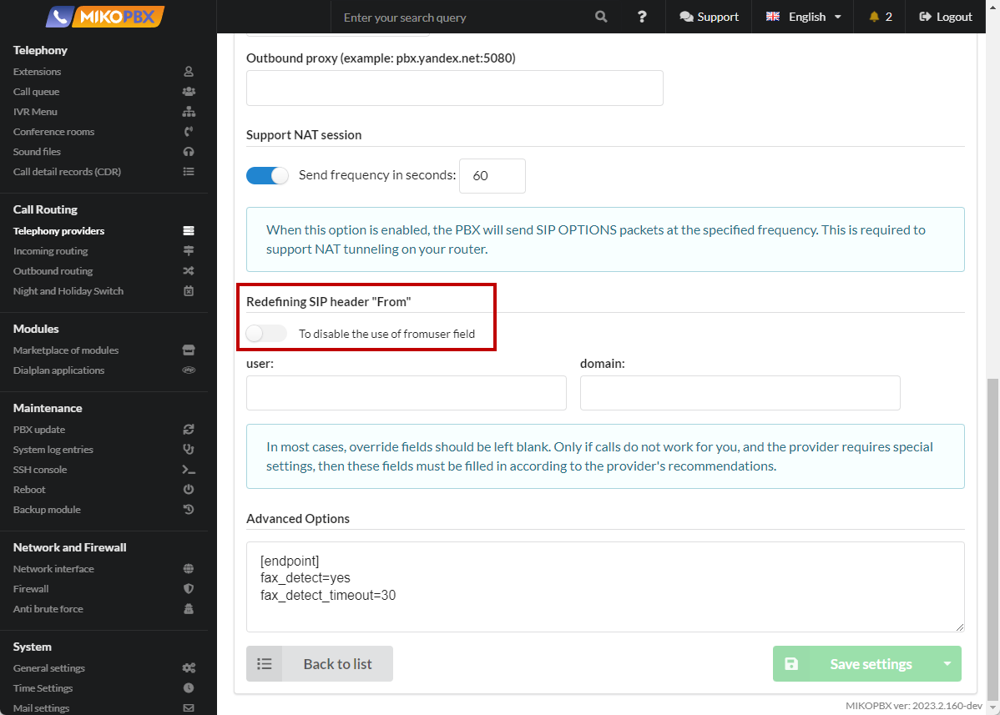
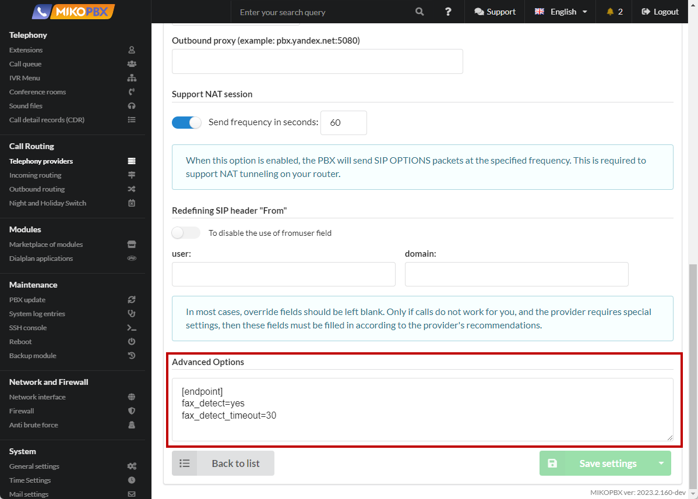
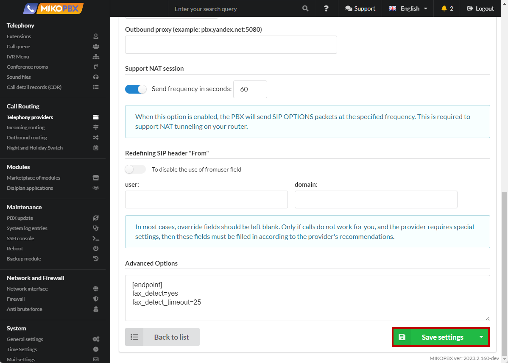

# VoIP providers

Translate to English:

## VoIP providers

### General Information

To make or receive external phone calls over the public switched telephone network or the Internet, you must create at least one provider account. Each technology has its own account type. To add a new account or modify an existing one, go to **Routing** -> **Telephony Providers**.

<figure><figcaption><p>Telephony providers section</p></figcaption></figure>

The provider overview contains a list of all available service providers. A green icon next to the provider's name indicates that MikoPBX has registered this provider, and you can start using this provider. You can enable or disable the use of the provider using the switch on the left.

<figure><figcaption></figcaption></figure>

To connect a new provider account, click **Connect SIP** or **Connect IAX** depending on the type of account you are connecting.

<figure><figcaption><p>Different types of connection </p></figcaption></figure>

### Setting up SIP Provider <a href="#nastrojka_sip_provajdera" id="nastrojka_sip_provajdera"></a>

#### General Settings


Instructions for connecting to the most popular service providers can be found in our [FAQ](broken-reference).


<figure><figcaption><p>General settibngs of provider</p></figcaption></figure>

In the general settings of the SIP provider, specify the following settings:

**Provider Name** - an arbitrary name that is convenient for you. It will be displayed in the selection lists in the corresponding menus.

**Account Type** - the type of registration for the provider account.&#x20;

**Provider host URL or IP Address** - can be either a URL or an IP address.

**Username** and **Password** provided by your provider.

**DTMF Mode** - determines how DTMF signals are transmitted over SIP. There are different standards used to transmit DTMF to SIP providers. Try using different standards to find the mode that suits you.

* **inband** sends keypresses as "tones." To use this standard, you need a high-quality audio codec.
* **Auto**, **rfc**, and **info** transmit keypresses through SIP encoding.

### Advanced SIP Provider Settings <a href="#rasshirennye_nastrojki_sip_provajdera" id="rasshirennye_nastrojki_sip_provajdera"></a>

<figure><figcaption><p>Advanced Settings</p></figcaption></figure>

**Additional provider hosts or ip**

In this section, list all communication service provider addresses from which incoming calls can arrive. Access to these addresses for SIP and RTP ports will be automatically opened on the firewall.

<figure><figcaption><p>Additional provider hosts or ip</p></figcaption></figure>

**SIP Connection Port**

By default, it is set to **5060**. The SIP protocol describes how a client application (e.g., a softphone) can request the initiation of a connection from another, possibly physically remote client in the same network using its unique name. The protocol defines how clients agree on opening exchange channels based on other protocols that can be used for direct information transmission (e.g., RTP).

<figure><figcaption><p>SIP Connection Port</p></figcaption></figure>

**Transport Protocol**

Allows you to specify the transport protocol used for this provider account.

<figure><figcaption><p>Transport Protocol</p></figcaption></figure>

**Outbound Proxy**

This is the provider's SIP proxy server for processing requests. The actual SIP server may differ from this address. The outbound proxy takes on primary requests and forwards them to the appropriate server.

<figure><figcaption><p>Outbound proxy</p></figcaption></figure>

**Support NAT Session**

When this option is enabled, Asterisk will send SIP OPTIONS packets. This is necessary to support NAT tunneling on your router.

Specify the **frequency** with which Asterisk will send OPTIONS-type SIP messages to check if this device is working and available for making calls.

If this device does not respond within the specified period (default is 60 seconds), Asterisk considers it turned off and unavailable for making calls.

<figure><figcaption><p>Support NAT Session</p></figcaption></figure>

**Redefining SIP Header "From"**

You can disable the use of the **fromuser** field of the SIP packet header.

<figure><figcaption><p>Redefining SIP Header "From"</p></figcaption></figure>

The **fromuser** and **fromdomain** parameters in the _pjsip.conf_ file are used for outgoing calls from Asterisk to the SIP device.

You can override:

* the username in the From field in SIP packets (**fromuser**).
* the domain name in the From field in SIP packets (**fromdomain**).

The fields **User** and **Domain** serve this purpose.

<figure><figcaption><p>User and Domain fields<br></p></figcaption></figure>

**Additional Parameters**

<figure><figcaption></figcaption></figure>

In this field, you can modify Asterisk configuration files.

You can override almost all parameters. For example, when using _chan\_pjsip_, the provider is described with the following sections:


```php
[REG-AUTH-***]
type = auth
; ----

[REG-***] 
type = registration
transport = transport-udp
; ----

[***-OUT]
type = auth
; ----

[***]
type = aor
max_contacts = 1
; ----

[***]
type = identify
; ----

[***]
type = endpoint
context = incoming
; ----
```


To override fields in sections, fill in the **Additional Parameters** field as follows:


```php
[registration-auth]
; Describe authentication parameters for [REG-AUTH-***]

[registration]
; Describe registration parameters on the remote server [REG-***]

[endpoint-auth]
; Describe authentication parameters for outgoing calls through the provider

[identify]
; This section is responsible for matching registration and endpoint. When an incoming call arrives, 
; an identity parameter check will be carried out according to the INVITE.
 
[aor]
; Edit the AOR section for the endpoint

[endpoint]
; Edit endpoint parameters
```


To complete the configuration, click **Save Settings**.

<figure><figcaption><p>Save settings</p></figcaption></figure>

### Multiple Providers on One IP <a href="#neskolko_provajderov_na_odnom_ip" id="neskolko_provajderov_na_odnom_ip"></a>

There are cases when you need to connect multiple accounts from one communication service provider. In this case, the settings **Host or IP Address** and **SIP Connection Port** may be the same for all accounts.

Asterisk handles this situation differently. The PBX will not be able to correctly route the call to the desired provider, and the call will be dropped.

As a solution, in older versions of the PBX, you could describe additional inbound routes for which you would fill in the **Additional Number (DID)** field with the **Username** value for each account of the provider. This required creating N number of additional routes, equal to the number of provider accounts.

An alternative is the <mark style="color:red;">Registering multiple accounts from one provider</mark> instruction. This approach was not very intuitive.

The **Username** field, in most cases, will be used as the destination number **Additional Number (DID)** for incoming calls. Considering that outgoing routes for all **Usernames** will be configured, the call will be correctly processed by the PBX.

### More about Registration Types

**Outgoing Registration**

This option is used when connecting most providers.

Registration is necessary when the provider cannot know from which IP address the client will connect. For example, when the PBX is behind NAT. The provider's server is usually on a public IP address.

**Incoming Registration**

This option is relevant for the operation of some FXO / GSM gateways when an external device must connect to your PBX using a login and password.

This option is also relevant when the remote device is behind NAT, and MikoPBX cannot know its IP address.

**IP Authentication, No Password**

Relevant for secure private networks. For example, Rostelecom often lays its network cable and connects the client to its local network.

In this case, the PBX and the provider must be in the same network.
