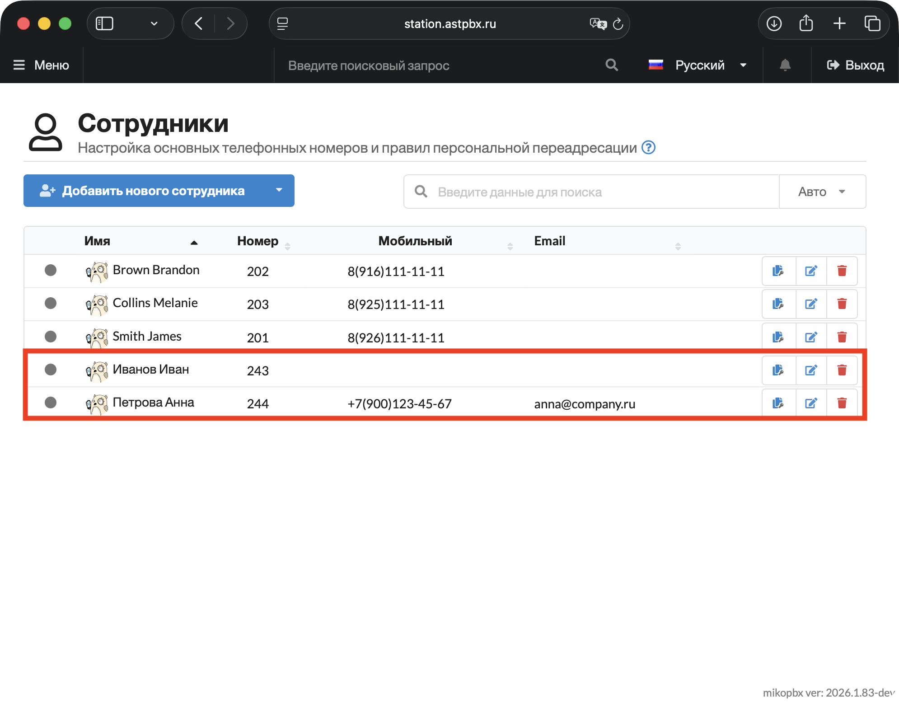
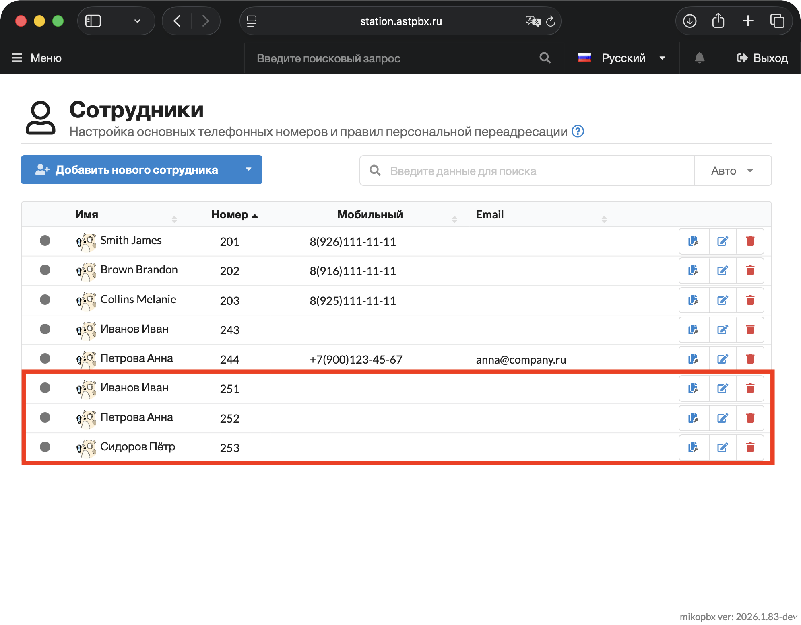
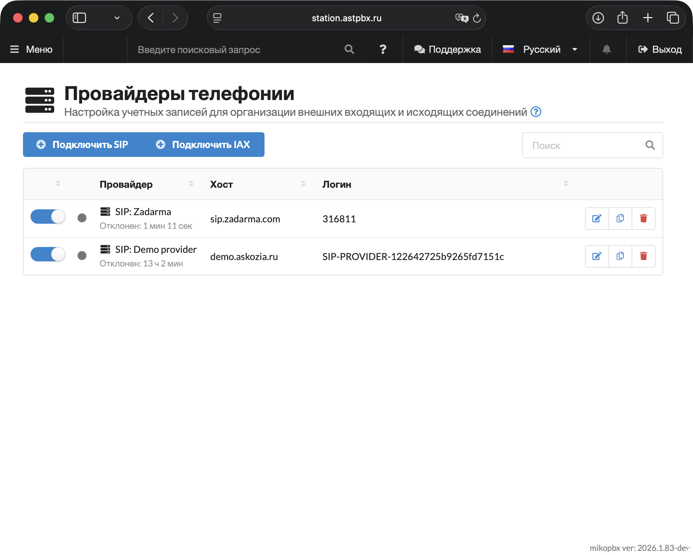
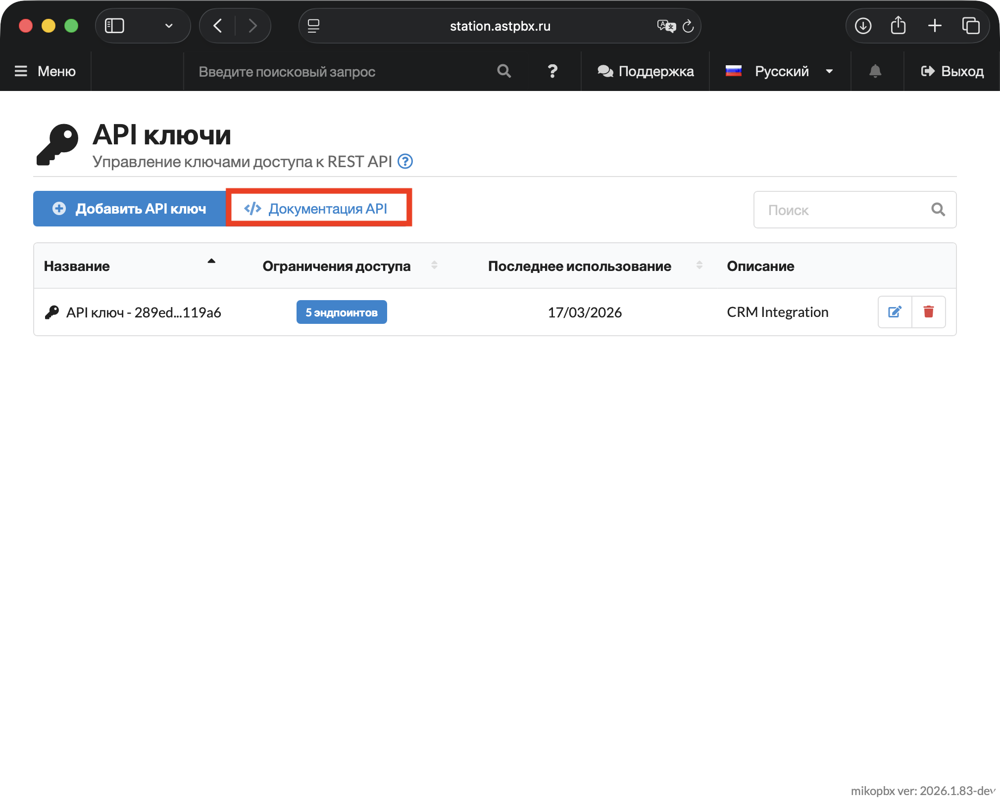

# API ключи

В этой статье описана работа с REST API MikoPBX на примере базовых практических задач: создание сотрудников и SIP-провайдеров, получение истории звонков, мониторинг состояния станции в реальном времени.


Если у вас отсутствует доверенный сертификат — добавьте `verify=False` в каждый запрос и отключите предупреждения:

```python
import urllib3
urllib3.disable_warnings()
```

Настоятельно рекомендуется выпустить доверенный сертификат. Самый простой способ селать это - с помощью модуля [Let's encrypt](../../modules/miko/module-get-ssl-lets-encrypt.md).


### Подготовка: API-ключ и окружение

**Создание API-ключа**

1. Перейдите в раздел: **"Система" → "API ключи".**

<figure><figcaption><p>Раздел "Система" -> "API ключи"</p></figcaption></figure>

2. Нажмите **"Добавить API ключ".**

* Заполните поле **Описание** (например: `CRM Integration`)
* Скопируйте сгенерированный API-ключ — он отображается **только один раз**
* **Сетевой фильтр:** ограничьте доступ по IP или выберите «Разрешены с любых адресов»

В зависимости от задачи переключите тумблер **«Полные права доступа»** или настройте права вручную для каждого ресурса. Придерживайтесь принципа минимальных привилегий (Least Privilege) — каждый ключ должен иметь доступ только к тем ресурсам, которые реально нужны.

<figure><figcaption><p>Базовые настройки API ключа</p></figcaption></figure>

В этой инструкции будут рассмотрены следующие задачи:

* **Создать сотрудника** — разрешите доступ к ресурсу **"Employees Management"** на уровне **"Чтение и запись"**
* **Создать SIP-провайдера** — разрешите доступ к ресурсу **"Providers"** на уровне **"Чтение и запись"**
* **Получить статусы регистрации** сотрудников и провайдеров — разрешите доступ к ресурсу **"SIP"** на уровне **"Чтение"**
* **Получить историю звонков** — разрешите доступ к ресурсу **"Call Records"** на уровне **"Чтение"**
* Активные звонки в реальном времени — разрешите доступ к ресурсу **"PBX Status"** на уровне **"Чтение"**

<figure><figcaption><p>Пример настройки прав доступа</p></figcaption></figure>

В этой статье, мы будем работать с Python, поэтому необходимо установить все необходимые зависимости:

```bash
pip install requests
```

### **Подключение**

Ниже приведен скрипт для подключения к станции через API-ключ. Этот шаблон необходимо использовать перед всеми скриптами, описанными в этой инструкции.

API-ключ и URL для API запросов передаются напрямую в заголовке запроса - никакой дополнительной аутентификации не требуется:

```python
import requests

BASE_URL = 'https://your-mikopbx.com/pbxcore/api/v3'
API_KEY  = 'ваш-api-ключ'

HEADERS = {
    'Authorization': f'Bearer {API_KEY}',
    'Content-Type':  'application/json',
}
```


В шаблоне замените следующие параметры:

* "**your-mikopbx.com**" на IP адрес или URL Вашей станции.
* "**ваш-api-ключ**" на ранее созданный API-ключ с необходимыми правами.


### Работа с сотрудниками

**Эндпоинт:** `POST /pbxcore/api/v3/employees`

Ниже приведена таблица с параметрами (полями) для такого запроса, которые Вы можете использовать.

| Поле                          | Обяз. | Тип / ограничения                      | Описание                                            |
| ----------------------------- | ----- | -------------------------------------- | --------------------------------------------------- |
| `number`                      | ✅     | string, 2–8 цифр                       | Добавочный номер                                    |
| `user_username`               | ✅     | string, 1–100 символов                 | ФИО сотрудника                                      |
| `sip_secret`                  | ✅     | string, 5–100 символов                 | Пароль SIP-аккаунта                                 |
| `user_email`                  | —     | string email, ≤255                     | Email для уведомлений                               |
| `mobile_number`               | —     | string E.164, ≤50                      | Мобильный (+7...) для переадресации                 |
| `mobile_dialstring`           | —     | string, ≤255                           | Строка набора мобильного                            |
| `sip_transport`               | —     | `udp` / `tcp` / `tls` / `udp,tcp`      | Транспорт SIP (по умолч.: `udp`)                    |
| `sip_dtmfmode`                | —     | `auto` / `rfc4733` / `inband` / `info` | Режим DTMF (по умолч.: `auto`)                      |
| `sip_enableRecording`         | —     | boolean                                | Запись разговоров (по умолч.: `true`)               |
| `sip_networkfilterid`         | —     | number \| `"none"`                     | ID сетевого фильтра                                 |
| `sip_manualattributes`        | —     | string, ≤1024                          | Дополнительные SIP-параметры                        |
| `fwd_ringlength`              | —     | integer, ≤180                          | Время дозвона до переадресации (сек, по умолч.: 45) |
| `fwd_forwarding`              | —     | number \| `hangup` \| `busy`           | Безусловная переадресация                           |
| `fwd_forwardingonbusy`        | —     | number \| `hangup` \| `busy`           | Переадресация при занятости                         |
| `fwd_forwardingonunavailable` | —     | number \| `hangup` \| `busy`           | Переадресация при недоступности                     |

#### **Создание одного сотрудника**

```python
def create_employee(
    number: str,
    name: str,
    sip_secret: str,
    email: str = '',
    mobile: str = '',
    record_calls: bool = True,
    fwd_ringlength: int = 45,
) -> dict:
    payload = {
        'number':              number,
        'user_username':       name,
        'sip_secret':          sip_secret,
        'sip_enableRecording': record_calls,
        'fwd_ringlength':      fwd_ringlength,
    }
    if email:  payload['user_email']    = email
    if mobile: payload['mobile_number'] = mobile

    r = requests.post(f'{BASE_URL}/employees', headers=HEADERS, json=payload)
    result = r.json()
    if result.get('result'):
        print(f" Создан: {number} ({name}), id={result['data']['id']}")
    else:
        print(f" Ошибка: {result.get('messages', {}).get('error', [])}")
    return result


# Минимальный пример (только обязательные поля)
create_employee(
    number='243',
    name='Иванов Иван',
    sip_secret='Secure#Pass9201',
)

# Полный пример
create_employee(
    number='244',
    name='Петрова Анна',
    sip_secret='Secure#Pass9202',
    email='anna@company.ru',
    mobile='79001234567',
    record_calls=True,
    fwd_ringlength=30,
)
```

Ниже приведен пример ответа API (HTTP 201) на такой запрос:

```json
{
  "result": true,
  "data": {
    "number": "201",
    "user_username": "Иванов Иван",
    "sip_secret": "Secure#Pass9201",
    "sip_dtmfmode": "auto",
    "sip_transport": "udp",
    "sip_enableRecording": true,
    "sip_networkfilterid": "none",
    "fwd_ringlength": 45,
    "id": "1",
    "extensions_length": 3
  },
  "messages": {"error": [], "info": [], "warning": []}
}
```

Возможные коды ответов:

| Код | Описание                                                             |
| --- | -------------------------------------------------------------------- |
| 201 | Сотрудник успешно создан                                             |
| 400 | Ошибка валидации (слабый пароль <5 символов, неверный формат номера) |
| 401 | Неверный или отсутствующий API-ключ                                  |
| 403 | Нет прав на запись для ресурса `/employees`                          |
| 409 | Конфликт — номер уже занят                                           |

В случае успешного выполнения запроса Вы увидите следующий вывод в консоль:


```python
 Создан: 243 (Иванов Иван), id=113
 Создан: 244 (Петрова Анна), id=114

Process finished with exit code 0
```


На станции будут созданы сотрудники 243 и 244.

<figure><figcaption><p>Созданные сотрудники с помощью REST API</p></figcaption></figure>

#### Вывод списка сотрудников

```python
def list_employees(search: str = '', limit: int = 100, offset: int = 0) -> list:
    params = {'limit': limit, 'offset': offset}
    if search: params['search'] = search
    r = requests.get(f'{BASE_URL}/employees', headers=HEADERS, params=params)
    return r.json().get('data', {}).get('data', []) 

for emp in list_employees():
    print(f"  {emp.get('number'):>6}  {emp.get('user_username', '')}")
```

Будет выведен список сотрудников в следующем формате:


```python
     202  Brown Brandon
     203  Collins Melanie
     201  Smith James
     243  Иванов Иван
     244  Петрова Анна

Process finished with exit code 0
```


#### **Массовое создание сотрудников**

```python
import time

employees = [
    {'number': '251', 'name': 'Иванов Иван',  'secret': 'Pass#9201'},
    {'number': '252', 'name': 'Петрова Анна', 'secret': 'Pass#9202'},
    {'number': '253', 'name': 'Сидоров Пётр', 'secret': 'Pass#9203'},
]

created, failed = [], []
for emp in employees:
    r = requests.post(
        f'{BASE_URL}/employees',
        headers=HEADERS,
        json={
            'number':        emp['number'],
            'user_username': emp['name'],
            'sip_secret':    emp['secret'],
        }
    )
    result = r.json()
    if result.get('result'):
        created.append(emp['number'])
        print(f" {emp['number']} {emp['name']}")
    else:
        failed.append(emp['number'])
        print(f" {emp['number']}: {result.get('messages', {}).get('error', [])}")
    time.sleep(0.2)  # небольшая пауза между запросами

print(f'Создано: {len(created)}, Ошибок: {len(failed)}')
```

В случае успешного выполнения запроса, Вы увидите следующий вывод в консоль:


```python
 251 Иванов Иван
 252 Петрова Анна
 253 Сидоров Пётр
Создано: 3, Ошибок: 0

Process finished with exit code 0
```


На станции будет создано 3 сотрудника:

<figure><figcaption><p>Созданные сотрудники с помощью REST API</p></figcaption></figure>

### Работа с SIP-провайдерами

**Эндпоинт:** `POST /pbxcore/api/v3/sip-providers`

Ниже приведена таблица с параметрами (полями) для такого запроса, которые Вы можете использовать.

| Поле                | Обяз. | Тип     | Описание                                                   |
| ------------------- | ----- | ------- | ---------------------------------------------------------- |
| `description`       | ✅     | string  | Название провайдера                                        |
| `host`              | ✅     | string  | Адрес SIP-сервера провайдера                               |
| `username`          | —     | string  | Логин на сервере провайдера                                |
| `secret`            | —     | string  | Пароль                                                     |
| `registration_type` | —     | string  | `inbound` / `outbound` / `none`                            |
| `qualify`           | —     | boolean | Мониторинг доступности (по умолч.: `true`)                 |
| transport           | —     | string  | `udp` / `tcp` / `tls` / `udp,tcp` (по умолч.: `udp,tcp`)   |
| dtmfmode            | —     | string  | `auto` / `rfc4733` / `inband` / `info` (по умолч.: `auto`) |
| port                | —     | integer | Порт подключения (по умолч.: `5060`)                       |
| disabled            | —     | boolean | Отключить провайдера (по умолч.: `false`)                  |

#### Создание провайдера

```python
def create_sip_provider(
    description: str,
    host: str,
    username: str = '',
    password: str = '',
    registration_type: str = 'outbound',
    qualify: bool = True,
) -> dict:
    payload = {
        'description': description,
        'host':        host,
    }
    if username:          payload['username']          = username
    if password:          payload['secret']            = password
    if registration_type: payload['registration_type'] = registration_type
    if not qualify:       payload['qualify']           = qualify

    r = requests.post(f'{BASE_URL}/sip-providers', headers=HEADERS, json=payload)
    result = r.json()
    if result.get('result'):
        print(f" Провайдер создан: {description}")
    else:
        print(f" Ошибка: {result.get('messages', {}).get('error', [])}")
    return result


create_sip_provider(
    description='Zadarma',
    host='sip.zadarma.com',
    username='316811',
    password='mysecretpass',
)
```

В случае успешного выполнения запроса Вы увидите следующий вывод в консоль:


```python
 Провайдер создан: Zadarma

Process finished with exit code 0
```


На станции будет создан провайдер:

<figure><figcaption><p>Созданный провайдер с помощью REST API</p></figcaption></figure>

#### **Вывод списка всех провайдеров**

```python
def list_providers() -> list:
    r = requests.get(f'{BASE_URL}/sip-providers', headers=HEADERS)
    return r.json().get('data', [])

for prov in list_providers():
    print(f"  {prov.get('id'):<20} {prov.get('description', '')}  [{prov.get('type', '')}]")
```

В случае успешного выполнения запроса Вы увидите следующий вывод в консоль:


```python
  SIP-TRUNK-34F7CAFE     [SIP]
  SIP-TRUNK-7B5977ED     [SIP]

Process finished with exit code 0
```


### Вывод истории звонков (CDR)

**Эндпоинт:** `GET /pbxcore/api/v3/cdr` — только чтение.

**Параметры запроса**

| Параметр      | Тип     | Описание                                     |
| ------------- | ------- | -------------------------------------------- |
| `offset`      | integer | Смещение для пагинации (по умолч.: 0)        |
| `limit`       | integer | Кол-во записей, макс. 100                    |
| `dateFrom`    | string  | Начало периода: `YYYY-MM-DD HH:MM:SS`        |
| `dateTo`      | string  | Конец периода: `YYYY-MM-DD HH:MM:SS`         |
| `src_num`     | string  | Фильтр по номеру звонящего                   |
| `dst_num`     | string  | Фильтр по номеру назначения                  |
| `disposition` | string  | `ANSWERED` / `NO ANSWER` / `BUSY` / `FAILED` |

```python
from datetime import datetime, timedelta

def get_cdr(
    offset: int = 0,
    limit: int = 20,
    date_from: str = None,
    date_to: str = None,
    src_num: str = None,
    dst_num: str = None,
    disposition: str = None,
) -> list:
    params = {'offset': offset, 'limit': min(limit, 100)}
    if date_from:   params['dateFrom'] = date_from
    if date_to:     params['dateTo']   = date_to
    if src_num:     params['src_num']  = src_num
    if dst_num:     params['dst_num']  = dst_num
    if disposition: params['disposition'] = disposition

    r = requests.get(f'{BASE_URL}/cdr', headers=HEADERS, params=params)
    return r.json().get('data', {}).get('records', [])


now  = datetime.now()
then = now - timedelta(days=7)

for row in get_cdr(
    date_from=then.strftime('%Y-%m-%dT%H:%M:%S'),
    date_to=now.strftime('%Y-%m-%dT%H:%M:%S'),
):
    print(
        str(row.get('start', ''))[:16],
        row.get('src_num', ''), '→', row.get('dst_num', ''),
        row.get('disposition', ''), row.get('totalBillsec', 0), 'с'
    )
```

В случае успешного выполнения запроса Вы увидите следующий вывод в консоль:


```python
2026-03-17 13:30 252 → 202 ANSWERED 48 с
2026-03-17 13:30 243 → 252 BUSY 0 с
2026-03-17 13:30 243 → 89161111111 CHANUNAVAIL 0 с
2026-03-17 13:29 202 → 243 NOANSWER 0 с
2026-03-17 13:29 202 → 202 ANSWERED 2 с
2026-03-17 13:29 202 → 243 NOANSWER 0 с
2026-03-17 13:29 202 → 10003246 NOANSWER 0 с
2026-03-17 13:28 202 → 243 NOANSWER 0 с


Process finished with exit code 0
```


#### **Статистика за период**

Для получения статистики за период добавьте следующую функцию:

```python
def cdr_stats(days: int = 1) -> dict:
    now  = datetime.now()
    then = now - timedelta(days=days)
    records = get_cdr(
        date_from=then.strftime('%Y-%m-%dT%H:%M:%S'),
        date_to=now.strftime('%Y-%m-%dT%H:%M:%S'),
        limit=100
    )
    answered  = [r for r in records if r.get('disposition') == 'ANSWERED']
    missed = [r for r in records if r.get('disposition') in ('NO ANSWER', 'NOANSWER')]
    total_dur = sum(r.get('totalBillsec', 0) for r in answered)
    return {
        'total':    len(records),
        'answered': len(answered),
        'missed':   len(missed),
        'avg_sec':  total_dur // len(answered) if answered else 0,
    }

stats = cdr_stats(days=7)
print(f"Звонков за 7 дней: {stats['total']}")
print(f"Отвечено:          {stats['answered']}")
print(f"Пропущено:         {stats['missed']}")
print(f"Средняя длит.:     {stats['avg_sec']}с")
```

В случае успешного выполнения запроса Вы увидите следующий вывод в консоль:


```python
Звонков за 7 дней: 13
Отвечено:          2
Пропущено:         5
Средняя длит.:     25с

Process finished with exit code 0
```



Звонки со статусом "CHANUNAVAIL" не учитываются в статистике "**Отвечено**", "**Пропущено**", "**Средняя длит.**".


**Поля CDR-записи**

| Поле                      | Тип      | Описание                                                                  |
| ------------------------- | -------- | ------------------------------------------------------------------------- |
| `linkedid`                | string   | Уникальный идентификатор звонка                                           |
| `start`                   | datetime | Время начала звонка                                                       |
| `src_num`                 | string   | Номер звонящего                                                           |
| `src_name`                | string   | Имя звонящего                                                             |
| `dst_num`                 | string   | Номер назначения                                                          |
| `dst_name`                | string   | Имя вызываемого                                                           |
| `disposition`             | string   | `ANSWERED` / `NO ANSWER` / `NOANSWER` / `BUSY` / `CHANUNAVAIL` / `FAILED` |
| `totalBillsec`            | integer  | Длительность разговора (секунды)                                          |
| `totalDuration`           | integer  | Полная длительность (включая дозвон)                                      |
| `records`                 | array    | Детальные записи по каждому плечу звонка                                  |
| `records[].recordingfile` | string   | Путь к файлу записи                                                       |
| `records[].playback_url`  | string   | URL для воспроизведения записи                                            |
| `records[].download_url`  | string   | URL для скачивания записи                                                 |
| `records[].dtmf_digits`   | string   | DTMF цифры, нажатые в IVR                                                 |

### Мониторинг: статусы SIP и активные звонки

#### **Статусы регистрации сотрудников и SIP-провайдеров**

**Эндпоинты:** `GET /pbxcore/api/v3/sip` , `GET /pbxcore/api/v3/sip-providers`

```python
from datetime import datetime
def show_employees():
    r = requests.get(f'{BASE_URL}/sip:getStatuses', headers=HEADERS)
    peers = r.json().get('data', {})
    for number, info in peers.items():
        icon = '🟢' if info.get('status') == 'Available' else '🔴'
        print(f"  {icon}  {number:>6}  {info.get('callerid', '')}  [{info.get('status', '')}]")


def show_providers():
    r = requests.get(f'{BASE_URL}/sip-providers:getStatuses', headers=HEADERS)

    providers = r.json().get('data', {}).get('sip', {})
    for prov_id, info in providers.items():
        icon = '🟢' if info.get('state') == 'registered' else '🔴'
        print(f"  {icon}  {info.get('description', prov_id):>20}  {info.get('username', '')}@{info.get('host', '')}  [{info.get('state', '')}]")


if __name__ == '__main__':
    print(f'MikoPBX Monitor [{datetime.now().strftime("%Y-%m-%d %H:%M:%S")}]')
    print('\n── Сотрудники ──────────────────────────────')
    show_employees()
    print('\n── Провайдеры ───────────────────────────────')
    show_providers()
```

В случае успешного выполнения запроса Вы увидите следующий вывод в консоль:


```python
MikoPBX Monitor [2026-03-17 16:47:35]

── Сотрудники ──────────────────────────────
  🔴     201  Smith James  [Unavailable]
  🟢     202  Brown Brandon  [Available]
  🔴     203  Collins Melanie  [Unavailable]
  🔴     243  Иванов Иван  [Unavailable]
  🟢     244  Петрова Анна  [Available] 
  🔴     251  Иванов Иван  [Unavailable]
  🟢     252  Петрова Анна  [Available]
  🔴     253  Сидоров Пeтр  [Unavailable]

── Провайдеры ───────────────────────────────
  🔴         Demo provider  SIP-PROVIDER-122642725b9265fd7151c@demo.askozia.ru  [rejected]
  🟢               Zadarma  316811@sip.zadarma.com  [registered]

Process finished with exit code 0

```


**Статусы сотрудников (поле `status`)**

| Значение      | Описание                     |
| ------------- | ---------------------------- |
| `Available`   | Зарегистрирован и доступен   |
| `Unavailable` | Не зарегистрирован (оффлайн) |

**Статусы провайдеров (поле `state`)**

| Значение       | Описание                              |
| -------------- | ------------------------------------- |
| `registered`   | Зарегистрирован на сервере провайдера |
| `rejected`     | Регистрация отклонена сервером        |
| `unregistered` | Не зарегистрирован                    |

#### **Активные звонки в реальном времени**

**Эндпоинт:** `GET /pbxcore/api/v3/pbx-status`

```python
def get_active_calls() -> list:
    r = requests.get(f'{BASE_URL}/pbx-status:getActiveCalls', headers=HEADERS)
    return r.json().get('data', [])

calls = get_active_calls()

print(f'Активных звонков: {len(calls)}')
for call in calls:
    print(f"  {call.get('src_num', '?')} → {call.get('dst_num', '?')}  [{call.get('src_name', '')} → {call.get('dst_name', '')}]")
```

В случае успешного выполнения запроса Вы увидите следующий вывод в консоль:


```python
Активных звонков: 1
  243 → 252  [Иванов Иван → Петрова Анна]

Process finished with exit code 0
```


### Справочник эндпоинтов

Всю информацию по эндпоинтам, параметрам запроса и полям, Вы можете найти в API-справочнике у Вас в АТС. Для этого в разделе "**API ключи**", нажмите на "**Документация API**".

<figure><figcaption><p>Справочник по API</p></figcaption></figure>

Таблицу с эндпоинтами Вы так же можете найти в подстатье текущей документации:


[endpoints.md](api-klyuchi/endpoints.md)

