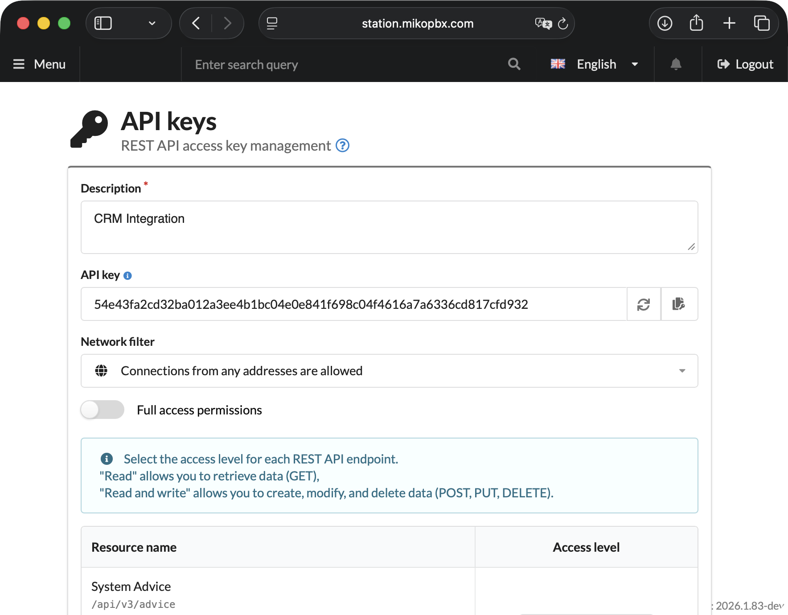

# API Keys

REST API MikoPBX allows you to automate station management and integrate it with external systems - CRM, helpdesk, corporate portals, and custom services. API keys are used to access the API.

### Authorization

All REST API requests are authorized via the `Authorization: Bearer <token>` header. MikoPBX supports two token types:

| Type      | When to use?                                              |
| --------- | --------------------------------------------------------- |
| JWT token | Internal system components, modules, built-in tools       |
| API key   | External integrations: CRM, scripts, third-party services |

For external integrations, always use an API key — it is created manually, has configurable access permissions, and can be revoked at any time.

### Creating an API Key

1. Go to **"System" → "API Keys"**.

<figure><figcaption>
"API Keys" section in  MikoPBX
</figcaption></figure>

2. \`Click **"Add API Key"**.

* Fill in the **Description** field (e.g.: `CRM Integration`)
* Copy the generated API key — it is displayed **only once**

> **Important:** save the key immediately after creation. Once the page is closed, it cannot be recovered — you will need to create a new one.

<figure><figcaption>
Basic API key parameters
</figcaption></figure>

### Configuring Access Permissions

Follow the principle of least privilege — each key should only have access to the resources that are actually needed.

When creating a key, two options are available:

* **Full access** — the key gets read and write access to all API resources. Use only if truly necessary.
* **Manual configuration** — the access level for each API resource is specified individually: read-only, read and write, or no access.


- "Read" allows you to retrieve data (GET)
- "Read and write" allows you to create, modify, and delete data (POST, PUT, DELETE)


**Network filter:** choose one of two options:

* **Localhost connections only** — the key will only work from the local network. Recommended if the integration runs within the infrastructure.
* **Connections from any address are allowed** — the key is accessible without IP restrictions. Use only if the client is located outside the local network.

### Security

Following these requirements protects the API from token interception and unauthorized access:

1. **Valid SSL certificate:**

Use a trusted SSL certificate on the MikoPBX server side. The easiest way is to issue a free certificate via the Let's Encrypt module (instructions for working with the module are available here).

Operating without a valid certificate is only acceptable in an isolated test environment with no internet access.

2. **Certificate trust on the client side:**

The client must verify the server certificate on every request. Disabling verification (`verify=False` in Python, `-k` in curl) is not acceptable in production: without it, a man-in-the-middle (MITM) attack becomes possible, where an attacker intercepts the Bearer token in plaintext.

3. **Key scope restriction:**

Each key must only have access to the resources actually used by the integration. <mark style="color:$danger;">Do not use "Full access" unless necessary</mark> — compromising such a key gives an attacker full control over the API.

4. **Network access restriction:**

If the integration runs within a local network — choose "Local connections only". This prevents a compromised key from being used from an external network.

Use "Allow connections from any address" only when the client is physically located outside the local network, and make sure all other security measures are in place — a valid SSL certificate and minimal key permissions.

#### Examples and Detailed Documentation

Click a card to navigate:

<table data-card-size="large" data-view="cards"><thead><tr><th></th><th data-hidden data-card-cover data-type="image">Cover image</th><th data-hidden data-card-target data-type="content-ref"></th></tr></thead><tbody><tr><td>REST API usage examples</td><td><a href="../../../.gitbook/assets/APIicon1.png">APIicon1.png</a></td><td><a href="examples.md">examples.md</a></td></tr><tr><td>Interactive documentation and endpoint list</td><td><a href="../../../.gitbook/assets/APIicon2.png">APIicon2.png</a></td><td><a href="endpoints.md">endpoints.md</a></td></tr></tbody></table>
