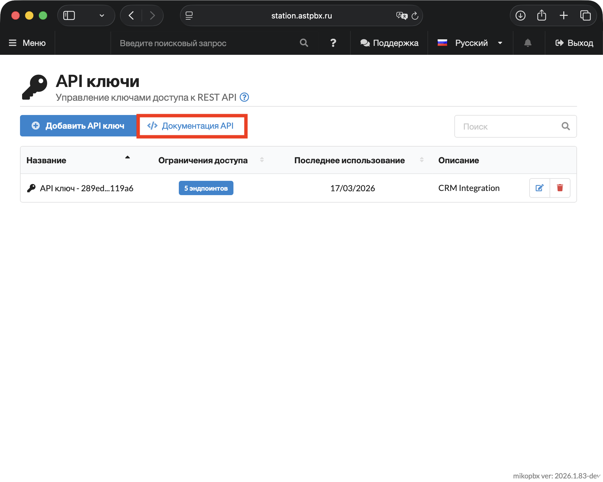

# Интерактивная документация и список эндпоинтов

Работа с REST API MikoPBX построена по стандарту OpenAPI. Интерактивная документация встроена прямо в АТС и всегда содержит актуальный список эндпоинтов, параметров и схем для вашей версии системы.

## Как открыть документацию

1. Перейдите в раздел **«Система» → «API ключи»**.

<figure><figcaption>
Раздел "Система" -> "API ключи"
</figcaption></figure>

2. Нажмите кнопку **«Документация API»**.

<figure><figcaption>
Кнопка «Документация API» в разделе API ключей
</figcaption></figure>

### Возможности интерактивной документации

Документация построена на базе стандарта OpenAPI и предоставляет полное описание всех эндпоинтов REST API MikoPBX.

**Навигация по эндпоинтам** — в левой панели все эндпоинты сгруппированы по разделам.&#x20;

<figure><figcaption>
Меню навигации
</figcaption></figure>

Для каждого эндпоинта отображается краткое описание, метод запроса (GET, POST, PUT, PATCH, DELETE), endpoint с подставленым адресом АТС. Ниже отображаются все доступные параметры запроса.

<figure><figcaption>
Описание эндпоинта с параметрами запроса и примером тела
</figcaption></figure>

**Примеры кода** — для каждого эндпоинта доступны готовые примеры запросов на разных языках. Переключатель находится под панелью параметров — по умолчанию показывается Shell / cURL, доступны также и другие языки (нажмите на название языка для его смены - в этой инструкции Python 3).

Ниже находится пример ответа сервера.

<figure><figcaption>
Пример запроса на Python и пример ответа сервера
</figcaption></figure>

**Выполнение запросов онлайн** — документация позволяет отправлять реальные запросы прямо из браузера и получать ответы от вашей АТС. Сервер определяется автоматически по адресу текущей страницы.

<figure><figcaption>
Выполнение запросов из документации API
</figcaption></figure>

Внизу страницы Вы найдете возможные номера ответов на запрос и краткое пояснение к ним. Так же будут отображены все параметры тела выбранного ответа.

<figure><figcaption>
Коды ответов и структура тела ответа
</figcaption></figure>

## Список эндпоинтов

> Базовый префикс всех путей: `/pbxcore/api/v3`

### Телефония и маршрутизация

#### Сотрудники

| Метод  | Путь                        | Описание                                 |
| ------ | --------------------------- | ---------------------------------------- |
| GET    | `/employees`                | Получить список сотрудников              |
| POST   | `/employees`                | Создать нового сотрудника                |
| GET    | `/employees/{id}`           | Получить сотрудника по ID                |
| PUT    | `/employees/{id}`           | Обновить сотрудника                      |
| PATCH  | `/employees/{id}`           | Частично обновить сотрудника             |
| DELETE | `/employees/{id}`           | Удалить сотрудника                       |
| GET    | `/employees:getDefault`     | Получить значения по умолчанию           |
| POST   | `/employees:batchCreate`    | Массовое создание сотрудников            |
| POST   | `/employees:batchDelete`    | Массовое удаление сотрудников            |
| POST   | `/employees:import`         | Импортировать сотрудников (предпросмотр) |
| POST   | `/employees:confirmImport`  | Подтвердить импорт                       |
| POST   | `/employees:export`         | Экспортировать сотрудников               |
| POST   | `/employees:exportTemplate` | Экспортировать шаблон                    |

#### Внутренние номера

| Метод | Путь                                 | Описание                                   |
| ----- | ------------------------------------ | ------------------------------------------ |
| GET   | `/extensions`                        | Получить список добавочных номеров         |
| GET   | `/extensions/{id}`                   | Получить добавочный номер по ID            |
| POST  | `/extensions:available`              | Проверить доступность номера               |
| GET   | `/extensions:getForSelect`           | Получить добавочные для выпадающего списка |
| POST  | `/extensions/{id}:getPhoneRepresent` | Получить представление телефона            |
| POST  | `/extensions:getPhonesRepresent`     | Получить представление телефонов           |

#### SIP провайдеры

| Метод  | Путь                        | Описание                         |
| ------ | --------------------------- | -------------------------------- |
| GET    | `/sip-providers`            | Получить список SIP провайдеров  |
| POST   | `/sip-providers`            | Создать SIP провайдера           |
| GET    | `/sip-providers/{id}`       | Получить SIP провайдера по ID    |
| PUT    | `/sip-providers/{id}`       | Обновить SIP провайдера          |
| PATCH  | `/sip-providers/{id}`       | Частично обновить SIP провайдера |
| DELETE | `/sip-providers/{id}`       | Удалить SIP провайдера           |
| GET    | `/sip-providers/{id}:copy`  | Скопировать SIP провайдера       |
| GET    | `/sip-providers:getDefault` | Получить шаблон SIP провайдера   |

#### IAX провайдеры

| Метод  | Путь                        | Описание                         |
| ------ | --------------------------- | -------------------------------- |
| GET    | `/iax-providers`            | Получить список IAX провайдеров  |
| POST   | `/iax-providers`            | Создать IAX провайдера           |
| GET    | `/iax-providers/{id}`       | Получить IAX провайдера по ID    |
| PUT    | `/iax-providers/{id}`       | Обновить IAX провайдера          |
| PATCH  | `/iax-providers/{id}`       | Частично обновить IAX провайдера |
| DELETE | `/iax-providers/{id}`       | Удалить IAX провайдера           |
| GET    | `/iax-providers/{id}:copy`  | Скопировать IAX провайдера       |
| GET    | `/iax-providers:getDefault` | Получить шаблон IAX провайдера   |

#### Провайдеры (общий список SIP + IAX)

| Метод | Путь                      | Описание                                    |
| ----- | ------------------------- | ------------------------------------------- |
| GET   | `/providers`              | Получить список всех провайдеров            |
| GET   | `/providers/{id}`         | Получить провайдера по ID                   |
| GET   | `/providers:getForSelect` | Получить провайдеров для выпадающего списка |

#### Очереди звонков

| Метод  | Путь                      | Описание                       |
| ------ | ------------------------- | ------------------------------ |
| GET    | `/call-queues`            | Получить список очередей       |
| POST   | `/call-queues`            | Создать новую очередь          |
| GET    | `/call-queues/{id}`       | Получить очередь по ID         |
| PUT    | `/call-queues/{id}`       | Обновить очередь               |
| PATCH  | `/call-queues/{id}`       | Частично обновить очередь      |
| DELETE | `/call-queues/{id}`       | Удалить очередь                |
| GET    | `/call-queues/{id}:copy`  | Копировать очередь             |
| GET    | `/call-queues:getDefault` | Получить значения по умолчанию |

#### IVR меню

| Метод  | Путь                   | Описание                       |
| ------ | ---------------------- | ------------------------------ |
| GET    | `/ivr-menu`            | Получить список IVR меню       |
| POST   | `/ivr-menu`            | Создать новое IVR меню         |
| GET    | `/ivr-menu/{id}`       | Получить IVR меню по ID        |
| PUT    | `/ivr-menu/{id}`       | Обновить IVR меню              |
| PATCH  | `/ivr-menu/{id}`       | Частично обновить IVR меню     |
| DELETE | `/ivr-menu/{id}`       | Удалить IVR меню               |
| GET    | `/ivr-menu/{id}:copy`  | Копировать IVR меню            |
| GET    | `/ivr-menu:getDefault` | Получить значения по умолчанию |

#### Входящая маршрутизация

| Метод  | Путь                               | Описание                           |
| ------ | ---------------------------------- | ---------------------------------- |
| GET    | `/incoming-routes`                 | Получить список входящих маршрутов |
| POST   | `/incoming-routes`                 | Создать входящий маршрут           |
| GET    | `/incoming-routes/{id}`            | Получить входящий маршрут по ID    |
| PUT    | `/incoming-routes/{id}`            | Обновить входящий маршрут          |
| PATCH  | `/incoming-routes/{id}`            | Частично обновить входящий маршрут |
| DELETE | `/incoming-routes/{id}`            | Удалить входящий маршрут           |
| POST   | `/incoming-routes/{id}:copy`       | Копировать входящий маршрут        |
| GET    | `/incoming-routes:getDefault`      | Получить значения по умолчанию     |
| GET    | `/incoming-routes:getDefaultRoute` | Получить маршрут по умолчанию      |
| POST   | `/incoming-routes:changePriority`  | Изменить приоритет маршрутов       |

#### Исходящая маршрутизация

| Метод  | Путь                              | Описание                            |
| ------ | --------------------------------- | ----------------------------------- |
| GET    | `/outbound-routes`                | Получить список исходящих маршрутов |
| POST   | `/outbound-routes`                | Создать исходящий маршрут           |
| GET    | `/outbound-routes/{id}`           | Получить исходящий маршрут по ID    |
| PUT    | `/outbound-routes/{id}`           | Обновить исходящий маршрут          |
| PATCH  | `/outbound-routes/{id}`           | Частично обновить исходящий маршрут |
| DELETE | `/outbound-routes/{id}`           | Удалить исходящий маршрут           |
| GET    | `/outbound-routes/{id}:copy`      | Копировать исходящий маршрут        |
| GET    | `/outbound-routes:getDefault`     | Получить значения по умолчанию      |
| POST   | `/outbound-routes:changePriority` | Изменить приоритет маршрутов        |

#### Нерабочее время

| Метод  | Путь                               | Описание                            |
| ------ | ---------------------------------- | ----------------------------------- |
| GET    | `/off-work-times`                  | Получить список временных условий   |
| POST   | `/off-work-times`                  | Создать временное условие           |
| GET    | `/off-work-times/{id}`             | Получить временное условие по ID    |
| PUT    | `/off-work-times/{id}`             | Обновить временное условие          |
| PATCH  | `/off-work-times/{id}`             | Частично обновить временное условие |
| DELETE | `/off-work-times/{id}`             | Удалить временное условие           |
| GET    | `/off-work-times/{id}:copy`        | Копировать временное условие        |
| GET    | `/off-work-times:getDefault`       | Получить значения по умолчанию      |
| POST   | `/off-work-times:changePriorities` | Изменить приоритеты условий         |

#### Конференц-комнаты

| Метод  | Путь                           | Описание                            |
| ------ | ------------------------------ | ----------------------------------- |
| GET    | `/conference-rooms`            | Получить список конференц-комнат    |
| POST   | `/conference-rooms`            | Создать конференц-комнату           |
| GET    | `/conference-rooms/{id}`       | Получить конференц-комнату по ID    |
| PUT    | `/conference-rooms/{id}`       | Обновить конференц-комнату          |
| PATCH  | `/conference-rooms/{id}`       | Частично обновить конференц-комнату |
| DELETE | `/conference-rooms/{id}`       | Удалить конференц-комнату           |
| GET    | `/conference-rooms:getDefault` | Получить шаблон конференц-комнаты   |

#### Приложения диалплана

| Метод  | Путь                                | Описание                              |
| ------ | ----------------------------------- | ------------------------------------- |
| GET    | `/dialplan-applications`            | Получить список dialplan приложений   |
| POST   | `/dialplan-applications`            | Создать dialplan приложение           |
| GET    | `/dialplan-applications/{id}`       | Получить dialplan приложение по ID    |
| PUT    | `/dialplan-applications/{id}`       | Обновить dialplan приложение          |
| PATCH  | `/dialplan-applications/{id}`       | Частично обновить dialplan приложение |
| DELETE | `/dialplan-applications/{id}`       | Удалить dialplan приложение           |
| GET    | `/dialplan-applications/{id}:copy`  | Скопировать dialplan приложение       |
| GET    | `/dialplan-applications:getDefault` | Получить шаблон dialplan приложения   |

#### Звуковые файлы

| Метод  | Путь                            | Описание                        |
| ------ | ------------------------------- | ------------------------------- |
| GET    | `/sound-files`                  | Получить список звуковых файлов |
| POST   | `/sound-files`                  | Создать звуковой файл           |
| GET    | `/sound-files/{id}`             | Получить звуковой файл по ID    |
| PUT    | `/sound-files/{id}`             | Обновить звуковой файл          |
| PATCH  | `/sound-files/{id}`             | Частично обновить звуковой файл |
| DELETE | `/sound-files/{id}`             | Удалить звуковой файл           |
| GET    | `/sound-files:getDefault`       | Получить значения по умолчанию  |
| GET    | `/sound-files:getForSelect`     | Получить для выпадающего списка |
| GET    | `/sound-files:playback`         | Воспроизвести звуковой файл     |
| POST   | `/sound-files:uploadFile`       | Загрузить звуковой файл         |
| POST   | `/sound-files:convertAudioFile` | Конвертировать аудио файл       |

#### Кастомизация системных файлов

| Метод  | Путь                       | Описание                                |
| ------ | -------------------------- | --------------------------------------- |
| GET    | `/custom-files`            | Получить список пользовательских файлов |
| POST   | `/custom-files`            | Создать новый пользовательский файл     |
| GET    | `/custom-files/{id}`       | Получить пользовательский файл по ID    |
| PUT    | `/custom-files/{id}`       | Обновить пользовательский файл          |
| PATCH  | `/custom-files/{id}`       | Частично обновить пользовательский файл |
| DELETE | `/custom-files/{id}`       | Удалить пользовательский файл           |
| GET    | `/custom-files:getDefault` | Получить значения по умолчанию          |

***

### Мониторинг и статистика

#### Состояние АТС

| Метод | Путь                            | Описание                 |
| ----- | ------------------------------- | ------------------------ |
| GET   | `/pbx-status:getActiveCalls`    | Получить активные вызовы |
| GET   | `/pbx-status:getActiveChannels` | Получить активные каналы |

#### SIP устройства

| Метод | Путь                              | Описание                                  |
| ----- | --------------------------------- | ----------------------------------------- |
| GET   | `/sip:getStatuses`                | Получить статусы всех SIP устройств       |
| GET   | `/sip:getPeersStatuses`           | Получить статусы SIP peers (legacy)       |
| GET   | `/sip:getRegistry`                | Получить статус регистрации (legacy)      |
| POST  | `/sip:processAuthFailures`        | Обработать ошибки аутентификации          |
| GET   | `/sip/{id}:getStatus`             | Получить статус SIP устройства            |
| GET   | `/sip/{id}:getStats`              | Получить статистику SIP устройства        |
| GET   | `/sip/{id}:getHistory`            | Получить историю подключений              |
| GET   | `/sip/{id}:getSecret`             | Получить SIP пароль                       |
| GET   | `/sip/{id}:getAuthFailureStats`   | Получить статистику ошибок аутентификации |
| POST  | `/sip/{id}:clearAuthFailureStats` | Очистить статистику ошибок                |
| POST  | `/sip/{id}:forceCheck`            | Принудительно проверить статус            |

#### SIP провайдеры (мониторинг)

| Метод | Путь                               | Описание                              |
| ----- | ---------------------------------- | ------------------------------------- |
| GET   | `/sip-providers:getStatuses`       | Получить статусы всех SIP провайдеров |
| GET   | `/sip-providers/{id}:getStatus`    | Получить статус SIP провайдера        |
| GET   | `/sip-providers/{id}:getHistory`   | Получить историю подключений          |
| GET   | `/sip-providers/{id}:getStats`     | Получить статистику SIP провайдера    |
| POST  | `/sip-providers/{id}:forceCheck`   | Принудительно проверить регистрацию   |
| POST  | `/sip-providers/{id}:updateStatus` | Обновить статус провайдера            |

#### IAX провайдеры (мониторинг)

| Метод | Путь                               | Описание                                    |
| ----- | ---------------------------------- | ------------------------------------------- |
| GET   | `/iax-providers:getStatuses`       | Получить статусы всех IAX провайдеров       |
| GET   | `/iax-providers/{id}:getStatus`    | Получить статус IAX провайдера              |
| GET   | `/iax-providers/{id}:getHistory`   | Получить историю подключений                |
| GET   | `/iax-providers/{id}:getStats`     | Получить статистику IAX провайдеров         |
| POST  | `/iax-providers/{id}:forceCheck`   | Принудительно проверить регистрацию         |
| POST  | `/iax-providers/{id}:updateStatus` | Обновить статус провайдера                  |
| GET   | `/iax:getRegistry`                 | Получить статус регистрации IAX провайдеров |

#### Провайдеры (мониторинг)

| Метод | Путь                           | Описание                          |
| ----- | ------------------------------ | --------------------------------- |
| GET   | `/providers:getStatuses`       | Получить статусы всех провайдеров |
| GET   | `/providers/{id}:getStatus`    | Получить статус провайдера        |
| GET   | `/providers/{id}:getHistory`   | Получить историю провайдера       |
| GET   | `/providers/{id}:getStats`     | Получить статистику провайдера    |
| POST  | `/providers/{id}:updateStatus` | Обновить статус провайдера        |

#### Журнал звонков (CDR)

| Метод  | Путь               | Описание                       |
| ------ | ------------------ | ------------------------------ |
| GET    | `/cdr`             | Получить список CDR записей    |
| GET    | `/cdr/{id}`        | Получить CDR запись по ID      |
| DELETE | `/cdr/{id}`        | Удалить CDR запись             |
| GET    | `/cdr:getMetadata` | Получить метаданные CDR        |
| GET    | `/cdr:playback`    | Воспроизвести запись разговора |
| GET    | `/cdr:download`    | Скачать запись разговора       |

#### Советы и рекомендации

| Метод | Путь              | Описание                              |
| ----- | ----------------- | ------------------------------------- |
| GET   | `/advice:getList` | Получить список системных уведомлений |
| GET   | `/advice:refresh` | Обновить кеш уведомлений              |

***

### Аутентификация и доступ

#### Аутентификация

| Метод | Путь            | Описание                       |
| ----- | --------------- | ------------------------------ |
| POST  | `/auth:login`   | Войти в систему (логин/пароль) |
| POST  | `/auth:refresh` | Обновить токен доступа         |
| POST  | `/auth:logout`  | Выйти из системы               |

#### API ключи

| Метод  | Путь                    | Описание                       |
| ------ | ----------------------- | ------------------------------ |
| GET    | `/api-keys`             | Получить список API ключей     |
| POST   | `/api-keys`             | Создать новый API ключ         |
| GET    | `/api-keys/{id}`        | Получить API ключ по ID        |
| PUT    | `/api-keys/{id}`        | Обновить API ключ              |
| PATCH  | `/api-keys/{id}`        | Частично обновить API ключ     |
| DELETE | `/api-keys/{id}`        | Удалить API ключ               |
| GET    | `/api-keys:getDefault`  | Получить значения по умолчанию |
| POST   | `/api-keys:generateKey` | Сгенерировать новый ключ       |

#### AMI пользователи

| Метод  | Путь                            | Описание                           |
| ------ | ------------------------------- | ---------------------------------- |
| GET    | `/asterisk-managers`            | Получить список AMI пользователей  |
| POST   | `/asterisk-managers`            | Создать нового AMI пользователя    |
| GET    | `/asterisk-managers/{id}`       | Получить AMI пользователя по ID    |
| PUT    | `/asterisk-managers/{id}`       | Обновить AMI пользователя          |
| PATCH  | `/asterisk-managers/{id}`       | Частично обновить AMI пользователя |
| DELETE | `/asterisk-managers/{id}`       | Удалить AMI пользователя           |
| GET    | `/asterisk-managers/{id}:copy`  | Копировать AMI пользователя        |
| GET    | `/asterisk-managers:getDefault` | Получить значения по умолчанию     |

#### ARI пользователи

| Метод  | Путь                              | Описание                           |
| ------ | --------------------------------- | ---------------------------------- |
| GET    | `/asterisk-rest-users`            | Получить список ARI пользователей  |
| POST   | `/asterisk-rest-users`            | Создать нового ARI пользователя    |
| GET    | `/asterisk-rest-users/{id}`       | Получить ARI пользователя по ID    |
| PUT    | `/asterisk-rest-users/{id}`       | Обновить ARI пользователя          |
| PATCH  | `/asterisk-rest-users/{id}`       | Частично обновить ARI пользователя |
| DELETE | `/asterisk-rest-users/{id}`       | Удалить ARI пользователя           |
| GET    | `/asterisk-rest-users:getDefault` | Получить значения по умолчанию     |

#### Ключи доступа (Passkeys)

| Метод  | Путь                             | Описание                               |
| ------ | -------------------------------- | -------------------------------------- |
| GET    | `/passkeys`                      | Получить список passkeys               |
| POST   | `/passkeys`                      | Создать новый passkey                  |
| GET    | `/passkeys/{id}`                 | Получить passkey по ID                 |
| PATCH  | `/passkeys/{id}`                 | Обновить passkey                       |
| DELETE | `/passkeys/{id}`                 | Удалить passkey                        |
| GET    | `/passkeys:checkAvailability`    | Проверить наличие passkeys             |
| GET    | `/passkeys:authenticationStart`  | Начать аутентификацию через passkey    |
| POST   | `/passkeys:authenticationFinish` | Завершить аутентификацию через passkey |
| POST   | `/passkeys:registrationStart`    | Начать регистрацию passkey             |
| POST   | `/passkeys:registrationFinish`   | Завершить регистрацию passkey          |

#### Пароли

| Метод | Путь                              | Описание                    |
| ----- | --------------------------------- | --------------------------- |
| GET   | `/passwords:generate`             | Сгенерировать пароль        |
| POST  | `/passwords:validate`             | Проверить надежность пароля |
| POST  | `/passwords:checkDictionary`      | Проверить пароль в словаре  |
| POST  | `/passwords:batchValidate`        | Пакетная проверка паролей   |
| POST  | `/passwords:batchCheckDictionary` | Пакетная проверка словаря   |

#### Пользователи

| Метод | Путь               | Описание                    |
| ----- | ------------------ | --------------------------- |
| GET   | `/users:available` | Проверить доступность email |

#### Сетевые фильтры

| Метод | Путь                            | Описание                                |
| ----- | ------------------------------- | --------------------------------------- |
| GET   | `/network-filters`              | Получить список сетевых фильтров        |
| GET   | `/network-filters/{id}`         | Получить сетевой фильтр по ID           |
| GET   | `/network-filters:getForSelect` | Получить фильтры для выпадающего списка |

***

### Системные настройки

#### Системные операции

| Метод | Путь                                 | Описание                                    |
| ----- | ------------------------------------ | ------------------------------------------- |
| GET   | `/system:ping`                       | Проверить доступность системы               |
| GET   | `/system:checkAuth`                  | Проверить аутентификацию                    |
| GET   | `/system:datetime`                   | Получить системное время                    |
| GET   | `/system:getAvailableLanguages`      | Получить доступные языки                    |
| GET   | `/system:checkForUpdates`            | Получить детальную информацию об обновлении |
| GET   | `/system:checkIfNewReleaseAvailable` | Быстрая проверка наличия новой версии       |
| GET   | `/system:getDeleteStatistics`        | Получить статистику удаления                |
| POST  | `/system:reboot`                     | Перезагрузить систему                       |
| POST  | `/system:shutdown`                   | Выключить систему                           |
| POST  | `/system:upgrade`                    | Обновить систему                            |
| POST  | `/system:restoreDefault`             | Восстановить настройки по умолчанию         |
| POST  | `/system:changeLanguage`             | Изменить язык системы                       |
| POST  | `/system:convertAudioFile`           | Конвертировать аудиофайл                    |
| POST  | `/system:executeBashCommand`         | Выполнить bash команду                      |
| POST  | `/system:executeSqlRequest`          | Выполнить SQL запрос                        |
| POST  | `/system:updateMailSettings`         | Обновить настройки почты                    |

#### Общие настройки

| Метод | Путь                             | Описание                          |
| ----- | -------------------------------- | --------------------------------- |
| GET   | `/general-settings`              | Получить общие настройки          |
| PUT   | `/general-settings`              | Обновить общие настройки          |
| PATCH | `/general-settings`              | Частично обновить общие настройки |
| GET   | `/general-settings/{id}`         | Получить конкретную настройку     |
| GET   | `/general-settings:getDefault`   | Получить значения по умолчанию    |
| POST  | `/general-settings:updateCodecs` | Обновить настройки кодеков        |

#### Сетевые интерфейсы и маршрутизация

| Метод  | Путь                      | Описание                            |
| ------ | ------------------------- | ----------------------------------- |
| GET    | `/network`                | Получить список сетевых интерфейсов |
| GET    | `/network/{id}`           | Получить сетевой интерфейс по ID    |
| DELETE | `/network/{id}`           | Удалить сетевой интерфейс           |
| GET    | `/network:getConfig`      | Получить полную конфигурацию сети   |
| GET    | `/network:getNatSettings` | Получить настройки NAT              |
| POST   | `/network:saveConfig`     | Сохранить конфигурацию сети         |

#### Сетевой фильтр (Firewall)

| Метод  | Путь                     | Описание                            |
| ------ | ------------------------ | ----------------------------------- |
| GET    | `/firewall`              | Получить список правил файервола    |
| POST   | `/firewall`              | Создать правило файервола           |
| GET    | `/firewall/{id}`         | Получить правило файервола по ID    |
| PUT    | `/firewall/{id}`         | Обновить правило файервола          |
| PATCH  | `/firewall/{id}`         | Частично обновить правило файервола |
| DELETE | `/firewall/{id}`         | Удалить правило файервола           |
| GET    | `/firewall:getDefault`   | Получить значения по умолчанию      |
| GET    | `/firewall:getBannedIps` | Получить список заблокированных IP  |
| POST   | `/firewall:unbanIp`      | Разблокировать IP адрес             |
| POST   | `/firewall:enable`       | Включить файервол                   |
| POST   | `/firewall:disable`      | Выключить файервол                  |

#### Защита от взлома (Fail2Ban)

| Метод | Путь        | Описание                             |
| ----- | ----------- | ------------------------------------ |
| GET   | `/fail2ban` | Получить настройки Fail2Ban          |
| PUT   | `/fail2ban` | Обновить настройки Fail2Ban          |
| PATCH | `/fail2ban` | Частично обновить настройки Fail2Ban |

#### Настройки времени

| Метод | Путь                                   | Описание                                 |
| ----- | -------------------------------------- | ---------------------------------------- |
| GET   | `/time-settings:getAvailableTimezones` | Получить список доступных часовых поясов |

#### Настройки почты

| Метод  | Путь                            | Описание                             |
| ------ | ------------------------------- | ------------------------------------ |
| GET    | `/mail-settings`                | Получить настройки почты             |
| PUT    | `/mail-settings`                | Обновить настройки почты             |
| PATCH  | `/mail-settings`                | Частично обновить настройки почты    |
| DELETE | `/mail-settings`                | Сбросить настройки почты             |
| GET    | `/mail-settings:getDefault`     | Получить значения по умолчанию       |
| GET    | `/mail-settings:getDiagnostics` | Получить диагностику настроек почты  |
| GET    | `/mail-settings:getOAuth2Url`   | Получить URL авторизации OAuth2      |
| POST   | `/mail-settings:refreshToken`   | Обновить OAuth2 токен                |
| POST   | `/mail-settings:testConnection` | Проверить подключение к SMTP серверу |
| POST   | `/mail-settings:sendTestEmail`  | Отправить тестовое письмо            |

#### Хранилище

| Метод | Путь                  | Описание                                     |
| ----- | --------------------- | -------------------------------------------- |
| GET   | `/storage:usage`      | Получить статистику использования хранилища  |
| GET   | `/storage:list`       | Получить список доступных устройств хранения |
| POST  | `/storage:mount`      | Смонтировать устройство хранения             |
| POST  | `/storage:umount`     | Размонтировать устройство хранения           |
| POST  | `/storage:mkfs`       | Форматировать устройство хранения            |
| POST  | `/storage:statusMkfs` | Получить статус форматирования               |

#### S3 Облачное хранилище

| Метод | Путь                         | Описание                             |
| ----- | ---------------------------- | ------------------------------------ |
| GET   | `/s3-storage`                | Получить конфигурацию S3 хранилища   |
| PUT   | `/s3-storage`                | Обновить конфигурацию S3 хранилища   |
| PATCH | `/s3-storage`                | Частично обновить конфигурацию S3    |
| GET   | `/s3-storage:stats`          | Получить статистику синхронизации S3 |
| GET   | `/s3-storage:testConnection` | Тестировать S3 соединение            |

#### Дополнительные модули

| Метод  | Путь                              | Описание                               |
| ------ | --------------------------------- | -------------------------------------- |
| GET    | `/modules`                        | Получить список модулей                |
| POST   | `/modules`                        | Создать модуль                         |
| GET    | `/modules/{id}`                   | Получить модуль по ID                  |
| PUT    | `/modules/{id}`                   | Обновить модуль                        |
| PATCH  | `/modules/{id}`                   | Частично обновить модуль               |
| DELETE | `/modules/{id}`                   | Удалить модуль                         |
| GET    | `/modules/{id}:getModuleInfo`     | Получить информацию о модуле           |
| GET    | `/modules/{id}:getModuleLink`     | Получить ссылку на скачивание модуля   |
| GET    | `/modules/{id}:getDownloadStatus` | Получить статус загрузки               |
| POST   | `/modules/{id}:startDownload`     | Начать загрузку модуля                 |
| POST   | `/modules/{id}:installFromRepo`   | Установить модуль из репозитория       |
| POST   | `/modules:installFromPackage`     | Установить модуль из пакета            |
| POST   | `/modules:getMetadataFromPackage` | Получить метаданные из пакета          |
| POST   | `/modules/{id}:enable`            | Включить модуль                        |
| POST   | `/modules/{id}:disable`           | Отключить модуль                       |
| POST   | `/modules/{id}:uninstall`         | Удалить модуль                         |
| POST   | `/modules:updateAll`              | Обновить все модули                    |
| GET    | `/modules:getAvailableModules`    | Получить доступные модули              |
| GET    | `/modules:getInstallationStatus`  | Получить статус установки              |
| GET    | `/modules:getDefault`             | Получить настройки модуля по умолчанию |

#### Лицензирование

| Метод | Путь                                  | Описание                            |
| ----- | ------------------------------------- | ----------------------------------- |
| GET   | `/license:getLicenseInfo`             | Получить информацию о лицензии      |
| GET   | `/license:ping`                       | Проверить связь с сервером лицензий |
| GET   | `/license:resetKey`                   | Сбросить лицензионный ключ          |
| GET   | `/license:sendPBXMetrics`             | Отправить метрики АТС               |
| POST  | `/license:captureFeatureForProductId` | Захватить функцию для продукта      |
| POST  | `/license:processUserRequest`         | Обработать запрос пользователя      |

#### Операции с файлами

| Метод  | Путь                      | Описание                             |
| ------ | ------------------------- | ------------------------------------ |
| GET    | `/files/{id}`             | Получить содержимое файла            |
| PUT    | `/files/{id}`             | Загрузить/обновить файл              |
| DELETE | `/files/{id}`             | Удалить файл                         |
| POST   | `/files:upload`           | Загрузить файл (чанками)             |
| GET    | `/files:uploadStatus`     | Проверить статус загрузки            |
| POST   | `/files:downloadFirmware` | Скачать прошивку                     |
| GET    | `/files:firmwareStatus`   | Проверить статус скачивания прошивки |

***

### Диагностика

#### Информация о системе

| Метод | Путь                         | Описание                          |
| ----- | ---------------------------- | --------------------------------- |
| GET   | `/sysinfo:getInfo`           | Получить системную информацию     |
| GET   | `/sysinfo:getExternalIpInfo` | Получить внешний IP адрес         |
| GET   | `/sysinfo:getHypervisorInfo` | Получить информацию о гипервизоре |
| GET   | `/sysinfo:getDMIInfo`        | Получить DMI информацию           |

#### Системные логи

| Метод | Путь                      | Описание                         |
| ----- | ------------------------- | -------------------------------- |
| GET   | `/syslog:getLogsList`     | Получить список лог файлов       |
| POST  | `/syslog:getLogFromFile`  | Получить содержимое лога         |
| POST  | `/syslog:getLogTimeRange` | Получить временной диапазон лога |
| POST  | `/syslog:eraseFile`       | Очистить лог файл                |
| POST  | `/syslog:startCapture`    | Начать захват пакетов            |
| POST  | `/syslog:stopCapture`     | Остановить захват пакетов        |
| POST  | `/syslog:prepareArchive`  | Подготовить архив логов          |
| POST  | `/syslog:downloadArchive` | Скачать архив логов              |
| POST  | `/syslog:downloadLogFile` | Скачать лог файл                 |

#### Документация OpenAPI

| Метод | Путь                                | Описание                              |
| ----- | ----------------------------------- | ------------------------------------- |
| GET   | `/openapi:getSpecification`         | Получить OpenAPI спецификацию         |
| GET   | `/openapi:getAclRules`              | Получить ACL правила API              |
| GET   | `/openapi:getDetailedPermissions`   | Получить детальный список разрешений  |
| GET   | `/openapi:getSimplifiedPermissions` | Получить упрощенный список разрешений |
| GET   | `/openapi:getValidationSchemas`     | Получить схемы валидации              |
| POST  | `/openapi:clearCache`               | Очистить кэш OpenAPI                  |

#### Поиск

| Метод | Путь                     | Описание         |
| ----- | ------------------------ | ---------------- |
| GET   | `/search:getSearchItems` | Глобальный поиск |

#### Ссылки на документацию

| Метод | Путь                  | Описание                        |
| ----- | --------------------- | ------------------------------- |
| GET   | `/wiki-links:getLink` | Получить ссылку на документацию |

#### Отслеживание активности пользователей

| Метод | Путь                           | Описание                        |
| ----- | ------------------------------ | ------------------------------- |
| POST  | `/user-page-tracker:pageView`  | Зафиксировать просмотр страницы |
| POST  | `/user-page-tracker:pageLeave` | Зафиксировать уход со страницы  |
