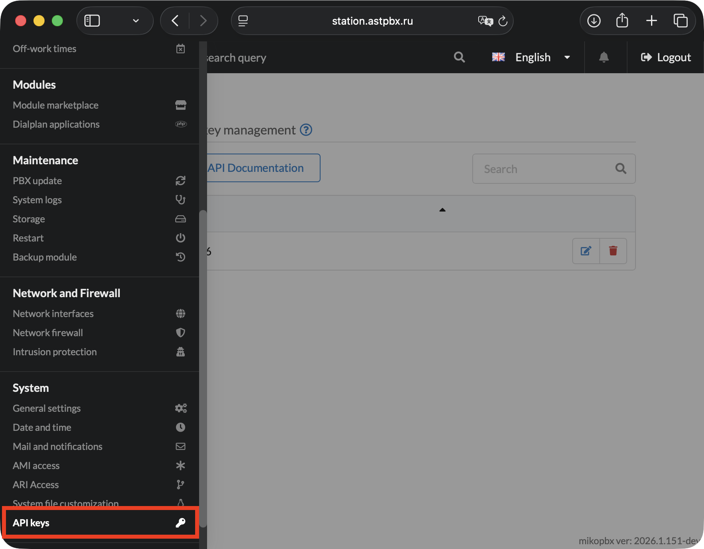
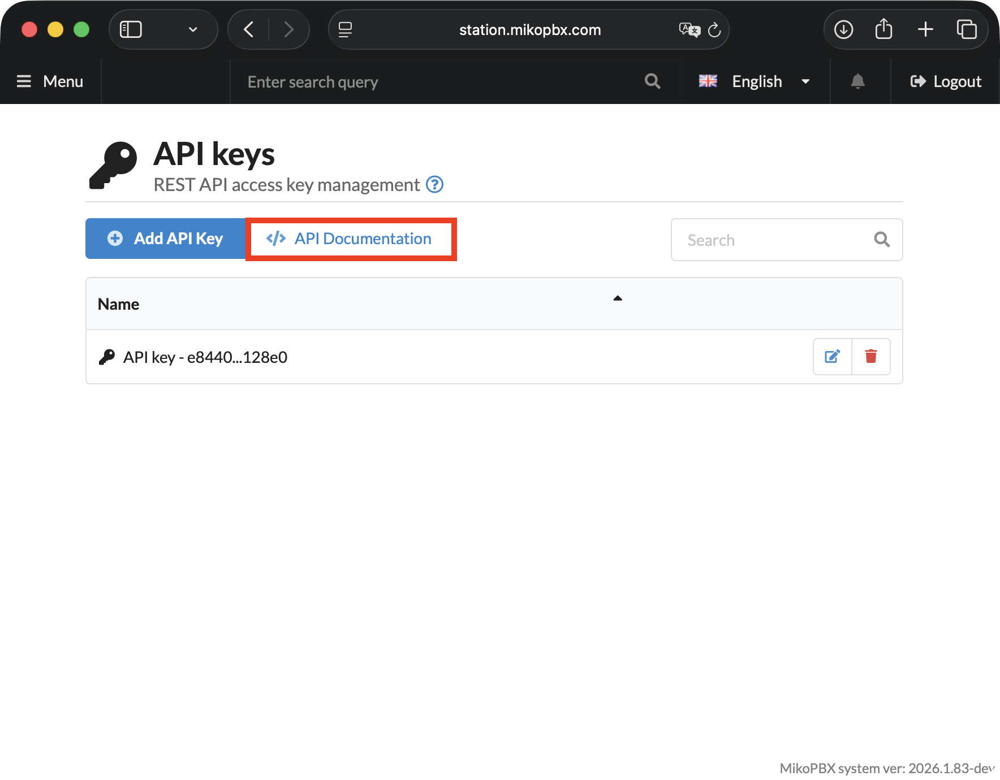
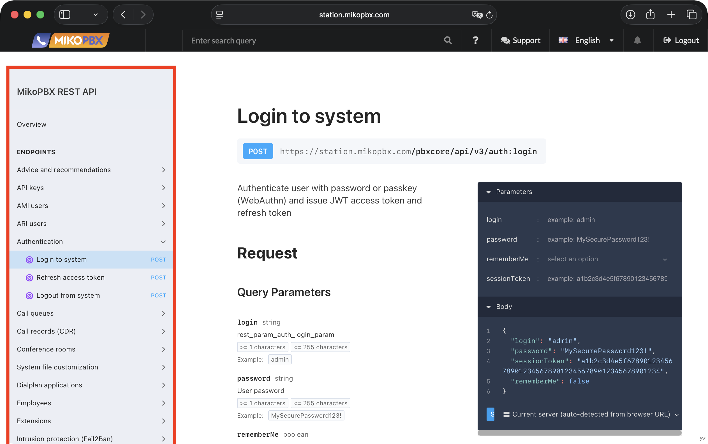
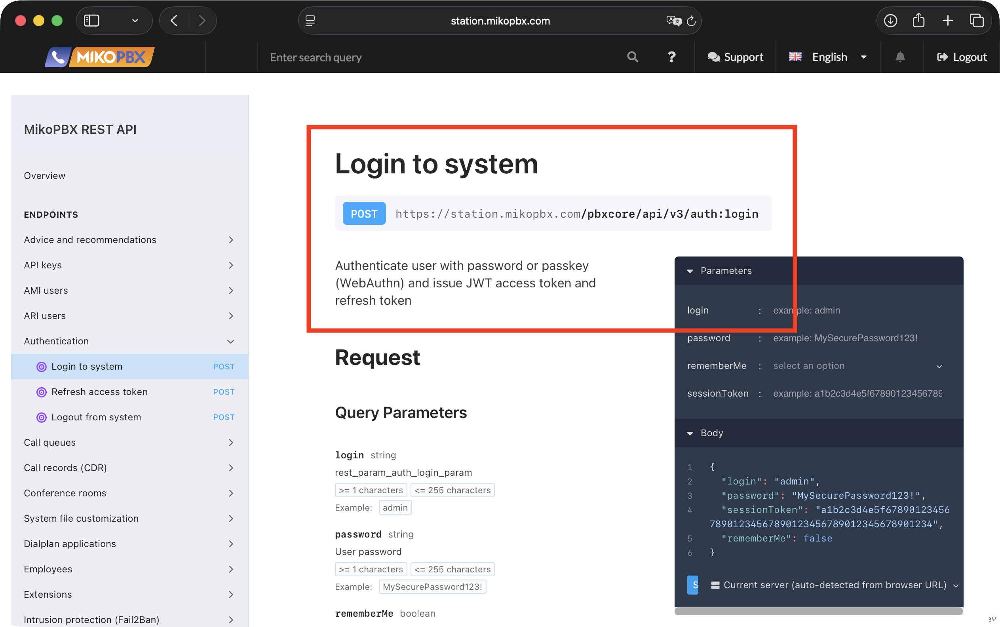
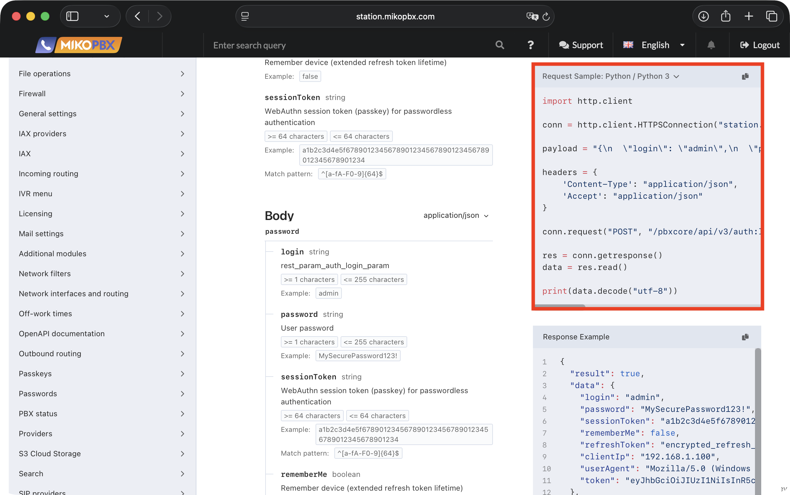
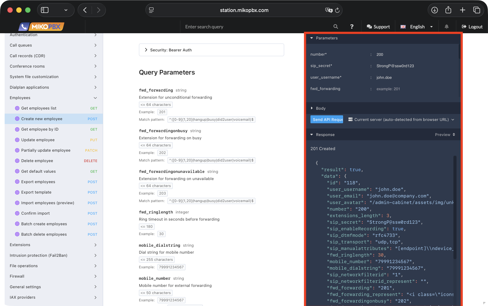
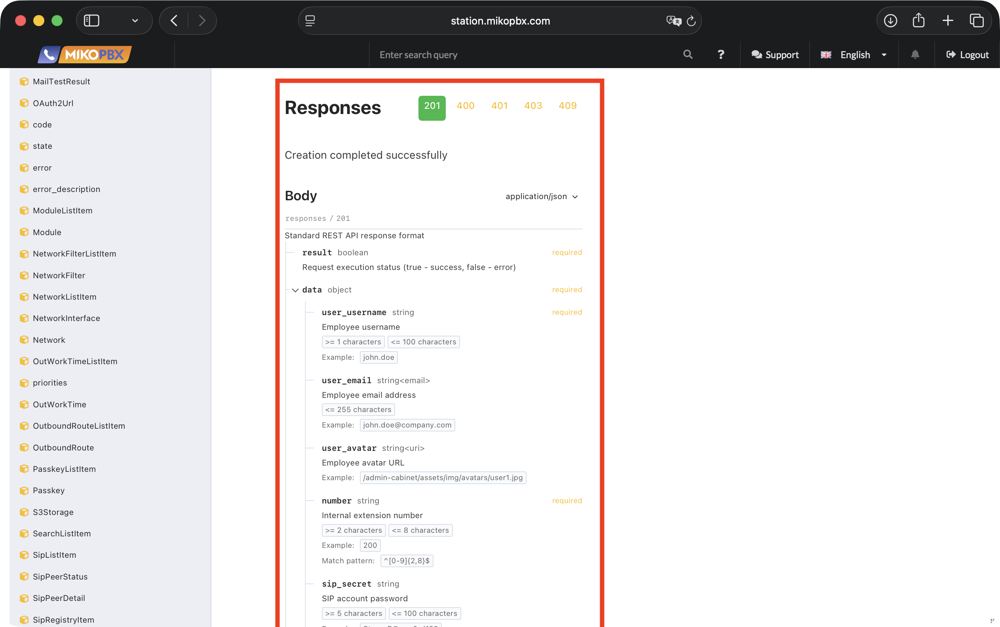

# Interactive Documentation and Endpoint List

MikoPBX REST API follows the OpenAPI standard. The interactive documentation is built directly into the PBX and always contains the current list of endpoints, parameters, and schemas for your version of the system.

## How to Open the Documentation

1. Go to **"System" → "API Keys"**.

<figure><figcaption>
Section "System" -> "API Keys" in MikoPBX web-interface
</figcaption></figure>

2. Click the **"API Documentation"** button.

<figure><figcaption>
"API Documentation" button in the API Keys section
</figcaption></figure>

### Interactive Documentation Features

The documentation is built on the OpenAPI standard and provides a complete description of all MikoPBX REST API endpoints.

**Endpoint navigation** — in the left panel, all endpoints are grouped by section.

<figure><figcaption>
Navigation menu
</figcaption></figure>

For each endpoint, a brief description is shown along with the request method (GET, POST, PUT, PATCH, DELETE) and the endpoint with the PBX address substituted. All available request parameters are displayed below.

<figure><figcaption>
Endpoint description with request parameters and body example
</figcaption></figure>

**Code examples** — ready-made request examples in different languages are available for each endpoint. The switcher is located below the parameters panel — Shell / cURL is shown by default, other languages are also available (click the language name to switch — in this guide, Python 3).

A server response example is shown below.

<figure><figcaption>
Request example in Python and server response example
</figcaption></figure>

**Online request execution** — the documentation allows you to send real requests directly from the browser and receive responses from your PBX. The server is determined automatically from the current page address.

<figure><figcaption>
Executing requests from the API documentation
</figcaption></figure>

At the bottom of the page you will find possible response codes with brief explanations, as well as all body parameters for the selected response.

<figure><figcaption>
Response codes and response body structure
</figcaption></figure>

## Endpoint List

> Base prefix for all paths: `/pbxcore/api/v3`

### Telephony and Routing

#### **Employees**

| Method | Path                        | Description                |
| ------ | --------------------------- | -------------------------- |
| GET    | `/employees`                | Get list of employees      |
| POST   | `/employees`                | Create a new employee      |
| GET    | `/employees/{id}`           | Get employee by ID         |
| PUT    | `/employees/{id}`           | Update employee            |
| PATCH  | `/employees/{id}`           | Partially update employee  |
| DELETE | `/employees/{id}`           | Delete employee            |
| GET    | `/employees:getDefault`     | Get default values         |
| POST   | `/employees:batchCreate`    | Batch create employees     |
| POST   | `/employees:batchDelete`    | Batch delete employees     |
| POST   | `/employees:import`         | Import employees (preview) |
| POST   | `/employees:confirmImport`  | Confirm import             |
| POST   | `/employees:export`         | Export employees           |
| POST   | `/employees:exportTemplate` | Export template            |

#### **Extensions**

| Method | Path                                 | Description                      |
| ------ | ------------------------------------ | -------------------------------- |
| GET    | `/extensions`                        | Get list of extensions           |
| GET    | `/extensions/{id}`                   | Get extension by ID              |
| POST   | `/extensions:available`              | Check number availability        |
| GET    | `/extensions:getForSelect`           | Get extensions for dropdown list |
| POST   | `/extensions/{id}:getPhoneRepresent` | Get phone representation         |
| POST   | `/extensions:getPhonesRepresent`     | Get phones representation        |

#### **SIP Providers**

| Method | Path                        | Description                   |
| ------ | --------------------------- | ----------------------------- |
| GET    | `/sip-providers`            | Get list of SIP providers     |
| POST   | `/sip-providers`            | Create SIP provider           |
| GET    | `/sip-providers/{id}`       | Get SIP provider by ID        |
| PUT    | `/sip-providers/{id}`       | Update SIP provider           |
| PATCH  | `/sip-providers/{id}`       | Partially update SIP provider |
| DELETE | `/sip-providers/{id}`       | Delete SIP provider           |
| GET    | `/sip-providers/{id}:copy`  | Copy SIP provider             |
| GET    | `/sip-providers:getDefault` | Get SIP provider template     |

#### **IAX Providers**

| Method | Path                        | Description                   |
| ------ | --------------------------- | ----------------------------- |
| GET    | `/iax-providers`            | Get list of IAX providers     |
| POST   | `/iax-providers`            | Create IAX provider           |
| GET    | `/iax-providers/{id}`       | Get IAX provider by ID        |
| PUT    | `/iax-providers/{id}`       | Update IAX provider           |
| PATCH  | `/iax-providers/{id}`       | Partially update IAX provider |
| DELETE | `/iax-providers/{id}`       | Delete IAX provider           |
| GET    | `/iax-providers/{id}:copy`  | Copy IAX provider             |
| GET    | `/iax-providers:getDefault` | Get IAX provider template     |

#### **Providers (combined SIP + IAX list)**

| Method | Path                      | Description                     |
| ------ | ------------------------- | ------------------------------- |
| GET    | `/providers`              | Get list of all providers       |
| GET    | `/providers/{id}`         | Get provider by ID              |
| GET    | `/providers:getForSelect` | Get providers for dropdown list |

#### **Call Queues**

| Method | Path                      | Description            |
| ------ | ------------------------- | ---------------------- |
| GET    | `/call-queues`            | Get list of queues     |
| POST   | `/call-queues`            | Create a new queue     |
| GET    | `/call-queues/{id}`       | Get queue by ID        |
| PUT    | `/call-queues/{id}`       | Update queue           |
| PATCH  | `/call-queues/{id}`       | Partially update queue |
| DELETE | `/call-queues/{id}`       | Delete queue           |
| GET    | `/call-queues/{id}:copy`  | Copy queue             |
| GET    | `/call-queues:getDefault` | Get default values     |

#### **IVR Menu**

| Method | Path                   | Description               |
| ------ | ---------------------- | ------------------------- |
| GET    | `/ivr-menu`            | Get list of IVR menus     |
| POST   | `/ivr-menu`            | Create a new IVR menu     |
| GET    | `/ivr-menu/{id}`       | Get IVR menu by ID        |
| PUT    | `/ivr-menu/{id}`       | Update IVR menu           |
| PATCH  | `/ivr-menu/{id}`       | Partially update IVR menu |
| DELETE | `/ivr-menu/{id}`       | Delete IVR menu           |
| GET    | `/ivr-menu/{id}:copy`  | Copy IVR menu             |
| GET    | `/ivr-menu:getDefault` | Get default values        |

#### **Incoming Routing**

| Method | Path                               | Description                     |
| ------ | ---------------------------------- | ------------------------------- |
| GET    | `/incoming-routes`                 | Get list of incoming routes     |
| POST   | `/incoming-routes`                 | Create incoming route           |
| GET    | `/incoming-routes/{id}`            | Get incoming route by ID        |
| PUT    | `/incoming-routes/{id}`            | Update incoming route           |
| PATCH  | `/incoming-routes/{id}`            | Partially update incoming route |
| DELETE | `/incoming-routes/{id}`            | Delete incoming route           |
| POST   | `/incoming-routes/{id}:copy`       | Copy incoming route             |
| GET    | `/incoming-routes:getDefault`      | Get default values              |
| GET    | `/incoming-routes:getDefaultRoute` | Get default route               |
| POST   | `/incoming-routes:changePriority`  | Change route priorities         |

#### **Outbound Routing**

| Method | Path                              | Description                     |
| ------ | --------------------------------- | ------------------------------- |
| GET    | `/outbound-routes`                | Get list of outbound routes     |
| POST   | `/outbound-routes`                | Create outbound route           |
| GET    | `/outbound-routes/{id}`           | Get outbound route by ID        |
| PUT    | `/outbound-routes/{id}`           | Update outbound route           |
| PATCH  | `/outbound-routes/{id}`           | Partially update outbound route |
| DELETE | `/outbound-routes/{id}`           | Delete outbound route           |
| GET    | `/outbound-routes/{id}:copy`      | Copy outbound route             |
| GET    | `/outbound-routes:getDefault`     | Get default values              |
| POST   | `/outbound-routes:changePriority` | Change route priorities         |

#### **Off-Work Time**

| Method | Path                               | Description                     |
| ------ | ---------------------------------- | ------------------------------- |
| GET    | `/off-work-times`                  | Get list of time conditions     |
| POST   | `/off-work-times`                  | Create time condition           |
| GET    | `/off-work-times/{id}`             | Get time condition by ID        |
| PUT    | `/off-work-times/{id}`             | Update time condition           |
| PATCH  | `/off-work-times/{id}`             | Partially update time condition |
| DELETE | `/off-work-times/{id}`             | Delete time condition           |
| GET    | `/off-work-times/{id}:copy`        | Copy time condition             |
| GET    | `/off-work-times:getDefault`       | Get default values              |
| POST   | `/off-work-times:changePriorities` | Change condition priorities     |

#### **Conference Rooms**

| Method | Path                           | Description                      |
| ------ | ------------------------------ | -------------------------------- |
| GET    | `/conference-rooms`            | Get list of conference rooms     |
| POST   | `/conference-rooms`            | Create conference room           |
| GET    | `/conference-rooms/{id}`       | Get conference room by ID        |
| PUT    | `/conference-rooms/{id}`       | Update conference room           |
| PATCH  | `/conference-rooms/{id}`       | Partially update conference room |
| DELETE | `/conference-rooms/{id}`       | Delete conference room           |
| GET    | `/conference-rooms:getDefault` | Get conference room template     |

#### **Dialplan Applications**

| Method | Path                                | Description                           |
| ------ | ----------------------------------- | ------------------------------------- |
| GET    | `/dialplan-applications`            | Get list of dialplan applications     |
| POST   | `/dialplan-applications`            | Create dialplan application           |
| GET    | `/dialplan-applications/{id}`       | Get dialplan application by ID        |
| PUT    | `/dialplan-applications/{id}`       | Update dialplan application           |
| PATCH  | `/dialplan-applications/{id}`       | Partially update dialplan application |
| DELETE | `/dialplan-applications/{id}`       | Delete dialplan application           |
| GET    | `/dialplan-applications/{id}:copy`  | Copy dialplan application             |
| GET    | `/dialplan-applications:getDefault` | Get dialplan application template     |

#### **Sound Files**

| Method | Path                            | Description                 |
| ------ | ------------------------------- | --------------------------- |
| GET    | `/sound-files`                  | Get list of sound files     |
| POST   | `/sound-files`                  | Create sound file           |
| GET    | `/sound-files/{id}`             | Get sound file by ID        |
| PUT    | `/sound-files/{id}`             | Update sound file           |
| PATCH  | `/sound-files/{id}`             | Partially update sound file |
| DELETE | `/sound-files/{id}`             | Delete sound file           |
| GET    | `/sound-files:getDefault`       | Get default values          |
| GET    | `/sound-files:getForSelect`     | Get for dropdown list       |
| GET    | `/sound-files:playback`         | Play back sound file        |
| POST   | `/sound-files:uploadFile`       | Upload sound file           |
| POST   | `/sound-files:convertAudioFile` | Convert audio file          |

#### **System File Customization**

| Method | Path                       | Description                  |
| ------ | -------------------------- | ---------------------------- |
| GET    | `/custom-files`            | Get list of custom files     |
| POST   | `/custom-files`            | Create new custom file       |
| GET    | `/custom-files/{id}`       | Get custom file by ID        |
| PUT    | `/custom-files/{id}`       | Update custom file           |
| PATCH  | `/custom-files/{id}`       | Partially update custom file |
| DELETE | `/custom-files/{id}`       | Delete custom file           |
| GET    | `/custom-files:getDefault` | Get default values           |

***

### Monitoring and Statistics

#### **PBX Status**

| Method | Path                            | Description         |
| ------ | ------------------------------- | ------------------- |
| GET    | `/pbx-status:getActiveCalls`    | Get active calls    |
| GET    | `/pbx-status:getActiveChannels` | Get active channels |

#### **SIP Devices**

| Method | Path                              | Description                           |
| ------ | --------------------------------- | ------------------------------------- |
| GET    | `/sip:getStatuses`                | Get statuses of all SIP devices       |
| GET    | `/sip:getPeersStatuses`           | Get SIP peer statuses (legacy)        |
| GET    | `/sip:getRegistry`                | Get registration status (legacy)      |
| POST   | `/sip:processAuthFailures`        | Process authentication failures       |
| GET    | `/sip/{id}:getStatus`             | Get SIP device status                 |
| GET    | `/sip/{id}:getStats`              | Get SIP device statistics             |
| GET    | `/sip/{id}:getHistory`            | Get connection history                |
| GET    | `/sip/{id}:getSecret`             | Get SIP password                      |
| GET    | `/sip/{id}:getAuthFailureStats`   | Get authentication failure statistics |
| POST   | `/sip/{id}:clearAuthFailureStats` | Clear failure statistics              |
| POST   | `/sip/{id}:forceCheck`            | Force status check                    |

#### **SIP Providers (Monitoring)**

| Method | Path                               | Description                       |
| ------ | ---------------------------------- | --------------------------------- |
| GET    | `/sip-providers:getStatuses`       | Get statuses of all SIP providers |
| GET    | `/sip-providers/{id}:getStatus`    | Get SIP provider status           |
| GET    | `/sip-providers/{id}:getHistory`   | Get connection history            |
| GET    | `/sip-providers/{id}:getStats`     | Get SIP provider statistics       |
| POST   | `/sip-providers/{id}:forceCheck`   | Force registration check          |
| POST   | `/sip-providers/{id}:updateStatus` | Update provider status            |

#### **IAX Providers (Monitoring)**

| Method | Path                               | Description                          |
| ------ | ---------------------------------- | ------------------------------------ |
| GET    | `/iax-providers:getStatuses`       | Get statuses of all IAX providers    |
| GET    | `/iax-providers/{id}:getStatus`    | Get IAX provider status              |
| GET    | `/iax-providers/{id}:getHistory`   | Get connection history               |
| GET    | `/iax-providers/{id}:getStats`     | Get IAX provider statistics          |
| POST   | `/iax-providers/{id}:forceCheck`   | Force registration check             |
| POST   | `/iax-providers/{id}:updateStatus` | Update provider status               |
| GET    | `/iax:getRegistry`                 | Get IAX provider registration status |

#### **Providers (Monitoring)**

| Method | Path                           | Description                   |
| ------ | ------------------------------ | ----------------------------- |
| GET    | `/providers:getStatuses`       | Get statuses of all providers |
| GET    | `/providers/{id}:getStatus`    | Get provider status           |
| GET    | `/providers/{id}:getHistory`   | Get provider history          |
| GET    | `/providers/{id}:getStats`     | Get provider statistics       |
| POST   | `/providers/{id}:updateStatus` | Update provider status        |

#### **Call Records (CDR)**

| Method | Path               | Description              |
| ------ | ------------------ | ------------------------ |
| GET    | `/cdr`             | Get list of CDR records  |
| GET    | `/cdr/{id}`        | Get CDR record by ID     |
| DELETE | `/cdr/{id}`        | Delete CDR record        |
| GET    | `/cdr:getMetadata` | Get CDR metadata         |
| GET    | `/cdr:playback`    | Play back call recording |
| GET    | `/cdr:download`    | Download call recording  |

#### **Advice and Recommendations**

| Method | Path              | Description                      |
| ------ | ----------------- | -------------------------------- |
| GET    | `/advice:getList` | Get list of system notifications |
| GET    | `/advice:refresh` | Refresh notification cache       |

***

### Authentication and Access

#### **Authentication**

| Method | Path            | Description           |
| ------ | --------------- | --------------------- |
| POST   | `/auth:login`   | Log in to the system  |
| POST   | `/auth:refresh` | Refresh access token  |
| POST   | `/auth:logout`  | Log out of the system |

#### **API Keys**

| Method | Path                    | Description              |
| ------ | ----------------------- | ------------------------ |
| GET    | `/api-keys`             | Get list of API keys     |
| POST   | `/api-keys`             | Create a new API key     |
| GET    | `/api-keys/{id}`        | Get API key by ID        |
| PUT    | `/api-keys/{id}`        | Update API key           |
| PATCH  | `/api-keys/{id}`        | Partially update API key |
| DELETE | `/api-keys/{id}`        | Delete API key           |
| GET    | `/api-keys:getDefault`  | Get default values       |
| POST   | `/api-keys:generateKey` | Generate a new key       |

#### **AMI Users**

| Method | Path                            | Description               |
| ------ | ------------------------------- | ------------------------- |
| GET    | `/asterisk-managers`            | Get list of AMI users     |
| POST   | `/asterisk-managers`            | Create a new AMI user     |
| GET    | `/asterisk-managers/{id}`       | Get AMI user by ID        |
| PUT    | `/asterisk-managers/{id}`       | Update AMI user           |
| PATCH  | `/asterisk-managers/{id}`       | Partially update AMI user |
| DELETE | `/asterisk-managers/{id}`       | Delete AMI user           |
| GET    | `/asterisk-managers/{id}:copy`  | Copy AMI user             |
| GET    | `/asterisk-managers:getDefault` | Get default values        |

#### **ARI Users**

| Method | Path                              | Description               |
| ------ | --------------------------------- | ------------------------- |
| GET    | `/asterisk-rest-users`            | Get list of ARI users     |
| POST   | `/asterisk-rest-users`            | Create a new ARI user     |
| GET    | `/asterisk-rest-users/{id}`       | Get ARI user by ID        |
| PUT    | `/asterisk-rest-users/{id}`       | Update ARI user           |
| PATCH  | `/asterisk-rest-users/{id}`       | Partially update ARI user |
| DELETE | `/asterisk-rest-users/{id}`       | Delete ARI user           |
| GET    | `/asterisk-rest-users:getDefault` | Get default values        |

#### **Passkeys**

| Method | Path                             | Description                   |
| ------ | -------------------------------- | ----------------------------- |
| GET    | `/passkeys`                      | Get list of passkeys          |
| POST   | `/passkeys`                      | Create a new passkey          |
| GET    | `/passkeys/{id}`                 | Get passkey by ID             |
| PATCH  | `/passkeys/{id}`                 | Update passkey                |
| DELETE | `/passkeys/{id}`                 | Delete passkey                |
| GET    | `/passkeys:checkAvailability`    | Check passkey availability    |
| GET    | `/passkeys:authenticationStart`  | Start passkey authentication  |
| POST   | `/passkeys:authenticationFinish` | Finish passkey authentication |
| POST   | `/passkeys:registrationStart`    | Start passkey registration    |
| POST   | `/passkeys:registrationFinish`   | Finish passkey registration   |

#### **Passwords**

| Method | Path                              | Description                       |
| ------ | --------------------------------- | --------------------------------- |
| GET    | `/passwords:generate`             | Generate password                 |
| POST   | `/passwords:validate`             | Validate password strength        |
| POST   | `/passwords:checkDictionary`      | Check password against dictionary |
| POST   | `/passwords:batchValidate`        | Batch validate passwords          |
| POST   | `/passwords:batchCheckDictionary` | Batch dictionary check            |

#### **Users**

| Method | Path               | Description              |
| ------ | ------------------ | ------------------------ |
| GET    | `/users:available` | Check email availability |

#### **Network Filters**

| Method | Path                            | Description                   |
| ------ | ------------------------------- | ----------------------------- |
| GET    | `/network-filters`              | Get list of network filters   |
| GET    | `/network-filters/{id}`         | Get network filter by ID      |
| GET    | `/network-filters:getForSelect` | Get filters for dropdown list |

***

### System Settings

#### **System Operations**

| Method | Path                                 | Description                              |
| ------ | ------------------------------------ | ---------------------------------------- |
| GET    | `/system:ping`                       | Check system availability                |
| GET    | `/system:checkAuth`                  | Check authentication                     |
| GET    | `/system:datetime`                   | Get system time                          |
| GET    | `/system:getAvailableLanguages`      | Get available languages                  |
| GET    | `/system:checkForUpdates`            | Get detailed update information          |
| GET    | `/system:checkIfNewReleaseAvailable` | Quick check for new version availability |
| GET    | `/system:getDeleteStatistics`        | Get deletion statistics                  |
| POST   | `/system:reboot`                     | Reboot the system                        |
| POST   | `/system:shutdown`                   | Shut down the system                     |
| POST   | `/system:upgrade`                    | Upgrade the system                       |
| POST   | `/system:restoreDefault`             | Restore default settings                 |
| POST   | `/system:changeLanguage`             | Change system language                   |
| POST   | `/system:convertAudioFile`           | Convert audio file                       |
| POST   | `/system:executeBashCommand`         | Execute bash command                     |
| POST   | `/system:executeSqlRequest`          | Execute SQL query                        |
| POST   | `/system:updateMailSettings`         | Update mail settings                     |

#### **General Settings**

| Method | Path                             | Description                       |
| ------ | -------------------------------- | --------------------------------- |
| GET    | `/general-settings`              | Get general settings              |
| PUT    | `/general-settings`              | Update general settings           |
| PATCH  | `/general-settings`              | Partially update general settings |
| GET    | `/general-settings/{id}`         | Get specific setting              |
| GET    | `/general-settings:getDefault`   | Get default values                |
| POST   | `/general-settings:updateCodecs` | Update codec settings             |

#### **Network Interfaces and Routing**

| Method | Path                      | Description                    |
| ------ | ------------------------- | ------------------------------ |
| GET    | `/network`                | Get list of network interfaces |
| GET    | `/network/{id}`           | Get network interface by ID    |
| DELETE | `/network/{id}`           | Delete network interface       |
| GET    | `/network:getConfig`      | Get full network configuration |
| GET    | `/network:getNatSettings` | Get NAT settings               |
| POST   | `/network:saveConfig`     | Save network configuration     |

#### **Firewall**

| Method | Path                     | Description                    |
| ------ | ------------------------ | ------------------------------ |
| GET    | `/firewall`              | Get list of firewall rules     |
| POST   | `/firewall`              | Create firewall rule           |
| GET    | `/firewall/{id}`         | Get firewall rule by ID        |
| PUT    | `/firewall/{id}`         | Update firewall rule           |
| PATCH  | `/firewall/{id}`         | Partially update firewall rule |
| DELETE | `/firewall/{id}`         | Delete firewall rule           |
| GET    | `/firewall:getDefault`   | Get default values             |
| GET    | `/firewall:getBannedIps` | Get list of banned IPs         |
| POST   | `/firewall:unbanIp`      | Unban IP address               |
| POST   | `/firewall:enable`       | Enable firewall                |
| POST   | `/firewall:disable`      | Disable firewall               |

#### **Intrusion Prevention (Fail2Ban)**

| Method | Path        | Description                        |
| ------ | ----------- | ---------------------------------- |
| GET    | `/fail2ban` | Get Fail2Ban settings              |
| PUT    | `/fail2ban` | Update Fail2Ban settings           |
| PATCH  | `/fail2ban` | Partially update Fail2Ban settings |

#### **Time Settings**

| Method | Path                                   | Description                     |
| ------ | -------------------------------------- | ------------------------------- |
| GET    | `/time-settings:getAvailableTimezones` | Get list of available timezones |

#### **Mail Settings**

| Method | Path                            | Description                    |
| ------ | ------------------------------- | ------------------------------ |
| GET    | `/mail-settings`                | Get mail settings              |
| PUT    | `/mail-settings`                | Update mail settings           |
| PATCH  | `/mail-settings`                | Partially update mail settings |
| DELETE | `/mail-settings`                | Reset mail settings            |
| GET    | `/mail-settings:getDefault`     | Get default values             |
| GET    | `/mail-settings:getDiagnostics` | Get mail settings diagnostics  |
| GET    | `/mail-settings:getOAuth2Url`   | Get OAuth2 authorization URL   |
| POST   | `/mail-settings:refreshToken`   | Refresh OAuth2 token           |
| POST   | `/mail-settings:testConnection` | Test SMTP server connection    |
| POST   | `/mail-settings:sendTestEmail`  | Send test email                |

#### **Storage**

| Method | Path                  | Description                           |
| ------ | --------------------- | ------------------------------------- |
| GET    | `/storage:usage`      | Get storage usage statistics          |
| GET    | `/storage:list`       | Get list of available storage devices |
| POST   | `/storage:mount`      | Mount storage device                  |
| POST   | `/storage:umount`     | Unmount storage device                |
| POST   | `/storage:mkfs`       | Format storage device                 |
| POST   | `/storage:statusMkfs` | Get formatting status                 |

#### **S3 Cloud Storage**

| Method | Path                         | Description                       |
| ------ | ---------------------------- | --------------------------------- |
| GET    | `/s3-storage`                | Get S3 storage configuration      |
| PUT    | `/s3-storage`                | Update S3 storage configuration   |
| PATCH  | `/s3-storage`                | Partially update S3 configuration |
| GET    | `/s3-storage:stats`          | Get S3 synchronization statistics |
| GET    | `/s3-storage:testConnection` | Test S3 connection                |

#### **Modules**

| Method | Path                              | Description                    |
| ------ | --------------------------------- | ------------------------------ |
| GET    | `/modules`                        | Get list of modules            |
| POST   | `/modules`                        | Create module                  |
| GET    | `/modules/{id}`                   | Get module by ID               |
| PUT    | `/modules/{id}`                   | Update module                  |
| PATCH  | `/modules/{id}`                   | Partially update module        |
| DELETE | `/modules/{id}`                   | Delete module                  |
| GET    | `/modules/{id}:getModuleInfo`     | Get module information         |
| GET    | `/modules/{id}:getModuleLink`     | Get module download link       |
| GET    | `/modules/{id}:getDownloadStatus` | Get download status            |
| POST   | `/modules/{id}:startDownload`     | Start module download          |
| POST   | `/modules/{id}:installFromRepo`   | Install module from repository |
| POST   | `/modules:installFromPackage`     | Install module from package    |
| POST   | `/modules:getMetadataFromPackage` | Get metadata from package      |
| POST   | `/modules/{id}:enable`            | Enable module                  |
| POST   | `/modules/{id}:disable`           | Disable module                 |
| POST   | `/modules/{id}:uninstall`         | Uninstall module               |
| POST   | `/modules:updateAll`              | Update all modules             |
| GET    | `/modules:getAvailableModules`    | Get available modules          |
| GET    | `/modules:getInstallationStatus`  | Get installation status        |
| GET    | `/modules:getDefault`             | Get default module settings    |

#### **Licensing**

| Method | Path                                  | Description                     |
| ------ | ------------------------------------- | ------------------------------- |
| GET    | `/license:getLicenseInfo`             | Get license information         |
| GET    | `/license:ping`                       | Check license server connection |
| GET    | `/license:resetKey`                   | Reset license key               |
| GET    | `/license:sendPBXMetrics`             | Send PBX metrics                |
| POST   | `/license:captureFeatureForProductId` | Capture feature for product     |
| POST   | `/license:processUserRequest`         | Process user request            |

#### **File Operations**

| Method | Path                      | Description                    |
| ------ | ------------------------- | ------------------------------ |
| GET    | `/files/{id}`             | Get file contents              |
| PUT    | `/files/{id}`             | Upload/update file             |
| DELETE | `/files/{id}`             | Delete file                    |
| POST   | `/files:upload`           | Upload file (chunked)          |
| GET    | `/files:uploadStatus`     | Check upload status            |
| POST   | `/files:downloadFirmware` | Download firmware              |
| GET    | `/files:firmwareStatus`   | Check firmware download status |

***

### Diagnostics

#### **System Information**

| Method | Path                         | Description                |
| ------ | ---------------------------- | -------------------------- |
| GET    | `/sysinfo:getInfo`           | Get system information     |
| GET    | `/sysinfo:getExternalIpInfo` | Get external IP address    |
| GET    | `/sysinfo:getHypervisorInfo` | Get hypervisor information |
| GET    | `/sysinfo:getDMIInfo`        | Get DMI information        |

#### **System Logs**

| Method | Path                      | Description           |
| ------ | ------------------------- | --------------------- |
| GET    | `/syslog:getLogsList`     | Get list of log files |
| POST   | `/syslog:getLogFromFile`  | Get log file contents |
| POST   | `/syslog:getLogTimeRange` | Get log time range    |
| POST   | `/syslog:eraseFile`       | Clear log file        |
| POST   | `/syslog:startCapture`    | Start packet capture  |
| POST   | `/syslog:stopCapture`     | Stop packet capture   |
| POST   | `/syslog:prepareArchive`  | Prepare log archive   |
| POST   | `/syslog:downloadArchive` | Download log archive  |
| POST   | `/syslog:downloadLogFile` | Download log file     |

#### **OpenAPI Documentation**

| Method | Path                                | Description                     |
| ------ | ----------------------------------- | ------------------------------- |
| GET    | `/openapi:getSpecification`         | Get OpenAPI specification       |
| GET    | `/openapi:getAclRules`              | Get API ACL rules               |
| GET    | `/openapi:getDetailedPermissions`   | Get detailed permissions list   |
| GET    | `/openapi:getSimplifiedPermissions` | Get simplified permissions list |
| GET    | `/openapi:getValidationSchemas`     | Get validation schemas          |
| POST   | `/openapi:clearCache`               | Clear OpenAPI cache             |

#### **Search**

| Method | Path                     | Description   |
| ------ | ------------------------ | ------------- |
| GET    | `/search:getSearchItems` | Global search |

#### **Documentation Links**

| Method | Path                  | Description            |
| ------ | --------------------- | ---------------------- |
| GET    | `/wiki-links:getLink` | Get documentation link |

#### **User Activity Tracking**

| Method | Path                           | Description      |
| ------ | ------------------------------ | ---------------- |
| POST   | `/user-page-tracker:pageView`  | Track page view  |
| POST   | `/user-page-tracker:pageLeave` | Track page leave |
