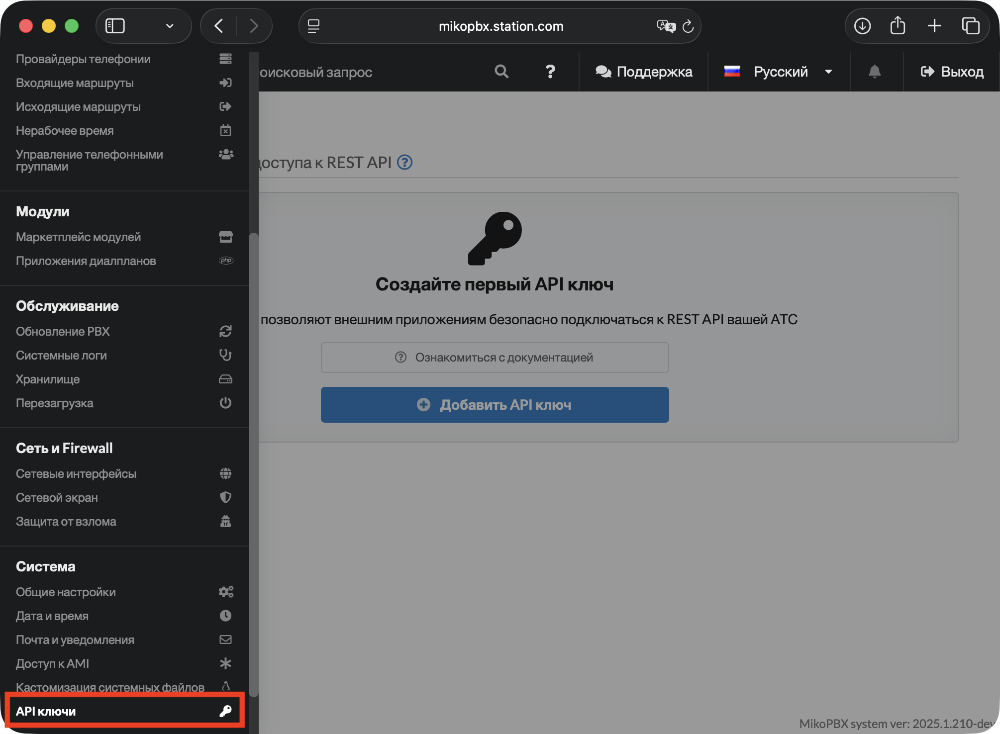
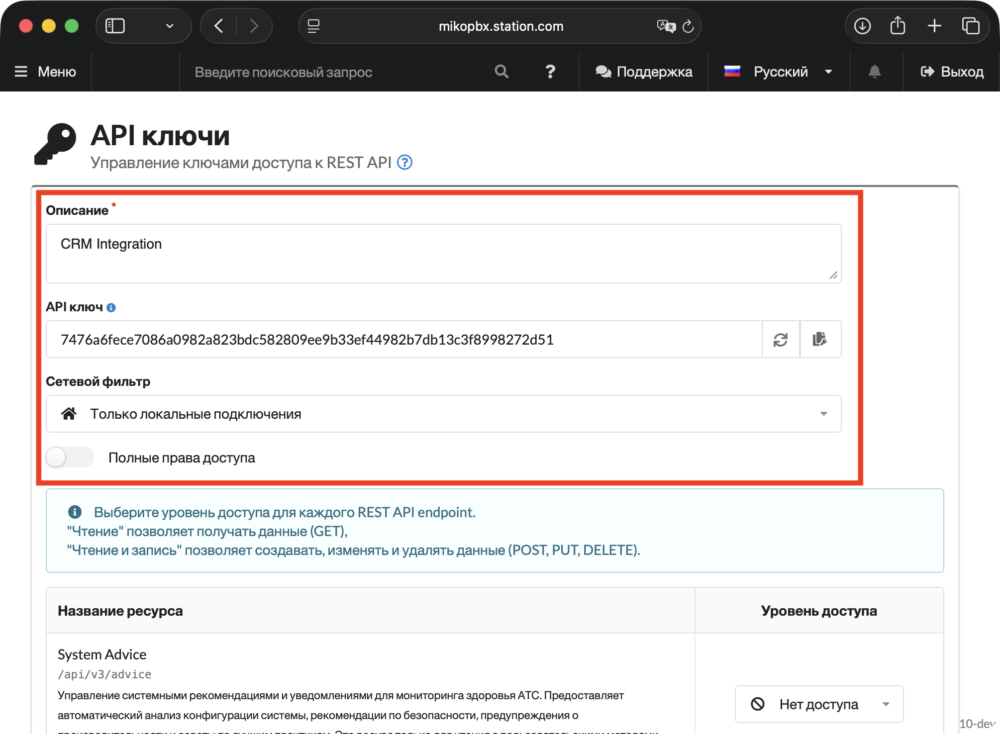

# API ключи

REST API MikoPBX позволяет автоматизировать управление станцией и интегрировать её с внешними системами — CRM, helpdesk, корпоративными порталами и собственными сервисами. Для доступа к API используются API ключи.

### Авторизация

Все запросы к REST API авторизуются через заголовок `Authorization: Bearer <token>`. MikoPBX поддерживает два типа токенов:

| Тип       | Когда использовать?                                           |
| --------- | ------------------------------------------------------------- |
| JWT токен | Внутренние компоненты системы, модули, встроенные инструменты |
| API ключ  | Внешние интеграции: CRM, скрипты, сторонние сервисы           |

Для внешних интеграций всегда используйте API ключ — он создаётся вручную, имеет настраиваемые права доступа и может быть отозван в любой момент.

### Создание API-ключа

1. Перейдите в раздел **«Система» → «API ключи»**.

<figure><figcaption>
Раздел "Система" -> "API ключи"
</figcaption></figure>

2. Нажмите **«Добавить API ключ»**.&#x20;

* Заполните поле **Описание** (например: `CRM Integration`)
* Скопируйте сгенерированный API-ключ — он отображается **только один раз**

> **Важно:** сохраните ключ сразу после создания. После закрытия страницы восстановить его невозможно — придётся создавать новый.

<figure><figcaption>
Базовые настройки API ключа
</figcaption></figure>

### Настройка прав доступа

Придерживайтесь принципа минимальных привилегий — каждый ключ должен иметь доступ только к тем ресурсам, которые реально нужны.

При создании ключа доступны два варианта:

* **Полные права доступа** — ключ получает доступ ко всем ресурсам API на чтение и запись. Используйте только если это действительно необходимо.
* **Ручная настройка** — для каждого ресурса API отдельно указывается уровень доступа: только чтение, чтение и запись, или нет доступа.


- "Чтение" позволяет получать данные (GET)
- "Чтение и запись" позволяет создавать, изменять и удалять данные (POST, PUT, DELETE).


**Сетевой фильтр:** выберите один из двух вариантов:

* **Только локальные подключения** — ключ будет работать только из локальной сети. Рекомендуется если интеграция работает внутри инфраструктуры.
* **Разрешены подключения с любых адресов** — ключ доступен без ограничений по IP. Используйте только если клиент находится за пределами локальной сети.

### Безопасность

Соблюдение следующих требований защищает API от перехвата токенов и несанкционированного доступа:

1. **Валидный SSL сертификат:**

Используйте доверенный SSL сертификат на стороне сервера MikoPBX. Самый простой способ — выпустить бесплатный сертификат через модуль Let's Encrypt (инструкция по работе с модулем находится [здесь](../../../modules/miko/module-get-ssl-lets-encrypt.md)).

Работа без валидного сертификата допустима только в изолированной тестовой среде без доступа из интернета.

2. **Доверие к сертификату на стороне клиента:**

Клиент обязан проверять сертификат сервера при каждом запросе. Отключение проверки (`verify=False` в Python, `-k` в curl) недопустимо в production: без неё возможна атака типа «человек посередине» (MITM), при которой злоумышленник перехватывает Bearer-токен в открытом виде.

3. **Ограничение прав (scope) ключа:**

Каждый ключ должен иметь доступ только к тем ресурсам, которые реально используются интеграцией. <mark style="color:$danger;">Не используйте «Полные права доступа» без необходимости</mark> — компрометация такого ключа даёт атакующему полный контроль над API.

4. **Ограничение сетевого доступа:**

Если интеграция работает внутри локальной сети — выбирайте «Только локальные подключения». Это исключает возможность использования скомпрометированного ключа из внешней сети.

Вариант «Разрешены подключения с любых адресов» используйте только когда клиент физически находится за пределами локальной сети, и убедитесь что остальные меры безопасности соблюдены — валидный SSL сертификат и минимальные права ключа.

### Примеры и подробная документация

Нажмите на карточку для перехода:

<table data-card-size="large" data-view="cards"><thead><tr><th></th><th data-hidden data-card-cover data-type="image">Cover image</th><th data-hidden data-card-target data-type="content-ref"></th></tr></thead><tbody><tr><td>Примеры использования REST API</td><td><a href="../../../.gitbook/assets/APIicon1.png">APIicon1.png</a></td><td><a href="examples.md">examples.md</a></td></tr><tr><td>Документация и список эндпоинтов</td><td><a href="../../../.gitbook/assets/APIicon2.png">APIicon2.png</a></td><td><a href="endpoints.md">endpoints.md</a></td></tr></tbody></table>
