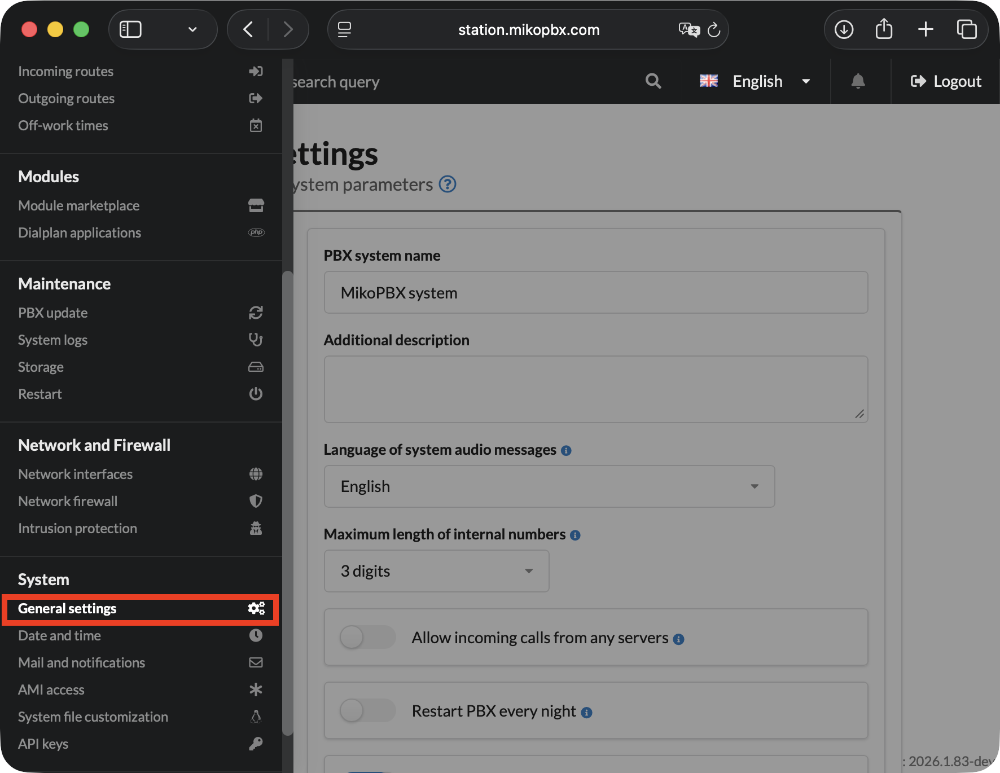
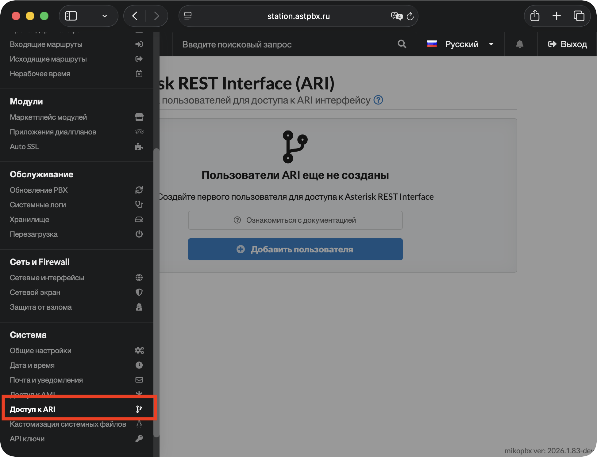
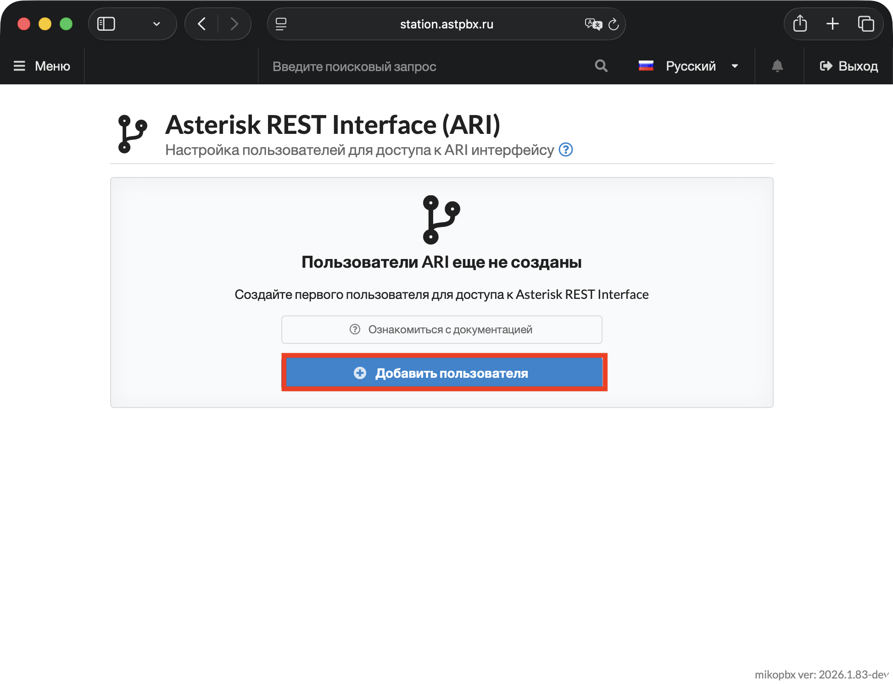
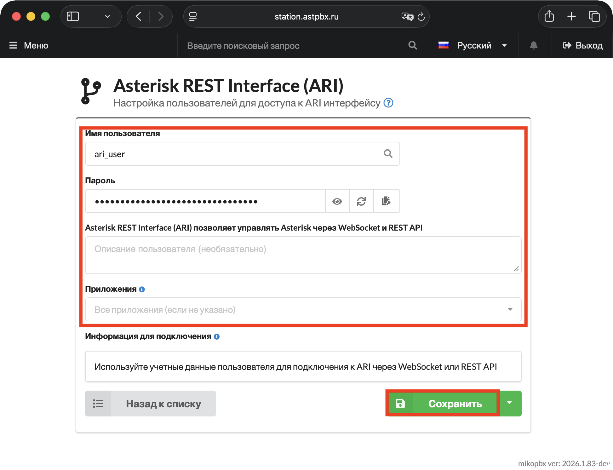

# Доступ к ARI&#x20;

ARI — это RESTful API с поддержкой WebSocket, который даёт полный контроль над каналами, мостами и медиапотоками Asterisk в реальном времени. В отличие от [REST API MikoPBX](api-keys/), ARI работает напрямую с ядром Asterisk и предназначен для разработки собственных телефонных приложений.

**По умолчанию отключён** — включите при необходимости в разделе **«Система» → «Asterisk REST Interface (ARI)»**.


Подробная документация по ARI доступна на официальном сайте Asterisk: [Asterisk REST Interface](https://docs.asterisk.org/Configuration/Interfaces/Asterisk-REST-Interface-ARI/)


### Для чего используется?

ARI применяется когда стандартных возможностей АТС недостаточно и нужна собственная логика обработки звонков:

* **WebRTC приложения и софтфоны** — веб-телефоны и мобильные клиенты с прямым управлением медиапотоками
* **Интерактивные голосовые меню (IVR)** — кастомная логика меню, недоступная через стандартный диалплан
* **Конференц-связь** — программное управление мостами и участниками
* **Запись и обработка звонков** — перехват аудио в реальном времени для аналитики или транскрибации
* **Голосовые боты и ассистенты** — интеграция с внешними AI-сервисами
* **Продвинутые очереди** — собственная логика распределения звонков

### Как это работает?

ARI состоит из трёх компонентов:

1. **REST API** — управление объектами Asterisk: каналами, мостами, записями
2. **WebSocket** (`/asterisk/ari/events`) — получение асинхронных событий в реальном времени: входящий звонок, завершение звонка, нажатие DTMF и т.д.
3. **Stasis** — приложение диалплана, которое передаёт канал под управление вашего ARI приложения

Типичный сценарий: звонок попадает в диалплан → `Stasis()` передаёт канал вашему приложению → приложение управляет звонком через REST API и получает события через WebSocket.

### Настройка ARI пользователя

1. Перед началом, необходимо включить ARI интерфейс (по умолчанию он выключен). Для этого перейдите в раздел "**Система**" -> "**Общие настройки**".

<figure><figcaption><p>Раздел "Система" -> "Общие настройки" в MikoPBX</p></figcaption></figure>

2. Далее во вкладку "**AMI\&ARI**", переключите тумблер "**Использовать ARI интерфейс**".  В поле **«Разрешённые источники CORS»** укажите домены, с которых будут выполняться запросы к ARI. CORS — механизм безопасности браузера, который ограничивает кросс-доменные запросы к API.

| Значение                    | Когда использовать                |
| --------------------------- | --------------------------------- |
| _(пусто)_                   | Доступ только с того же домена    |
| `http://localhost:3000`     | Локальная разработка              |
| `https://app.mycompany.com` | Продакшн приложение               |
| `*`                         | Все источники — только для тестов |


Никогда не используйте `*` в продакшне. Указывайте только доверенные домены по HTTPS.


<figure><figcaption><p>Подключение ARI</p></figcaption></figure>

3. Перейдите в раздел **«Система» → «Доступ к ARI»**.

<figure><figcaption><p>Раздел "Система" -> "Доступ к ARI" в MikoPBX</p></figcaption></figure>

4. Нажмите **«Добавить пользователя»**.

<figure><figcaption><p>Кнопка "Добавить пользователя" в разделе "Доступ к ARI"</p></figcaption></figure>

5. Заполните следующие параметры:

* **Имя пользователя** - логин для подключения, например `ari_user`.
* **Пароль** - пароль для подключения.
* **Описание** - описание для текущего пользователя, например "WebRTC Demo".
* **Приложения** - укажите имена Stasis приложений, к которым имеет доступ пользователь. Оставьте поле пустым для доступа ко всем приложениям.&#x20;


**Распространенные приложения**

* **ari-app:** Основное приложение для ARI
* **stasis:** Базовое Stasis приложение
* **external-media:** Работа с внешними медиа-потоками
* **bridge-app:** Управление мостами вызовов
* **channel-spy:**&#x41F;рослушивание каналов


Сохраните настройки.

<figure><figcaption><p>Параметры создаваемого ARI-пользователя</p></figcaption></figure>

### Параметры подключения

#### WebSocket

| Тип              | URL                                               |
| ---------------- | ------------------------------------------------- |
| Обычный          | `ws://your-mikopbx.com:8088/asterisk/ari/events`  |
| Защищённый (TLS) | `wss://your-mikopbx.com:8089/asterisk/ari/events` |

Замените `[application]` на имя вашего Stasis приложения.

#### REST API

| Тип   | URL                                           |
| ----- | --------------------------------------------- |
| HTTP  | `http://your-mikopbx.com:8088/asterisk/ari`   |
| HTTPS | `https://your-mikopbx.com:8089/asterisk/ari/` |

**Аутентификация:** HTTP Basic Auth — логин и пароль ARI пользователя.

<pre class="language-bash"><code class="lang-bash"># REST API запрос через curl
curl -u <a data-footnote-ref href="#user-content-fn-1">username:password</a> https://<a data-footnote-ref href="#user-content-fn-2">your-mikopbx.com</a>:8089/asterisk/ari/asterisk/info
</code></pre>


Рекомендуется использовать защищённые подключения (wss:// и https://) с валидным SSL сертификатом. Обычные ws:// и http:// допустимы только в изолированной тестовой среде.


### Пример: Hello World

Это минимальный пример работы с ARI — канал входит в Stasis приложение, приложение воспроизводит звуковой файл и завершает звонок.

Пример взят из официальной документации Asterisk: [Getting Started with ARI](https://docs.asterisk.org/Configuration/Interfaces/Asterisk-REST-Interface-ARI/Getting-Started-with-ARI/)

#### Шаг 1 — подключитесь к WebSocket

<pre class="language-bash"><code class="lang-bash">wscat -c "wss://<a data-footnote-ref href="#user-content-fn-3">username:password</a>@<a data-footnote-ref href="#user-content-fn-2">your-mikopbx.com</a>:8089/asterisk/ari/events?app=hello-world"
</code></pre>

#### Шаг 2 — настройте входящий маршрут

В MikoPBX перейдите в **«Маршрутизация» → «Приложения диалплана»**, создайте приложение с типом **«Диалплан Asterisk»** и кодом:

```php
1,Answer()
n,Stasis(hello-world)
n,Hangup()
```

Назначьте приложение на нужный входящий маршрут.

#### Шаг 3 — позвоните на номер

При входящем звонке WebSocket получит событие `StasisStart`:

<pre class="language-json"><code class="lang-json">{
  "type": "StasisStart",
  "timestamp": "2026-03-25T07:18:27.423+0300",
  "args": [],
  "channel": {
    "id": "<a data-footnote-ref href="#user-content-fn-4">mikopbx-1774412307.28</a>",
    "name": "Local/10003258@internal-incoming-0000000a;2",
    "state": "Up",
    "protocol_id": "",
    "caller": {
      "name": "79257184275",
      "number": "79257184275"
    },
    "connected": {
      "name": "",
      "number": "252"
    },
    "accountcode": "",
    "dialplan": {
      "context": "internal",
      "exten": "10003258",
      "priority": 2,
      "app_name": "Stasis",
      "app_data": "hello-world"
    },
    "creationtime": "2026-03-25T07:18:27.371+0300",
    "language": "en-en"
  },
  "asterisk_id": "82:6a:9e:68:10:11",
  "application": "hello-world"
}
</code></pre>

#### Шаг 4 — воспроизведите звук через REST API

Откройте новое окно терминала и выполните следующую команду:


Используйте `id` канала из события `StasisStart`!


<pre class="language-bash"><code class="lang-bash">curl -u <a data-footnote-ref href="#user-content-fn-5">username:password</a> -X POST \
  "https://<a data-footnote-ref href="#user-content-fn-6">your-mikopbx.com</a>:8089/asterisk/ari/channels/<a data-footnote-ref href="#user-content-fn-7">mikopbx-1774412307.28</a>/play?media=sound:/storage/usbdisk1/mikopbx/media/custom/miko_hello"
</code></pre>

При успешном проигрывании Вы увидите следующий вывод в терминал:

```json
{
  "id": "a0ee0d43-2af5-4250-a303-43825507a06c",
  "media_uri": "sound:/storage/usbdisk1/mikopbx/media/custom/miko_hello",
  "target_uri": "channel:mikopbx-1774412307.28",
  "language": "en-en",
  "state": "playing"
}
```

#### Шаг 5 — завершите звонок

После завершения звонка WebSocket пришлёт `StasisEnd`:

```json
{
  "type": "StasisEnd",
  "timestamp": "2026-03-25T07:19:44.982+0300",
  "channel": {
    "id": "mikopbx-1774412307.28",
    "name": "Local/10003258@internal-incoming-0000000a;2",
    "state": "Up",
    "protocol_id": "",
    "caller": {
      "name": "79257184275",
      "number": "79257184275"
    },
    "connected": {
      "name": "",
      "number": "252"
    },
    "accountcode": "",
    "dialplan": {
      "context": "internal",
      "exten": "10003258",
      "priority": 2,
      "app_name": "Stasis",
      "app_data": "hello-world"
    },
    "creationtime": "2026-03-25T07:18:27.371+0300",
    "language": "en-en"
  },
  "asterisk_id": "82:6a:9e:68:10:11",
  "application": "hello-world"
}
```

### Пример: монитор присутствия

Живая таблица статусов сотрудников в терминале — не требует настройки\
входящих маршрутов и Stasis приложений. Работает через подписку на все\
события станции.

Установите зависимости:

```bash
pip install requests websockets
```

<pre class="language-python"><code class="lang-python">import asyncio
import websockets
import json
import os
from datetime import datetime

ARI_HOST = '<a data-footnote-ref href="#user-content-fn-8">your-mikopbx.com</a>'
ARI_USER = '<a data-footnote-ref href="#user-content-fn-8">ari_user</a>'
ARI_PASS = '<a data-footnote-ref href="#user-content-fn-9">your-ari-password</a>'

peers = {}

STATES = {
    'NOT_INUSE':   ('🟢', 'Свободен'),
    'BUSY':        ('🔴', 'Занят'),
    'UNAVAILABLE': ('⚫', 'Недоступен'),
}

def draw():
    print('\033[2J\033[H', end='')
    now = datetime.now().strftime('%H:%M:%S')
    print(f'MikoPBX — монитор присутствия [{now}]')
    print('─' * 50)
    print(f'  {"Номер":&#x3C;10} {"Имя":&#x3C;20} {"Статус":&#x3C;15} {"Обновлён"}')
    print('─' * 50)
    for number, info in sorted(peers.items()):
        icon, label = STATES.get(info['state'], ('❓', info['state']))
        print(f'  {number:&#x3C;10} {info["name"]:&#x3C;20} {icon} {label:&#x3C;12} {info["updated"]}')
    print('─' * 50)
    print(f'  Сотрудников: {len(peers)}')

async def run():
    uri = (
        f"wss://{ARI_USER}:{ARI_PASS}@{ARI_HOST}:8089/asterisk/ari/events"
        f"?app=auto-receptionist&#x26;subscribeAll=true"
    )
    async with websockets.connect(uri) as ws:
        draw()
        async for message in ws:
            event = json.loads(message)
            etype = event.get('type')

            if etype == 'DeviceStateChanged':
                ds     = event.get('device_state', {})
                name   = ds.get('name', '')
                state  = ds.get('state', '')

                if not name.startswith('PJSIP/'):
                    continue

                number = name.replace('PJSIP/', '')

                if number not in peers:
                    peers[number] = {'name': number, 'state': state, 'updated': '—'}

                peers[number]['state']   = state
                peers[number]['updated'] = datetime.now().strftime('%H:%M:%S')
                draw()

            elif etype == 'PeerStatusChange':
                ep     = event.get('endpoint', {})
                number = ep.get('resource', '')
                state  = ep.get('state', '')

                if not number:
                    continue

                if number not in peers:
                    peers[number] = {'name': number, 'state': 'unknown', 'updated': '—'}

                if state == 'online':
                    peers[number]['state'] = 'NOT_INUSE'
                elif state == 'offline':
                    peers[number]['state'] = 'UNAVAILABLE'

                peers[number]['updated'] = datetime.now().strftime('%H:%M:%S')
                draw()

            elif etype == 'ContactStatusChange':
                ep     = event.get('endpoint', {})
                number = ep.get('resource', '')
                ci     = event.get('contact_info', {})
                status = ci.get('contact_status', '')

                if not number:
                    continue

                if number not in peers:
                    peers[number] = {'name': number, 'state': 'unknown', 'updated': '—'}

                if status == 'Reachable':
                    peers[number]['state'] = 'NOT_INUSE'
                elif status in ('Unreachable', 'NonQualified'):
                    peers[number]['state'] = 'UNAVAILABLE'

                peers[number]['updated'] = datetime.now().strftime('%H:%M:%S')
                draw()

asyncio.run(run())
</code></pre>

При совершении вызовов, информация в таблице будет обновляться:


```python
MikoPBX — монитор присутствия [11:34:43]
──────────────────────────────────────────────────
  Номер      Имя                  Статус          Обновлён
──────────────────────────────────────────────────
  202        202                  🟢 Свободен     11:34:25
  243        243                  ⚫ Недоступен   11:34:43
  252        252                  🔴 Занят        11:34:41
──────────────────────────────────────────────────
  Сотрудников: 3
```


***

Полная документация по ARI — на сайте Asterisk: [docs.asterisk.org](https://docs.asterisk.org/Configuration/Interfaces/Asterisk-REST-Interface-ARI/)

[^1]: Укажите логин и пароль Вашего ari-пользователя

[^2]: Укажите адрес Вашей MikoPBX

[^3]: Логин и пароль ARI пользователя

[^4]: ID, который нужен для следующего шага

[^5]: Укажите логин и пароль ari-пользователя

[^6]: Укажите адрес Вашей станции

[^7]: ID с Шага номер 3

[^8]: Замените на адрес Вашей MikoPBX

[^9]: Замените на пароль ari-пользователя
